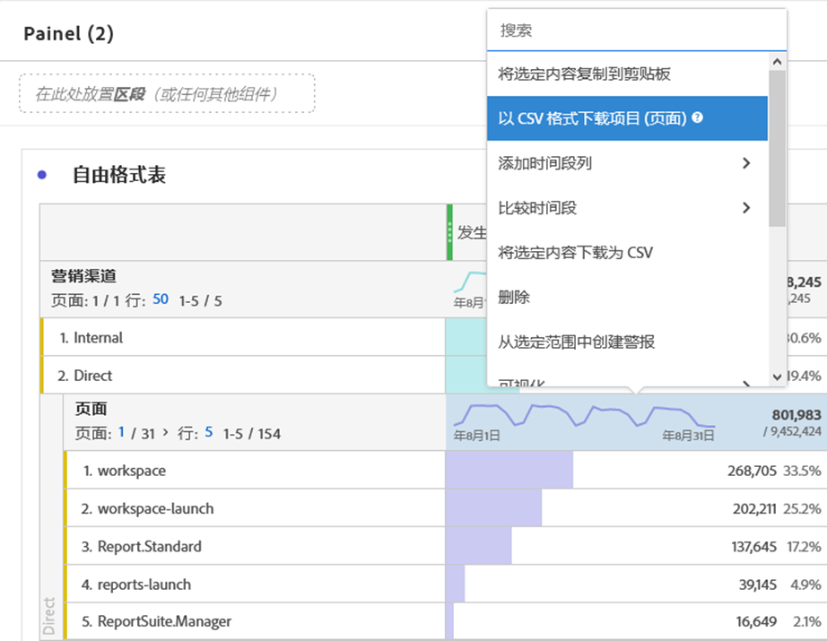

# 下载 PDF 或 CSV 文件

您可以从Analysis Workspace导出数据有几种不同的方式，具体取决于要在工具外分析的数据集以及哪些人需要接收信息。 导出的数据可以采用复制的数据、CSV或PDF文件的形式。 如果您希望文件中包含可视化，则通常首选PDF；而如果您只希望纯文本数据，则首选CSV（或复制的数据）。

## 将项目下载为CSV或PDF {#download-project}

您可以通过转到&#x200B;**[!UICONTROL “项目”>“以PDF形式下载”（或以CSV形式下载）]**&#x200B;来下载完整项目。 下载的文件包含项目中显示的所有（可见）表和可视化。 如果您希望将可视化包含在文件中，则通常首选PDF；而如果您只希望纯文本数据，则首选CSV。

对于项目下载，请牢记：

* 当您请求项目下载时，可以保存或保存项目。 但是，只有已保存的项目可以是[计划的](https://docs.adobe.com/content/help/zh-Hans/analytics/analyze/analysis-workspace/curate-share/t-schedule-report.html)。
* 在浏览器中下载的PDF可能需要几分钟时间才能导出，因为项目在以PDF格式呈现之前在Adobe服务器上重新运行。 我们建议在浏览器中下载 PDF 之前不要离开项目。但是，在等待过程中，您仍可以继续对项目进行更改。如果PDF渲染时间超过5分钟，则系统会提示您通过电子邮件发送。
* PDF下载以单页形式呈现，不应用分页。
* 将项目渲染为PDF后，我们会渲染页面上的内容。 如果项目具有自定义大小的可视化和面板，则需要将它们更改为自动调整大小（右上角的按钮），以便内容将不会被截断。

## 将数据复制到剪贴板(热键：Ctrl+C){#copy-data}

右键单击选项&#x200B;**[!UICONTROL 复制到剪贴板]**&#x200B;可让您快速从Workspace复制数据并将其粘贴到其他位置。

* 如果希望复制显示的表，请右键单击表标题，然后选择&#x200B;**将数据复制到剪贴板**。
* 如果要复制数据子集，请在表中进行选择，然后右键单击> **将选择复制到剪贴板**。

此外，热键`Ctrl+C`将您的选择复制到剪贴板。 复制后，您可以进入另一个工具并粘贴信息（或点击`Ctrl+V`）。

## 将数据下载为 CSV {#download-data}

右键单击选项&#x200B;**[!UICONTROL 将数据下载为CSV]**&#x200B;允许您下载数据表或任何可视化的CSV数据源。

* 从任何表或可视化的标题中，右键单击&#x200B;**[!UICONTROL 以CSV]**&#x200B;形式下载数据。 这会将可视化的显示数据下载到表格或基础数据源中，作为CSV格式。 注意：地图可视化不支持此选项。
* 如果在表中进行了选择，则该选项将显示&#x200B;**[!UICONTROL 将选择内容下载为CSV]**。 与显示的完整表相比，仅使用此选项下载所选内容。

## 以 CSV 格式下载项目 {#download-items}

如果要分析表中超过可见的400行数据，请右键单击表标题或任何行，然后选择&#x200B;**以CSV(Dimension名)**&#x200B;形式下载项目。 此选项将为所选维度导出多达50,000个维度项目（基于表排序），并应用过滤器和区段。 如果从表顶部选择此选项，则将导出表中的第一个维。 自由格式表中不强制使用任何限制，但建议在列数少于20的表中使用“下载项目”选项以确保最佳性能。

>[!TIP]
>
> 如果您的维度超过50,000个项目，请下载应用了不同排序量度的文件或应用筛选器。 例如，在一次下载中按访问降序排序，在第二次下载中按访问升序排序。 此提示可帮助您检索长尾项目。

您可以在项目内进行多任务，甚至在下载过程中在同一选项卡中导航到新的Workspace项目。 如果您打开新的浏览器选项卡，下载将暂停。 如果您完全离开工作区或关闭浏览器选项卡，下载将取消。

### 下载的项目文件

表格的功能将应用于下载的文件，如下所示：

* 所有面板段都应用为过滤器。
* 表中所选维度在&#x200B;**上方**&#x200B;应用为每列上方的过滤器。
* 将删除&#x200B;**下面**&#x200B;的表中所选维度。

在上面的示例中，页面项目随面板区段(新访客客户)和上面的组件(营销渠道=电子邮件)一起下载，而下面的组件（移动设备类型）则从下载的CSV中删除。

### 下载通知

在文件下载时，您将看到包含进度的信息通知。 您可以随时单击&#x200B;**[!UICONTROL 取消下载]**&#x200B;取消下载。 关闭toast **不会**&#x200B;取消下载。

文件完成后，您将看到完成通知，文件将下载到您的浏览器。

如果您一次请求多个下载，您将收到通知，每次额外的下载都将排队等待，直到上次下载完成。

## 常见问题解答 {#faq}

| 问题 | 回答 |
| --- | --- |
| 为什么下载了PDF一页？ | Workspace此时不会将下载的PDF分页。 |
| 我是否可以使用“以CSV形式下载项目”选项导出50,000多个项目？ | 虽然每次下载最多可包含50,000个维度项目，但您可以更改表的排序以检索较长的尾部项目，或应用过滤器以下载更多特定项目。 |
| **[!UICONTROL 复制可视化]**&#x200B;有什么作用？ | **[!UICONTROL 复制]** 可视化不是导出选项。它允许您将可视化或面板从Workspace中的一个位置复制到另一个位置。 例如，在同一项目中从一个面板到另一个面板，或从一个项目到另一个项目。 [内链接视频](https://docs.adobe.com/content/help/en/analytics-learn/tutorials/analysis-workspace/visualizations/intra-linking-in-analysis-workspace.html) |

