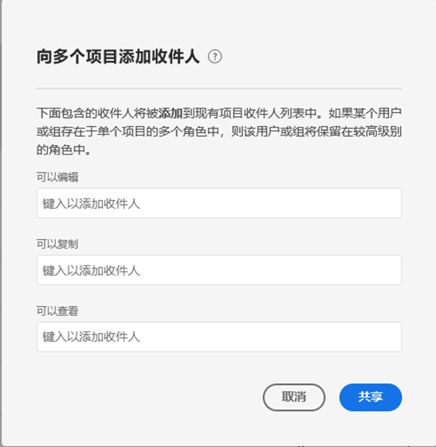

# 共享项目

共享可以使一个项目供您的组织内的其他 Analysis Workspace 用户使用。在收件人打开项目时，您应用的任何[策划](curate.md)都会反映出来。

## 项目角色 {#Roles}

您可以为收件人添加三个项目角色中的一个角色。项目角色与用户和特定项目 ID 关联。项目角色与 [Adobe Experience Cloud Admin Console](https://docs.adobe.com/content/help/zh-Hans/core-services/interface/manage-users-and-products/admin-getting-started.html) 中管理的用户权限无关。

| 角色 | 项目控制 |
|---|---|
| 可以编辑 | 收件人可以对项目的变更执行&#x200B;**[!UICONTROL 保存]**&#x200B;操作，并且可以行使共有人的权力。如果您希望与其他同事共同管理项目，则此角色很有用；这包括编辑、删除和修改共享项目的收件人列表。 注意：Analysis Workspace 当前不支持实时协作，因此建议在给定时间只让一个用户编辑项目。如果同时保存多个项目，则将保留最后一个版本。 |
| 可以复制 | 收件人可以执行&#x200B;**[!UICONTROL 另存为]**&#x200B;操作，并有权访问左边栏。在此角色中，项目交互不受限。如果您希望将项目共享给了解您组织数据以及知道如何使用 Analysis Workspace 的用户，但不希望更改项目，则此角色非常有用。 |
| 可以查看 | 收件人无法执行“另存为”操作，并且不具有访问左边栏的权限。项目交互受到限制。如果您希望将项目共享给不太熟悉您组织的数据结构或不太熟悉 Analysis Workspace 和 Adobe Analytics 的一般用户，则此角色非常有用。但是，您可能仍然希望这些用户在一个安全的环境中使用数据和信息分析。 详细了解[“可以查看”角色提供的项目体验](/help/analyze/analysis-workspace/curate-share/view-only-projects.md)。 |

>[!IMPORTANT]
> 在 2020 年 6 月 18 日之前添加的项目收件人已迁移到相应项目角色。管理员用户已迁移到&#x200B;**[!UICONTROL 可以编辑]**&#x200B;角色，非管理员用户已迁移到&#x200B;**[!UICONTROL 可以复制]**&#x200B;角色。这些角色将提供与以前相同的项目体验。此外，所有组（包括“全部”组）都已迁移到&#x200B;**[!UICONTROL 可以复制]**&#x200B;角色。

### 未分配角色（项目链接）

If a recipient is not assigned a role and receives a [link](https://docs.adobe.com/content/help/en/analytics/analyze/analysis-workspace/curate-share/shareable-links.html) to the project (**[!UICONTROL Share]>[!UICONTROL Get project link]**), they will be placed into a role by default. 管理员将获得&#x200B;**[!UICONTROL 可以编辑]**&#x200B;角色，非管理员将获得&#x200B;**[!UICONTROL 可以复制]**&#x200B;角色。

### 分配了多个角色

如果收件人分配到了多个角色，他们将始终获得权限最高的角色体验。如果同时将收件人添加为个人和组成员，则可能发生这种情况。例如，如果作为个人收件人获得&#x200B;**[!UICONTROL 可以编辑]**&#x200B;角色，而作为小组成员获得&#x200B;**[!UICONTROL 可以查看]**&#x200B;角色，则收件人将获得&#x200B;**[!UICONTROL 可以编辑]**&#x200B;项目体验。

### 管理员和角色

具有&#x200B;**[!UICONTROL 可以复制]**&#x200B;或&#x200B;**[!UICONTROL 可以查看]**&#x200B;角色的管理员在打开项目时将获得有限的项目体验。如有需要，管理员可以随时通过&#x200B;**[!UICONTROL 组件]>[!UICONTROL 项目]**&#x200B;将其角色提升为&#x200B;**[!UICONTROL 可以编辑]**。

## 向共享项目添加收件人 {#Add}

要向共享项目添加收件人，请执行以下操作：

1. 单击&#x200B;**[!UICONTROL 共享]** > **[!UICONTROL 共享项目]**。
如果存在未保存的更改，系统将提示您先保存项目。
1. 添加收件人或收件人组。
欲获取每个角色的说明，请单击顶部的帮助图标。
1. （可选）将嵌入的项目组件（区段、计算量度和日期范围）与所有接收人共享。共享后，这些组件将显示在接收人工作区的“组件”下拉菜单中。请注意，此设置不具有持续性，在分享时，它是独立的操作。
1. （可选）将此页设置为收件人的登陆页面。
此设置不具有持续性，在分享时，它是独立的操作。
1. 单击共享。您还可以单击&#x200B;**[!UICONTROL 策划和共享]**&#x200B;以自动应用项目策划。如果某个项目已共享，则将显示&#x200B;**[!UICONTROL 更新]**&#x200B;和&#x200B;**[!UICONTROL 策划和更新]**&#x200B;按钮。了解有关[项目策划](https://docs.adobe.com/content/help/zh-Hans/analytics/analyze/analysis-workspace/curate-share/curate.html)的更多信息。

## 共享到收件人组 {#Groups}

所有用户都可以将项目共享到由多位收集人组成的组。在 Adobe Analytics 中，组由 [Adobe Experience Cloud Admin Console](https://docs.adobe.com/content/help/zh-Hans/core-services/interface/manage-users-and-products/admin-getting-started.html) 中的产品配置文件定义。

* 管理员可以共享到任何组，包括“全部”组。
* 除“全部”组外，非管理员可以共享到其所属的组。

## 共享报表链接 {#Links}

您可以通过&#x200B;**[!UICONTROL 共享]>[!UICONTROL 获取项目链接]**&#x200B;来获取某个项目的链接。单击该链接后，收件人将需要先登录，然后才能进入项目。如果收件人未分配到角色，他们将获得默认角色。管理员将获得&#x200B;**[!UICONTROL 可以编辑]**&#x200B;角色，非管理员将获得&#x200B;**[!UICONTROL 可以复制]**&#x200B;角色。[了解有关创建](https://docs.adobe.com/content/help/en/analytics/analyze/analysis-workspace/curate-share/shareable-links.html) Workspace项目的可共享链接的更多信息。

## 在项目管理器中共享项目 {#Manager}

还可以通过&#x200B;**[!UICONTROL 组件]>[!UICONTROL 项目]**&#x200B;来共享项目。可以按照上述相同步骤共享单个项目。如果选择共享多个项目，则会将收件人添加到每个项目的现有收件人列表中。

例如：

* 项目 A 共享给收件人 1、2、3
* 项目 B 共享给收件人 4、5、6

选择项目 A 和 B 后，将收件人 4 和 7 添加到共享列表。现在，每个项目的新共享列表为：

* 项目 A：1、2、3、4、7
* 项目 B：4、5、6、7

## 常见问题解答 {#FAQs}

| 问题 | 回答 |
|---|---|
| 如果两位编辑者同时保存一个项目，会发生什么情况？ | 将不会合并更改，并将保留最后保存的项目版本。Analysis Workspace 当前不支持实时协作。 |
| 作为管理员，我将获得什么样的项目体验？ | 具有&#x200B;**[!UICONTROL 可以复制]**&#x200B;或&#x200B;**[!UICONTROL 可以查看]**&#x200B;角色的管理员在打开项目时将获得有限的项目体验。如有需要，管理员可以随时通过&#x200B;**[!UICONTROL 组件]>[!UICONTROL 项目]**&#x200B;将其角色提升为&#x200B;**[!UICONTROL 可以编辑]**。 |
| 如果一位收件人作为个人和作为小组成员分别有不同的角色，会发生什么情况？ | 如果收件人同时具有多个角色，他们将始终获得权限最高的角色体验。例如，如果作为个人收件人获得&#x200B;**[!UICONTROL 可以编辑]**&#x200B;角色，而作为小组成员获得&#x200B;**[!UICONTROL 可以查看]**&#x200B;角色，则收件人将获得&#x200B;**[!UICONTROL 可以编辑]**&#x200B;项目体验。 |
| 如果收件人打开项目链接，他们会获得什么体验？ | 收件人将获得您在共享模式中为其分配的角色。如果收件人未分配到角色，并收到指向项目的链接（**[!UICONTROL 共享]>[!UICONTROL 获取项目链接]**），则他们会获得默认角色。管理员将获得&#x200B;**[!UICONTROL 可以编辑]**&#x200B;角色，非管理员将获得&#x200B;**[!UICONTROL 可以复制]**&#x200B;角色。 |
