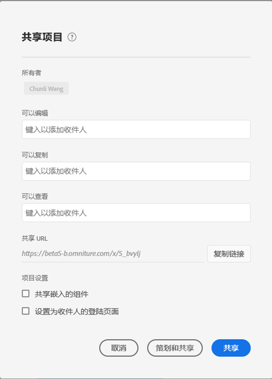

# 共享项目

可与以下类型的人员共享 Analysis Workspace 项目：

* 您组织中有权访问 Adobe Analytics 的用户和组

  可共享“编辑”、“复制”或“查看”访问权限

* 您组织中无权访问 Adobe Analytics 的用户和组

  收件人具有只读访问权限

* 您组织之外的人员

  收件人具有只读访问权限

当收件人打开项目时，将反映您在分享前应用的任何[策划](curate.md)。

下面是项目共享的视频概述：

>[!VIDEO](https://video.tv.adobe.com/v/36207/?quality=12)

## 与组织中的 Analysis Workspace 用户和组共享 {#Add}

可与组织中现有的 Analysis Workspace 用户或组共享某个项目。当您按本节所述共享项目时，您与其共享的用户必须已有权访问 Adobe Analytics。

您可以与用户或组共享特定角色，也可以共享链接。

* [共享特定的项目角色](#share-a-specific-project-role)

* [共享项目链接](#share-a-link-to-a-project)

## 共享特定的项目角色

与组织中的用户和组共享特定项目角色时，请考虑以下事项：

* 项目角色（**[!UICONTROL 编辑原件]**、**[!UICONTROL 编辑副本]**&#x200B;和&#x200B;**[!UICONTROL 只读]**）与用户和特定项目 ID 关联。项目角色与 [Adobe Experience Cloud Admin Console](https://experienceleague.adobe.com/docs/core-services/interface/manage-users-and-products/admin-getting-started.html) 中管理的用户权限无关。

* 在 Adobe Analytics 中，组由 [Adobe Experience Cloud Admin Console](https://experienceleague.adobe.com/docs/core-services/interface/manage-users-and-products/admin-getting-started.html) 中的产品配置文件定义。管理员可以共享到任何组，包括“全部”组。 除“全部”组外，非管理员可以共享到其所属的任何组。

* 如果用户分配到了多个角色，将始终获得权限最高的角色体验。 如果同时将用户添加为个人和组成员，则可能发生这种情况。 例如，如果作为个人授予用户&#x200B;**[!UICONTROL 编辑原件]**&#x200B;角色，并作为组成员授予用户&#x200B;**[!UICONTROL 只读]**&#x200B;角色，则该用户将获得&#x200B;**[!UICONTROL 编辑原件]**&#x200B;项目体验。

* 归入&#x200B;**[!UICONTROL 编辑副本]**&#x200B;或&#x200B;**[!UICONTROL 只读]**&#x200B;角色的管理员在打开项目时获得这些有限的体验。管理员可以将其角色更改为 **[!UICONTROL 编辑原始]** 共享项目并授予 **编辑** 角色，如以下过程所述。

* 如果选择共享多个项目，则会将收件人添加到每个项目的现有收件人列表中。

  例如，项目A已与收件人1、2和3共享，而项目B已与收件人4、5和6共享。

  然后，与收件人4和7共享项目A和B。 项目A的新共享列表现在为1、2、3、4和7，而项目B的新共享列表为4、5、6和7。

要与组织中的用户或组共享特定的项目角色，请执行以下操作：

1. 在Adobe Analytics中，选择 [!UICONTROL **工作区**] 选项卡，然后选择 [!UICONTROL **项目**] 在左边栏中。

1. 选中要共享的一个或多个项目旁边的复选框，然后选择 [!UICONTROL **共享**].

   或

   要仅共享单个项目，您可以打开要共享的项目，然后选择 **[!UICONTROL 共享]** > **[!UICONTROL 与Workspace用户共享]**.
如果存在未保存的更改，则将提示您首先保存您的项目。

   此时将显示共享项目对话框。 此 [!UICONTROL **通过链接共享**] 和 [!UICONTROL **设置**] 仅在共享单个项目时，该对话框的部分才可见。

   

1. 在提供的角色字段之一中添加收件人或收件人组：

   **编辑原件：**&#x200B;收件人可将更改&#x200B;**[!UICONTROL 保存]**&#x200B;到项目，并作为共有人行使权力。如果您希望与其他同事共同管理项目，则此角色很有用；这包括编辑、删除和修改共享项目的收件人列表。 注意：Analysis Workspace 当前不支持实时协作，因此建议在给定时间只让一个用户编辑项目。如果同时保存多个项目，则将保留最后一个版本。

   **编辑副本：**&#x200B;收件人可执行&#x200B;**[!UICONTROL 另存为]**，并有权访问左边栏。在此角色中，项目交互不受限。如果您希望将项目共享给了解您组织数据以及知道如何使用 Analysis Workspace 的用户，但不希望更改项目，则此角色非常有用。

   **只读：**&#x200B;收件人无法执行&#x200B;**[!UICONTROL 保存]**&#x200B;或&#x200B;**[!UICONTROL 另存为]**，并且无权访问左边栏。项目交互受到限制。如果您希望将项目共享给不太熟悉您组织的数据结构或不太熟悉 Analysis Workspace 和 Adobe Analytics 的一般用户，则此角色非常有用。 但是，您可能仍然希望这些用户在一个安全的环境中使用数据和信息分析。详细了解[只读角色项目体验](/help/analyze/analysis-workspace/curate-share/view-only-projects.md)。

1. （视情况而定）如果要共享单个项目，请选择在共享项目时是否启用以下选项：

   * **共享嵌入的项目组件：**&#x200B;与所有接收人共享区段、计算量度和日期范围。 共享后，这些组件将显示在接收人工作区的“组件”下拉菜单中。此设置不具有持续性，属于分享时的一次性操作。

   * **设置为收件人的登陆页面：** 将此页面设置为收件人的登陆页面。 此设置不具有持续性，属于分享时的一次性操作。

1. 选择 **[!UICONTROL 共享]**. (如果项目已共享，请选择 [!UICONTROL **更新**].)

   或

   选择 **[!UICONTROL 策划和共享]** 以自动应用项目策划。 (如果项目已共享，请选择 **[!UICONTROL 策划和更新]**.) 详细了解[项目策划](https://experienceleague.adobe.com/docs/analytics/analyze/analysis-workspace/curate-share/curate.html?lang=zh-Hans)。

## 共享项目链接

按本节所述共享链接时，请考虑以下事项：

* 使用链接的收件人必须登录 Adobe Analytics 才能访问项目。

* 如果没有为收件人分配角色，并且收件人收到项目的[链接](https://experienceleague.adobe.com/docs/analytics/analyze/analysis-workspace/curate-share/shareable-links.html)，则为其授予默认角色。管理员获得&#x200B;**[!UICONTROL 编辑原件]**&#x200B;角色，非管理员获得&#x200B;**[!UICONTROL 编辑副本]**&#x200B;角色。

要与您组织中的用户共享项目链接，请执行以下操作：

1. 保存该项目。如果存在未保存的更改，则在分享链接前将提示您首先保存您的项目。

1. 选择&#x200B;**[!UICONTROL 共享]** > **[!UICONTROL 与 Workspace 用户共享]**，然后在&#x200B;**[!UICONTROL 通过链接分享]**&#x200B;字段旁选择&#x200B;**[!UICONTROL 复制]**。

   

1. 与您组织中的用户共享该链接。例如，可将它粘贴到电子邮件中、粘贴到内部网站上等。

## 与任何人共享项目（无需登录） {#share-public-link}

可为无权访问 Adobe Analytics 的人员授予对 Analysis Workspace 项目的[只读访问权限](/help/analyze/analysis-workspace/curate-share/view-only-projects.md)。其中可包括：

* 您组织之外的人员

* 您组织内无权访问 Adobe Analytics 的人员

>[!NOTE]
>
>与无权访问 Adobe Analytics 的人员共享 Analysis Workspace 项目时，请考虑以下事项：
>
>* Analytics 管理员可禁止以此方式共享项目，如[首选项](/help/analyze/analysis-workspace/user-preferences.md)所述。如果您无法按本节所述共享项目，则您的 Analytics 管理员已禁止这样做。
>
>* 不得与无权访问 Adobe Analytics 的人员共享具有超过 50 个展开的可视化的项目。
>
>* 您与其共享项目的用户可查看在[策划](curate.md)期间应用于项目的任何过滤器。
> 
>* 您与其共享的用户可更改项目日期范围。默认情况下显示您为项目设置的日期范围。
>
>* 如果许多用户尝试同时访问给定的链接，则项目可能会变得无法访问。默认情况下，每 5 分钟可有超过 190 人访问单个链接。如果您的组织达到此限制，请等待 5 分钟，然后再重试访问链接。

以下视频演示和随附文档描述与任何人共享链接相关的选项：

>[!VIDEO](https://video.tv.adobe.com/v/3420093/?learn=on)

要与无权访问 Adobe Analytics 的人员共享 Analysis Workspace 项目，请执行以下操作：

1. 打开要共享的 Analysis Workspace 项目。

1. 单击&#x200B;**[!UICONTROL 共享]** > **[!UICONTROL 与任何人共享]**。

   如果存在未保存的更改，则将提示您保存您的项目。

   <!-- Add screen shot of new modal -->

1. 如果尚未启用&#x200B;**[!UICONTROL 链接活动]**&#x200B;选项，请启用该选项。

   选择此选项将创建可与任何人共享的项目链接。随时可通过禁用此选项而禁止访问项目。

   项目的所有者也是此链接的所有者。只有移交项目所有权后，才能将链接所有权移交给另一用户，如 Analytics 管理指南中的[转移用户资源或设置帐户到期](/help/admin/admin/user-management2/users-assets.md)所述。

1. 选择是否启用以下安全选项（您的 Analytics 管理员可控制此选项）：

   * **[!UICONTROL 要求进行 Experience Cloud 身份验证]：**

     启用此选项后，只有可登录到从中创建了您所共享的项目的 Adobe Experience Cloud 组织的用户才能访问该项目。但是，您与其共享的用户无需有权访问 Adobe Analytics。

     Analytics 管理员可为公司配置此首选项，如[首选项](/help/analyze/analysis-workspace/user-preferences.md)所述。根据管理员如何配置此选项，您可能会遇到以下情况：

      * 如果此选项不可见，则您的 Analytics 管理员未启用此功能。

      * 如果启用了此选项但它为灰色，则您的 Analytics 管理员要求对访问 Analysis Workspace 项目的任何人进行 Experience Cloud 身份验证。

1. 在&#x200B;**[!UICONTROL 与任何人共享（无需登录）]**&#x200B;字段旁，单击&#x200B;**复制链接**&#x200B;图标  以将链接复制到您的系统剪贴板。

1. 与您希望其有权访问该项目的人员共享该链接。例如，可将该链接粘贴到电子邮件中。

   您与其共享该链接的任何人均可查看该 Analysis Workspace 项目。

1. （可选）可单击&#x200B;**生成新链接**&#x200B;图标  以阻止以前收到该项目链接的用户访问。随后将生成一个可与您希望其访问该项目的用户共享的新链接。

1. 选择&#x200B;**[!UICONTROL 关闭]**&#x200B;以关闭共享对话框。随后自动保存您的更改。

## 查看与您共享的项目

当有人通过以下方式与您共享项目时 [共享特定项目角色](#share-a-specific-project-role)，您可以从以下位置访问共享项目： [Analytics登陆页面上的“项目”选项卡](/help/analyze/landing.md#navigate-the-projects-tab).

当有人通过共享链接(来自 [“共享项目”选项卡](#share-a-link-to-a-project) 或使用 [与任何人共享](#share-a-project-with-anyone-no-login-required) 链接)，您必须使用与您共享的链接才能访问该项目。 例如，链接可能已在一封电子邮件中、在内部网站上共享，依此类推。

## 共享嵌入的组件

以下是一段关于该主题的视频：

>[!VIDEO](https://video.tv.adobe.com/v/24713/?quality=12)

## 常见问题解答 {#FAQs}

| 问题 | 回答 |
| --- | --- |
| 如果两位编辑者同时保存一个项目，会发生什么情况？ | 将不会合并更改，并将保留最后保存的项目版本。Analysis Workspace 当前不支持实时协作。 |
| 如果一位收件人作为个人和作为小组成员分别有不同的角色，会发生什么情况？ | 如果收件人同时具有多个角色，他们将始终获得权限最高的角色体验。例如，如果作为个人授予收件人&#x200B;**[!UICONTROL 编辑原件]**&#x200B;角色，并作为组成员授予收件人&#x200B;**[!UICONTROL 只读]**&#x200B;角色，则该收件人将获得&#x200B;**[!UICONTROL 编辑原件]**&#x200B;项目体验。 |
| 如果收件人打开项目链接，他们会获得什么体验？ | 收件人将获得您在共享模式中为其分配的角色。如果没有为收件人分配角色，并且收件人收到项目的链接（**[!UICONTROL 共享]** > **[!UICONTROL 与 Workspace 用户共享]**，然后在&#x200B;**[!UICONTROL 通过链接共享]**&#x200B;字段旁选择&#x200B;**[!UICONTROL 复制]**），则为其授予默认角色。管理员获得&#x200B;**[!UICONTROL 编辑原件]**&#x200B;角色，非管理员获得&#x200B;**[!UICONTROL 编辑副本]**&#x200B;角色。 |
