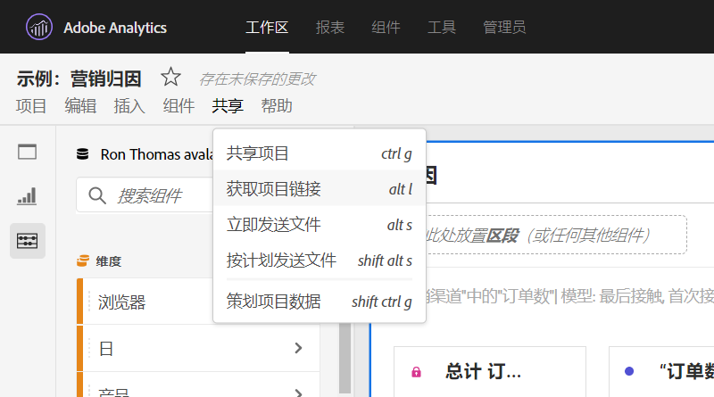

# 创建可共享链接

Analysis Workspace优惠了多种方式将项目共享给用户，包括获得项目链接或项目特定部分的能力。 收到链接的用户必须先登录Adobe Analytics，然后才能进入项目。

## Get project link {#project-link}

要共享指向完整项目的链接，请转到“共享”>“ **[!UICONTROL 获取项目”链接]**。 如果未为链接的收件人分配项目角 [色](https://docs.adobe.com/content/help/zh-Hans/analytics/analyze/analysis-workspace/curate-share/share-projects.html)，则管理员会收&#x200B;**[!UICONTROL 到“可编辑]**”，而非管理员&#x200B;**[!UICONTROL 会收到“]**&#x200B;可重复”体验。

## 获取面板或可视化链接 {#panel-link}

您还可以共享指向项目特定部分的链接，如面板或单个可视化。 这有时也称为内部链接。 这有助于吸引用户关注项目中的关键洞察。

* 从任何面板标题中，右键单击“获 **[!UICONTROL 取面板”链接]**
* 从任何表或可视化标题中，右键单击“获 **[!UICONTROL 取可视化”链接]**

[观看有关如何](https://www.youtube.com/watch?v=lvmAdKNfWQw) 创建链接的视频，并使用这些链接将收件人引导到项目的特定部分。

## 在目录中使用链接 {#TOC}

利用各种链接选项的一个提示是始终在Workspace项目顶部包含目录。 在目录中，您可以链接到其他相关项目、特定面板和特定可视化。 这有助于项目收件人更轻松地导航。

[观看有关如何](https://www.youtube.com/watch?v=Xo6fTguWm-M) 使用链接和Workspace的富文本编辑器构建目录的视频。

