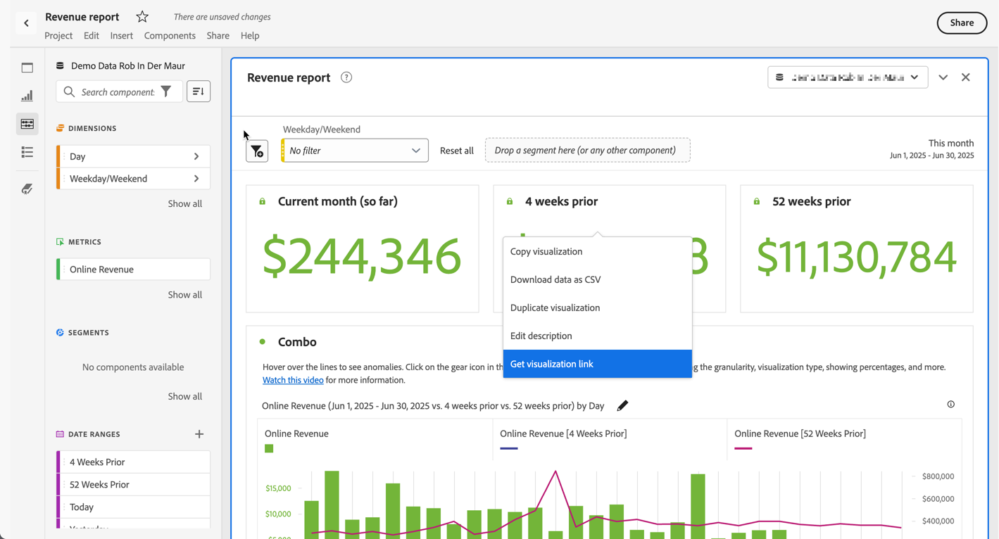

# 创建可共享链接

Analysis Workspace 提供了多种将项目共享给用户的方法，包括能够获得指向项目或项目特定部分的链接。某些链接类型要求收件人登录到 Adobe Analytics 后再访问项目，而其他链接类型无此要求。

## 获取项目链接以与其他 Workspace 用户共享 {#project-link}

要共享项目链接，请转到要共享的项目，然后选择转到&#x200B;**[!UICONTROL 共享]** > **[!UICONTROL 获取项目链接]**(或&#x200B;**[!UICONTROL 共享]** > **[!UICONTROL 与Workspace用户共享]** > **[!UICONTROL 通过链接共享]**)。 要求您与其共享该链接的用户登录。

如果尚未为链接的收件人分配[项目角色](/help/analyze/analysis-workspace/curate-share/share-projects.md)，则管理员将获得&#x200B;**[!UICONTROL 编辑原始项目]**，非管理员将获得&#x200B;**[!UICONTROL 编辑副本]**&#x200B;体验。

## 获取只读链接以与任何人共享

您可以与无权访问Analysis Workspace的用户共享指向Adobe Analytics项目的只读链接。

有关详细信息，请参阅[与任何人共享](/help/analyze/analysis-workspace/curate-share/share-projects.md#share-a-project-with-anyone-no-login-required)。

## 获取面板或可视化图表链接 {#panel-link}

您还可以共享指向项目特定部分的链接，如面板或单个可视化图表。这种链接有时被称为内部链接。内部链接对于吸引用户关注项目中的关键问题分析非常有帮助。

* 从面板标题的上下文菜单中，选择&#x200B;**[!UICONTROL 获取面板链接]**
* 从可视化图表标题的上下文菜单中，选择&#x200B;**[!UICONTROL 获取可视化图表链接]**

请[观看视频](https://experienceleague.adobe.com/docs/analytics-learn/tutorials/analysis-workspace/visualizations/intra-linking-in-analysis-workspace.html?lang=zh-Hans)，了解如何创建链接，并使用这些链接促使收件人访问项目的特定部分。

## 在目录中使用链接 {#TOC}

使用各种链接选项的一个技巧是，始终将目录置于工作区项目顶部。在目录中，您可以链接到其他相关项目、特定面板和特定可视化图表。这可帮助项目收件人更加轻松地进行导航。

请[观看视频](https://experienceleague.adobe.com/docs/analytics-learn/tutorials/analysis-workspace/navigating-workspace-projects/create-a-toc-in-analysis-workspace.html?lang=zh-Hans)，了解如何通过使用链接和工作区的富文本编辑器来构建目录。

<!--
# Create shareable links

Analysis Workspace offers many ways to share a project to your users, including the ability to get a link to a project or a specific part of a project. Some link types require the recipient to log in to Adobe Analytics before accessing the project, while others do not. 

## Get a project link to share with other Workspace users {#project-link} 

To share a link to a project, go to the project you want to share, then select go to [!UICONTROL **Share**] > [!UICONTROL **Share with Workspace users**] > [!UICONTROL **Share by link**]. Users you share the link with are required to log in. 

If the recipient of the link has not been assigned a [project role](https://experienceleague.adobe.com/docs/analytics/analyze/analysis-workspace/curate-share/share-projects.html?lang=zh-Hans), admins receive **[!UICONTROL Edit original]** and non-admins receive **[!UICONTROL Edit copy]** experiences.

## Get a read-only link to share with anyone

You can share a read-only link to Analysis Workspace projects with people who don't have access to Adobe Analytics. Users you share the link with are not required to log in. 

For more information, see "Share a project with anyone (no login required)" in the article [Share projects](/help/analyze/analysis-workspace/curate-share/share-projects.md).

## Get panel or visualization link {#panel-link} 

You can also share a link to a specific part of a project, such as a panel or individual visualization. This is sometimes referred to as intra-linking. This can be useful to draw your users' attention to key insights within the project.  

* From any panel header, right-click **[!UICONTROL Get panel link]** 
* From any table or visualization header, right-click **[!UICONTROL Get visualization link]** 

[Watch the video](https://experienceleague.adobe.com/docs/analytics-learn/tutorials/analysis-workspace/visualizations/intra-linking-in-analysis-workspace.html?lang=zh-Hans) on how to create links and use them to drive recipients to specific parts of your project. 

-->