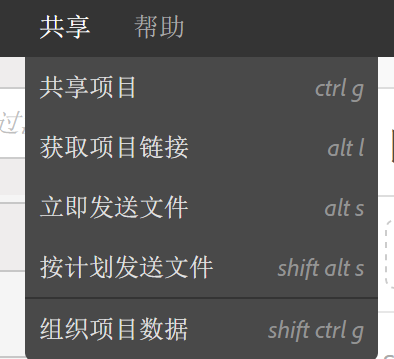
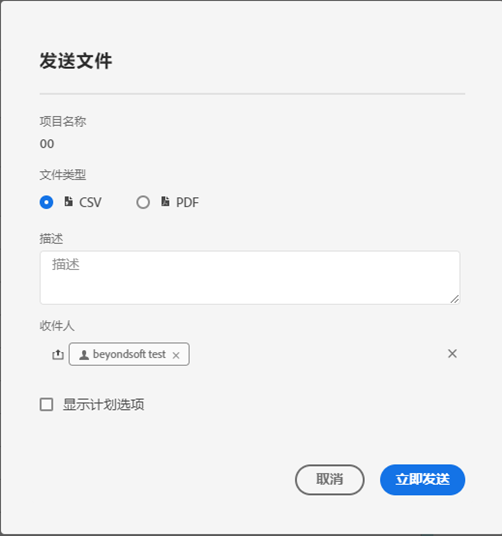
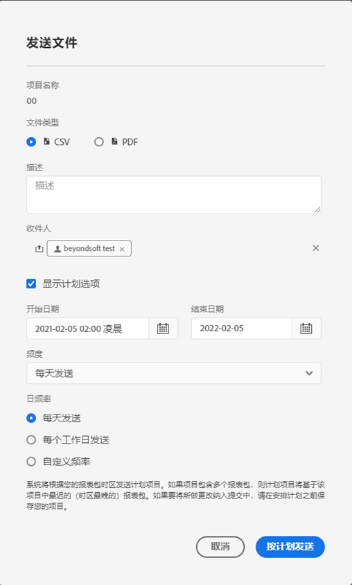

# 发送和计划项目

您可以通过电子邮件将Adobe Analytics项目作为文件发送给选定的用户。 您可以临时发送文件，也可以配置按计划发送的文件。

发送文件时请考虑以下事项：

* 可以采用 CSV 或 PDF 格式发送文件。

* 任何应用于项目的标记都会自动应用于导出文件。

导出Adobe Analytics数据的其他方法也可用，如[导出概述](/help/export/home.md)中所述。

## 发送文件

要通过电子邮件将临时文件发送给收件人，请执行以下操作：

1. 选择&#x200B;**[!UICONTROL 共享] > [!UICONTROL 发送文件]**。
1. 指定文件类型：
   * [!UICONTROL **CSV**]：如果您需要纯文本数据，请选择此选项。
   * [!UICONTROL **PDF**]：如果您希望下载的文件包含项目中所有显示（可见）的表和可视化，请选择此选项。
1. （可选）使用&#x200B;**[!UICONTROL Description]**&#x200B;添加要包含在电子邮件中的描述。
1. 添加收件人或组。您还可以输入电子邮件地址。
1. （可选）选择&#x200B;**[!UICONTROL 显示计划选项]**&#x200B;到[计划文件导出](#schedule-file-export)。
1. 单击&#x200B;**[!UICONTROL 立即发送]**。 选择&#x200B;**[!UICONTROL 取消]**&#x200B;即可取消。

## 安排文件导出 {#schedule}

要通过电子邮件按计划将文件发送给收件人，请执行以下操作：

1. 选择&#x200B;**[!UICONTROL 共享] > [!UICONTROL 计划文件导出]**。
1. 指定文件类型：
   * [!UICONTROL **CSV**]：如果您需要纯文本数据，请选择此选项。
   * [!UICONTROL **PDF**]：如果您希望下载的文件包含项目中所有显示（可见）的表和可视化，请选择此选项。
1. （可选）使用&#x200B;**[!UICONTROL Description]**&#x200B;添加要包含在电子邮件中的描述。
1. 添加收件人或组。您还可以输入电子邮件地址。
1. （仅适用于Healthcare Shield客户）提供[密码保护计划报告](#password-protect-a-new-scheduled-project)的密码。
1. 确保已选择&#x200B;**[!UICONTROL 显示计划选项]**。
1. 选择&#x200B;**[!UICONTROL 频率]**。 您可以在以下各项之间进行选择：

   | 频率 | 选项 |
   |---|---|
   | **[!UICONTROL 每小时发送]** | 为&#x200B;**[!UICONTROL 发送间隔小时数]**&#x200B;输入一个值。 |
   | **[!UICONTROL 每日发送]** | 选择&#x200B;**[!UICONTROL 每日频率]**：**[!UICONTROL 每天发送]**、**[!UICONTROL 每个工作日发送]**&#x200B;或&#x200B;**[!UICONTROL 自定义频率]**。 如果您选择&#x200B;**[!UICONTROL 自定义频率]**，请为&#x200B;**[!UICONTROL 发送间隔天数]**&#x200B;输入一个值。 |
   | **[!UICONTROL 每周发送]** | 为&#x200B;**[!UICONTROL 发送间隔周数]**&#x200B;输入一个值。 并选择一周中的&#x200B;**[!UICONTROL 天]**。 |
   | **[!UICONTROL 按星期几发送月报表]** | 选择&#x200B;**[!UICONTROL 周中某天]**&#x200B;和&#x200B;**[!UICONTROL 月中某周]**。 |
   | **[!UICONTROL 每月按月发送]** | 从&#x200B;**[!UICONTROL 发送日期]**&#x200B;中选择一个值。 |
   | **[!UICONTROL 按月份中的日期每年发送]** | 选择&#x200B;**[!UICONTROL 周中日]**，选择&#x200B;**[!UICONTROL 月中周]**，然后选择&#x200B;**[!UICONTROL 月中月]**。 |
   | **[!UICONTROL 按特定日期每年发送]** | 选择&#x200B;**[!UICONTROL 月份]**&#x200B;并从&#x200B;**[!UICONTROL 发送日期]**&#x200B;中选择一个值。 |

1. 输入从&#x200B;**[!UICONTROL 开始的]**&#x200B;开始日期。 或者，选择以从日历中选择开始日期。

1. 在&#x200B;**[!UICONTROL 结束日期]**&#x200B;中输入结束日期。 或者，选择以从日历中选择结束日期。
1. 选择&#x200B;**[!UICONTROL 按计划]**&#x200B;发送。 选择&#x200B;**[!UICONTROL 取消]**&#x200B;即可取消。

## 计划项目管理器 {#manager}

使用&#x200B;**[!UICONTROL 组件]** > **[!UICONTROL 计划项目]**，可从主界面管理计划的Analysis Workspace项目。 有关更多信息，请参阅[计划项目](/help/components/scheduled-projects-manager.md)。

<!--
# Schedule projects

From the Workspace **Share menu**, you can send Analysis Workspace projects using email to selected recipients. Files can be sent in CSV or PDF format. After you share scheduled projects, you can edit the schedule settings to modify the frequency, receipient list, or file type using the Scheduled Projects manager.

## Send file now

To send a file immediately to recipients via email:

1. Click **[!UICONTROL Share] > [!UICONTROL Export file]**.
1. Specify the file type:
   * [!UICONTROL **CSV**]: Choose this option if you want plain-text data.
   * [!UICONTROL **PDF**]: Choose this option if you want the downloaded file to contain all the displayed (visible) tables and visualizations in the project.
1. (Optional) Add a description to include in the email to explain the file being received. 
1. Add recipients or groups. Email addresses can also be entered. 
1. Click **[!UICONTROL Send Now]**.
1. (Optional) Click **[!UICONTROL Show scheduling options]** to specify a delivery schedule.

## Send file on schedule

To send a file on a recurring schedule to recipients via email:

1. Click **[!UICONTROL Share] > [!UICONTROL Schedule file export]**.
1. Specify the file type (CSV or PDF).
1. (Optional) Add a description that will be included in the email to explain the file being received. 
1. Add recipients or groups. Email addresses can also be entered. 
1. Specify the range the schedule should be delivered over by modifying Starting on and Ending on inputs. The end date must be within a year from the day the schedule is created or modified.
1. Specify the delivery frequency. Each frequency allows for different customizations. 
1. Click **[!UICONTROL Send on schedule]**.

## Manage scheduled projects

When you manage scheduled projects, you can edit and delete recurring project schedules:

*  Change the file type (.csv or PDF)
*  Update the project description
*  Add or remove recipients
*  Change the frequency

Scheduled Analysis Workspace projects can be managed under **Analytics > Components > Scheduled Projects**.

For more information, see [Scheduled projects](/help/components/scheduled-projects-manager.md)
-->
