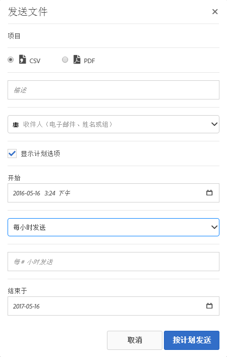

# 发送文件 - 计划交付项目

通过电子邮件发送 Analysis Workspace 项目，或者针对项目的提交进行规划。

1. [创建一个 Analysis Workspace 项目](https://marketing.adobe.com/resources/help/en_US/analytics/analysis-workspace/t_freeform_project.html)并保存该项目。
1. Click **[!UICONTROL Share]** &gt; **[!UICONTROL Send File On Schedule]**.

   

1. 在[!UICONTROL 发送文件]页面中，指定文件类型（CSV 或 PDF）。

   

1. Add recipients email addresses or names, the click **[!UICONTROL Send Now]**.
1. (Optional) Click **[!UICONTROL Show Scheduling Options]** to specify a delivery schedule, then click **[!UICONTROL Send on Schedule]**.
1. 在“组件”&gt;“计划项 **[!UICONTROL 目”中]** ，管 [理计划项目](/help/analyze/analysis-workspace/curate-share/schedule-projects.md)。
