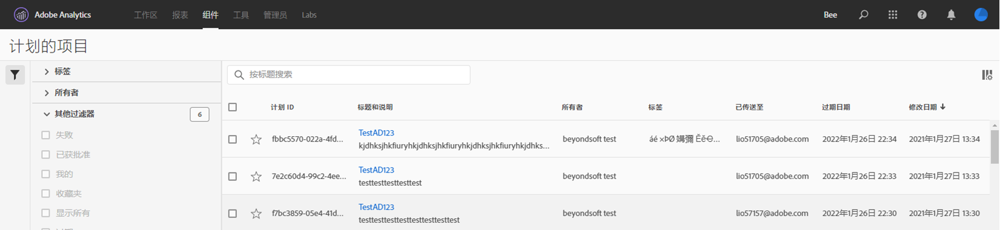

# 计划项目

从“工作区共 **享”菜单**，您可以通过电子邮件将Analysis Workspace项目发送给选定收件人。 文件可以以CSV或PDF格式发送。

## 立即发送文件

要立即通过电子邮件将文件发送给收件人:

1. Click **Share > Send File Now**.
1. 指定文件类型（CSV或PDF）。
1. （可选）添加将包含在电子邮件中的说明，以说明收到的文件。
1. 添加收件人或组。 还可以输入电子邮件地址。
1. 单击&#x200B;**立即发送**。
1. （可选）单击“显 **示计划选项** ”以指定投放计划。

## 按计划发送文件

要通过电子邮件将循环计划上的文件发送给收件人，请执行以下操作：

1. Click **Share > Send File on Schedule**.
1. 指定文件类型（CSV或PDF）。
1. （可选）添加将包含在电子邮件中的说明，以说明收到的文件。
1. 添加收件人或组。 还可以输入电子邮件地址。
1. 通过修改开始和结束输入指定计划应传送的范围。 结束日期必须在创建或修改计划之日起的一年内。
1. 指定投放频率。 每个频率允许不同的自定义。
1. 单击 **“在计划时发送**”。

## 计划项目管理器

计划的Analysis Workspace项目可在“分析”>“ **组件”>“计划项目”下进行管理**。

在计划项目管理器中，您可以编辑和删除重复的项目计划。 在搜索栏中或使用左边栏中的筛选器选项搜索计划。 您可以按标记、批准的计划、所有者等进行筛选。

以下是“计划项目”管理器中的常见操作：

| 操作 | 描述 |
|---|---|
| **编辑计划** | 单击计划的标题以更新其投放设置。 |
| **删除计划** | 在列表中选择计划的项目，然后从菜单中选择删除。 这将删除项目的选定计划;不会删除项目本身。 |
| **添加标记** | 在列表中选择计划的项目，然后选择“标记”或“批准”以组织计划并使其更易于搜索。 |
| **视图失败的计划** | 导航到左边栏>其他过滤器>未能看到已失败的计划。 |
| **视图过期计划** | 导航到左边栏>其他过滤器>过期，以查看已过期的计划。 单击计划的标题以设置新的交付计划。 |
| **视图计划ID** | 导航到右上方的列选项，并将计划ID列添加到表中。 计划的ID通常对调试有用。 |

计划项目管理器可显示特定用户已创建的项目。若应用程序中禁用此用户帐户，则会停止所有计划的提交。计划的项目所有权可 **以通过** “管理员”>“分析用 **户和资产”>“转移资产”转移给新用户**。
