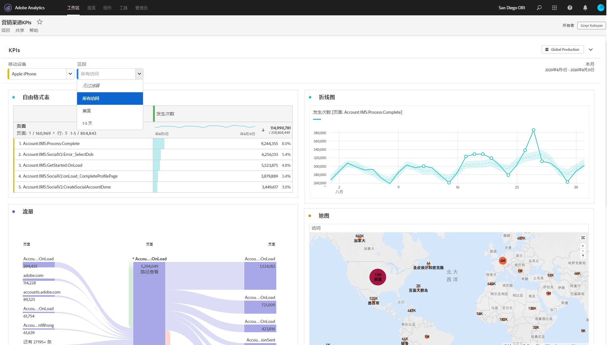

# 仅供查看的项目

您可以通过[项目共享工作流程](/help/analyze/analysis-workspace/curate-share/share-projects.md)与收件人共享“仅查看”项目。处于“可以查看”角色的收件人将获得更有限的项目体验。如果您将项目共享到不太熟悉您组织的数据结构（一般为 Analysis Workspace 或 Adobe Analytics）的用户，但仍想让他们在安全的环境下使用数据和洞察，则可能想要这样做。

请注意，即使在仅供查看的项目中，也可编辑面板日历日期范围。

下面是仅查看项目的视频概述：

>[!VIDEO](https://video.tv.adobe.com/v/36206/?quality=12)

## 禁用的交互

仅查看项目中已禁用的交互包括：

* 隐藏的左边栏
* 报表包
* 自由格式过滤
* 自由格式的可见行数
* 自由格式的行、列或可视化图表设置
* 面板区段
* 编辑、插入和组件菜单
* 工作区提示

## 启用的交互

仅查看项目中，一些更值得注意的已启用交互包括：

| 面积图 | 启用的交互 |
| --- | --- |
| 自由格式表 | <ul><li>分页和排序</li><li>悬停</li><li>更新链接可视化图表的单元格选择</li><li>右键单击 > 获取可视化图表链接</li><li>右键单击 > 复制到剪贴板</li></ul> |
| 可视化图表 | <ul><li>单击以打开/关闭图例</li><li>悬停</li><li>右键单击 > 获取可视化图表链接</li><li>折叠/展开</li><li>流量 - 展开流量节点</li><li>地图 - 缩放</li></ul> |
| 面板 | <ul><li>交互式下拉过滤器</li><li>右键单击 > 获取面板链接</li><li>折叠/展开</li></ul> |
| 项目 | <ul><li>检查所有信息图标</li><li>“项目”菜单 - 新建、打开、设置为登陆页、刷新、下载 CSV/PDF、有限的项目信息和设置</li><li>“共享”菜单 - 获取项目链接，立即发送文件</li><li>“帮助”菜单 - 除“提示和调试器”选项之外的所有操作</li></ul> |
