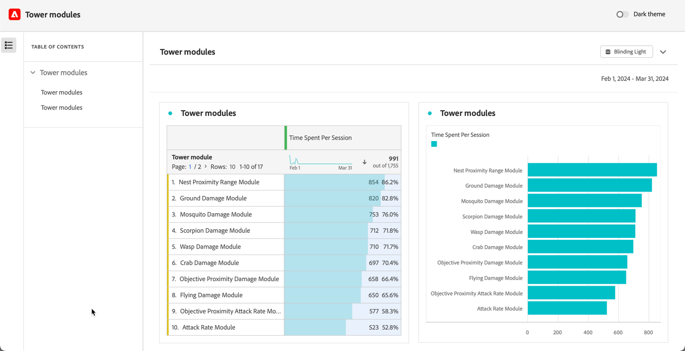

# 只读项目

您可以通过[共享功能](share-projects.md)以只读方式与收件人共享项目。 处于&#x200B;**[!UICONTROL 只读]**&#x200B;角色的收件人将获得更有限的项目体验。

如果您将项目共享到不太熟悉您组织的数据结构（一般为 Analysis Workspace 或 Adobe Analytics）的用户，但仍想让他们在安全的环境下使用数据和洞察，则可能想要这样做。

只读收件人的交互受到限制。

## 禁用的交互

仅查看项目中已禁用的交互包括：

* 隐藏的左侧面板
* 面板日历日期范围。注意：如果要向收件人授予日历控制权，请添加一个包含日期范围[的](https://experienceleague.adobe.com/docs/analytics-learn/tutorials/analysis-workspace/using-panels/using-drop-down-filters.html?lang=zh-Hans)下拉区段。
* 自由格式分段
* 自由格式的可见行数
* 自由格式的行、列或可视化图表设置
* 面板区段
* 编辑、插入和组件菜单
* 工作区提示

## 启用的交互

仅查看项目中，一些更值得注意的已启用交互包括：

| 面积图 | 启用的交互 |
| --- | --- |
| **自由格式表** | <li>分页和排序</li><li>悬停</li><li>更新链接可视化图表的单元格选择</li><li>从上下文菜单>获取可视化图表链接</li><li>从上下文菜单>复制到剪贴板</li> |
| **可视化图表** | <li>单击以打开/关闭图例</li><li>悬停</li><li>从上下文菜单>获取可视化图表链接</li><li>折叠/展开</li><li>流量 - 展开流量节点</li><li>地图 - 缩放</li></ul> |
| **面板** | <li>交互式下拉区段</li><li>从上下文菜单>获取面板链接</li><li>折叠/展开</li> |
| **项目** | <li>检查所有信息图标</li><li>“项目”菜单 - 新建、打开、设置为登陆页、刷新、下载 CSV/PDF、有限的项目信息和设置</li><li>“共享”菜单 - 获取项目链接，立即发送文件</li><li>“帮助”菜单 - 除“提示和调试器”选项之外的所有操作</li> |

## 与任何人分享经验

如果您使用[与任何人共享](share-projects.md#share-a-project-with-anyone-no-login-required)选择了项目，则链接接收者只能查看该项目，不能与该项目交互。

