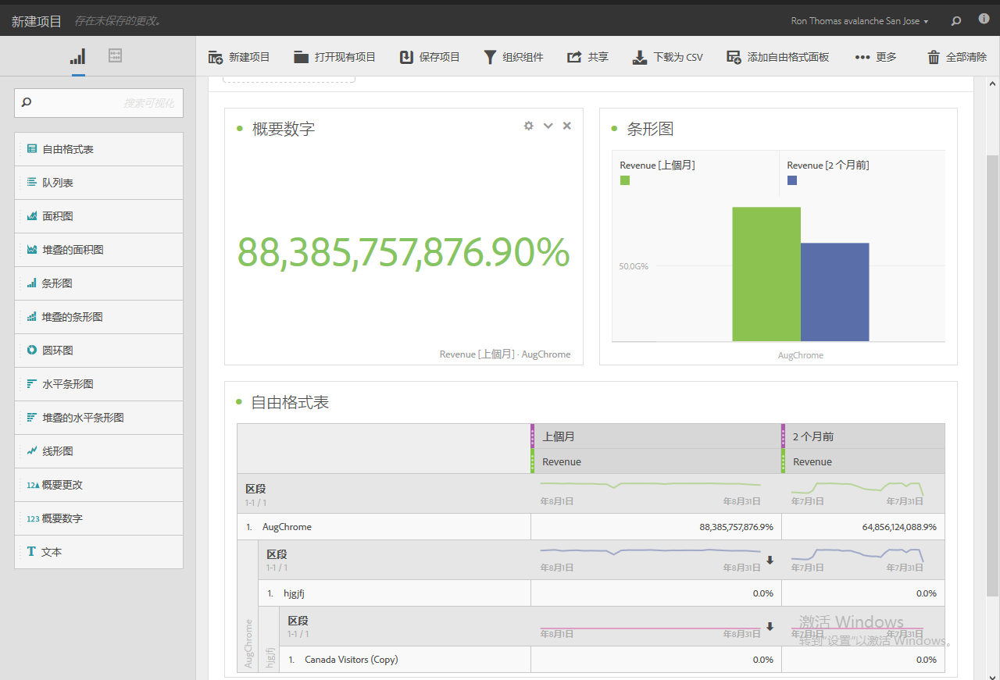
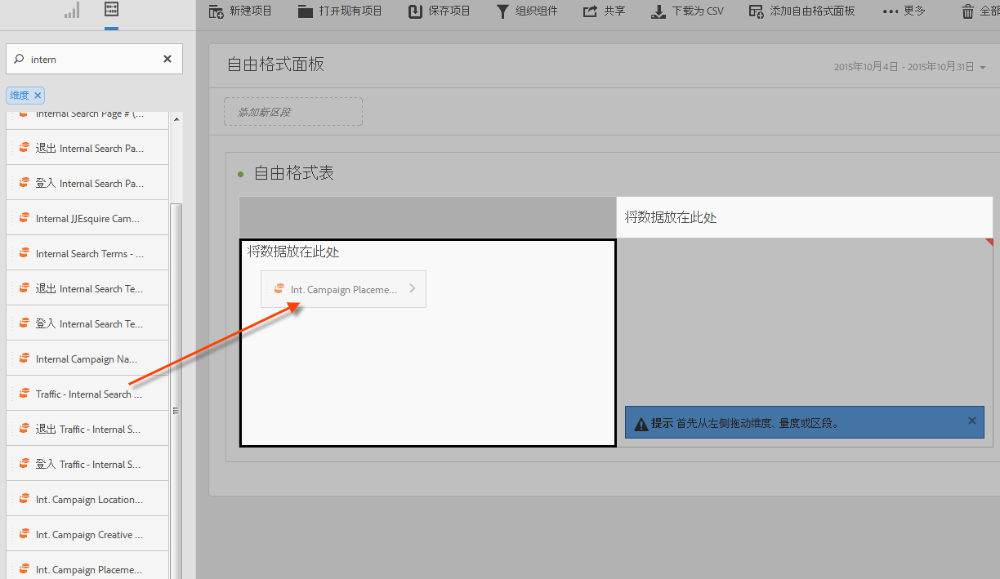
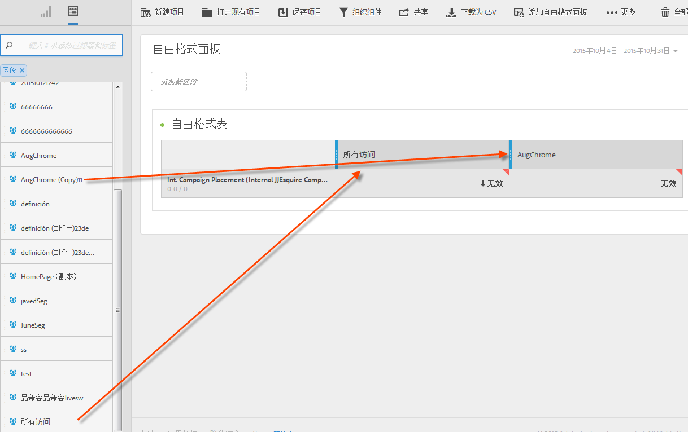
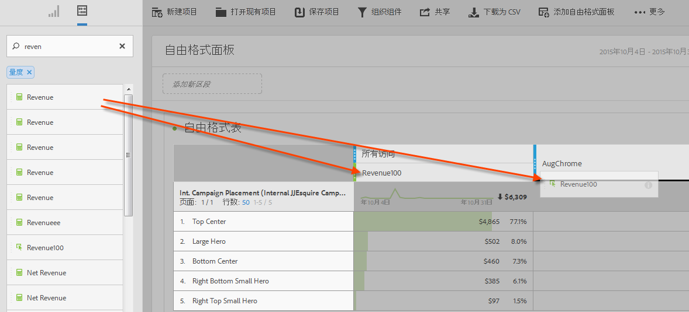
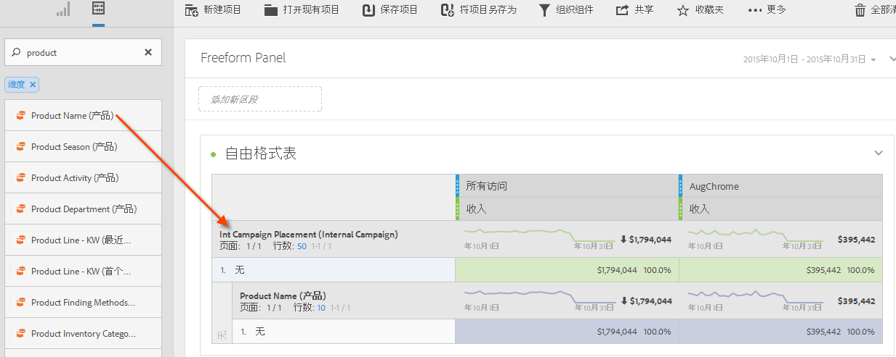
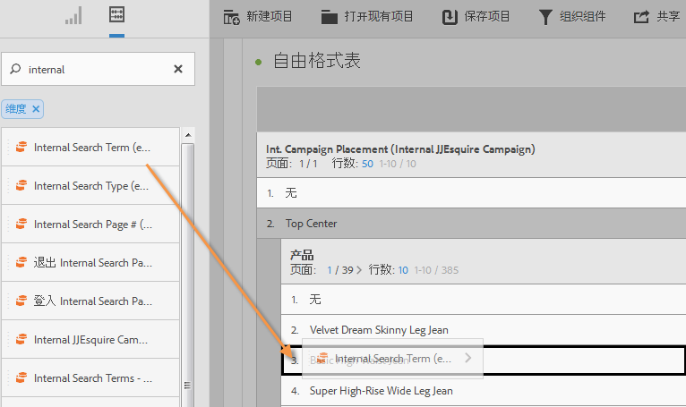
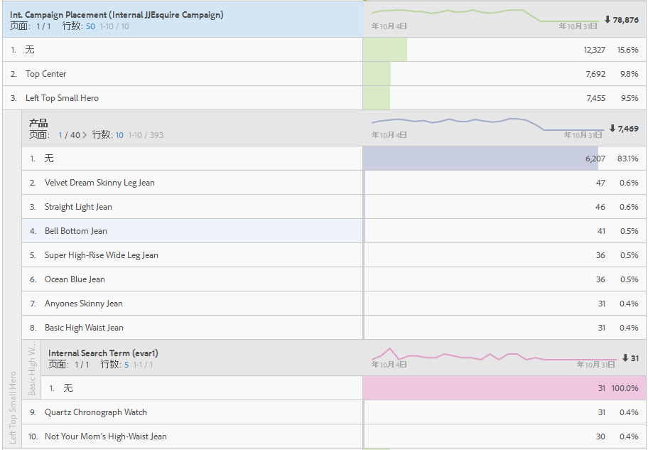

# Analysis Workspace使用案例

列举有关如何使用数据表、区段的示例，同时提供一些适合 Analysis Workspace 的用例建议。

您可以直接研究数据以回答具体的问题，并且可以收集有关客户的交互内容以及受众的兴趣所在。在自由格式环境中，您可以在一个时间段内应用维度、量度和区段，进而直接检索目标数据。针对具体问题精心定制分析，然后将信息发布到各类报表和可视化结果中以进行共享，同时方便时间非常有限的一线业务用户理解。

**示例**

* 作为一家传媒公司，您或许希望在新访客、回访客以及最忠实的访客之间进行比较，了解在每个不同的区段内容享用 (content consumption) 会随着时间发生怎样的变化？
* 比较品牌与非品牌关键词的转化率。
* 按照内部搜索、外部搜索、登录页面等划分页面查看次数，了解品牌与非品牌术语之间表现方式不同的原因。
* 比较前后两天的行或列，分析多个量度的增长情况。
* 执行一个简单的查询，例如某个维度的跳出次数。

## 零售示例 {#section_9EFDEF038CAD4954BCFB118A8F33A96F}

假设您是一家户外用品零售商的营销分析人员，您的任务是调查怎样筹划近期感恩节的促销活动，并且针对如何改善现场促销活动，提出各种建议。下面的示例显示了如何比较不同区段之间促销活动的收入数据，以及为了深入研究促销活动，应当怎样添加划分。

1. 选择相应的报表包。
1. 例如，搜索“内部促销活动部署”维度，并将它拖至表格画布的左侧区域（该数据将构成表格的行）。

   

1. 现在，单击左上方的区段图标，然后将各个客户忠诚度区段拖至画布的右半部分。这样可以准备在各个区段之间进行联机比较。它们将构成表格的列。

   

1. 单击左上方的“事件（量度）”图标，然后在每个区段的下方添加“收入”量度。请注意报表是怎样自动生成的。现在，您可以开始比较这些客户区段的促销活动收入了。

   

1. 如果您想了解页面左侧横幅槽中哪个产品最有效，请按照“产品名称”来划分左侧横幅。具体方法是：单击“维度”图标，然后将“产品名称”维度拖至左侧横幅的最顶端。

   

1. 不过，您可以深入了解更多的内容。或许，您想知道人们经常使用哪些搜索词来访问最畅销的产品 - Norfolk Highland。为此，您只需将“内部搜索词”维度拖至产品名称的顶端：

   

   屏幕上会显示一个新的划分结果：

   

   这种划分数据的方式可以为您的营销团队在其他促销活动中提供建议和交叉销售机会，进而为您的公司带来更多收入。您可以继续进行划分，直到获得需要的结果。

   现在您可以与这些营销团队[共享](../../analyze/analysis-workspace/curate-share/curate.md#concept_4A9726927E7C44AFA260E2BB2721AFC6)此报表。

