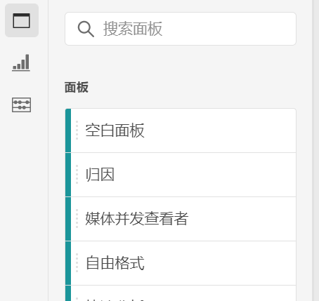
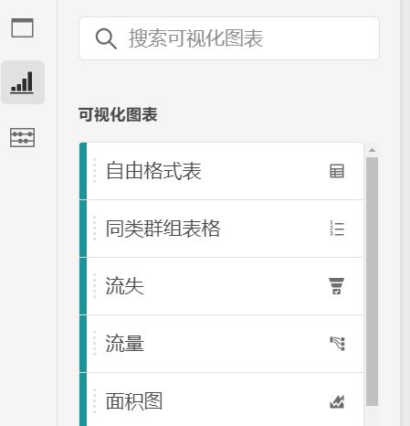
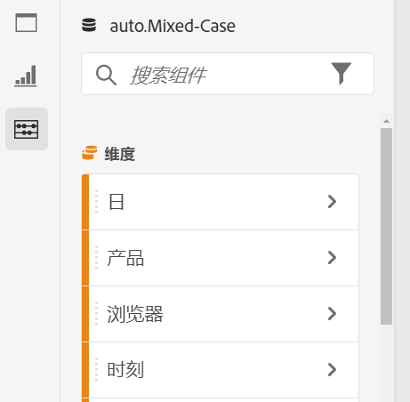
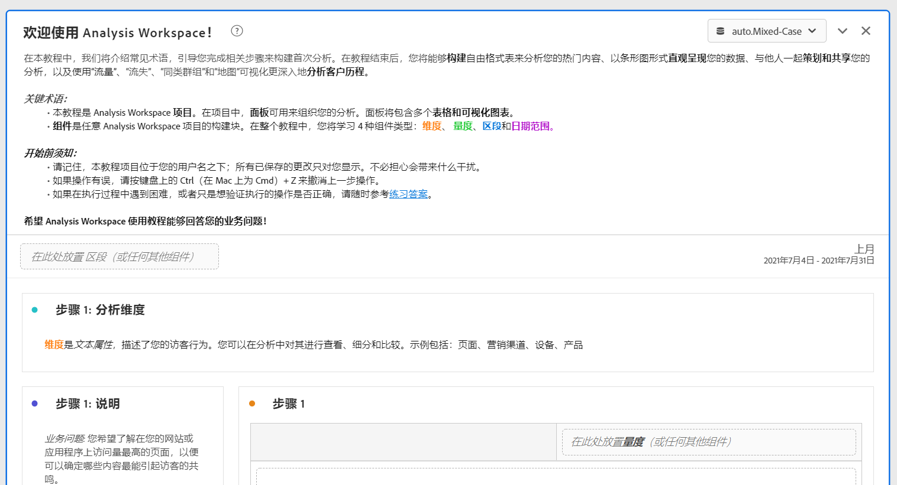

# Analysis Workspace 概述

利用 Analysis Workspace，可以快速生成分析以收集见解，然后与其他人共享这些见解。可以使用拖放浏览器界面进行分析、添加可视化图表以便直观地呈现数据、梳理数据集以及与您选定的任何人员共享和安排项目。

以下视频进行了简要概述，并例举了可以执行的操作。

>[!BEGINSHADEBOX]

有关演示视频，请参阅 [Analysis Workspace概述](https://video.tv.adobe.com/v/26266/?quality=12&learn=on){target="_blank"}。

>[!ENDSHADEBOX]

## Analysis Workspace 的区域

下面的图像和附表解释了 Analysis Workspace 中的一些主要区域：

| 图像中的位置 | 名称和功能 |
|---------|----------|
| A | **最左侧边栏：**&#x200B;包含用于向 Analysis Workspace 添加面板、可视化图表和组件的选项卡。还包含用于打开数据词典的数据词典图标。 |
| B | **左边栏：**&#x200B;根据在最左侧边栏中选择的选项卡，此区域包含单独的面板、可视化图表或组件。 |
| C | **画布：**&#x200B;这是您从左边栏拖动内容以构建项目的主要区域。当您向画布添加面板、可视化图表和组件时，项目将动态更新。 |
| D | **报表包下拉菜单：**&#x200B;对于 Analysis Workspace 中的每个面板，报表包下拉菜单可让您选择要用作数据源的报表包。 |

## Analysis Workspace 中的功能 {#analysis}

以下是 Analysis Workspace 中提供的一些主要功能：

### 面板

**“面板”**&#x200B;可以包含许多表格和可视化图表，用于在项目中对分析进行组织和整理。Analysis Workspace 中提供的许多面板都可以基于一些用户输入来生成整套分析。在最左侧边栏中，选择顶部的&#x200B;**[!UICONTROL 面板]**&#x200B;图标可查看所有可用的面板。

要了解有关面板的更多信息，请参阅[面板概述](https://experienceleague.adobe.com/docs/analytics/analyze/analysis-workspace/panels/panels.html?lang=zh-Hans)。

### 可视化图表

**可视化图表**（例如条形图或折线图）可用于直观地呈现数据。在最左侧边栏中，选择中间的&#x200B;**[!UICONTROL 可视化图表]**&#x200B;图标可查看所有可用的可视化图表。

要了解有关可视化图表的更多信息，请参阅[可视化图表概述](https://experienceleague.adobe.com/docs/analytics/analyze/analysis-workspace/visualizations/freeform-analysis-visualizations.html?lang=zh-Hans)。

### 组件

Analysis Workspace 中的组件包含：

* 维度

* 量度

* 区段

* 日期范围

要了解有关每种组件类型的更多信息，请参阅[组件概述](/help/analyze/analysis-workspace/components/analysis-workspace-components.md)。

所有这些组件类型均可添加到可视化图表（例如自由格式表）中以开始回答业务问题。

了解组件术语后，即可将组件拖入可视化图表（包括自由格式表）中以[构建分析](/help/analyze/analysis-workspace/build-workspace-project/freeform-overview.md)。

### 数据词典

Analysis Workspace 中的数据词典可帮助用户和管理员跟踪并更好地了解其 Analytics 环境中的组件。

要了解有关数据词典的更多信息，请参阅[数据词典概述](/help/analyze/analysis-workspace/components/data-dictionary/data-dictionary-overview.md)。

### 数据源

通过同步可视化图表，您可以控制与可视化图表对应的数据表或数据源。以下是有关如何[管理数据源](/help/analyze/analysis-workspace/visualizations/t-sync-visualization.md)的更多信息。

## 开始使用 Analysis Workspace

### 登录 Adobe Analytics {#login}

要开始使用 Analysis Workspace，请前往 [experience.adobe.com/analytics](https://experience.adobe.com/analytics) 登录 Adobe Analytics。默认情况下将显示 Analysis Workspace 的“项目”页面。如果已为您选择一个特定项目，默认情况下将显示该项目。

### 创建项目 {#new-project}

Analysis Workspace 中的分析被称作[项目](/help/analyze/analysis-workspace/build-workspace-project/freeform-overview.md)。

您可以在 Analysis Workspace 中创建项目，如[创建项目](/help/analyze/analysis-workspace/build-workspace-project/create-projects.md)中所述。

可以将项目组织到文件夹和子文件夹中，如 [Analysis Workspace 中的文件夹](/help/analyze/analysis-workspace/build-workspace-project/workspace-folders/about-folders.md)中所述。

### 保存和共享项目

在 Analysis Workspace 中创建分析时，您的工作将[自动保存](/help/analyze/analysis-workspace/build-workspace-project/save-projects.md)。

在构建完项目并收集可操作洞察后，项目即可供其他人使用。您可以与组织内的用户和组甚至组织外的人员共享项目。有关共享项目的信息，请参阅[共享项目](/help/analyze/analysis-workspace/curate-share/share-projects.md)。

## 其他资源 {#resources}

* Adobe 提供大量的 [Analytics 视频培训教程](https://experienceleague.adobe.com/docs/analytics-learn/tutorials/overview.html?lang=zh-Hans)。
* 有关新功能的更新，请参阅 [Adobe Experience Cloud 发行说明](https://experienceleague.adobe.com/docs/release-notes/experience-cloud/current.html#analytics)。
* 通过 Analysis Workspace 培训教程模板了解 Analysis Workspace 是一个不错的方法。此模板将指导您逐步了解在 Workspace 中构建第一个分析时通常会用到的术语和步骤。要开始使用该教程，请执行以下操作：
   1. 在 Adobe Analytics 中的 [!UICONTROL **Workspace**] 选项卡上，选择左侧的&#x200B;**[!UICONTROL 学习]**。
   1. 选择&#x200B;**[!UICONTROL 打开教程]**。
      

