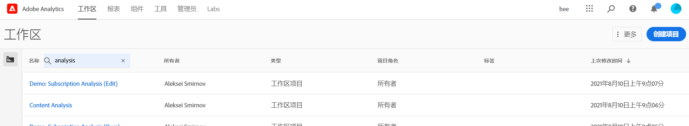
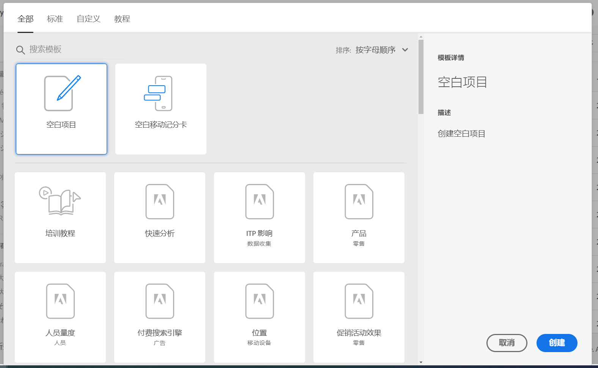

# Analysis Workspace 概述

Analysis Workspace是一款灵活的浏览器工具，可让您快速构建分析并分享见解。 使用拖放界面，您可以制作分析、添加可视化功能以栩栩如生地呈现数据、创建数据集、与组织中的任何人共享和计划项目。

如果您只有几分钟时间，请观看此简短的概述，了解可能的方法。

>[!VIDEO](https://docs.adobe.com/content/help/en/analytics-learn/tutorials/analysis-workspace/analysis-workspace-basics/analysis-workspace-overview.html)

## Log in to Adobe Analytics {#login}

要开始使用Analysis Workspace，请访问experience.adobe.com/analytics登录 [Adobe Analytics](http://experience.adobe.com/analytics)。 如果之前未为您选择特定项目，您将登录到Workspace项目列表主页。

## 使用培训教程 {#training-tutorial}

登录后，您的第一站应该是“Analysis Workspace培训教程”，该教程将指导您逐步了解在Workspace中构建第一个分析的常用术语和步骤。 要开始教程，请单击“ **[!UICONTROL 新建项目]** ”，然后在 **新项目模式中选择** “培训教程”。

## 创建新项目 {#new-project}

教程完成后，您可以开始构建您的第一个项目。 新的 **项目模式** 为您提供了不同的启动分析选项。 您可以选择从空白项目或空白移 [动记分卡开始](https://docs.adobe.com/content/help/zh-Hans/analytics/analyze/mobapp/curator.html)，具体取决于您是准备从浏览器还是Adobe Analytics仪表板移动应用程序共享分析。

您还可以从预建模板开始分析 ****，这些模板是Adobe提供的标准模板，或是由您的组织创建的自定义模板。 根据您所考虑的分析或用例，可以使用多个不同的模板。 [进一步了解](https://docs.adobe.com/content/help/zh-Hans/analytics/analyze/analysis-workspace/build-workspace-project/starter-projects.html) 可用的不同模板选项。

## 构建分析 {#analysis}

在您的Workspace项目 **中，面板、表、可视化和组件** （可从左边栏访问）。 这些是您的项目构件。

### 组件

**组件** 是维度、量度、细分或日期范围，所有这些都可以组合到自由形式 **[!UICONTROL 表中]** ,开始回答您的业务问题。 在深入分析之前，请 [务必熟悉](https://docs.adobe.com/content/help/zh-Hans/analytics/analyze/analysis-workspace/components/analysis-workspace-components.html) 每种组件类型。 掌握组件术语后，您可以开始拖放以在自由形 [式表中构建](https://docs.adobe.com/content/help/en/analytics/analyze/analysis-workspace/build-workspace-project/t-freeform-project.html)**[!UICONTROL 分析]**。

### 可视化图表

**然后**，在数据顶部添加可视化（如条形图或折线图），以可视方式使其栩栩如生。 在最左边的边栏上，选择中间的 **[!UICONTROL 可视化]** 图标以查看可用可视化 [的完](https://docs.adobe.com/content/help/zh-Hans/analytics/analyze/analysis-workspace/visualizations/freeform-analysis-visualizations.html) 整列表。

### 面板

**面板** 用于在项目中组织分析，并可包含许多表和可视化。 Analysis Workspace提供的许多专题小组根据少数用户的意见生成了全套分析。 在最左边的边栏上，选择顶部的“ **[!UICONTROL 面板]** ”图标，以查看可用面 [板的完](https://docs.adobe.com/content/help/en/analytics/analyze/analysis-workspace/panels/panels.html) 整列表。

## 其他资源 {#resources}

* Adobe优惠数百 [个Analytics视频培训教程](https://docs.adobe.com/content/help/en/analytics-learn/tutorials/overview.html)。
* 请参阅 [Analysis Workspace 中的新增功能](/help/analyze/analysis-workspace/new-features-in-analysis-workspace.md)以获取新增功能的最新信息。
