# Analysis Workspace 中的新增功能

## 2019 年 5 月

增强功能于2019年月日发布。

| 增强功能 | 描述 |
|--- |--- |
| 流量可视化图表设置中添加了一个新设置：包含重复实例。 | [流量设置](/help/analyze/analysis-workspace/visualizations/c-flow/flow-settings.md) |

## 2019 年 4 月

增强功能于2019年月11日发布。

| 增强功能 | 描述 |
|--- |--- |
| 优化最佳实践的增强功能 | [优化性能](/help/analyze/analysis-workspace/new-features-in-analysis-workspace.md) |

## 2019 年 1 月

2019 年 1 月 17 日发行的新增功能和增强功能。

| 功能 | 描述 |
|--- |--- |
| [同类群组分析](/help/analyze/analysis-workspace/visualizations/cohort-table/cohort-analysis.md) | 对同类群组分析进行重大改进后，您能够：<ul><li>应用区段包含并单独返回量度。 </li><li>显示流失率而不是保留率。</li><li>显示延时表（包含事件之前和之后经过的时间）。</li><li>自定义同类群组维度（根据 eVar 而不只是时间对访客进行分组）。</li><li>执行滚动同期计算：根据上一时段(而非原始同期)计算保留/流失。 </li><li>将多个量度添加到包含和回访字段中，并应用区段。（不支持计算量度）</li></ul> |
| [视图密度](/help/analyze/analysis-workspace/build-workspace-project/view-density.md) | 此新设置可减少左边栏、自由格式表和同类群组表中的垂直边距，从而使您能够在单个屏幕上查看更多数据。可通过项目 &gt; 项目信息和设置进行访问。 |
| [在归因 IQ 中支持多值变量](/help/analyze/analysis-workspace/attribution-iq/attribution.md) | Analytics 中的某些维度可以在单次点击中包含多个值，例如 listVar、产品变量、列表属性或推销 eVar。Analysis Workspace 允许您在点击级别将归因 IQ 应用于任何此类变量。 |
| 性能改进 | 提高了划分可视化图表的速度 - 具有大量划分的项目将能更快加载。 |

## 2018 年 11 月

2018 年 11 月 1 日发行的新增功能和增强功能。

| 功能 | 描述 |
|--- |--- |
| [VRS 和项目策划 - 增强功能](/help/analyze/analysis-workspace/curate-share/curate-projects-vrs.md) | 这些更改的实际引入时间为 2018 年 10 月。无论是管理员还是非管理员，都可以在策划的 Workspace 项目和策划的虚拟报表包 (VRS) 中，查看发生更改的组件。 此前，单击显示所有组件按钮后，大家只能查看非策划的组件。策划体验经过更新后，在查看组件方面提供了更加精细化的控制。  |

## 2018 年 10 月

2018 年 10 月 11 日发行的新增功能和增强功能。

<table id="table_3DDC812B2F66416F868004416D248BF3"> 
 <thead> 
  <tr> 
   <th colname="col1" class="entry"> 功能 </th> 
   <th colname="col2" class="entry"> 描述 </th> 
  </tr> 
 </thead>
 <tbody> 
  <tr> 
   <td colname="col1"> 
<b>面板下拉菜单管理</b> 
 </td> 
   <td colname="col2"> 
我们对面板下拉菜单的管理进行了一些更改，这些更改已在 9 月维护版本中引入。现在当您右键单击下拉菜单时，可以执行以下操作： 
 
    <ul id="ul_4BDEC66EEB2243628FE32B43E377E5BD"> 
     <li id="li_EF8277BE972540D3B2604D82BC7C0918">删除下拉菜单（此选项始终存在。） </li> 
     <li id="li_6A991208F2744274817DBE1E9D1B443F">删除标签（如果显示标签。） </li> 
     <li id="li_5C1CFC465C2E41D2B35E8841EFDC82AA">添加标签（如果没有显示标签。） </li> 
    </ul> </td> 
  </tr> 
  <tr> 
   <td colname="col1"> 
<b>面板和可视化工具提示中的链接</b> 
 </td> 
   <td colname="col2"> 
我们向面板和可视化工具提示中添加了指向相关视频和文档的链接。 
 </td> 
  </tr> 
 </tbody> 
</table>

## 2018 年 9 月

2018 年 9 月 13 日发行的新增功能和增强功能。

<table id="table_137719BFA03C44A78FDE872DF8B228A4"> 
 <thead> 
  <tr> 
   <th colname="col1" class="entry"> 功能 </th> 
   <th colname="col2" class="entry"> 描述 </th> 
  </tr> 
 </thead>
 <tbody> 
  <tr> 
   <td colname="col1"> 
<b>面板下拉菜单</b> 
 </td> 
   <td colname="col2"> 
面板拖放区域现在具备下拉菜单功能。通过下拉菜单，最终用户能够以可控方式与项目中的数据交互。例如：假设您的某个项目有多个版本，以提供针对特定国家/地区的报告。现在，您可以将这些不同版本整合到单个项目中，并添加一个国家/地区下拉菜单。 
 </td> 
  </tr> 
  <tr> 
   <td colname="col1"> 
<b>调色板</b> 
 </td> 
   <td colname="col2"> 
现在，您可以通过选择不同的调色板或指定个性化调色板来更改工作区中使用的配色方案。这项功能会影响工作区中的许多内容，包括大多数可视化图表。它<b>不会</b>影响概要变化、自由格式表中的条件格式以及地图可视化。 
 
注意：Internet Explorer 11 未启用调色板支持。 
 </td> 
  </tr> 
  <tr> 
   <td colname="col1"> 
<b>新模板：音频使用情况</b> 
 </td> 
   <td colname="col2"> 
请参阅 <a href="https://marketing.adobe.com/resources/help/en_US/sc/appmeasurement/hbvideo/media-workspace-templates.html" format="html" scope="external">Analytics 音频</a>。 
 </td> 
  </tr> 
 </tbody> 
</table>
## 2018 年 8 月

2018 年 8 月 9 日发行的新增功能和增强功能。

<table id="table_DD77C02344414DCD9AC0A6A22E648B72"> 
 <thead> 
  <tr> 
   <th colname="col1" class="entry"> 功能 </th> 
   <th colname="col2" class="entry"> 描述 </th> 
  </tr> 
 </thead>
 <tbody> 
  <tr> 
   <td colname="col1"> 
<b>拖放区域指南</b> 
 </td> 
   <td colname="col2"> 
这些指南可帮助您更轻松地了解每次拖放操作的用途。例如，当您将鼠标指针悬停在某列上时，其将会显示“添加”、“替换”、“过滤方式”和“划分”等内容。 
 
我们还添加了黄色/红色指南，可在您执行不推荐或禁止的操作时提醒您，例如将两个指标堆叠在一起（会导致数据无效）。 
 </td> 
  </tr> 
  <tr> 
   <td colname="col1"> 
<b>“添加空白面板”选项</b> 
 </td> 
   <td colname="col2"> 
我们在“开始面板”下方添加了一个 + 符号，更便于添加其他面板。 
 </td> 
  </tr> 
 </tbody> 
</table>

## 2018 年 7 月

2018 年 7 月 19 日发行的新增功能和增强功能。

<table id="table_336E121310204DC492EA004F40830B0F"> 
 <thead> 
  <tr> 
   <th colname="col1" class="entry"> 功能 </th> 
   <th colname="col2" class="entry"> 描述 </th> 
  </tr> 
 </thead>
 <tbody> 
  <tr> 
   <td colname="col1"> 
<b> <a href="../../analyze/analysis-workspace/attribution-iq/attribution.md#concept_5BDCF631FCC841FF920FE07F1B0D08A2" format="dita" scope="local"> 归因 IQ </a> </b> 
 </td> 
   <td colname="col2"> 
借助“归因 IQ”，您可以对营销效果进行更复杂、更智能的分析。新的归因模型可用于 Analysis Workspace（在任何表格或任何划分中）和计算量度中的量度。新的归因面板可提供更好的可视化图表和比较。 
 </td> 
  </tr> 
  <tr> 
   <td colname="col1"> 
<b> 改进左边栏 </b> 
 </td> 
   <td colname="col2"> 
对左边栏进行了改进，使其更为直观且便于使用： 
 
    <ul id="ul_087BEDF4338946DA857CD82CB69F98C2"> 
     <li id="li_C751AACAC60442DC93118F0819F8EEA7"> 为内嵌有标头的组件（量度、区段、日期）引入了创建 (+) 功能。 </li> 
     <li id="li_DE2EB184A02D4CE58C23F518DB85EFDD"> 在每个区域列表的底部添加了“+ 查看全部”，以表明有 5 个以上的选项。 </li> 
     <li id="li_5208F3C6026647B09F4A85131B175175">选择组件时会显示带有图标的操作（如标记、收藏夹）。 </li> 
     <li id="li_11E601488A844515928231E09889BC54">对用户界面进行了美学上的改进。 </li> 
    </ul> </td> 
  </tr> 
  <tr> 
   <td colname="col1"> 
<b>计算量度的总数 </b> 
 </td> 
   <td colname="col2"> 
如果可能，我们现在会显示计算量度的总数，包括百分数 
 </td> 
  </tr> 
  <tr> 
   <td colname="col1"> 
<b>新的<a href="../../analyze/analysis-workspace/components/calendar-date-ranges/calendar.md#concept_7705EA2616284F7185D82F5E872257FE" format="dita" scope="local">日期范围</a>预设</b> 
 </td> 
   <td colname="col2"> 
在 Analysis Workspace 的日期范围预设中添加了“最近 13 周整”。 
 </td> 
  </tr> 
 </tbody> 
</table>

## 2018 年 6 月

2018年月14日发布的新增功能和增强功能。

<table id="table_57035A06D99447A6BE6ED825A648ED3F"> 
 <thead> 
  <tr> 
   <th colname="col1" class="entry"> 功能 </th> 
   <th colname="col2" class="entry"> 描述 </th> 
  </tr> 
 </thead>
 <tbody> 
  <tr> 
   <td colname="col1"> 
<b> <a href="../../analyze/analysis-workspace/components/dimensions/view-dimensions.md#concept_5459DF3389564391A04AEBC63D732337" format="dita" scope="local"> 动态维度列 </a> </b> 
 </td> 
   <td colname="col2"> 
以往在列中放置维度时，最多可显示 5 个与时间无关的维度值（以及 15 个时间维度值），并且这些值都是静态的（即，选择的 5 个值永远不会发生变化）。 
 
从今以后，默认情况下将显示动态值而非静态值，同时还会提供一个将动态值转变为静态值的选项。其他注意事项： 
 
    <ul id="ul_C802BC32CB084E30B4E58E9E90B9A63D"> 
     <li id="li_452466AB416F4737B532849C604BD4CC">点击动态维度上的“i”，可查看排名（5 个值中的第 1 个）和维度类型。 </li> 
     <li id="li_588F6199E38D47869AC855A4C2A4D1B7">更新数据时，动态维度列也将随之更新，以显示当前的 5/15 个维度项目。 </li> 
     <li id="li_19D47638D4D94416B0DAD2B2FB835ABE">如果移动或复制动态维度列，那么这些维度值将变为静态值。 </li> 
     <li id="li_B95411689AE04774B7B9BA128F2DB96F">将鼠标悬停在一个静态维度列时，您会看到一个锁定图标，它表明该维度是静态的。 </li> 
    </ul> </td> 
  </tr> 
  <tr> 
   <td colname="col1"> 
<b>新工作区功能模态 </b> 
 </td> 
   <td colname="col2"> 
与上个月介绍的“每日提示”类似，每当有新版本时，在您首次登录到工作区后，这个模态就会显示新的工作区功能。 
 </td> 
  </tr> 
 </tbody> 
</table>

## 2018 年 5 月

2018年月10日发布的新增功能和增强功能。

<table id="table_EE4C690A178B4F80BDAF2BB4424D6020"> 
 <thead> 
  <tr> 
   <th colname="col1" class="entry"> 功能 </th> 
   <th colname="col2" class="entry"> 描述 </th> 
  </tr> 
 </thead>
 <tbody> 
  <tr> 
   <td colname="col1"> 
<b>每日提示</b> 
 </td> 
   <td colname="col2"> 
我们将在界面右下角提供“每日提示”（以及相应的短视频）。这些提示旨在帮助您熟悉 Analysis Workspace 的众多炫酷功能。您可以选择取消这些提示，或者随时通过帮助 &gt; 提示来访问这些提示。 
 
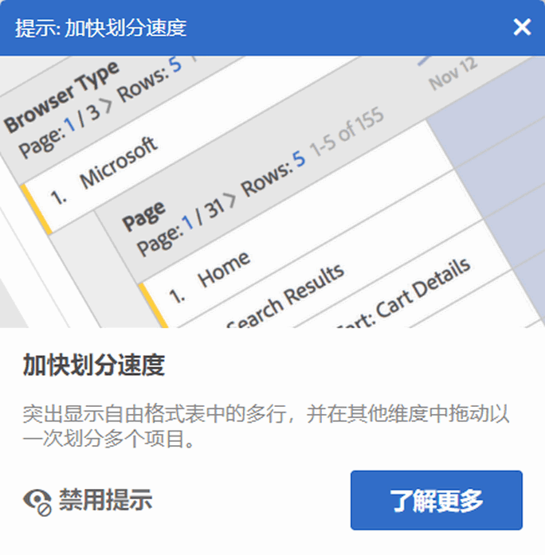 
 </td> 
  </tr> 
  <tr> 
   <td colname="col1"> 
<b><a href="../../analyze/analysis-workspace/components/t-freeform-project-segment.md#task_11C6A2C7717B48049E5750B9D20FEC80" format="dita" scope="local"> 区段模板 </a> 和 <a href="../../analyze/analysis-workspace/components/apply-create-metrics.md#concept_941E9463B88D4EC59076B0E3D76F7C5B" format="dita" scope="local"> 计算指标模板 </a></b> 
 </td> 
   <td colname="col2"> 
现在，左边栏会显示区段模板和计算量度模板。 
 </td> 
  </tr> 
  <tr> 
   <td colname="col1"> 
<b>拖动组件时的滚动功能</b> 
 </td> 
   <td colname="col2"> 
现在，将组件拖动到新位置时，您可以上下进行滚动。 
 </td> 
  </tr> 
  <tr> 
   <td colname="col1"> 
<b>有关 <a href="../../analyze/analysis-workspace/virtual-analyst/c-anomaly-detection/view-anomalies.md#concept_B215F229DD804928BB4455198E89A68D" format="dita" scope="local"> 异常的更多信息 </a></b> 
 </td> 
   <td colname="col2"> 
现在，将鼠标悬停在折线图中的异常时，异常信息会显示异常的日期和原始值。 
 </td> 
  </tr> 
 </tbody> 
</table>

## 2018 年 4 月

2018年月12日发布的新增功能和增强功能。

<table id="table_B9E784CD14A1453EB360FCCDC612250F"> 
 <thead> 
  <tr> 
   <th colname="col1" class="entry"> 功能 </th> 
   <th colname="col2" class="entry"> 描述 </th> 
  </tr> 
 </thead>
 <tbody> 
  <tr> 
   <td colname="col1"> 
 <a href="../../analyze/analysis-workspace/build-workspace-project/column-row-settings/column-settings.md#concept_05C48D3D834F416994602216C9FF6535" format="dita" scope="local">默认启用“标题文本换行”</a> 
 </td> 
   <td colname="col2"> 
默认情况下，将为自由格式表启用列设置标题文本换行。 
 </td> 
  </tr> 
  <tr> 
   <td colname="col1"> 
 <a href="../../analyze/analysis-workspace/build-workspace-project/column-row-settings/table-settings.md#concept_AA32AA9932F744FB9044F59C7B8E562C" format="dita" scope="local"> 新的行设置 </a> 
 </td> 
   <td colname="col2"> 
新的按行计算百分比设置强制自由格式表计算整行中的单元格百分比，而不是沿列向下计算。这对显示百分比趋势特别有用，例如显示一个维度值与其余维度值在一段时间内的对比趋势。在单击可视化图标时，默认情况下会开启该设置。 
 </td> 
  </tr> 
  <tr> 
   <td colname="col1"> 
 <a href="../../analyze/analysis-workspace/visualizations/freeform-analysis-visualizations.md#section_D3BB5042A92245D8BF6BCF072C66624B" format="dita" scope="local">“100% 堆叠”可视化设置</a> 
 </td> 
   <td colname="col2"> 
堆叠的区域/堆叠的条形/堆叠的水平条形可视化的新可视化设置将图表变为“100% 堆叠”的可视化，因此您可以度量相对比例。 
 
 
 </td> 
  </tr> 
  <tr> 
   <td colname="col1"> 
 <a href="../../analyze/analysis-workspace/virtual-analyst/virtual-analyst.md#concept_2DEA84993D8641808C25CF2DC286093E" format="dita" scope="local"> 异常检测和贡献分析</a>当前只能通过 Analysis Workspace 使用 
 </td> 
   <td colname="col2"> 
异常检测和贡献分析已从 Reports &amp; Analytics 功能集中删除，现在只能通过 Analysis Workspace 使用。 
 
请注意，Adobe Analytics Select 和 Adobe Analytics Foundation 客户只能访问 Workspace 中的“每天粒度”异常检测。 
 </td> 
  </tr> 
 </tbody> 
</table>

## 2018 年 3 月

2018年月日发布的新增功能和增强功能。

<table id="table_580CF2C1322E4FB78870BE2B1F497B2F"> 
 <thead> 
  <tr> 
   <th colname="col1" class="entry"> 功能 </th> 
   <th colname="col2" class="entry"> 描述 </th> 
  </tr> 
 </thead>
 <tbody> 
  <tr> 
   <td colname="col1"> 
 <a href="../../analyze/analysis-workspace/build-workspace-project/column-row-settings/column-settings.md#concept_05C48D3D834F416994602216C9FF6535" format="dita" scope="local"> 标题文本环绕 </a> 
 </td> 
   <td colname="col2"> 
现在，您可以隐藏自由格式表中的标头文本，以使标头更加易读，表格更易共享。我们已在“列”设置中添加了一个名为“隐藏标头文本”的选项。这对 .pdf 渲染和名称较长的量度尤其有用。 
 </td> 
  </tr> 
  <tr> 
   <td colname="col1"> 
 <a href="../../analyze/analysis-workspace/components/apply-create-metrics.md#concept_941E9463B88D4EC59076B0E3D76F7C5B" format="dita" scope="local">通过右键单击创建量度</a> 
 </td> 
   <td colname="col2"> 
为了更便于快速创建计算量度，从所选内容创建量度已添加到自由格式表的右键单击菜单。在选定一个或多个标头列单元格时，会显示该选项。 
 </td> 
  </tr> 
  <tr> 
   <td colname="col1"> 
 <a href="../../analyze/analysis-workspace/visualizations/map-visualization.md#concept_FC933745EDC248D6A783FC6865607F16" format="dita" scope="local"> 地图可视化增强 </a> 
 </td> 
   <td colname="col2"> 
为了能在地图可视化中显示同期（例如，年度）比较信息，我们已添加了以下增强功能： 
 
    <ul id="ul_F570E6AB174C45788620CF50E2742A08"> 
     <li id="li_746E329037764644A9CCF79161C26350">地图可视化增强现在可以显示负数。例如，如果您绘制的是以年同比量度，地图会在纽约上方显示 -33%。 </li> 
     <li id="li_E05F0380627044E6A4E8A60C98494BF7">对于“百分数”类型的量度，群集会计算所有百分比的平均值。 </li> 
     <li id="li_44C04306EA1B413E91B8256B340D5296">新颜色方案：正/负（绿色/红色） </li> 
    </ul> </td> 
  </tr> 
  <tr> 
   <td colname="col1"> 
 <a href="../../analyze/analysis-workspace/build-workspace-project/starter-projects.md#concept_49B9A327C5004DB0A4BE6291435625C5" format="dita" scope="local"> 自定义模版更新 </a> 
 </td> 
   <td colname="col2"> 
对于最近发布的自定义模版，我们已 
 
    <ul id="ul_787F48253F454163B99F6DD50F199FE2"> 
     <li id="li_828DD547DDB54A81B9FFB9FE92790F6C">在项目的顶部（标题附近）添加了模板图标，以帮助将编辑模板模式与使用模板作为项目起始点区分开来。 </li> 
     <li id="li_EEAA4D115CB74A57BABD524B2561E0CC">允许非管理员创建（另存为）并编辑工作区项目模板，前提是他们获得了在 Analysis Workspace 中创建/策划项目的权限。（管理员 &gt; 用户管理 &gt; 群组 &gt; 编辑所有报表访问权限 &gt; 自定义 Analytics 工具 &gt; 在 Analysis Workspace 中创建/策划项目）。 </li> 
    </ul> </td> 
  </tr> 
 </tbody> 
</table>

## 2018 年 2 月

2018 年 2 月 8 日发行的新增功能和增强功能.

<table id="table_824BBE4A554B4DB092ADA9044383D0FA"> 
 <thead> 
  <tr> 
   <th colname="col1" class="entry"> 功能 </th> 
   <th colname="col2" class="entry"> 描述 </th> 
  </tr> 
 </thead>
 <tbody> 
  <tr> 
   <td colname="col1"> 
 <a href="../../analyze/analysis-workspace/build-workspace-project/starter-projects.md#section_309C3DEDC9584A3FA3699BE10BF751ED" format="dita" scope="local"> 自定义工作区模板 </a> 
 </td> 
   <td colname="col2"> 
您现在可以构建并保存自己的工作区模板，这样一来，公司中的其他用户便可以开始使用与自己相关的数据。 
 </td> 
  </tr> 
  <tr> 
   <td colname="col1"> 
 <a href="../../analyze/analysis-workspace/build-workspace-project/t-freeform-project.md#task_C2C698ACC7954062A28E4784911E6CF2" format="dita" scope="local">“新建项目”启动模式</a> 
 </td> 
   <td colname="col2"> 
单击“新建项目”可启动一个新的屏幕，您可以从中选取新建项目的具体选项： 
 
    <ul id="ul_FE90E6B9AF334A029D66A43901F8FA0B"> 
     <li id="li_F1DFD9AE140C4E5B849D4C522D5968DB">空白项目，或 </li> 
     <li id="li_23BD391D68674C299858A97BFE10598B">标准的（内置）工作区模板，或 </li> 
     <li id="li_04D84FE375B84BF88843AA0D43A234BF">采用自定义的工作区模板（参见前面所述内容） </li> 
    </ul> </td> 
  </tr> 
  <tr> 
   <td colname="col1"> 
“右键单击”操作支持“复制”命令 
 </td> 
   <td colname="col2"> 
我们增加了一个右键单击“复制到剪贴板”选项，利用该选项可以持续复制单元格/表格。 
 </td> 
  </tr> 
  <tr> 
   <td colname="col1"> 
 <a href="../../analyze/analysis-workspace/build-workspace-project/column-row-settings/column-settings.md#concept_05C48D3D834F416994602216C9FF6535" format="dita" scope="local">对列中的百分比做出了改进</a> 
 </td> 
   <td colname="col2"> 
以前，列中显示的“总数百分比”最多只能达到 100%，即使在某些情况下，行中的数值（如平均数）占总数的百分比超过了 100% 也是如此。 
 
现在，我们可以显示大于 100% 的百分比，准确度提高了。此外，我们还将上限调整为 1,000%，以确保允许列值有充足的变化范围。 
 </td> 
  </tr> 
  <tr> 
   <td colname="col1"> 
 <a href="../../analyze/analysis-workspace/build-workspace-project/column-row-settings/column-settings.md#section_3DD847151DA14914888A70FC4FD7BDFB" format="dita" scope="local"> 在各种划分中启用了条件格式 </a> 
 </td> 
   <td colname="col2"> 
现在，除非选择了“自定义”限制，否则对于各种划分，将在自由格式表格中自动应用条件格式（颜色等）。 
 </td> 
  </tr> 
  <tr> 
   <td colname="col1"> 
对默认 <a href="../../analyze/analysis-workspace/components/calendar-date-ranges/calendar.md#concept_7705EA2616284F7185D82F5E872257FE" format="dita" scope="local"> 日历</a>视图的更改 
 </td> 
   <td colname="col2"> 
如今，工作区日历默认情况下将显示当前月份和上一月份，而不是当前月份和下一月份。 
 </td> 
  </tr> 
  <tr> 
   <td colname="col1"> 
改进了工作区表格中的悬停/选择颜色 
 </td> 
   <td colname="col2"> 
与单击单元格时相比，将鼠标悬停在自由格式表格单元格时，二者的颜色差别变得更加分明。 
 </td> 
  </tr> 
 </tbody> 
</table>

## 2018 年 1 月

2018 年 1 月 18 日发行的新增功能和增强功能。

<table id="table_7A2E678577F94BDABB1276C826E6554F"> 
 <thead> 
  <tr> 
   <th colname="col1" class="entry"> 功能 </th> 
   <th colname="col2" class="entry"> 描述 </th> 
  </tr> 
 </thead>
 <tbody> 
  <tr> 
   <td colname="col1"> 
自由格式表格中增加了更多的维度项目<a href="../../analyze/analysis-workspace/build-workspace-project/pagination-filtering-sorting.md#concept_3E1AE8B53CBE4D06B2C4470EDA7E9FE9" format="dita" scope="local">过滤选项</a> 
 </td> 
   <td colname="col2"> 
已经为维度项目增加了以下（高级）过滤选项（除了现有的“包含”和“不包含”选项之外）： 
 
    <ul id="ul_869B3E943E304C0282D56AD96BB79E18"> 
     <li id="li_81A49BA0CA3041C7AB892FAD2D129E5A">包含所有词语 </li> 
     <li id="li_2AB564F917844F82839A91949D0B684A">包含任何词语 </li> 
     <li id="li_16C7938EDC8F422EA006FB63F2881EF1">包含该短语 </li> 
     <li id="li_5130EBE9A7A54CCFA313F3C3C268B367">不包含任何词语 </li> 
     <li id="li_861825154EDC49EBA57514FD0A2AE462">不包含该短语 </li> 
     <li id="li_5364BFB73ECF4B92A6663693ABD4BCF5">等于 </li> 
     <li id="li_1EBF3119B6364842A35D39BAD645F4AF">不等于 </li> 
     <li id="li_487886E0A6EC4245A0E85D2E8B4A20FB">开始于 </li> 
     <li id="li_A73F54DFBAAB44D4A4134342A3124E47">结束于 </li> 
    </ul> </td> 
  </tr> 
  <tr> 
   <td colname="col1"> 
 <a href="../../analyze/analysis-workspace/visualizations/freeform-analysis-visualizations.md#section_05B7914D4C9E443F97E2BFFDEC70240C" format="dita" scope="local"> 在不同面板、不同项目之间复制和粘贴可视化/面板</a> 
 </td> 
   <td colname="col2"> 
现在，您可以右键单击并复制可视化或面板，然后将复制的可视化或面板粘贴（“插入”）到同一项目的其他位置或其他项目中。 
 
您可以利用此项功能来创建一些能够复制到其他项目中的“构建基块”（预定义的可视化/面板），从而更加快速地运用特定于您公司的数据。 
 </td> 
  </tr> 
  <tr> 
   <td colname="col1"> 
 <a href="../../analyze/analysis-workspace/build-workspace-project/starter-projects.md#concept_49B9A327C5004DB0A4BE6291435625C5" format="dita" scope="local">新增了 Mobile “消息”模板和“位置”模板</a> 
 </td> 
   <td colname="col2"> 
添加了以下两种项目模板： 
 
    <ul id="ul_2F5976C849474A2B8A6BCDA2559F2855"> 
     <li id="li_51B7830E062A4CFDBDF219C56249A733">一种全新的 Mobile 项目“消息”模板，此模板重点关注应用内消息推送的性能。 </li> 
     <li id="li_D2FB258EF3AF4EB19CEB258D08F4EBBE">一种全新的 Mobile 项目“位置”模板，此模板包含可展示位置数据的“地图”。 </li> 
    </ul> </td> 
  </tr> 
  <tr> 
   <td colname="col1"> 
对列大小调整功能做出了改进 
 </td> 
   <td colname="col2"> 
在调整最左侧列的大小时，Workspace 现在会保持其余列的宽度百分比（而不只是调整右侧的下一列宽度）。这种改变有助于更加快速地创建表格以进行分析和共享。 
 </td> 
  </tr> 
  <tr> 
   <td colname="col1"> 
可在表格中显示 <a href="../../analyze/analysis-workspace/visualizations/freeform-table.md#concept_0D2E24FCCBAF4194AA941448860E422F" format="dita" scope="local">400 行</a>内容 
 </td> 
   <td colname="col2"> 
现在，您可以在表格中显示 400 行（比之前增多了 200 行），从而可在表格中囊括 365 天的趋势。 
 </td> 
  </tr> 
  <tr> 
   <td colname="col1"> 
 <a href="../../analyze/analysis-workspace/visualizations/map-visualization.md#concept_FC933745EDC248D6A783FC6865607F16" format="dita" scope="local"> PDF 中的地图可视化支持</a> 
 </td> 
   <td colname="col2"> 
现在可以在 PDF 中对 2017 年 10 月推出的地图可视化进行渲染。 
 </td> 
  </tr> 
  <tr> 
   <td colname="col1"> 
 <a href="../../analyze/analysis-workspace/build-workspace-project/t-freeform-project.md#task_C2C698ACC7954062A28E4784911E6CF2" format="dita" scope="local"> 复制/另存为项目时使用相对内部链接</a> 
 </td> 
   <td colname="col2"> 
以前，当您复制某个项目或执行“另存为”时，保存在该项目中的所有内部链接均指向原始项目，而不是复制后的项目。 
 
现在，执行“复制”或“另存为”操作后，内部链接都是一些相对于其所在项目的链接。 
 </td> 
  </tr> 
  <tr> 
   <td colname="col1"> 
贡献分析：<a href="https://marketing.adobe.com/resources/help/en_US/analytics/contribution/ca_main.html" format="html" scope="external">令牌通知 </a> 
 </td> 
   <td colname="col2"> 
如果贵公司的贡献分析令牌数量有限，则您每次用掉一个令牌后 Analysis Workspace UI 中会显示相关通知。这可以让您知晓还剩下多少令牌。&amp; amp；nbsp； 
 
（管理员用户：您可以通过编辑群组权限，对能够使用令牌的人员进行限制。此权限称为“异常检测和贡献分析”，位于 Analytics &gt; 管理员 &gt; 用户管理 &gt; 编辑群组 &gt; 编辑所有报表访问权限 &gt; 自定义报表包工具 &gt; 工具和报表下。） 
 </td> 
  </tr> 
  <tr> 
   <td colname="col1"> 
CSV 文件可包含多字节字符 
 </td> 
   <td colname="col2"> 现在，可以在 MS Excel 中打开通过电子邮件传送的包含多字节字符的 CSV 文件。 </td> 
  </tr> 
  <tr> 
   <td colname="col1"> 
对 event#、eVar# 和 prop# 进行了更改 
 </td> 
   <td colname="col2"> 
Event#、eVar# 和 prop# 之前被添加在左边栏的维度名称中（2017 年），现在，只有当您<b>搜索</b>相应组件时，它们才会显示。 
 
（这同样适用于虚拟报表包生成器。） 
 </td> 
  </tr> 
  <tr> 
   <td colname="col1"> 
对“无”/“未指定”进行了更改 
 </td> 
   <td colname="col2"> 
对 Analysis Workspace 中“无”/“未指定”的工作方式进行了更改，从而使其与 Reports &amp; Analytics、区段生成器和 Analysis Workspace 中的维度值菜单保持一致。 
 
这意味着在 Analysis Workspace 的大多数项目中，值将显示为“未指定”而非“无”。 
 </td> 
  </tr> 
 </tbody> 
</table>

## 2017 年 11 月

2017 年 11 月 9 日发布的新功能。

<table id="table_C502E81253634E6CBAE7F12C7B62F7B6"> 
 <thead> 
  <tr> 
   <th colname="col1" class="entry"> 功能 </th> 
   <th colname="col2" class="entry"> 描述 </th> 
  </tr> 
 </thead>
 <tbody> 
  <tr> 
   <td colname="col1"> 
不兼容组件列表 
 </td> 
   <td colname="col2"> 
有时候，并非项目中包含的所有组件都会包含在报表包中。在加载项目或切换到报表包时显示的“不兼容的报表包”结果消息现在会列出不兼容的组件。 
 </td> 
  </tr> 
 </tbody> 
</table>

## 2017 年 10 月

2017 年 10 月 26 日发布的新功能。

<table id="table_892279F2B4AF4DB38C64AA9AFC5657A7"> 
 <thead> 
  <tr> 
   <th colname="col1" class="entry"> 功能 </th> 
   <th colname="col2" class="entry"> 描述 </th> 
  </tr> 
 </thead>
 <tbody> 
  <tr> 
   <td colname="col1"> 
 <a href="../../analyze/analysis-workspace/visualizations/map-visualization.md#concept_FC933745EDC248D6A783FC6865607F16" format="dita" scope="local"> 地图可视化 </a> 
 </td> 
   <td colname="col2"> 
新的和nbsp；地图可视化和控制；nbsp；使您能够在位置环境中轻松查看客户互动。从宏观（全球）视图到微观（城市）视图，您可以轻松地放大和缩小可视化中的各种层次结构等级，以了解跨区域的客户集群。 
 
您可以通过 IP 地址对位置数据进行可视化（对于非移动数据集），或者可以在 Analysis Workspace 中将经纬度数据（对于使用 Mobile SDK 的客户）变得生动有趣。&amp; amp；nbsp； 
 </td> 
  </tr> 
  <tr> 
   <td colname="col1"> 
 <a href="../../analyze/analysis-workspace/visualizations/line.md#concept_EBE07FCD66C24D2AB58F1EC0F8017AD8" format="dita" scope="local"> 趋势可视化的粒度选择器 </a> 
 </td> 
   <td colname="col2"> 
现在，当数据源中的维度为时间维度时，您可以轻松地在时间粒度之间切换。您可以从可视化设置的下拉列表中切换粒度。 
 </td> 
  </tr> 
  <tr> 
   <td colname="col1"> 
 <a href="../../analyze/analysis-workspace/components/t-freeform-project-segment.md#task_11C6A2C7717B48049E5750B9D20FEC80" format="dita" scope="local"> 区段拖放区域中的完整维度和事件 </a> 
 </td> 
   <td colname="col2"> 
以前，您只能将维度项目、日期范围或区段放入区段拖放区域。现在您可以将完整的维度或事件放入区段拖放区域。在这两种情况下，Analysis Workspace 将创建“存在”点击区段。 
 
示例：“在 eVar1 存在的地方点击”或“在 event1 存在的地方点击”。 
 
注意：您无法将计算量度放入区段区域。只有这些可为其构建区段的维度/量度才具有放入区段区域的资格。 
 </td> 
  </tr> 
  <tr> 
   <td colname="col1"> 
 <a href="../../analyze/analysis-workspace/visualizations/t-sync-visualization.md#task_A73B065DC3834AFCA422E364A1468099" format="dita" scope="local"> 数据源设置中列出了已连接的可视化 </a> 
 </td> 
   <td colname="col2"> 
如果有可视化连接到自由格式或同类表，左上侧的点（数据源设置）即会列出连接的可视化。将鼠标悬停在其上方将突出显示链接的可视化，单击它即会转到该可视化。 
 
此外，还有一个“显示/隐藏数据表”复选框可让您显示或隐藏数据表。 
 </td> 
  </tr> 
  <tr> 
   <td colname="col1"> 
 <a href="../../analyze/analysis-workspace/build-workspace-project/t-freeform-project.md#task_C2C698ACC7954062A28E4784911E6CF2" format="dita" scope="local">向左边栏事件名称添加了 Event#</a> 
 </td> 
   <td colname="col2"> 
在 2017 年 10 月之前，evar# 和 prop# 均被附加到维度名称，您可以对这些数字编号进行搜索。相同的功能现在也可用于事件。 
 
示例：“Subscriptions”当前在左边栏中显示为“Subscriptions (event1)”。 
 
请记住： 
 
    <ul id="ul_5DF85C65F7004539949DDC4F23922296"> 
     <li id="li_A685834B4914460D87568583BB39C474">表中不显示事件编号（为了使标题保持简短）。 </li> 
     <li id="li_D742D04470244633900335B7F5A79FD9">为了保持一致性，表中不再显示 prop 和 eVar 的编号。 </li> 
    </ul> </td> 
  </tr> 
  <tr> 
   <td colname="col1"> 
 <a href="../../analyze/analysis-workspace/build-workspace-project/t-freeform-project.md#task_C2C698ACC7954062A28E4784911E6CF2" format="dita" scope="local"> 在默认情况下，现有的维度按逻辑顺序排序 </a> 
 </td> 
   <td colname="col2"> 
某些现有维度的默认排序顺序在下列情况下已更新： 
 
    <ul id="ul_B9C0C761F39E43A4977EC028F4D4525C"> 
     <li id="li_FE72ADDCD32A4FF7907462726D6E7758">当它们被拖到自由格式表中时。 </li> 
     <li id="li_5D78DD0DCB7347AC85E260F53109010C">当它们在左边栏中被人查看时。 </li> 
    </ul> 
例如，如果将“小时”放入表中，它将按照从 12AM 至 11PM 的顺序进行排序。您仍然可以选择按照任何量度列进行排序。 
 </td> 
  </tr> 
  <tr> 
   <td colname="col1"> 
 <a href="../../analyze/analysis-workspace/virtual-analyst/c-anomaly-detection/view-anomalies.md" format="dita" scope="local">允许置信度间隔重新缩放图表的选项</a> 
 </td> 
   <td colname="col2"> 
异常检测置信度间隔不会自动缩放可视化的 y 轴以期让图表变得更加清晰易读。 
 
您现在可以选择允许置信度间隔缩放图表。 
 </td> 
  </tr> 
  <tr> 
   <td colname="col1"> 
 <a href="/help/components/c-alerts/alert-manager.md" format="dita" scope="local"> 警报：已添加<b>续订</b>选项 </a> 
 </td> 
   <td colname="col2"> 
在警报管理器中选择了一个或多个警报后，可通过单击续订来续订它们。 
 
这会将它们的过期日期延长一年的时间（从单击续订之日算起，而不考虑它们的原始过期日期）。 
 </td> 
  </tr> 
  <tr> 
   <td colname="col1"> 
UI 改进 
 </td> 
   <td colname="col2"> 
    <ul id="ul_645B43AC6F554353B887DD58F0AA86E8"> 
     <li id="li_05B16A84008E4DA3A5DE91AF3C942D55">空白面板：现在我们从一开始就突出显示了可添加到空白面板的所有可视化，例如地图、流失、流量、直方图、同类群组和维恩。您可以选择保存此面板作为您的默认项目开始状态。 </li> 
     <li id="li_9F1ED138DB0E453DA6BD4B4A512492CC">新的左边栏样式使左边栏中的“面板”、“可视化”和“组件”变得更加清晰易用。 </li> 
     <li id="li_5DF6177F0EFD4D4D9D432768DEA3F37D">自由格式表：空白的自由格式表现在将显示一个动画 GIF，来展示 Analysis Workspace 的拖放范例。 </li> 
    </ul> </td> 
  </tr> 
 </tbody> 
</table>

## 2017 年 9 月

2017 年 9 月 21 日发布的新功能。

<table id="table_DC0DA93B8A3B481080FCB2BA8F985753"> 
 <thead> 
  <tr> 
   <th colname="col1" class="entry"> 功能 </th> 
   <th colname="col2" class="entry"> 描述 </th> 
  </tr> 
 </thead>
 <tbody> 
  <tr> 
   <td colname="col1"> 
 <a href="../../analyze/analysis-workspace/components/dimensions/time-parting-dimensions.md#concept_03D6295D84CD42528D40B932AD80AE04" format="dita" scope="local">Analysis Workspace 中的时间划分维度</a> 
 </td> 
   <td colname="col2"> 
基于时间戳的维度现已添加到 Analysis Workspace 中。维度包括： 
 
    <ul id="ul_9BDBC0B344504E85840040E493873A47"> 
     <li id="li_826A8CBF4FDB4C98AC176C7145C09DB2">每天时间（例如，01 时、12 时、15 时、23 时） </li> 
     <li id="li_FD6AAD4D3F544224A757D8124F973BE5">上午/下午（例如，上午、下午） </li> 
     <li id="li_5CAE35FB8E3E490A8FCF72DF8AC619CC">每周时间（例如，星期一、星期二、星期三等） </li> 
     <li id="li_930DFC6BFCC740A392EC7FA859FF0E73">周末/工作日（例如，周末、工作日） </li> 
     <li id="li_C09F8BF8C598498392732C183C5BB720">日期（例如 1 日、2 日、....30 日、31 日） </li> 
     <li id="li_E80A8932C32B4410A9BC703090FB5CFF">月份（例如，一月、二月、三月） </li> 
     <li id="li_67620F09B58244B2B17317E0DB97067A">每年的某一日（例如，第 1 天、第 2 天，等） </li> 
     <li id="li_A96CD77357064FC19D92EFA8244560D6">季度（例如 1 季度、2 季度） </li> 
    </ul> </td> 
  </tr> 
  <tr> 
   <td colname="col1"> 
 <a href="../../analyze/analysis-workspace/build-workspace-project/column-row-settings/column-settings.md#concept_05C48D3D834F416994602216C9FF6535" format="dita" scope="local"> 在自由格式表中一次管理多个列 </a> 
 </td> 
   <td colname="col2"> 
您现在可一次更改多个列中的设置，只需选择多个列并单击其中任意一列的设置图标。您所做的任何更改将应用于有单元格被选中的所有列。 
 </td> 
  </tr> 
  <tr> 
   <td colname="col1"> 
 <a href="../../analyze/analysis-workspace/visualizations/c-flow/multi-dimensional-flow.md#concept_7D1D66E9D34D4C52902C8E2D92658B27" format="dita" scope="local"> 流量：维度间标签设置 </a> 
 </td> 
   <td colname="col2"> 
现在每个“流量”列的顶部有一个新的维度标签，让您在流量可视化图表中使用多个维度时变得更加直观。 
 </td> 
  </tr> 
  <tr> 
   <td colname="col1"> 
 <a href="../../analyze/analysis-workspace/visualizations/histogram.md#section_09D774C584864D4CA6B5672DC2927477" format="dita" scope="local"> 直方图点击计数方法 </a> 
 </td> 
   <td colname="col2"> 
以前，直方图可视化图表中有两种计数方法：访问和访客（默认）。 
 
现在可以使用第三种计数方法作为区段容器，即“点击”。“发生次数”可用作自由格式表中的 y 轴量度。 
 </td> 
  </tr> 
  <tr> 
   <td colname="col1"> 
  用于区段比较和贡献分析配置的全部清除按钮 
 </td> 
   <td colname="col2"> 
您现在可以“全部清除”工作区中以下区域的所有元素，而不必手动删除每个元素。 
 
    <ul id="ul_73E06D64CDCA4E83B9FEC2FD99D41CD3"> 
     <li id="li_A51EF8FADFA04CC19FD79C1675597659"> <a href="../../analyze/analysis-workspace/virtual-analyst/contribution-analysis/run-contribution-analysis.md#section_F6932F4BF74544B5872164E7B1E0C6FC" format="dita" scope="local">“贡献分析”中“排除的组件”</a> </li> 
     <li id="li_30E612D5A7584484967260931DB9E30E"> <a href="../../analyze/analysis-workspace/c-panels/c-segment-comparison/compare-segments.md#section_5E98FFA0744140C08D83700E3F025937" format="dita" scope="local">“区段比较”中“排除的组件”</a> </li> 
    </ul> </td> 
  </tr> 
  <tr> 
   <td colname="col1"> 
 <a href="../../analyze/analysis-workspace/visualizations/summary-number-change.md#concept_804726EA096349F8AECF8C2D3DFD9BE4" format="dita" scope="local">“概要变化”中的显示类型更新了名称</a> 
 </td> 
   <td colname="col2"> 
目前在“概要变化选项”中使用的两个选项进行了重命名，以明确其含义： 
 
    <ul id="ul_7301D1C73E72424F911EE8DAAD9247A0"> 
     <li id="li_89D94632E0C94263A84887AF5B360E27">显示变化 &gt; 显示百分比变化 </li> 
     <li id="li_D48EB4055019449DAF2998CB9A5D23DF">显示差异 &gt; 显示原始差异 </li> 
    </ul> </td> 
  </tr> 
  <tr> 
   <td colname="col1"> 
 <a href="../../analyze/analysis-workspace/visualizations/summary-number-change.md#concept_804726EA096349F8AECF8C2D3DFD9BE4" format="dita" scope="local"> 扩展了简化的概要数字/变化的小数位 </a> 
 </td> 
   <td colname="col2"> 
以前，在简化的概要数字/变化可视化图表中，显示的小数位为 0 个。 
 
现在，您可以选择 0 至 3 个小数位来强化您的报告。 
 </td> 
  </tr> 
 </tbody> 
</table>

## 2017 年 8 月

2017 年 8 月 17 日发布的新功能。

<table id="table_C29887097C894B1C91AD7086F0DAEC73"> 
 <thead> 
  <tr> 
   <th colname="col1" class="entry"> 功能 </th> 
   <th colname="col2" class="entry"> 描述 </th> 
  </tr> 
 </thead>
 <tbody> 
  <tr> 
   <td colname="col1"> 
 <a href="../../analyze/analysis-workspace/build-workspace-project/t-freeform-project.md#task_C2C698ACC7954062A28E4784911E6CF2" format="dita" scope="local"> 在保存过程中标记项目 </a> 
 </td> 
   <td colname="col2"> 
您当前可在保存项目时为项目添加标记。 
 </td> 
  </tr> 
  <tr> 
   <td colname="col1"> 
 <a href="../../analyze/analysis-workspace/build-workspace-project/freeform-overview.md#concept_F5EE3CF6691545D6AA69AD6F512555D7" format="dita" scope="local">“项目”列表页面中的“标记”列</a> 
 </td> 
   <td colname="col2"> 
已在“工作区”项目列表页面中添加了“标记”列。此列会显示每个项目的标记。 
 </td> 
  </tr> 
  <tr> 
   <td colname="col1"> 
 <a href="../../analyze/analysis-workspace/visualizations/c-flow/flow.md#concept_2F210EC358ED4887AE6DAA8C095DB55E" format="dita" scope="local"> 将“流量”可视化导出为 .CSV 文件 </a> 
 </td> 
   <td colname="col2"> 
您可以下载 .csv 文件格式的“流量”可视化，它允许您在 Microsoft Excel（以表形式显示）或其他软件中分析“流量”结果。 
 </td> 
  </tr> 
  <tr> 
   <td colname="col1"> 
 <a href="/help/components/c-alerts/intellligent-alerts.md" format="dita" scope="local"> 智能警报：额外的置信区间 </a> 
 </td> 
   <td colname="col2"> 
对于基于异常检测的警报，添加了两个新的置信水平（99.75％ 和 99.9％）。某些粒度选择的默认值也发生了更改： 
 
    <ul id="ul_EB1F07A4D2204D57B2DDD9838CE4F5D9"> 
     <li id="li_542AAACE703F4EBFBD91F11F5ABC2929">每小时：当前为 99.75% </li> 
     <li id="li_D01E4598FB33473FAAC5D60441FD081B"> 每天：当前为 99% </li> 
    </ul> </td> 
  </tr> 
 </tbody> 
</table>

## 2017 年 7 月

2017 年 7 月 20 日发布的新功能。

<table id="table_64E3A9960F314E2F9FFC738696EACDF7"> 
 <thead> 
  <tr> 
   <th colname="col1" class="entry"> 功能 </th> 
   <th colname="col2" class="entry"> 描述 </th> 
  </tr> 
 </thead>
 <tbody> 
  <tr> 
   <td colname="col1"> 
<b> <a href="../../analyze/analysis-workspace/visualizations/text.md#concept_2315D97E27364E3194AC1C459B654B2F" format="dita" scope="local"> 富文本编辑器 </a></b> 
 </td> 
   <td colname="col2"> 
允许您更改文本框可视化和面板/可视化描述中的字体设置（粗体、斜体等）和超链接。 
 </td> 
  </tr> 
  <tr> 
   <td colname="col1"> 
<b><a href="../../analyze/analysis-workspace/analysis-workspace-features.md#section_253EA04E067F4A29A8B54CE2B7631086" format="dita" scope="local">内部链接（使链接快速可视化）</a></b> 
 </td> 
   <td colname="col2"> 
<b>内部链接</b>允许您从文本框向下链接到项目中的特定面板和可视化，如创建项目目录。您可以像共享项目链接一样共享这些链接，以将某个人定向到项目中的特定可视化或面板。新增了名为“获取面板链接”和“获取可视化链接”的右键单击选项。 
 </td> 
  </tr> 
  <tr> 
   <td colname="col1"> 
<b> <a href="../../analyze/analysis-workspace/visualizations/freeform-analysis-visualizations.md#section_94F1988CB4B9434BA1D9C6034062C3DE" format="dita" scope="local"> 图例标签编辑 </a></b> 
 </td> 
   <td colname="col2"> 
让您可以重命名可视化图例（流失、面积图、堆叠的面积图、条形图、堆叠的条形图、圆环图、直方图、水平条形图、堆叠的水平条形图、折线图、散点图和维恩图）中的系列名称，以帮助您使视觉对象更易于使用。 
 
图例编辑<b>不</b>适用于以下内容：树形图、项目符号、概要变化或概要数字、文本、自由格式、直方图、同类群组或流量可视化。 
 </td> 
  </tr> 
  <tr> 
   <td colname="col1"> 
<b><a href="../../analyze/analysis-workspace/visualizations/t-sync-visualization.md#task_A73B065DC3834AFCA422E364A1468099" format="dita" scope="local">对“管理数据源”进行的更新</a></b> 
 </td> 
   <td colname="col2"> 
我们重新设计了数据源（为可视化提供支持）的管理方式。在将数据源锁定到表时，不再提供单独的隐藏表。 
 
我们而是会将可视化绑定到用于创建该可视化的表。这还将解决实时链接表存在的以下错误：更改粒度后，下次加载项目时又恢复为旧粒度。 
 </td> 
  </tr> 
  <tr> 
   <td colname="col1"> 
<b> <a href="../../analyze/analysis-workspace/virtual-analyst/contribution-analysis/run-contribution-analysis.md#concept_0E420C3EB71847399AA1D719C0B75250" format="dita" scope="local"> 突出显示特定异常的功能 </a></b> 
 </td> 
   <td colname="col2"> 
在贡献分析和链接到该贡献分析的智能警报项目中，我们现在使用蓝色圆点突出显示异常。这样可以更清楚地指示正在分析的异常。 
 </td> 
  </tr> 
  <tr> 
   <td colname="col1"> 
<b>用于 Experience Cloud 登录的“获取项目链接”</b> 
 </td> 
   <td colname="col2"> 
之前，如果您使用 Experience Cloud 凭据登录并导航到 Analytics，则无法使用共享 &gt; 获取项目链接功能。我们已经修复此问题。但您仍必须先保存项目，然后此选项才会变得可单击。 
 </td> 
  </tr> 
  <tr> 
   <td colname="col1"> 
<b><a href="../../analyze/analysis-workspace/curate-share/schedule-projects.md#concept_A7B9856EF2504BD791FE5A9E8AA7C29C" format="dita" scope="local">计划项目管理器中的“过期项目”</a></b> 
 </td> 
   <td colname="col2"> 
现在，您可以在计划项目管理器中过滤过期的项目。然后，决定是重新启动还是删除这些项目。 
 </td> 
  </tr> 
 </tbody> 
</table>

## 2017 年 6 月

2017 年 6 月 8 日发布的新功能。

<table id="table_5B859A64363A44A98FC55E7AFB3C1D0C"> 
 <thead> 
  <tr> 
   <th colname="col1" class="entry"> 功能 </th> 
   <th colname="col2" class="entry"> 描述 </th> 
  </tr> 
 </thead>
 <tbody> 
  <tr> 
   <td colname="col1"> <b> <a href="../../analyze/analysis-workspace/visualizations/fallout/configuring-fallout.md#concept_298891C950D5498FA820CC4D7F51F4CA" format="dita" scope="local"> 流失增强功能</a></b> </td> 
   <td colname="col2"> 
    <ul id="ul_8A979BC0BE0F4D008F68B019A2D83A08"> 
     <li id="li_C8093834980B43A094FA9E2A7906E135">可进行比较的区段没有数量限制。 </li> 
     <li id="li_45D709C9B04F4E6A9BD94FD03E0C80FA">能够命名和更轻松地管理接触点组（添加、删除、移动等）。 </li> 
     <li id="li_BC609CDFD9AA4EB081987922DB318040">右键单击 &gt; 显示接触点趋势 (%)：显示总流失百分比的趋势。 </li> 
     <li id="li_C72BB725368644DDA3FCE479A918CDB3">右键单击 &gt; 显示所有接触点趋势 %：在同一个图表上显示流失中所有接触点百分比的趋势（如果包含“所有访问”，则将其排除）。 </li> 
     <li id="li_40D0A8B481B04F21BEC0A4E421C77865">能够将路径中的各个接触点限制在下一次点击（而不是最终）。 </li> 
    </ul> </td> 
  </tr> 
  <tr> 
   <td colname="col1"> <a href="../../analyze/analysis-workspace/visualizations/c-flow/flow-settings.md#concept_1DD357A991414622877364BAB40C8E26" format="dita" scope="local"> <b>流量增强功能</b></a> </td> 
   <td colname="col2"> 
    <ul id="ul_54675DB3F59E4B24AF0C8F6E6AB2F3C1"> 
     <li id="li_DEF7D9BF03CD4A2D86A4BDD89FB3731A">添加了新的可视化设置，称为禁用标签截断（默认值 = 取消选中）。 </li> 
    </ul> </td> 
  </tr> 
  <tr> 
   <td colname="col1"> <b> <a href="../../analyze/analysis-workspace/components/calendar-date-ranges/calendar.md#concept_7705EA2616284F7185D82F5E872257FE" format="dita" scope="local"> 日历</a></b>更改 </td> 
   <td colname="col2"> 使日历与 Reports &amp; Analytics 一致的日历更改包括： 
    <ul id="ul_BD706B07369F4339BF4925F22FEC1C7F"> 
     <li id="li_33A47BAAD3C04C8784D2FC00A6F6782E">首次单击开始选择日期范围。然后向任一方向突出显示日期范围，直到单击第二次选择结束日期范围。在单击第一个日期的同时，按住 Shift 键（或右键单击），可选择日期范围。 </li> 
     <li id="li_C3BEC56ABCED482C82A41EA0550B3077">延长了各个滚动日期片断的回溯时间段（例如，允许最多将日期往前追溯两年）。 </li> 
    </ul> </td> 
  </tr> 
  <tr> 
   <td colname="col1"> 
<b>完善了针对维度项目的搜索</b> 
 </td> 
   <td colname="col2"> 
    <ul id="ul_E955585818FF4553A869003B94DDB697"> 
     <li id="li_A37D2DB6290842578FE752DD8E712B73">速度提高 </li> 
     <li id="li_BADFD0FF3D574F1C8F19EFB37F95969C">在必要时使用可提取更多数据的显示过去 6 个月排名最前的项目选项。 </li> 
    </ul> </td> 
  </tr> 
  <tr> 
   <td colname="col1"> 
<b><a href="../../analyze/analysis-workspace/build-workspace-project/column-row-settings/column-settings.md#concept_05C48D3D834F416994602216C9FF6535" format="dita" scope="local">“使用百分比限制”复选框</a></b> 
 </td> 
   <td colname="col2"> 
    <ul id="ul_7B6B794EDF874A4D87770AB9BAB42F33"> 
     <li id="li_0B403D892320434FBAD9A7F7B808947C"> 添加了一个复选框来表示百分比截止值，尤其是面向基于百分比的量度（也适用于非百分比量度）。 </li> 
    </ul> </td> 
  </tr> 
  <tr> 
   <td colname="col1"> 
<b>组件管理器增强功能</b> 
 </td> 
   <td colname="col2"> 
    <ul id="ul_BB22F84ABFB04685A9752AD4BDE6E60A"> 
     <li id="li_B3D460C15C454911A9D7254F50815355">为警报和计划项目添加了过期日期 </li> 
    </ul> </td> 
  </tr> 
  <tr> 
   <td colname="col1"> 
<b> <a href="/help/components/c-alerts/alert-manager.md" format="dita" scope="local"> 警报管理器增强功能</a></b> 
 </td> 
   <td colname="col2"> 
    <ul id="ul_72464DC499744290BA37DB3B1E143F74"> 
     <li id="li_C687F0A3A99F4CC39B482BDA0F7B75DD">添加了启用/禁用警报的功能。 </li> 
     <li id="li_F7415EE7DF29417FAF416594E36A38A4">添加了已启用/已禁用的列。 </li> 
     <li id="li_61B3A60A2AFB4BD0AA4D83803AB95B1E">添加了用于已启用/已禁用警报的过滤器。 </li> 
    </ul> </td> 
  </tr> 
  <tr> 
   <td colname="col1"> 
新建 <b> <a href="../../analyze/analysis-workspace/build-workspace-project/fa-shortcut-keys.md#concept_9A6356084DBC4D468E265E7A65B3E051" format="dita" scope="local"> 热键 </a></b> 
 </td> 
   <td colname="col2"> 
添加了以下热键： 
 
    <ul id="ul_5AE965D910DA4883BC2067CDFDBBA75A"> 
     <li id="li_6DBD6DFB9CA54F89B9A0627F3B1D5928">alt + shift + 1 = 转到“面板”窗格 </li> 
     <li id="li_1B7E7C1115A84DB8A1BC07EA1C3AB15F">alt + shift + 2 = 转到“可视化”窗格 </li> 
     <li id="li_1BDB09DDEEDC4E7DB0D1C08A4E02A613">alt + shift + 3 = 转到“组件”窗格 </li> 
    </ul> </td> 
  </tr> 
 </tbody> 
</table>

## 2017 年 4 月

2017 年 4 月 20 日发布的新功能.

<table id="table_53EEFB870ED943F5BFD71FAB2DBCE49B"> 
 <thead> 
  <tr> 
   <th colname="col1" class="entry"> 功能 </th> 
   <th colname="col2" class="entry"> 描述 </th> 
  </tr> 
 </thead>
 <tbody> 
  <tr> 
   <td colname="col1"> 
 <a href="../../analyze/analysis-workspace/build-workspace-project/starter-projects.md#concept_49B9A327C5004DB0A4BE6291435625C5" format="dita" scope="local">“人员”模板</a> 
 </td> 
   <td colname="col2"> 
注意：“人员”模板及其关联的“人员”量度只能在 <a href="https://marketing.adobe.com/resources/help/en_US/mcdc/mcdc-people.html" format="html" scope="external">Adobe Experience Cloud 设备协作</a>中使用。 
 
该模板基于“人员”量度，“人员”量度是删除了重复数据的独特访客量度版本。通过“人员”量度可测量客户使用多个设备与您的品牌进行交互的频率。 
 </td> 
  </tr> 
  <tr> 
   <td colname="col1"> 
“撤消/重做”选项的改进 
 </td> 
   <td colname="col2"> 
这些列表显示了<a href="../../analyze/analysis-workspace/build-workspace-project/undo-redo.md#concept_993110B9F2F84EB192308108882F8EEC" format="dita" scope="local">您在 Analysis Workspace 中可以和不能撤消/重做的事项</a>。 
 </td> 
  </tr> 
 </tbody> 
</table>

## 2017 年 2 月

2017 年 2 月 16 日发布的新功能：

<table id="table_227D3668E9FD4FF4A1906FC619DCAFBF"> 
 <thead> 
  <tr> 
   <th colname="col1" class="entry"> 功能 </th> 
   <th colname="col2" class="entry"> 描述 </th> 
  </tr> 
 </thead>
 <tbody> 
  <tr> 
   <td colname="col1"> 
 <a href="../../analyze/analysis-workspace/build-workspace-project/column-row-settings/table-settings.md#concept_AA32AA9932F744FB9044F59C7B8E562C" format="dita" scope="local"> 按位置划分 </a> 
 </td> 
   <td colname="col2"> 
允许按表位置划分。示例：“我始终希望划分自由格式表中的头 7 行。”在创建允许您启用“按位置划分”的自由格式表时，现在会提供一个复选框。此设置默认处于禁用状态。 
 
以前，划分中的值列表会被“锁定”。这会导致这样一种情况，例如，如果您按页面划分日期，则会得到您选定日期范围内头 50 页的列表。 
 
如果您保存了该报表然后在一个月后运行它，则头 50 页很可能已发生更改。然而，Analysis Workspace“信任”来自原始划分的结果并返回相同页面，但将当前月份作为日期范围。 
 </td> 
  </tr> 
 </tbody> 
</table>

## 2017 年 1 月

2017 年 1 月 19 日发布的新功能：

<table id="table_0AB06B81BFA34521A9BF1150E64663C3"> 
 <thead> 
  <tr> 
   <th colname="col1" class="entry"> 功能 </th> 
   <th colname="col2" class="entry"> 描述 </th> 
  </tr> 
 </thead>
 <tbody> 
  <tr> 
   <td colname="col1"> 
 <a href="../../analyze/analysis-workspace/curate-share/download-send.md#concept_BB548979F47F45739679B830428C3025" format="dita" scope="local">无需保存项目即可发送和下载 PDF</a> 
 </td> 
   <td colname="col2"> 
现在，无需保存项目即可在工作区中发送和下载 PDF。PDF 文件名与当前项目名称匹配。下载的 PDF 包括项目中未保存的更改。请注意，您无法安排未保存的项目。（您还可以发送和下载未保存的 CSV 文件，但是您无法对其进行安排。） 
 </td> 
  </tr> 
  <tr> 
   <td colname="col1"> 
 <a href="../../analyze/analysis-workspace/curate-share/curate.md#concept_4A9726927E7C44AFA260E2BB2721AFC6" format="dita" scope="local">自动共享项目组件</a> 
 </td> 
   <td colname="col2"> 
现在，您可以选择与所有接收人自动共享项目组件（区段、计算量度和日期范围）。共享后，这些组件将显示在接收人工作区的组件下拉菜单中。 
 </td> 
  </tr> 
  <tr> 
   <td colname="col1"> 
CSV 格式的流失可视化 
 </td> 
   <td colname="col2"> 
添加了对 CSV 格式的流失可视化的支持。 
 </td> 
  </tr> 
  <tr> 
   <td colname="col1"> 
 <a href="../../analyze/analysis-workspace/components/t-freeform-project-segment.md#task_11C6A2C7717B48049E5750B9D20FEC80" format="dita" scope="local"> 区段中的日期范围 </a> 
 </td> 
   <td colname="col2"> 
您可以将日期范围放置到区段拖放区域（例如，面板区段拖放区域、流失可视化区段拖放区域等）。日期范围会自动转换为区段。日期范围可以是自定义，也可以是非自定义的，但不是诸如“小时/日/周/月/季度/年”之类的粒度。 
 </td> 
  </tr> 
  <tr> 
   <td colname="col1"> 
 <a href="../../analyze/analysis-workspace/components/calendar-date-ranges/time-comparison.md#concept_93BCAD81B7A54ABBBA5CD9E419F6F764" format="dita" scope="local"> 向表中的每一列添加一个时间段 </a> 
 </td> 
   <td colname="col2"> 
现在，您可以向表中的每一列添加一个时间段，此操作允许您添加一个不用于日历设置的时间段。此功能是比较日期的另一种方法。您还可以将每列的日期调整为全部从同一行开始。 
 </td> 
  </tr> 
 </tbody> 
</table>

## 2016 年 11 月

2016 年 11 月 10 日发布的新功能：

<table id="table_9B2B9CC7A3574A99A716BF1C9745E32B"> 
 <thead> 
  <tr> 
   <th colname="col1" class="entry"> 功能 </th> 
   <th colname="col2" class="entry"> 描述 </th> 
  </tr> 
 </thead>
 <tbody> 
  <tr> 
   <td colname="col1"> 
 <a href="../../analyze/analysis-workspace/components/calendar-date-ranges/time-comparison.md#concept_93BCAD81B7A54ABBBA5CD9E419F6F764" format="dita" scope="local"> 日期比较 </a> 
 </td> 
   <td colname="col2"> 
新的日期比较功能允许您选取任意列并创建通用日期比较，例如：年同比、季度同比和月同比等。 
 
“日期比较”自动包括一个显示百分比变化的“差异”列。 
 </td> 
  </tr> 
 </tbody> 
</table>

## 2016 年 10 月

2016 年 10 月 20 日发布的新功能：

<table id="table_56258080C60F480AA83E1D5DE7D2C782"> 
 <thead> 
  <tr> 
   <th colname="col1" class="entry"> 新功能 </th> 
   <th colname="col2" class="entry"> 如何使用 </th> 
  </tr> 
 </thead>
 <tbody> 
  <tr> 
   <td colname="col1"> <b> <a href="../../analyze/analysis-workspace/visualizations/fallout/fallout-flow.md#concept_D7ED51D138C747CA8F35BD93F21E79A6" format="dita" scope="local"> 流失分析 </a></b> </td> 
   <td colname="col2"> 
新的流失功能将向 Analysis Workspace 中引入营销漏斗功能。通过使用漏斗，您可以确定客户在与您的网站或跨渠道营销活动进行交互时，从哪个位置放弃了营销活动或偏离了定义的转化路径。流失分析允许您通过新可视化及 Analysis Workspace 提供的原有灵活性生成强大的漏斗，以便识别关键成功量度的转化。通过流失分析，您可以 
 
 
 
    <ul id="ul_E7C8255BA5D84F74ABBC6CC0E148DFB0"> 
     <li id="li_B7AC104F2A9348DCB2BCAA2FC9D3F3E6">拖放和重新排列漏斗步骤（接触点） </li> 
     <li id="li_CC85524BC64546CD84794CC02C24CF21">分析多维度流失（混合和匹配来自不同维度和量度的值） </li> 
     <li id="li_FA59CEE0211E4894B9109FF6A2FA3F80">标识后续步骤以了解客户离开后立即去了何处 </li> 
    </ul> 
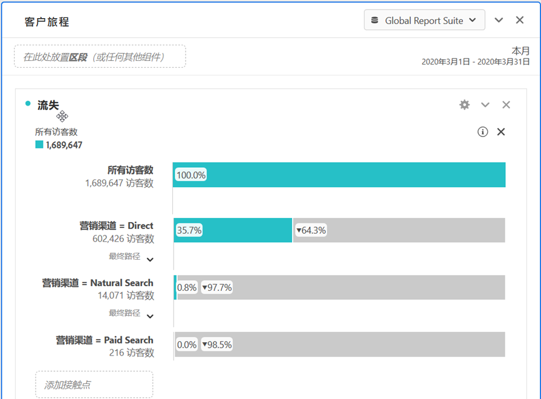 
 </td> 
  </tr> 
  <tr> 
   <td colname="col1"> <b> <a href="../../analyze/analysis-workspace/visualizations/c-flow/flow.md#concept_2F210EC358ED4887AE6DAA8C095DB55E" format="dita" scope="local"> 流量可视化 </a></b> </td> 
   <td colname="col2"> 
新的流量功能允许您通过 Analysis Workspace 中新增和更新的灵活可视化，查看网站/应用程序的客户流量/行程，以便发现客户在网站/应用程序中的移动方式和进展情况。流量允许您 
 
 
 
    <ul id="ul_F1D4A99743664CB3B17E9485CF5E72FC"> 
     <li id="li_0F7AF953EAB746DC95032FF9A533E560">可视化客户在资产中的行程 </li> 
     <li id="li_697A47BE06CF4284ACA3DBE4CA4012BF">分析“登入”、“退出”或客户行程中某个特定维度项目后立即执行的后续步骤 </li> 
     <li id="li_D13AD928AC434D599D43836FB334B14D">通过在所选择路径中指定一个特定点来动态创建用户区段 </li> 
    </ul> 
 
 </td> 
  </tr> 
  <tr> 
   <td colname="col1"> <b> <a href="/help/components/c-alerts/intellligent-alerts.md" format="dita" scope="local"> 智能警报 </a></b> </td> 
   <td colname="col2"> 
“智能警报”是 Adobe Analytics 的新警报系统，您可以通过该系统在 Analysis Workspace 中创建和管理警报，以及进行警报预览和规则贡献。您可以： 
 
 
 
    <ul id="ul_02BD64D3047942009880B8F1DA1F2A40"> 
     <li id="li_01504AABBC514DF38354683843222541">构建基于异常的警报（90%、95% 或 99% 阈值；% 更改；以上/以下）。 </li> 
     <li id="li_9BFE2B4C429D441287F1A37A08E62A40">预览警报触发的频率。 </li> 
     <li id="li_08D310196581483DB499C00358835B73">通过含链接的电子邮件或短信将警报发送到自动生成的 Analysis Workspace 项目。 </li> 
     <li id="li_2ADF9465EE474CDB839ED867662CCE6F">创建可在一个警报中捕获了多个量度的“堆栈式”警报。 </li> 
    </ul> 
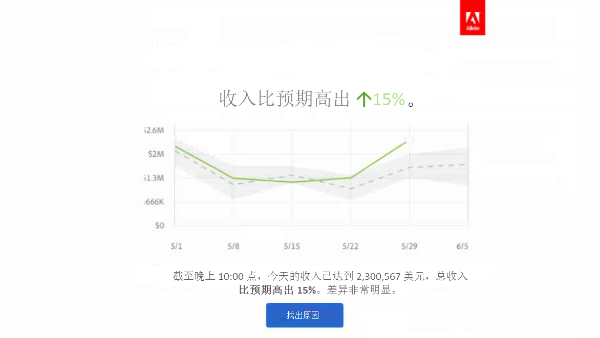 
 </td> 
  </tr> 
  <tr> 
   <td colname="col1"> <b> <a href="../../analyze/analysis-workspace/virtual-analyst/c-anomaly-detection/anomaly-detection.md#concept_65E7C869C20B4509984189C8FD971F0E" format="dita" scope="local"> 异常检测和贡献分析 </a></b> </td> 
   <td colname="col2"> 
允许您了解趋势数据中的更改是否显著，以及造成此更改的原因。 
 
异常检测和贡献分析现在是 Analysis Workspace 中的核心工作流程。 
 
重要：贡献分析仅适用于 Adobe Analytics Premium 客户。 
 
您可以： 
 
 
 
    <ul id="ul_9CEE47788F3640838D8598F2E2C020D6"> 
     <li id="li_787236BB5EA545B8833B311C06C24337">自动检测数据中在统计上显著的数据异常。 </li> 
     <li id="li_2FB3D94DEEF14DD5ADA6AD69E15F243D">针对任何每日异常运行“贡献分析”，并将其嵌入到您的 Analysis Workspace 项目中。 </li> 
    </ul> 
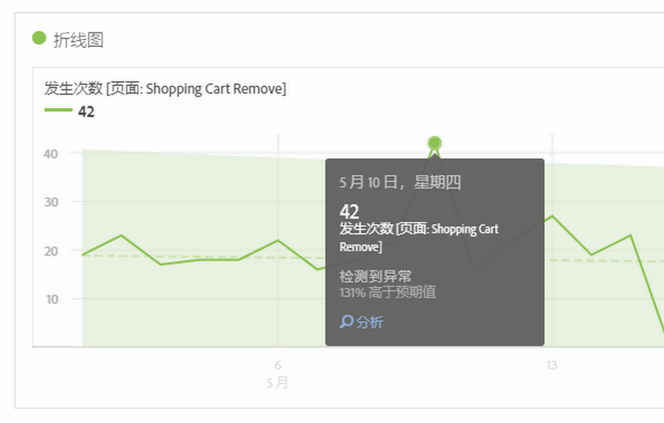 
 
 
 </td> 
  </tr> 
  <tr> 
   <td colname="col1"> <b> <a href="../../analyze/analysis-workspace/build-workspace-project/starter-projects.md#concept_49B9A327C5004DB0A4BE6291435625C5" format="dita" scope="local"> 入门项目 </a></b> </td> 
   <td colname="col2"> 为了更便于用户开始使用 Analysis Workspace，我们针对常见的业务问题创建了一些预生成的项目模板，如 
 
 
    <ul id="ul_603F5ACC16F74D53AEB9F762FAC91656"> 
     <li id="li_6B3F2E5D4B044EC19D45E5501E33DB91">用户维系 </li> 
     <li id="li_7240EE8852FC4642B3AD4837C990A775">移动应用程序客户获取 </li> 
    </ul> 
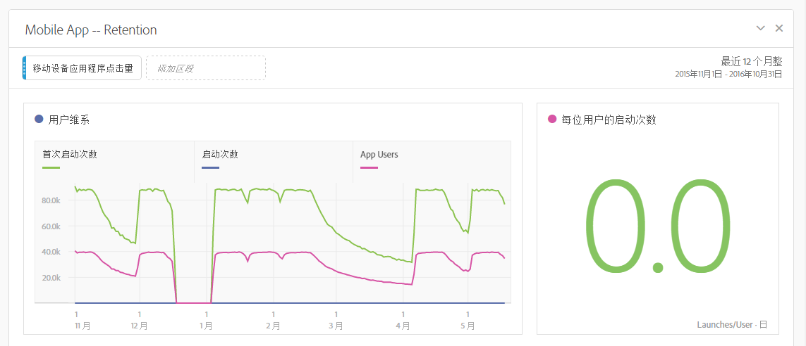 
 </td> 
  </tr> 
  <tr> 
   <td colname="col1"> <b><a href="../../analyze/analysis-workspace/visualizations/freeform-analysis-visualizations.md#section_46E886D108DF49BDB6EE2D5A0E054E95" format="dita" scope="local">直方图可视化</a></b> </td> 
   <td colname="col2"> 
用户可以使用直方图查看任何成功事件中用户的分布情况。您可以自定义存储段和存储段大小，以适应任何分布情况和标识高值和低值用户。 
 
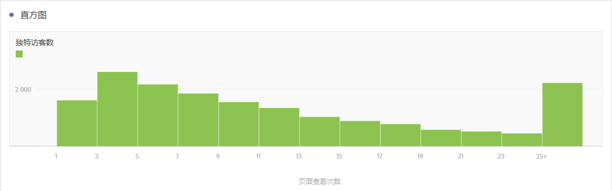 
 </td> 
  </tr> 
  <tr> 
   <td colname="col1"> 其他更新 </td> 
   <td colname="col2"> 
    <ul id="ul_2585F74DC7754C819017F280E16BF06F"> 
     <li id="li_412446013E7F42DBB1BF50F9E2C4D92F"> 
      <!--AN-124610: -->已添加“计入重复实例”作为一个项目级别设置（项目 &gt; 项目信息和设置）。此设置指定是否将重复实例计入报表中。如果您针对相同的变量具有多个序列值，则可以将它们计为该变量的一个实例，也可以计为多个实例。 </li> 
     <li id="li_480E1B307C62418CBC2F50ADE32B9EE9">在日历中的“取消”和“运行”旁边添加了一个名为“应用到所有面板”的新按钮。已将“运行”更改为“应用”。如果单击新按钮，它不仅会更改当前面板的选定日期范围，还会更改项目内所有其他面板的日期范围。 </li> 
     <li id="li_4D10DFE307344D06AA60792FABE5B57E"> 
      <!--AN-124168: -->在左导航边栏中添加了“操作”按钮，它们可执行以下操作：标记、收藏、批准、<b>共享（新增！）</b>、<b>删除（新增！）</b>。 </li> 
     <li id="li_946EC05568D4447193E9307546DF6F9B">向搜索栏添加了一个过滤器，它允许您对标记、收藏夹、批准的项目和组件进行过滤。 </li> 
     <li id="li_4EA118ACCD3B4F88B0ECF72717F631FA">已向手动行添加一个预览图标（不是添加到列有维度项目的动态行），以便您预览区段、量度和日期范围。 </li> 
     <li id="li_81D5241EA3FD49CEA0E9F412837D87A8"> 
      <!--AN-128702: -->已将 Analysis Workspace 教程的 YouTube 链接更新为：<a href="https://www.youtube.com/playlist?list=PL2tCx83mn7GuNnQdYGOtlyCu0V5mEZ8sS" format="https" scope="external">https://www.youtube.com/playlist?list=PL2tCx83mn7GuNnQdYGOtlyCu0V5mEZ8sS</a>。 </li> 
     <li id="li_D81DB98C49664D2884CCCC1DB0058CD8"> 
      <!--AN-124004:-->对于可视化，我们在上下文菜单中添加了一个名为从头开始的右键单击选项（将用于流程图、维恩图和直方图），通过此选项可删除当前可视化的配置，并打开一个允许您对该可视化进行重新配置的新面板。 </li> 
     <li id="li_84632BFCE1794B49A31FF45067FA04B7">名为“图例可视”的新可视化设置允许您隐藏概要数字/概要变化可视化的过滤器详细信息文本。 </li> 
     <li id="li_EE8C48642DD54A04B08F4222F9565BF6">概要更改可视化的新可视化设置允许您使用“显示差异”查看 2 个百分比之间的差异。对于非百分比值，如果您选择“显示差异”选项，它将显示一个数字。 </li> 
     <li id="li_17AAABCA7B3A477182FB70453CA2EEBB">已调整时间维度的行数。 </li> 
     <li id="li_35A91D50CD514CD0B939C24AEEC64BF4">已更新区段生成器和计算量度生成器中左侧导航边栏的外观，使其更加接近于 Analysis Workspace。 </li> 
    </ul> </td> 
  </tr> 
 </tbody> 
</table>

## 2016 年 6 月

2016 年 6 月 16 日发布的新功能：

* [允许管理员](https://marketing.adobe.com/resources/help/en_US/reference/groups.html) 允许或拒绝对用户进行 **[!UICONTROL “分析]** ”&gt; **[!UICONTROL “工作区]** ”选项卡的新用户组权限。自 2016 年 6 月 16 日开始，所有用户都将拥有访问此选项卡的权限。要拒绝访问，只需要从“Analysis Workspace 访问”组中删除用户即可。
* The[区段比较面板](../../analyze/analysis-workspace/c-panels/c-segment-comparison/segment-comparison.md#concept_74FAC1C6D0204F9190A110B0D9005793)通过自动分析您有权访问的每个量度和维度，可发现任意两个区段之间的最显著统计学差异。
* [新的项目菜单结构](../../analyze/analysis-workspace/build-workspace-project/freeform-overview.md#concept_F5EE3CF6691545D6AA69AD6F512555D7)重新排列了顶部菜单，提高了其可扩展性。例如，创建&#x200B;**新同类群组面板**&#x200B;的过程现在包括创建一个空白面板和拖入一个同类群组表可视化。
* [新的左边栏](../../analyze/analysis-workspace/build-workspace-project/freeform-overview.md#concept_F5EE3CF6691545D6AA69AD6F512555D7)：面板、可视化、组件
* 新的维恩图可视化类型允许您最多拖入 3 个区段和一个量度以构建维恩图。
* 排名表格中的[趋势选择](../../analyze/analysis-workspace/analysis-workspace-features.md#section_34930C967C104C2B9092BA8DCF2BF81A)（折线图）现在已经关联。
* [“创建可视化”图标](../../analyze/analysis-workspace/visualizations/freeform-analysis-visualizations.md#concept_09242627629147A88A68F1506954C276)：单击此图标可在执行下一步操作（条形图、维恩图...）时提供智能推测。
* 扩展了[手动行](../../analyze/analysis-workspace/build-workspace-project/column-row-settings/manual-vs-dynamic-rows.md#concept_C50E7DFBC0504C72A973123192F487D8)功能
* [添加区段](../../analyze/analysis-workspace/components/t-freeform-project-segment.md#task_11C6A2C7717B48049E5750B9D20FEC80)拖放区域
* 次要更新：

   * 能够删除面板中的所有可视化和项目中的所有面板。（以前，必须保留至少一个可视化或面板。）
   * 更改了[快捷键](../../analyze/analysis-workspace/build-workspace-project/fa-shortcut-keys.md#concept_9A6356084DBC4D468E265E7A65B3E051)（热键），更便于在 Analysis Workspace 中使用。
   * 样式更改：缩小了可视化中的字体；各行都具有颜色色板；向下移动了各个面板上的日期选择器。

## 2016 年 4 月

2016 年 4 月 21 日发布的新功能：

<table id="table_2649645FDED84B71952F741ABB3FC20E"> 
 <thead> 
  <tr> 
   <th colname="col1" class="entry"> 功能 </th> 
   <th colname="col2" class="entry"> 描述 </th> 
  </tr> 
 </thead>
 <tbody> 
  <tr> 
   <td colname="col1"> 发送文件 </td> 
   <td colname="col2"> 
通过电子邮件发送 Analysis Workspace 项目，或者针对项目的提交进行规划。See <a href="../../analyze/analysis-workspace/curate-share/t-schedule-report.md#task_509549DD2D83495A94A0DFC6724DA907" format="dita" scope="local"> Send File - Schedule a project for delivery </a>. 
 </td> 
  </tr> 
  <tr> 
   <td colname="col1"> 下载 PDF </td> 
   <td colname="col2"> 
通过“操作”菜单，您可以采用 PDF 格式下载 Analysis Workspace 项目（类似于以 CSV 格式下载）。 
 </td> 
  </tr> 
 </tbody> 
</table>

## 2016 年 1 月

2016 年 1 月 21 日发布的新功能。

* [撤消操作](../../analyze/analysis-workspace/new-features-in-analysis-workspace.md#section_12890C393D5E4FC8A3CF050318BD8482)
* [链接至此项目](../../analyze/analysis-workspace/new-features-in-analysis-workspace.md#section_453E70F7409F4501B8E976A0D18C9A46)
* [项目符号图表、散点图和树图可视化](../../analyze/analysis-workspace/new-features-in-analysis-workspace.md#section_B19EA50EBF5546E99D3A142827153FD6)
* [针对区段、量度和日期的另存为功能](../../analyze/analysis-workspace/new-features-in-analysis-workspace.md#section_04C8B10A0751453AAE5F1BC35938C6CE)
* [“添加新区段”按钮](../../analyze/analysis-workspace/new-features-in-analysis-workspace.md#section_85CC88C02C79456EA2B41F2BFBB64FC4)
* [条件格式](../../analyze/analysis-workspace/new-features-in-analysis-workspace.md#section_5775B505D83041408B8C3EAEC5D7C32B)
* [维度预览](../../analyze/analysis-workspace/new-features-in-analysis-workspace.md#section_F519EBF889B244E8B25BB6BA2833325A)
* [图例可见](../../analyze/analysis-workspace/new-features-in-analysis-workspace.md#section_28D10D86CAE343AB838808C1DD2E7983)
* [将 Y 轴定位为 0](../../analyze/analysis-workspace/new-features-in-analysis-workspace.md#section_83DF5DE79EF04F9F8DCB3154F5E799B3)
* [选项卡标题中的项目名称](../../analyze/analysis-workspace/new-features-in-analysis-workspace.md#section_497C61A030984BCCA2CEA553312C3226)
* [转移项目所有权](../../analyze/analysis-workspace/new-features-in-analysis-workspace.md#section_989C2CCB80B5408EB85E6B12C8D943E3)

## 撤消操作 {#section_12890C393D5E4FC8A3CF050318BD8482}

您现在可以撤消在 Analysis Workspace 中执行的大部分操作。

要撤消操作，请在操作菜单中单击&#x200B;**[!UICONTROL 撤消]。**

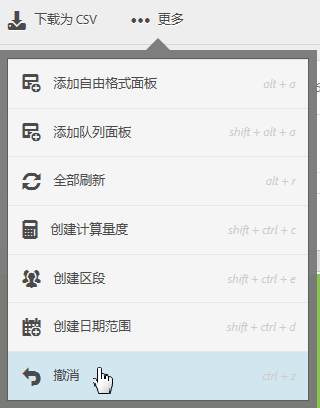

You can also use standard Windows and Mac [keyboard shortcuts](../../analyze/analysis-workspace/build-workspace-project/fa-shortcut-keys.md#concept_9A6356084DBC4D468E265E7A65B3E051) (ctrl or cmd + z) for Undo.

*`Undo`*&#x200B;功能在撤消表中的划分时特别有用。

Actions that are *`not`* undoable:

* 更改[!UICONTROL 同类群组表]的配置（例如，拖放量度、更改值）。However, you can click **[!UICONTROL Undo]** after clicking **[!UICONTROL Run]**.

* 调整面板和子面板大小，或者移动它们。

可清除撤消历史的操作：

* 保存项目。
* 更改报表包。

## 链接至此项目 {#section_453E70F7409F4501B8E976A0D18C9A46}

在项目中，从“操作”菜单中单击&#x200B;**[!UICONTROL 链接至此项目]，即可通过电子邮件将已保存项目的 URL 发送给其他用户。**&#x200B;具有管理权限的收件人可编辑和保存以这种方式共享的项目。否则，这些项目为只读状态。

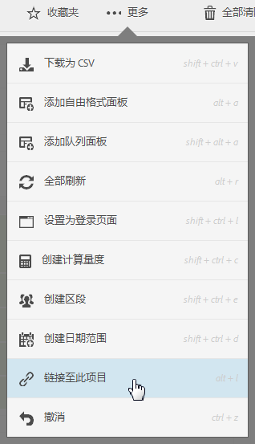

>[!NOTE]
>
>如果您的公司使用单点登录(旧版单点登录和通过Experience Cloud登录时)，共享报告链接不可用。

## 项目符号图表、散点图和树图可视化 {#section_B19EA50EBF5546E99D3A142827153FD6}

以下新的可视化信息将在 2016 年 1 月发行的版本中提供。

**项目符号图表**

您可以查看您感兴趣的值与其他性能范围（目标）进行比较或衡量的结果。

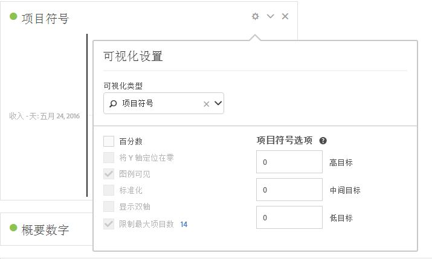

项目符号图表提供一个主要的衡量标准（例如，本年至今的收入），将该衡量标准与一个或更多其他衡量标准进行比较，以丰富其含义（例如，与目标收入比较），并在性能定性范围（例如，高、中和低）的上下文中显示它。您可以在[!UICONTROL 可视化设置]中指定目标范围。

**散点图**

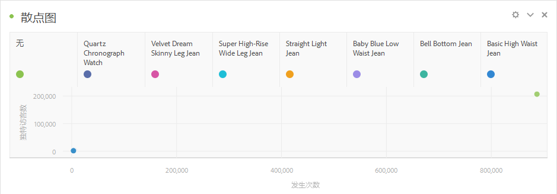

显示所提供的展示次数以及有多少名独特用户已看到了这些展示。每个数据点的大小以可视化方式提示查看者见到某广告的平均次数。大小和数据依据您选择的维度、日期范围和过滤器而变化。

>[!NOTE]
>
>与散点图关联的表至少需要两列。第一列定义 X 轴，第二列定义 Y 轴。如果存在第三列，那么散点图图表可使用它来决定点的半径。换言之，列 *1*、*2* 和 *3* 映射到 *X*、*Y* 和&#x200B;*点半径*。

**树图**

将分层（树结构）数据显示为一组嵌套的矩形。树上的每个分支都被给予一个矩形，然后为其贴上代表子分支的更小矩形。

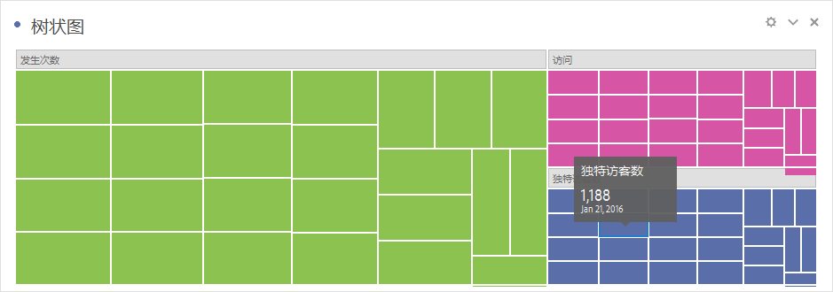

当颜色和大小维度以某种方式与树结构关联时，用户通常可以轻松地查看平时很难以其他方式见到的模式，例如当有某个颜色特别重要时。树图的第二个优势在于，它们可以通过精心的构建有效地利用空间。

## 针对区段、量度和日期的另存为功能 {#section_04C8B10A0751453AAE5F1BC35938C6CE}

在 Analysis Workspace 区段生成器中编辑现有（已保存）的区段时，单击&#x200B;**[!UICONTROL 另存为]可生成一个副本。**

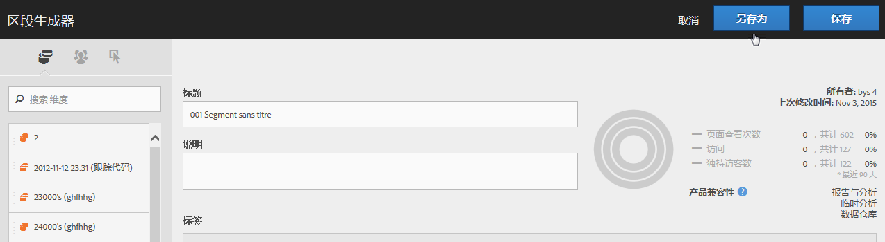

新区段显示在[!UICONTROL 组件]面板的[!UICONTROL 区段]组内。

*`Save As`*&#x200B;还可用于[!UICONTROL 计算量度生成器]和[!UICONTROL 日期范围生成器]。

## “添加新区段”按钮{#section_85CC88C02C79456EA2B41F2BFBB64FC4}

**[!UICONTROL 添加新区段]按钮已被添加到您将区段拖放到项目中的位置。**

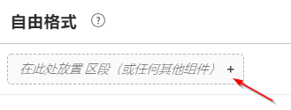

如果您要在项目中工作时直接创建区段，而不是使用[!UICONTROL 区段]面板来创建区段，则此增强会非常有用。

## 条件格式 {#section_5775B505D83041408B8C3EAEC5D7C32B}

在“列设置”中，您可以将条件格式应用于单元格数据。

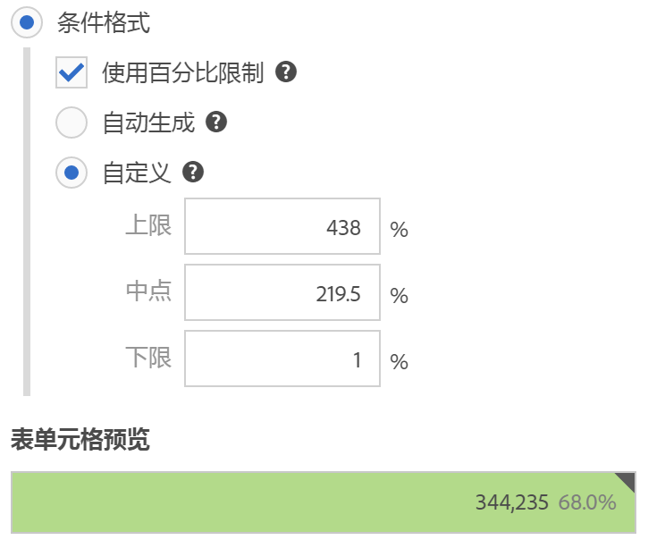

<table id="table_4285E6982FBD4B66AC95AAF6C5C7B347"> 
 <thead> 
  <tr> 
   <th colname="col1" class="entry"> 元素 </th> 
   <th colname="col2" class="entry"> 描述 </th> 
  </tr> 
 </thead>
 <tbody> 
  <tr> 
   <td colname="col1"> 条件格式 </td> 
   <td colname="col2"> 
 根据数据值，将以下颜色应用于单元格： 
 
    <ul id="ul_97E3AD5F6B41460C882D8B4EE0A8C77A"> 
     <li id="li_88874B4250224DE781C03E4A5931D6A2">绿色：高值 </li> 
     <li id="li_B4863F967C7544D7AA2847696FB85525">黄色：中点值 </li> 
     <li id="li_5B06D7CD0C39437898DA55EA653A1124">红色：低值 </li> 
    </ul> 
替换表中的维度会重置条件格式限制。替换量度会重新计算此列的限制（其中，量度在 X 轴上，维度在 Y 轴上）。 
 </td> 
  </tr> 
  <tr> 
   <td colname="col1"> 自动生成 </td> 
   <td colname="col2"> 
自动生成条件格式的限制。上限为此列中的最大值。下限为最小值，中点为上限和下限的平均值。 
 </td> 
  </tr> 
  <tr> 
   <td colname="col1"> 自定义 </td> 
   <td colname="col2"> 
您可以为条件格式手动分配上限、中点和下限字段的值。这可以让您灵活地决定列值何时为好、中或差。 
 </td> 
  </tr> 
 </tbody> 
</table>

## 维度预览 {#section_F519EBF889B244E8B25BB6BA2833325A}

在“维度”组件面板中，您可以将光标悬停在维度旁边的信息图标上方，并查看前五个维度的预览。

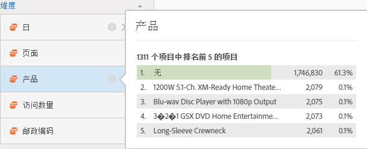

## 图例可见 {#section_28D10D86CAE343AB838808C1DD2E7983}

在[!UICONTROL 可视化设置]中，**[!UICONTROL 图例可见]选项可显示或隐藏可视化的图例。**

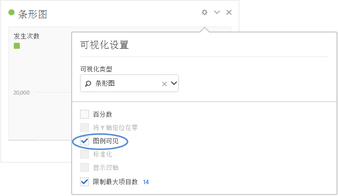

## 将 Y 轴定位为 0 {#section_83DF5DE79EF04F9F8DCB3154F5E799B3}

根据折线图和面积图的数字，Y 轴的底部可能不为 0。在&#x200B;**[!UICONTROL 可视化图设置]**&#x200B;中启用“[!UICONTROL 将 Y 轴定位为 0]”，可强制将 Y 轴设为 0，以便更加准确地查看趋势。以下示例显示收入图表在启用和禁用此设置的情况下有何变化：

**将 Y 轴定位为 0 已禁用**

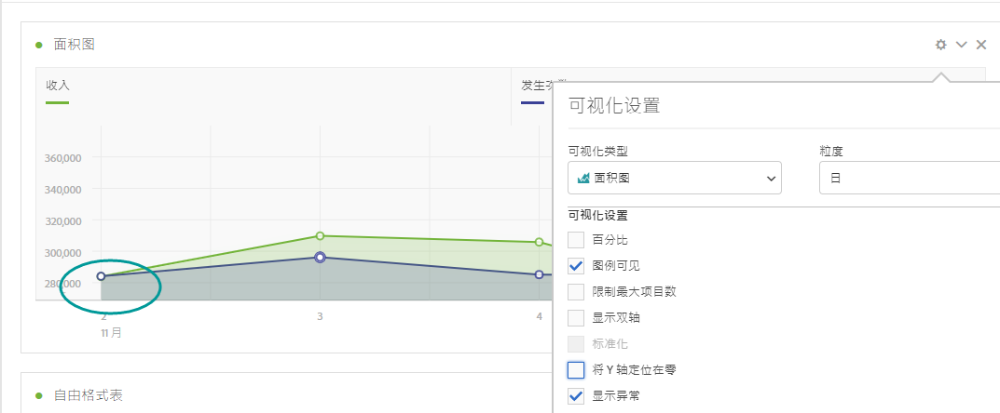

**将 Y 轴定位为 0 已启用**

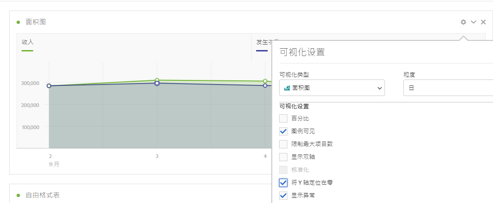

## 选项卡标题中的项目名称 {#section_497C61A030984BCCA2CEA553312C3226}

When saving a project, the title on the browser tab will be displayed as "`<Project Name>` - Analysis Workspace". 如果您要在多个浏览器选项卡中打开多个项目，此增强会非常有用。

## 转移项目所有权 {#section_989C2CCB80B5408EB85E6B12C8D943E3}

管理员可以将 [!UICONTROL Analysis Workspace] 项目从一名用户转移到另一用户。

Navigate to **[!UICONTROL Admin]** &gt; **[!UICONTROL User Management]** &gt; **[!UICONTROL Transfer]** to transfer projects.
