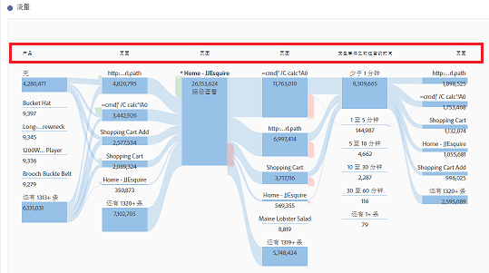

# Analysis Workspace 中的新增功能

## 2020 年 3 月

2020年3月12日发布的新增功能。

| 功能 | 描述 |
|--- |--- |
| 支持Workspace中的多个报表包 | 您现在可以将多个报表包中的数据并排引入单个项目中以视图。 [了解更多...](https://docs.adobe.com/content/help/zh-Hans/analytics/analyze/analysis-workspace/build-workspace-project/multiple-report-suites.html) |
| 培训教程模板 | 这个新的标准模板将指导您逐步了解在Workspace中构建第一个分析的常用术语和步骤。 该模板可用作新建项目模式中的标准模板，并替换当前存在的示例项目，供列表中没有其他项目的新用户使用。[了解更多...](/help/analyze/analysis-workspace/build-workspace-project/starter-projects.md) |

## 2020 年 2 月

2020年2月20日发布的新增功能。

| 功能 | 描述 |
|--- |--- |
| 适用于使用跨设备分析的组织的新工作区模板 | 此模板显示CDA在拼接访问方面的有效性，并指导您了解CDA独有的维度和指标。 需要使用 CDA 的报表包。有关更多信息，请参阅[设置跨设备分析](https://docs.adobe.com/content/help/zh-Hans/analytics/components/cda/cda-setup.html)。 |
| Workspace中的新热键 | <ul><li>折叠/展开所有面板：`alt + m`</li><li>折叠/展开活动面板：`alt + ctrl + m`</li><li>搜索左边栏：`ctrl + /`</li><li>移到下一个面板：`alt + Right Key`</li><li>移到上一个面板：`alt + Left Key`</li></ul>[了解更多...](https://docs.adobe.com/content/help/zh-Hans/analytics/analyze/analysis-workspace/build-workspace-project/fa-shortcut-keys.html) |
| 其他工作区增强功能 | <ul><li>将面板或可视化放入Workspace后，左边栏现在将自动切换到组件，以实现更无缝的工作流程。</li><li>模板组件现在可以根据这些组件进行操作（例如，标记、收藏、已批准）。</li><li>筛选的量度和区段列表优惠+按钮，添加新组件（如果找不到所需组件）。</li></ul> |
| 工作区调试器 | Workspace 调试器已添加到“帮助”菜单，可让您根据调试 Workspace 请求更加无缝地启用调试器。[了解更多...](https://www.adobe.io/apis/experiencecloud/analytics/docs.html#!AdobeDocs/analytics-2.0-apis/master/reporting-tricks.md) |

## 2020 年 1 月

2020 年 1 月 16 日发布的新功能。

| 功能 | 描述 |
|--- |--- |
| [自由格式表生成器](https://docs.adobe.com/content/help/zh-Hans/analytics/analyze/analysis-workspace/visualizations/freeform-table.html) | 启用表生成器后，您可以通过拖放多个维度、细分、量度和区段来构建可解答更复杂业务问题的表。数据不会立即更新。Instead, updates occur after you click **[!UICONTROL Build]**, saving you time once you know what table you want to construct. 此外，此功能还提供：<ul><li>**预览**：您可以先预览表的格式，然后再花费时间渲染实际数据。</li><li>**灵活的行和划分设置**：您可以为每个维度行设置行级别和划分级别。以前，工作区施加了一些默认值，这些默认值在返回数据之前无法更改。</li><li>**按状态划分**：您可以将维度行设置为始终&#x200B;_按状态划分_&#x200B;而不是&#x200B;_按特定项目_（默认值）划分。</li><li>**手动静态行排序**：您可以手动对静态行进行排序，以使表行完全按照您的需要显示。以前，静态行只能按度量列或按字母顺序排序。</li></ul> |

## 2019 年 10 月

2019 年 10 月 10 日发布的增强功能。

| 增强功能 | 描述 |
|--- |--- |
| 更新了自由格式表总计 | 自由格式表现在包含两个总计， **[!UICONTROL Table total]** a和a **[!UICONTROL Grand total]**。 表格总计行会将已应用的[报表过滤器](https://docs.adobe.com/content/help/zh-Hans/analytics/analyze/analysis-workspace/build-workspace-project/pagination-filtering-sorting.html)计入在内。以前，只有区段会影响总数的计算。[了](https://docs.adobe.com/content/help/zh-Hans/analytics/analyze/analysis-workspace/build-workspace-project/workspace-totals.html) 解更多 **[!UICONTROL Show Totals]** , **[!UICONTROL Show Grand Total]** 还添加了选项 **[!UICONTROL Column Settings]**。 对自由形式总计进行此更改后，将更新相关可视化(例如链接的可 **[!UICONTROL Summary Number]** 视化)以及导出的CSV和PDF数据。 |
| 用于删除“未指定/无”的选项 | 一个可以轻松删除“未指定（无）”的选项已经添加到报表过滤器。 |
| 弃用紫色粒度组件 | 已弃用紫色的时间粒度组件（分钟、小时、日、周、月、季度、年）。紫色时间组件与对应的橙色维度组件的功能是一样的，因此这项更改将简化这方面的使用体验。即使之前使用了某个紫色时间组件，您也&#x200B;**无需执行任何操作**。 通过此更改，紫色 **[!UICONTROL Time]** 部分也已更名为 **[!UICONTROL Date Ranges]**。 |

## 2019 年 8 月

2019 年 8 月 8 日发布的增强功能。

| 增强功能 | 描述 |
|--- |--- |
| 将下拉筛选器的项目限制从 50 提高至 200 | 我们将可放置在下拉筛选器中的项目限制从 50 提高到了 200。此增强功能适用于各种用例，例如将所有国家/地区 (195) 添加到筛选器，或将所有美国州和省 (52) 添加到筛选器。 |

## 2019 年 7 月

2019 年 7 月 18 日发布的增强功能。

| 增强功能 | 描述 |
|--- |--- |
| 同类群组分析增强功能 | 新增了以下[阶层分析设置](https://docs.adobe.com/content/help/zh-Hans/analytics/analyze/analysis-workspace/visualizations/cohort-table/t-cohort.html)： <ul><li>仅显示百分比</li><li>将百分比四舍五入到最接近的整数</li><li>显示平均百分比行</li></ul> |
| 显示过去 18 个月内的项目 | 在左边栏中，用户现在可以选择&#x200B;_显示过去 18 个月内的项目_。以前，回看周期最长为 6 个月。这样，用户就可以更轻松地比较去年（最长 18 个月前）的页面或营销活动。 |
| 新的 Analysis Workspace 模板 | 我们在 Analysis Workspace 中新增了一个名为[“Magento：营销与商务”](https://docs.adobe.com/content/help/zh-Hans/analytics/analyze/analysis-workspace/build-workspace-project/starter-projects.html)的模板。它专为 Magento 电子商务客户设计，不过任何零售商都可使用它来获得有关其商务活动的独特洞察。 |

## 2019 年 6 月

2019 年 6 月 13 日发布的增强功能。

| 增强功能 | 描述 |
|--- |--- |
| 新增的开箱即用的过滤器 | 左边栏搜索新增了开箱即用的过滤器。除了您现在看到的这些过滤器（维度、量度、已批准等）之外，还新增了一些过滤器（例如计算指标、客户属性、eVar、Prop、视频等）以更便于查找所需的组件。 |

## 2019 年 5 月

2019 年 5 月 9 日发行的增强功能。

| 增强功能 | 描述 |
|--- |--- |
| 流量可视化图表设置中添加了一个新设置：包含重复实例。 | [流设置](/help/analyze/analysis-workspace/visualizations/c-flow/flow-settings.md) |

## 2019 年 4 月

2019 年 4 月 11 日发行的增强功能。

| 增强功能 | 描述 |
|--- |--- |
| 优化最佳实践的增强功能 | [优化性能](/help/analyze/analysis-workspace/new-features-in-analysis-workspace.md) |

## 2019 年 1 月

2019 年 1 月 17 日发行的新增功能和增强功能。

| 功能 | 描述 |
|--- |--- |
| [同类群组分析](/help/analyze/analysis-workspace/visualizations/cohort-table/cohort-analysis.md) | 对同期群分析的重大改进使您能够：<ul><li>分别应用细分包含和返回指标。 </li><li>展示客户流失而非保留。</li><li>显示延迟表(包含事件之前和之后经过的时间)。</li><li>自定义同期群维度(以根据eVar（而不仅仅是时间）对访客进行分组)。</li><li>进行滚动式同类群组计算：根据先前的时间段而不是原始同类群组来计算维系率/流失率。 </li><li>在包含和返回字段中添加多个指标，并应用区段。 （不支持计算量度）</li></ul> |
| [视图密度](/help/analyze/analysis-workspace/build-workspace-project/view-density.md) | 此新设置可减少左边栏、自由格式表和同类群组表中的垂直边距，从而使您能够在单个屏幕上查看更多数据。可通过项目 > 项目信息和设置进行访问。 |
| [在归因 IQ 中支持多值变量](attribution-iq.md) | Analytics 中的某些维度可以在单次点击中包含多个值，例如 listVar、产品变量、列表属性或推销 eVar。Analysis Workspace 允许您在点击级别将归因 IQ 应用于任何此类变量。 |
| 性能改进 | 加快细分可视化的改进——具有大量细分的项目加载速度更快。 |

## 2018 年 11 月

2018年11月1日发布的新增功能和增强功能。

| 功能 | 描述 |
|--- |--- |
| [VRS 和项目策划 - 增强功能](/help/analyze/analysis-workspace/curate-share/curate-projects-vrs.md) | 这些更改的实际引入时间为 2018 年 10 月。无论是管理员还是非管理员，都可以在策划的工作区项目和策划的虚拟报表包 (VRS) 中，查看发生更改的组件。 此前，单击显示所有组件按钮后，大家只能查看非策划的组件。策划体验经过更新后，在查看组件方面提供了更加精细化的控制。  |

## 2018 年 10 月

2018年10月11日发布的新增功能和增强功能。

<table id="table_3DDC812B2F66416F868004416D248BF3"> 
 <thead> 
  <tr> 
   <th colname="col1" class="entry"> 功能 </th> 
   <th colname="col2" class="entry"> 描述 </th> 
  </tr> 
 </thead>
 <tbody> 
  <tr> 
   <td colname="col1"> 
<b>面板下拉菜单管理</b> 
 </td> 
   <td colname="col2"> 
我们对9月MR引入的面板下跌管理进行了一些改动。 当您右键单击下拉菜单时，您现在可以 
 
    <ul id="ul_4BDEC66EEB2243628FE32B43E377E5BD"> 
     <li id="li_EF8277BE972540D3B2604D82BC7C0918">删除下拉列表（此选项始终存在。） </li> 
     <li id="li_6A991208F2744274817DBE1E9D1B443F">删除标签（如果显示了标签）。 </li> 
     <li id="li_5C1CFC465C2E41D2B35E8841EFDC82AA">添加标签（如果未显示标签）。 </li> 
    </ul> </td> 
  </tr> 
  <tr> 
   <td colname="col1"> 
<b>面板和可视化工具提示中的链接</b> 
 </td> 
   <td colname="col2"> 
我们向面板和可视化工具提示中添加了指向相关视频和文档的链接。 
 </td> 
  </tr> 
 </tbody> 
</table>

## 2018 年 9 月

2018年9月13日发布的新增功能和增强功能。

<table id="table_137719BFA03C44A78FDE872DF8B228A4"> 
 <thead> 
  <tr> 
   <th colname="col1" class="entry"> 功能 </th> 
   <th colname="col2" class="entry"> 描述 </th> 
  </tr> 
 </thead>
 <tbody> 
  <tr> 
   <td colname="col1"> 
<b>面板下拉框</b> 
 </td> 
   <td colname="col2"> 
面板拖放区域现在具有下拉功能。 下拉菜单使最终用户能够以受控方式与项目中的数据交互。 示例：假定您拥有多个版本的项目，以提供特定于国家／地区的报告。 您现在可以将这些项目折叠为单个项目，而添加到国家／地区下拉列表中。 
 </td> 
  </tr> 
  <tr> 
   <td colname="col1"> 
<b>调色板</b> 
 </td> 
   <td colname="col2"> 
您现在可以通过从其他调色板中进行选择或指定自己的调色板来更改Workspace中使用的颜色方案。 这会影响Workspace中的许多内容，包括大多数可视化。 它不影 <b>响摘要更改</b> 、自由格式表中的条件格式和映射可视化。 
 
注意：Internet Explorer 11 未启用调色板支持。 
 </td> 
  </tr> 
  <tr> 
   <td colname="col1"> 
<b>新模板：音频使用情况</b> 
 </td> 
   <td colname="col2"> 
请参阅 <a href="https://marketing.adobe.com/resources/help/zh_CN/sc/appmeasurement/hbvideo/media-workspace-templates.html"  >Analytics 音频</a>。 
 </td> 
  </tr> 
 </tbody> 
</table>
## 2018 年 8 月

2018年8月9日发布的新增功能和增强功能。

<table id="table_DD77C02344414DCD9AC0A6A22E648B72"> 
 <thead> 
  <tr> 
   <th colname="col1" class="entry"> 功能 </th> 
   <th colname="col2" class="entry"> 描述 </th> 
  </tr> 
 </thead>
 <tbody> 
  <tr> 
   <td colname="col1"> 
<b>拖放区域参考线</b> 
 </td> 
   <td colname="col2"> 
此指南可帮助您更轻松地了解每个拖放操作的功能。例如，当您将鼠标悬停在某列上时，我们将显示添加、替换、筛选依据和划分等内容。 
 
我们还添加了黄色／红色参考线，当您执行不推荐或禁止的操作时，这些参考线会提醒您，例如，将两个指标相互叠加（这会导致数据无效）。 
 </td> 
  </tr> 
  <tr> 
   <td colname="col1"> 
<b>添加空白面板选项</b> 
 </td> 
   <td colname="col2"> 
我们在开始面板下方添加了+符号，以便更轻松地添加其他面板。 
 </td> 
  </tr> 
 </tbody> 
</table>

## 2018 年 7 月

2018年7月19日发布的新增功能和增强功能。

<table id="table_336E121310204DC492EA004F40830B0F"> 
 <thead> 
  <tr> 
   <th colname="col1" class="entry"> 功能 </th> 
   <th colname="col2" class="entry"> 描述 </th> 
  </tr> 
 </thead>
 <tbody> 
  <tr> 
   <td colname="col1"> 
<b> <a href="attribution-iq.md"  > 归因 IQ </a> </b> 
 </td> 
   <td colname="col2"> 
借助“归因 IQ”，您可以对营销效果进行更复杂、更智能的分析。新的归因模型可用于分析工作区（在任何表或任何细分中）中的指标以及计算的指标。 新的归因面板可提供更好的可视化图表和比较。 
 </td> 
  </tr> 
  <tr> 
   <td colname="col1"> 
<b> 对左边栏的改进 </b> 
 </td> 
   <td colname="col2"> 
对左边栏进行了改进，使其更直观、更易于使用： 
 
    <ul id="ul_087BEDF4338946DA857CD82CB69F98C2"> 
     <li id="li_C751AACAC60442DC93118F0819F8EEA7"> 为标题内联的组件（度量、区段、日期）带来了创建(+)功能。 </li> 
     <li id="li_DE2EB184A02D4CE58C23F518DB85EFDD"> 在每个章节列表的底部添加了“+全部查看”，以表明有5个以上的选项。 </li> 
     <li id="li_5208F3C6026647B09F4A85131B175175">选择组件时带有图标的表面化操作（如标记、收藏夹）。 </li> 
     <li id="li_11E601488A844515928231E09889BC54">对用户界面进行了美学改进。 </li> 
    </ul> </td> 
  </tr> 
  <tr> 
   <td colname="col1"> 
<b>计算量度的合计 </b> 
 </td> 
   <td colname="col2"> 
如果可能，我们现在会显示计算量度的总数，包括百分比 
 </td> 
  </tr> 
  <tr> 
   <td colname="col1"> 
<b>新日 <a href="/help/analyze/analysis-workspace/components/calendar-date-ranges/calendar.md"  > 期范围预 </a>设 </b> 
 </td> 
   <td colname="col2"> 
将“最近13周整”添加到分析工作区中的日期范围预设。 
 </td> 
  </tr> 
 </tbody> 
</table>

## 2018 年 6 月

2018 年 6 月 14 日发行的新增功能和增强功能。

<table id="table_57035A06D99447A6BE6ED825A648ED3F"> 
 <thead> 
  <tr> 
   <th colname="col1" class="entry"> 功能 </th> 
   <th colname="col2" class="entry"> 描述 </th> 
  </tr> 
 </thead>
 <tbody> 
  <tr> 
   <td colname="col1"> 
<b> <a href="/help/analyze/analysis-workspace/components/dimensions/view-dimensions.md"  > 动态维度列 </a> </b> 
 </td> 
   <td colname="col2"> 
以前，当维放在列上时，我们显示非时间维的前5个值（时间维的前15个值），并将这些值保持为静态（即，选取的5个值从未更改）。 
 
从现在开始，默认情况下，我们显示动态值而不是静态值，并可以选择将它们转换为静态值。 需要注意的其他事项： 
 
    <ul id="ul_C802BC32CB084E30B4E58E9E90B9A63D"> 
     <li id="li_452466AB416F4737B532849C604BD4CC">单击(i)动态维，您将看到排名（前1个，共5个）和维类型。 </li> 
     <li id="li_588F6199E38D47869AC855A4C2A4D1B7">数据更新时，动态维列将更新以显示当前的5/15维项。 </li> 
     <li id="li_19D47638D4D94416B0DAD2B2FB835ABE">复制或移动的动态维列将变为静态。 </li> 
     <li id="li_B95411689AE04774B7B9BA128F2DB96F">将鼠标悬停在静态维列上时，您将看到一个锁图标，指示该维为静态。 </li> 
    </ul> </td> 
  </tr> 
  <tr> 
   <td colname="col1"> 
<b>新工作区功能模态 </b> 
 </td> 
   <td colname="col2"> 
与上月推出的“每日提示”类似，此模式在您首次登录Workspace后显示新的Workspace功能。 
 </td> 
  </tr> 
 </tbody> 
</table>

## 2018 年 5 月

2018 年 5 月 10 日发行的新增功能和增强功能。

<table id="table_EE4C690A178B4F80BDAF2BB4424D6020"> 
 <thead> 
  <tr> 
   <th colname="col1" class="entry"> 功能 </th> 
   <th colname="col2" class="entry"> 描述 </th> 
  </tr> 
 </thead>
 <tbody> 
  <tr> 
   <td colname="col1"> 
<b>每日提示</b> 
 </td> 
   <td colname="col2"> 
我们将在界面的右下角提供每日提示（以及一个简短的视频）。 这些提示旨在使您熟悉众多酷炫的分析工作区功能。 您可以选择取消这些提示，或者随时通过帮助 &gt; 提示来访问这些提示。 
 
 
 </td> 
  </tr> 
  <tr> 
   <td colname="col1"> 
<b><a href="/help/analyze/analysis-workspace/components/t-freeform-project-segment.md"  >区段模板</a>和<a href="/help/analyze/analysis-workspace/components/apply-create-metrics.md"  >计算量度模板</a></b> 
 </td> 
   <td colname="col2"> 
左边栏现在显示区段模板和计算量度模板。 
 </td> 
  </tr> 
  <tr> 
   <td colname="col1"> 
<b>在拖动组件时可滚动</b> 
 </td> 
   <td colname="col2"> 
现在，您可以在将组件拖动到新位置时上下滚动。 
 </td> 
  </tr> 
  <tr> 
   <td colname="col1"> 
<b>关于异常的其他 <a href="/help/analyze/analysis-workspace/virtual-analyst/c-anomaly-detection/view-anomalies.md"  > 信息 </a></b> 
 </td> 
   <td colname="col2"> 
将指针悬停在折线图中的异常上方时，该信息现在会显示异常的日期和原始值。 
 </td> 
  </tr> 
 </tbody> 
</table>

## 2018 年 4 月

2018 年 4 月 12 日发行的新增功能和增强功能。

<table id="table_B9E784CD14A1453EB360FCCDC612250F"> 
 <thead> 
  <tr> 
   <th colname="col1" class="entry"> 功能 </th> 
   <th colname="col2" class="entry"> 描述 </th> 
  </tr> 
 </thead>
 <tbody> 
  <tr> 
   <td colname="col1"> 
 <a href="/help/analyze/analysis-workspace/build-workspace-project/column-row-settings/column-settings.md"  >默认启用“标题文本换行”</a> 
 </td> 
   <td colname="col2"> 
默认情况下，将为自由格式表启用列设置标题文本换行。 
 </td> 
  </tr> 
  <tr> 
   <td colname="col1"> 
 <a href="/help/analyze/analysis-workspace/build-workspace-project/column-row-settings/table-settings.md"  > 新的行设置 </a> 
 </td> 
   <td colname="col2"> 
新的按行计算百分比设置强制自由格式表计算整行中的单元格百分比，而不是沿列向下计算。这对显示百分比趋势特别有用，例如显示一个维度值与其余维度值在一段时间内的对比趋势。在单击可视化图标时，默认情况下会开启该设置。 
 </td> 
  </tr> 
  <tr> 
   <td colname="col1"> 
 <a href="/help/analyze/analysis-workspace/visualizations/freeform-analysis-visualizations.md#section_D3BB5042A92245D8BF6BCF072C66624B"  >“100% 堆叠”可视化设置</a> 
 </td> 
   <td colname="col2"> 
堆叠的区域/堆叠的条形/堆叠的水平条形可视化的新可视化设置将图表变为“100% 堆叠”的可视化，因此您可以度量相对比例。 
 
 
 </td> 
  </tr> 
  <tr> 
   <td colname="col1"> 
 <a href="/help/analyze/analysis-workspace/virtual-analyst/overview.md"  > 异常检测和贡献分析</a>当前只能通过 Analysis Workspace 使用 
 </td> 
   <td colname="col2"> 
异常检测和贡献分析已从 Reports &amp; Analytics 功能集中删除，现在只能通过 Analysis Workspace 使用。 
 
请注意，Adobe Analytics Select 和 Adobe Analytics Foundation 客户只能访问工作区中的“每日粒度”异常检测。 
 </td> 
  </tr> 
 </tbody> 
</table>

## 2018 年 3 月

2018 年 3 月 8 日发行的新增功能和增强功能。

<table id="table_580CF2C1322E4FB78870BE2B1F497B2F"> 
 <thead> 
  <tr> 
   <th colname="col1" class="entry"> 功能 </th> 
   <th colname="col2" class="entry"> 描述 </th> 
  </tr> 
 </thead>
 <tbody> 
  <tr> 
   <td colname="col1"> 
 <a href="/help/analyze/analysis-workspace/build-workspace-project/column-row-settings/column-settings.md"  > 标题文本换行 </a> 
 </td> 
   <td colname="col2"> 
现在，您可以隐藏自由格式表中的标头文本，以使标头更加易读，表格更易共享。我们已在“列”设置中添加了一个名为“标题文本换行”的选项。这对 .pdf 渲染和名称较长的量度尤其有用。 
 </td> 
  </tr> 
  <tr> 
   <td colname="col1"> 
 <a href="/help/analyze/analysis-workspace/components/apply-create-metrics.md"  >通过右键单击创建量度</a> 
 </td> 
   <td colname="col2"> 
为了更便于快速创建计算量度，从所选内容创建量度已添加到自由格式表的右键单击菜单。在选定一个或多个标头列单元格时，会显示该选项。 
 </td> 
  </tr> 
  <tr> 
   <td colname="col1"> 
 <a href="/help/analyze/analysis-workspace/visualizations/map-visualization.md"  > 地图可视化增强 </a> 
 </td> 
   <td colname="col2"> 
为了能够在地图可视化中显示时段（如年度）比较，我们添加了以下增强功能： 
 
    <ul id="ul_F570E6AB174C45788620CF50E2742A08"> 
     <li id="li_746E329037764644A9CCF79161C26350">地图可视化现在可显示负数。 例如，如果您正在绘制一个年度指标，则地图可以显示纽约的-33%。 </li> 
     <li id="li_E05F0380627044E6A4E8A60C98494BF7">使用“百分比”类型的度量，聚类将百分比平均在一起。 </li> 
     <li id="li_44C04306EA1B413E91B8256B340D5296">新的颜色方案：正／负（绿色／红色） </li> 
    </ul> </td> 
  </tr> 
  <tr> 
   <td colname="col1"> 
 <a href="/help/analyze/analysis-workspace/build-workspace-project/starter-projects.md"  > 自定义模版更新 </a> 
 </td> 
   <td colname="col2"> 
对于最近发布的自定义模板，我们 
 
    <ul id="ul_787F48253F454163B99F6DD50F199FE2"> 
     <li id="li_828DD547DDB54A81B9FFB9FE92790F6C">在项目顶部（在标题附近）添加了一个模板图标，以帮助区分编辑模板模式与将模板用作项目的起点。 </li> 
     <li id="li_EEAA4D115CB74A57BABD524B2561E0CC">允许非管理员创建（另存为）和编辑Workspace项目模板，前提是他们已被授予“在分析工作区中创建／管理项目”权限。 （管理员 &gt; 用户管理 &gt; 群组 &gt; 编辑所有报表访问权限 &gt; 自定义 Analytics 工具 &gt; 在 Analysis Workspace 中创建/策划项目）。 </li> 
    </ul> </td> 
  </tr> 
 </tbody> 
</table>

## 2018 年 2 月

2018 年 2 月 8 日发行的新增功能和增强功能.

<table id="table_824BBE4A554B4DB092ADA9044383D0FA"> 
 <thead> 
  <tr> 
   <th colname="col1" class="entry"> 功能 </th> 
   <th colname="col2" class="entry"> 描述 </th> 
  </tr> 
 </thead>
 <tbody> 
  <tr> 
   <td colname="col1"> 
 <a href="/help/analyze/analysis-workspace/build-workspace-project/starter-projects.md#create-custom-template"  > 自定义工作区模板 </a> 
 </td> 
   <td colname="col2"> 
您现在可以构建并保存自己的工作区模板，这样一来，公司中的其他用户便可以开始使用与自己相关的数据。 
 </td> 
  </tr> 
  <tr> 
   <td colname="col1"> 
 <a href="/help/analyze/analysis-workspace/build-workspace-project/t-freeform-project.md"  >“新建项目”启动模式</a> 
 </td> 
   <td colname="col2"> 
单击“新建项目”可启动一个新的屏幕，您可以从中选取新建项目的具体选项 
 
    <ul id="ul_FE90E6B9AF334A029D66A43901F8FA0B"> 
     <li id="li_F1DFD9AE140C4E5B849D4C522D5968DB">空白项目，或 </li> 
     <li id="li_23BD391D68674C299858A97BFE10598B">标准（内置）工作区模板，或 </li> 
     <li id="li_04D84FE375B84BF88843AA0D43A234BF">自定义工作区模板（请参阅上文） </li> 
    </ul> </td> 
  </tr> 
  <tr> 
   <td colname="col1"> 
右击复制支持 
 </td> 
   <td colname="col2"> 
我们添加了右键单击“复制到剪贴板”选项，以便您能够一致地复制单元格／表。 
 </td> 
  </tr> 
  <tr> 
   <td colname="col1"> 
 <a href="/help/analyze/analysis-workspace/build-workspace-project/column-row-settings/column-settings.md"  >对列中的百分比做出了改进</a> 
 </td> 
   <td colname="col2"> 
以前，列中显示的“总数百分比”最多只能达到 100%，即使在某些情况下行中的数值（如平均数）占总数的百分比超过了 100% 也是如此。 
 
我们现在显示的百分比大于100%，以便更准确。 我们还将上限值移到1,000%，以确保列的宽度可以增大到过大。 
 </td> 
  </tr> 
  <tr> 
   <td colname="col1"> 
 <a href="/help/analyze/analysis-workspace/build-workspace-project/column-row-settings/column-settings.md#section_3DD847151DA14914888A70FC4FD7BDFB"  > 在各种划分中启用了条件格式 </a> 
 </td> 
   <td colname="col2"> 
现在，除非选择了“自定义”限制，否则对于各种划分，将在自由格式表格中自动应用条件格式（颜色等）。 
 </td> 
  </tr> 
  <tr> 
   <td colname="col1"> 
更改了默认<a href="/help/analyze/analysis-workspace/components/calendar-date-ranges/calendar.md"  >日历</a>视图 
 </td> 
   <td colname="col2"> 
默认情况下，Workspace日历现在将显示当月和上个月，而不是当月和下个月。 
 </td> 
  </tr> 
  <tr> 
   <td colname="col1"> 
改进了工作区表中的悬停／选择颜色 
 </td> 
   <td colname="col2"> 
将鼠标悬停在自由格式表单元格上与单击单元格时的颜色差异变得更加明显。 
 </td> 
  </tr> 
 </tbody> 
</table>

## 2018 年 1 月

2018 年 1 月 18 日发行的新增功能和增强功能。

<table id="table_7A2E678577F94BDABB1276C826E6554F"> 
 <thead> 
  <tr> 
   <th colname="col1" class="entry"> 功能 </th> 
   <th colname="col2" class="entry"> 描述 </th> 
  </tr> 
 </thead>
 <tbody> 
  <tr> 
   <td colname="col1"> 
自由格式表格中增加了更多的维度项目<a href="/help/analyze/analysis-workspace/build-workspace-project/pagination-filtering-sorting.md"  >过滤选项</a> 
 </td> 
   <td colname="col2"> 
除了现有的“包含”和“不包含”选项之外，还为维项目添加了以下（高级）筛选选项： 
 
    <ul id="ul_869B3E943E304C0282D56AD96BB79E18"> 
     <li id="li_81A49BA0CA3041C7AB892FAD2D129E5A">包含所有词语 </li> 
     <li id="li_2AB564F917844F82839A91949D0B684A">包含任何词语 </li> 
     <li id="li_16C7938EDC8F422EA006FB63F2881EF1">包含该短语 </li> 
     <li id="li_5130EBE9A7A54CCFA313F3C3C268B367">不包含任何词语 </li> 
     <li id="li_861825154EDC49EBA57514FD0A2AE462">不包含该短语 </li> 
     <li id="li_5364BFB73ECF4B92A6663693ABD4BCF5">等于 </li> 
     <li id="li_1EBF3119B6364842A35D39BAD645F4AF">不等于 </li> 
     <li id="li_487886E0A6EC4245A0E85D2E8B4A20FB">开始于 </li> 
     <li id="li_A73F54DFBAAB44D4A4134342A3124E47">结束于 </li> 
    </ul> </td> 
  </tr> 
  <tr> 
   <td colname="col1"> 
 <a href="/help/analyze/analysis-workspace/visualizations/freeform-analysis-visualizations.md#section_05B7914D4C9E443F97E2BFFDEC70240C"  > 在不同面板、不同项目之间复制和粘贴可视化/面板</a> 
 </td> 
   <td colname="col2"> 
您现在可以右键单击并复制一个可视化或面板，然后将复制的元素粘贴（“插入”）到项目中的其他位置或其他项目中。 
 
您可以使用此功能创建“构件块”（预定义的可视化／面板），这些构件块可以复制到其他项目中，以便更快地开始使用特定于业务的数据。 
 </td> 
  </tr> 
  <tr> 
   <td colname="col1"> 
 <a href="/help/analyze/analysis-workspace/build-workspace-project/starter-projects.md"  >新增了 Mobile “消息”模板和“位置”模板</a> 
 </td> 
   <td colname="col2"> 
添加了以下两种项目模板： 
 
    <ul id="ul_2F5976C849474A2B8A6BCDA2559F2855"> 
     <li id="li_51B7830E062A4CFDBDF219C56249A733">用于“消息传递”的新移动项目模板，它侧重于应用程序内和推送消息传递性能。 </li> 
     <li id="li_D2FB258EF3AF4EB19CEB258D08F4EBBE">“位置”的新移动项目模板，包括展示位置数据的地图。 </li> 
    </ul> </td> 
  </tr> 
  <tr> 
   <td colname="col1"> 
调整列大小的改进 
 </td> 
   <td colname="col2"> 
在调整最左侧列的大小时，Workspace现在会保持其余列的宽度百分比（而不只是调整右侧的下一列宽度）。 此更改可加快表的创建速度，以便进行分析和共享。 
 </td> 
  </tr> 
  <tr> 
   <td colname="col1"> 
可在表格中显示 <a href="/help/analyze/analysis-workspace/visualizations/freeform-table.md"  >400 行</a>内容 
 </td> 
   <td colname="col2"> 
现在，您可以在表格中显示 400 行（比之前增多了 200 行），从而可在表格中囊括 365 天的趋势。 
 </td> 
  </tr> 
  <tr> 
   <td colname="col1"> 
 <a href="/help/analyze/analysis-workspace/visualizations/map-visualization.md"  > PDF 中的地图可视化支持</a> 
 </td> 
   <td colname="col2"> 
现在可以在 PDF 中对 2017 年 10 月推出的地图可视化进行渲染。 
 </td> 
  </tr> 
  <tr> 
   <td colname="col1"> 
 <a href="/help/analyze/analysis-workspace/build-workspace-project/t-freeform-project.md"  > 复制/另存为项目时使用相对内部链接</a> 
 </td> 
   <td colname="col2"> 
以前，当您复制某个项目或执行“另存为”时，保存在该项目中的所有内部链接均指向原始项目，而不是复制后的项目。 
 
现在，执行“复制”或“另存为”操作后，内部链接都是一些相对于其所在项目的链接。 
 </td> 
  </tr> 
  <tr> 
   <td colname="col1"> 
贡献分析：<a href="https://marketing.adobe.com/resources/help/zh_CN/analytics/contribution/ca_main.html"  >令牌通知 </a> 
 </td> 
   <td colname="col2"> 
如果公司的贡献分析令牌数量有限，则分析工作区UI现在会在您使用令牌时显示通知。 这可以让您知晓还剩下多少令牌。&amp;nbsp; 
 
（管理员用户：您可以通过编辑群组权限，对能够使用令牌的人员进行限制。此权限称为“异常检测和贡献分析”，位于 Analytics &gt; 管理员 &gt; 用户管理 &gt; 编辑群组 &gt; 编辑所有报表访问权限 &gt; 自定义报表包工具 &gt; 工具和报表下。） 
 </td> 
  </tr> 
  <tr> 
   <td colname="col1"> 
具有多个再见字符的CSV文件 
 </td> 
   <td colname="col2"> 现在，可以在MS Excel中打开电子邮件中包含多字节字符的CSV文件。 </td> 
  </tr> 
  <tr> 
   <td colname="col1"> 
对事件#、eVar#和prop#的更改 
 </td> 
   <td colname="col2"> 
事件#、eVar#和prop#（在2017年）添加到左边栏中的维名称中)仅在搜索组件时才 <b>显示</b> 。 
 
（也适用于Virtual Report Suite Builder。） 
 </td> 
  </tr> 
  <tr> 
   <td colname="col1"> 
对“无”/“未指定”的更改 
 </td> 
   <td colname="col2"> 
更改了“无”/“未指定”在分析工作区中的工作方式，以便与“报告与分析”、“区段生成器”和“分析工作区”中的维值菜单保持一致。 
 
这意味着该值在分析工作区的大多数项目中将显示为“未指定”而不是“无”。 
 </td> 
  </tr> 
 </tbody> 
</table>

## 2017 年 11 月

2017年11月9日发布的新增功能。

<table id="table_C502E81253634E6CBAE7F12C7B62F7B6"> 
 <thead> 
  <tr> 
   <th colname="col1" class="entry"> 功能 </th> 
   <th colname="col2" class="entry"> 描述 </th> 
  </tr> 
 </thead>
 <tbody> 
  <tr> 
   <td colname="col1"> 
列表不兼容的组件 
 </td> 
   <td colname="col2"> 
有时，并非项目中包含的所有组件都包含在报表包中。 在加载项目或切换到报表包时显示的“不兼容的报表包”结果消息现在会列出不兼容的组件。 
 </td> 
  </tr> 
 </tbody> 
</table>

## 2017 年 10 月

2017年10月26日发布的新增功能。

<table id="table_892279F2B4AF4DB38C64AA9AFC5657A7"> 
 <thead> 
  <tr> 
   <th colname="col1" class="entry"> 功能 </th> 
   <th colname="col2" class="entry"> 描述 </th> 
  </tr> 
 </thead>
 <tbody> 
  <tr> 
   <td colname="col1"> 
 <a href="/help/analyze/analysis-workspace/visualizations/map-visualization.md"  > 地图可视化 </a> 
 </td> 
   <td colname="col2"> 
通过新的地图可视化，您可以轻松查看客户在其位置上下文内的交互。从宏观（全球）视图到微观（城市）视图，您可以轻松地放大和缩小可视化中的各种层次结构等级，以了解跨区域的客户集群。 
 
您可以通过 IP 地址对位置数据进行可视化（对于非移动数据集），或者可以在 Analysis Workspace 中将经纬度数据（对于使用 Mobile SDK 的客户）变得生动有趣。&amp;nbsp; 
 </td> 
  </tr> 
  <tr> 
   <td colname="col1"> 
 <a href="/help/analyze/analysis-workspace/visualizations/line.md"  > 趋势可视化的粒度选择器 </a> 
 </td> 
   <td colname="col2"> 
现在，当数据源中的维是时间维时，您可以轻松地在时间粒度之间切换。 您可以从可视化设置的下拉菜单中切换粒度。 
 </td> 
  </tr> 
  <tr> 
   <td colname="col1"> 
 <a href="/help/analyze/analysis-workspace/components/t-freeform-project-segment.md"  > 区段拖放区域中的完整维度和事件 </a> 
 </td> 
   <td colname="col2"> 
以前，您只能将维项目、日期范围或区段拖放到区段拖放区域中。 您现在可以将完整维度或事件放入区段拖放区。 在这两种情况下，分析工作区都将创建“存在”点击区段。 
 
示例：“点击eVar1存在的位置”或“点击事件1存在的位置”。 
 
注意：您无法将计算量度放入区段区域。只有这些可为其构建区段的维度/量度才具有放入区段区域的资格。 
 </td> 
  </tr> 
  <tr> 
   <td colname="col1"> 
 <a href="/help/analyze/analysis-workspace/visualizations/t-sync-visualization.md"  > 数据源设置中列出了已连接的可视化 </a> 
 </td> 
   <td colname="col2"> 
如果有可视化连接到自由形式或同期群表，则左上角的点（数据源设置）现在将列表连接的可视化。 悬停鼠标将突出显示链接的可视化，单击鼠标将转到该可视化。 
 
此外，还有一个“显示／隐藏数据表”复选框，允许您显示或隐藏数据表。 
 </td> 
  </tr> 
  <tr> 
   <td colname="col1"> 
 <a href="/help/analyze/analysis-workspace/build-workspace-project/t-freeform-project.md"  >向左边栏事件名称添加了 Event#</a> 
 </td> 
   <td colname="col2"> 
在2017年10月之前，evar#和prop#会附加到维名称中，您可以搜索这些数字。 现在，事件可使用相同的功能。 
 
示例：“订阅”现在在左边栏中显示为“订阅(事件1)”。 
 
记住： 
 
    <ul id="ul_5DF85C65F7004539949DDC4F23922296"> 
     <li id="li_A685834B4914460D87568583BB39C474">表中不显示事件编号（以使标题保持简短）。 </li> 
     <li id="li_D742D04470244633900335B7F5A79FD9">为了保持一致性，prop和eVar在表中也不再显示其数字。 </li> 
    </ul> </td> 
  </tr> 
  <tr> 
   <td colname="col1"> 
 <a href="/help/analyze/analysis-workspace/build-workspace-project/t-freeform-project.md"  > 在默认情况下，现有的维度按逻辑顺序排序 </a> 
 </td> 
   <td colname="col2"> 
在以下情况下，某些现成尺寸的默认排序顺序已更新： 
 
    <ul id="ul_B9C0C761F39E43A4977EC028F4D4525C"> 
     <li id="li_FE72ADDCD32A4FF7907462726D6E7758">当它们被拖入自由格式表时。 </li> 
     <li id="li_5D78DD0DCB7347AC85E260F53109010C">在左边栏中查看时。 </li> 
    </ul> 
例如，如果将“每天的小时”放入表中，则将从上午12点到晚上11点对其进行排序。 您仍然可以选择按任何度量列排序。 
 </td> 
  </tr> 
  <tr> 
   <td colname="col1"> 
 <a href="/help/analyze/analysis-workspace/virtual-analyst/c-anomaly-detection/view-anomalies.md"  >允许置信度间隔重新缩放图表的选项</a> 
 </td> 
   <td colname="col2"> 
异常检测置信度间隔不会自动缩放可视化的y轴，以潜在地使图表更清晰。 
 
您现在可以选择允许置信区间缩放图表。 
 </td> 
  </tr> 
  <tr> 
   <td colname="col1"> 
 <a href="/help/components/c-alerts/alert-manager.md"  > 警报：已添加<b>续订</b>选项 </a> 
 </td> 
   <td colname="col2"> 
在警报管理器中选择了一个或多个警报后，可通过单击续订来续订它们。 
 
这会将它们的过期日期延长一年的时间（从单击续订之日算起，而不考虑它们的原始过期日期）。 
 </td> 
  </tr> 
  <tr> 
   <td colname="col1"> 
UI改进 
 </td> 
   <td colname="col2"> 
    <ul id="ul_645B43AC6F554353B887DD58F0AA86E8"> 
     <li id="li_05B16A84008E4DA3A5DE91AF3C942D55">空白面板：现在，我们通过突出显示您可添加到面板的所有可视化功能（如地图、流失、流量、直方图、同期群和维恩）来开始。 您可以选择将此面板保存为默认项目开始状态。 </li> 
     <li id="li_9F1ED138DB0E453DA6BD4B4A512492CC">新的左边栏样式使左边栏上的面板、可视化和组件更加可见和可用。 </li> 
     <li id="li_5DF6177F0EFD4D4D9D432768DEA3F37D">自由格式表：空白的自由格式表现在将显示一个动画GIF，它演示了分析工作区的拖放模式。 </li> 
    </ul> </td> 
  </tr> 
 </tbody> 
</table>

## 2017 年 9 月

2017年9月21日发布的新增功能。

<table id="table_DC0DA93B8A3B481080FCB2BA8F985753"> 
 <thead> 
  <tr> 
   <th colname="col1" class="entry"> 功能 </th> 
   <th colname="col2" class="entry"> 描述 </th> 
  </tr> 
 </thead>
 <tbody> 
  <tr> 
   <td colname="col1"> 
 <a href="/help/analyze/analysis-workspace/components/dimensions/time-parting-dimensions.md"  >Analysis Workspace 中的时间划分维度</a> 
 </td> 
   <td colname="col2"> 
基于时间戳的维度已现成添加到分析工作区。 维包括： 
 
    <ul id="ul_9BDBC0B344504E85840040E493873A47"> 
     <li id="li_826A8CBF4FDB4C98AC176C7145C09DB2">每天的小时数（例如01、12、15、23） </li> 
     <li id="li_FD6AAD4D3F544224A757D8124F973BE5">上午／下午（例如下午） </li> 
     <li id="li_5CAE35FB8E3E490A8FCF72DF8AC619CC">星期几（例如，星期一、星期二、星期三等） </li> 
     <li id="li_930DFC6BFCC740A392EC7FA859FF0E73">周末／工作日（例如周末、工作日） </li> 
     <li id="li_C09F8BF8C598498392732C183C5BB720">月日（例如1、2、...）. 30, 31) </li> 
     <li id="li_E80A8932C32B4410A9BC703090FB5CFF">年度月份（例如，1月、2月、3月） </li> 
     <li id="li_67620F09B58244B2B17317E0DB97067A">一年中的某天（例如第1天、第2天等） </li> 
     <li id="li_A96CD77357064FC19D92EFA8244560D6">一年中的季度（例如第1季度、第2季度等） </li> 
    </ul> </td> 
  </tr> 
  <tr> 
   <td colname="col1"> 
 <a href="/help/analyze/analysis-workspace/build-workspace-project/column-row-settings/column-settings.md"  > 在自由格式表中一次管理多个列 </a> 
 </td> 
   <td colname="col2"> 
您现在可以一次更改多列的设置。 只需选择多列，然后单击其中任意一列的设置图标。 您所做的任何更改将应用于所有列，其中已选择单元格。 
 </td> 
  </tr> 
  <tr> 
   <td colname="col1"> 
 <a href="/help/analyze/analysis-workspace/visualizations/c-flow/multi-dimensional-flow.md"  > 流量：维度间标签设置 </a> 
 </td> 
   <td colname="col2"> 
现在每个“流量”列的顶部有一个新的维度标签，让您在流量可视化图表中使用多个维度时变得更加直观。 
 </td> 
  </tr> 
  <tr> 
   <td colname="col1"> 
 <a href="/help/analyze/analysis-workspace/visualizations/histogram.md#section_09D774C584864D4CA6B5672DC2927477"  > 直方图点击计数方法 </a> 
 </td> 
   <td colname="col2"> 
以前，直方图可视化中有2种计数方法：访问和访客（默认）。 
 
您现在可以使用第三个计数方法“点击”作为区段容器。 “发生次数”可用作自由格式表中的 y 轴量度。 
 </td> 
  </tr> 
  <tr> 
   <td colname="col1"> 
  用于区段比较和贡献分析配置的全部清除按钮 
 </td> 
   <td colname="col2"> 
您现在可以“全部清除”工作区中以下区域的所有元素，而不必手动删除每个元素。 
 
    <ul id="ul_73E06D64CDCA4E83B9FEC2FD99D41CD3"> 
     <li id="li_A51EF8FADFA04CC19FD79C1675597659"> <a href="/help/analyze/analysis-workspace/virtual-analyst/contribution-analysis/run-contribution-analysis.md#section_F6932F4BF74544B5872164E7B1E0C6FC"  >“贡献分析”中“排除的组件”</a> </li> 
     <li id="li_30E612D5A7584484967260931DB9E30E"> <a href="/help/analyze/analysis-workspace/c-panels/c-segment-comparison/segment-comparison.md">“区段比较”中“排除的组件”</a> </li> 
    </ul> </td> 
  </tr> 
  <tr> 
   <td colname="col1"> 
 <a href="/help/analyze/analysis-workspace/visualizations/summary-number-change.md"  >“概要变化”中的显示类型更新了名称</a> 
 </td> 
   <td colname="col2"> 
当前的两个“摘要更改选项”已重命名以阐明其含义： 
 
    <ul id="ul_7301D1C73E72424F911EE8DAAD9247A0"> 
     <li id="li_89D94632E0C94263A84887AF5B360E27">显示更改&gt;显示百分比更改 </li> 
     <li id="li_D48EB4055019449DAF2998CB9A5D23DF">显示差异&gt;显示原始差异 </li> 
    </ul> </td> 
  </tr> 
  <tr> 
   <td colname="col1"> 
 <a href="/help/analyze/analysis-workspace/visualizations/summary-number-change.md"  > 扩展了简化的概要数字/变化的小数位 </a> 
 </td> 
   <td colname="col2"> 
以前，缩略的摘要数字／更改可视化显示0位小数。 
 
您现在可以选择0到3位小数，以增强您的报告。 
 </td> 
  </tr> 
 </tbody> 
</table>

## 2017 年 8 月

2017年8月17日发布的新增功能。

<table id="table_C29887097C894B1C91AD7086F0DAEC73"> 
 <thead> 
  <tr> 
   <th colname="col1" class="entry"> 功能 </th> 
   <th colname="col2" class="entry"> 描述 </th> 
  </tr> 
 </thead>
 <tbody> 
  <tr> 
   <td colname="col1"> 
 <a href="/help/analyze/analysis-workspace/build-workspace-project/t-freeform-project.md"  > 在保存过程中标记项目 </a> 
 </td> 
   <td colname="col2"> 
您当前可在保存项目时为项目添加标记。 
 </td> 
  </tr> 
  <tr> 
   <td colname="col1"> 
 <a href="/help/analyze/analysis-workspace/build-workspace-project/freeform-overview.md"  >“项目”列表页面中的“标记”列</a> 
 </td> 
   <td colname="col2"> 
已在“工作区”项目列表页面中添加了“标记”列。此列会显示每个项目的标记。 
 </td> 
  </tr> 
  <tr> 
   <td colname="col1"> 
 <a href="/help/analyze/analysis-workspace/visualizations/c-flow/flow.md"  > 将“流量”可视化导出为 .CSV 文件 </a> 
 </td> 
   <td colname="col2"> 
您可以下载 .csv 文件格式的“流量”可视化，它允许您在 Microsoft Excel（以表形式显示）或其他软件中分析“流量”结果。 
 </td> 
  </tr> 
  <tr> 
   <td colname="col1"> 
 <a href="/help/components/c-alerts/intellligent-alerts.md"  > 智能警报：额外的置信区间 </a> 
 </td> 
   <td colname="col2"> 
对于基于异常检测的警报，添加了两个新的置信度级别（99.75%和99.9%）。 某些粒度选择的默认值也已更改： 
 
    <ul id="ul_EB1F07A4D2204D57B2DDD9838CE4F5D9"> 
     <li id="li_542AAACE703F4EBFBD91F11F5ABC2929">小时：现在百分之九十九点七五 </li> 
     <li id="li_D01E4598FB33473FAAC5D60441FD081B"> 每日：现在99% </li> 
    </ul> </td> 
  </tr> 
 </tbody> 
</table>

## 2017 年 7 月

2017年7月20日发布的新增功能。

<table id="table_64E3A9960F314E2F9FFC738696EACDF7"> 
 <thead> 
  <tr> 
   <th colname="col1" class="entry"> 功能 </th> 
   <th colname="col2" class="entry"> 描述 </th> 
  </tr> 
 </thead>
 <tbody> 
  <tr> 
   <td colname="col1"> 
<b> <a href="/help/analyze/analysis-workspace/visualizations/text.md"  > 富文本编辑器 </a></b> 
 </td> 
   <td colname="col2"> 
允许您更改文本框可视化和面板/可视化描述中的字体设置（粗体、斜体等）和超链接。 
 </td> 
  </tr> 
  <tr> 
   <td colname="col1"> 
<b><a href="/help/analyze/analysis-workspace/analysis-workspace-features.md#section_253EA04E067F4A29A8B54CE2B7631086"  >内部链接（使链接快速可视化）</a></b> 
 </td> 
   <td colname="col2"> 
<b>通过内部链接</b> ，您可以从文本框向下链接到项目中的特定面板和可视化，例如创建项目目录。 您可以像共享项目链接一样共享这些链接，以将某个人定向到项目中的特定可视化或面板。新增了名为“获取面板链接”和“获取可视化图表链接”的右键单击选项。 
 </td> 
  </tr> 
  <tr> 
   <td colname="col1"> 
<b> <a href="/help/analyze/analysis-workspace/visualizations/freeform-analysis-visualizations.md#section_94F1988CB4B9434BA1D9C6034062C3DE"  > 图例标签编辑 </a></b> 
 </td> 
   <td colname="col2"> 
允许您重命名可视化图例（流失、面积、堆叠区域、条形、堆叠的条形、圆环、直方图、水平条、堆叠的水平条、线条、散点和维恩）中的序列名称，以帮助您使视觉效果更易于消耗。 
 
图例编 <b>辑不适用于</b> :树图、项目符号、摘要更改或数字、文本、自由格式、直方图、同期群或流可视化。 
 </td> 
  </tr> 
  <tr> 
   <td colname="col1"> 
<b><a href="/help/analyze/analysis-workspace/visualizations/t-sync-visualization.md"  >对“管理数据源”进行的更新</a></b> 
 </td> 
   <td colname="col2"> 
我们重新设计了数据源（为可视化图表提供支持）的管理方式。将数据源锁定到表时，不再有单独的隐藏表。 
 
相反，我们会将可视化绑定到您创建它时所用的表。 这还将解决实时链接表的错误，在该错误中，您可以更改粒度，然后在下次加载项目时恢复为旧粒度。 
 </td> 
  </tr> 
  <tr> 
   <td colname="col1"> 
<b> <a href="/help/analyze/analysis-workspace/virtual-analyst/contribution-analysis/run-contribution-analysis.md"  > 突出显示特定异常的功能 </a></b> 
 </td> 
   <td colname="col2"> 
现在，我们在贡献分析中用蓝点突出显示异常，并链接智能警报项目。 这样可以更清楚地指示正在分析的异常。 
 </td> 
  </tr> 
  <tr> 
   <td colname="col1"> 
<b>用于 Experience Cloud 登录的“获取项目链接”</b> 
 </td> 
   <td colname="col2"> 
之前，如果您使用 Experience Cloud 凭据登录并导航到 Analytics，则无法使用共享 &gt; 获取项目链接功能。我们已经修复此问题。但您仍必须先保存项目，然后此选项才会变得可单击。 
 </td> 
  </tr> 
  <tr> 
   <td colname="col1"> 
<b><a href="/help/analyze/analysis-workspace/curate-share/schedule-projects.md"  >计划项目管理器中的“过期项目”</a></b> 
 </td> 
   <td colname="col2"> 
您现在可以在“计划项目管理器”中过滤过期的项目。 然后，您可以决定是重新启动还是删除这些项目。 
 </td> 
  </tr> 
 </tbody> 
</table>

## 2017 年 6 月

2017年6月8日发布的新增功能。

<table id="table_5B859A64363A44A98FC55E7AFB3C1D0C"> 
 <thead> 
  <tr> 
   <th colname="col1" class="entry"> 功能 </th> 
   <th colname="col2" class="entry"> 描述 </th> 
  </tr> 
 </thead>
 <tbody> 
  <tr> 
   <td colname="col1"> <b> <a href="/help/analyze/analysis-workspace/visualizations/fallout/configuring-fallout.md"  > 流失</a></b>增强功能 </td> 
   <td colname="col2"> 
    <ul id="ul_8A979BC0BE0F4D008F68B019A2D83A08"> 
     <li id="li_C8093834980B43A094FA9E2A7906E135">无限细分进行比较 </li> 
     <li id="li_45D709C9B04F4E6A9BD94FD03E0C80FA">能够命名和更轻松地管理触点组（添加、删除、移动等） </li> 
     <li id="li_BC609CDFD9AA4EB081987922DB318040">右键单击 &gt; 显示接触点趋势 (%)：显示总流失百分比的趋势。 </li> 
     <li id="li_C72BB725368644DDA3FCE479A918CDB3">右键单击 &gt; 显示所有接触点趋势 %：在同一个图表上显示流失中所有接触点百分比的趋势（如果包含“所有访问”，则将其排除）。 </li> 
     <li id="li_40D0A8B481B04F21BEC0A4E421C77865">能够将路径中的各个接触点限制在下一次点击（而不是最终）。 </li> 
    </ul> </td> 
  </tr> 
  <tr> 
   <td colname="col1"> <a href="/help/analyze/analysis-workspace/visualizations/c-flow/flow-settings.md"  > <b>流量</b></a>增强功能 </td> 
   <td colname="col2"> 
    <ul id="ul_54675DB3F59E4B24AF0C8F6E6AB2F3C1"> 
     <li id="li_DEF7D9BF03CD4A2D86A4BDD89FB3731A">添加了新的可视化设置，称为禁用标签截断（默认值 = 取消选中）。 </li> 
    </ul> </td> 
  </tr> 
  <tr> 
   <td colname="col1"> <b> <a href="/help/analyze/analysis-workspace/components/calendar-date-ranges/calendar.md"  > 日历</a></b>更改 </td> 
   <td colname="col2"> 使日历与 Reports &amp; Analytics 一致的日历更改包括： 
    <ul id="ul_BD706B07369F4339BF4925F22FEC1C7F"> 
     <li id="li_33A47BAAD3C04C8784D2FC00A6F6782E">第一次单击将开始日期范围选择。 然后在任一方向高亮显示该范围，直到第二次单击，选择日期范围的结束。 如果按住Shift键（或使用右键单击）的同时单击第一个日期，则该日期将附加到该范围。 </li> 
     <li id="li_C3BEC56ABCED482C82A41EA0550B3077">延长了各个滚动日期段的回顾周期（例如，允许天数最多回溯到两年） </li> 
    </ul> </td> 
  </tr> 
  <tr> 
   <td colname="col1"> 
<b>改进了对维项目的搜索</b> 
 </td> 
   <td colname="col2"> 
    <ul id="ul_E955585818FF4553A869003B94DDB697"> 
     <li id="li_A37D2DB6290842578FE752DD8E712B73">提高速度 </li> 
     <li id="li_BADFD0FF3D574F1C8F19EFB37F95969C">在必要时使用可提取更多数据的显示过去 6 个月排名最前的项目选项。 </li> 
    </ul> </td> 
  </tr> 
  <tr> 
   <td colname="col1"> 
<b><a href="/help/analyze/analysis-workspace/build-workspace-project/column-row-settings/column-settings.md"  >“使用百分比限制”复选框</a></b> 
 </td> 
   <td colname="col2"> 
    <ul id="ul_7B6B794EDF874A4D87770AB9BAB42F33"> 
     <li id="li_0B403D892320434FBAD9A7F7B808947C"> 添加了一个复选框以表示百分比缩减，特别是对于基于百分比的量度（也适用于非基于百分比的量度）。 </li> 
    </ul> </td> 
  </tr> 
  <tr> 
   <td colname="col1"> 
<b>组件管理器 </b>增强 
 </td> 
   <td colname="col2"> 
    <ul id="ul_BB22F84ABFB04685A9752AD4BDE6E60A"> 
     <li id="li_B3D460C15C454911A9D7254F50815355">为警报和计划项目添加了过期日期 </li> 
    </ul> </td> 
  </tr> 
  <tr> 
   <td colname="col1"> 
<b> <a href="/help/components/c-alerts/alert-manager.md"  > 警报管理器</a></b>增强功能 
 </td> 
   <td colname="col2"> 
    <ul id="ul_72464DC499744290BA37DB3B1E143F74"> 
     <li id="li_C687F0A3A99F4CC39B482BDA0F7B75DD">添加了启用/禁用警报的功能。 </li> 
     <li id="li_F7415EE7DF29417FAF416594E36A38A4">添加了“已启用/已禁用”列。 </li> 
     <li id="li_61B3A60A2AFB4BD0AA4D83803AB95B1E">添加了用于已启用/已禁用警报的过滤器。 </li> 
    </ul> </td> 
  </tr> 
  <tr> 
   <td colname="col1"> 
新增的<b>热键</b> 
 </td> 
   <td colname="col2"> 
添加了以下热键： 
 
    <ul id="ul_5AE965D910DA4883BC2067CDFDBBA75A"> 
     <li id="li_6DBD6DFB9CA54F89B9A0627F3B1D5928">alt + shift + 1 =转到“面板”窗格 </li> 
     <li id="li_1B7E7C1115A84DB8A1BC07EA1C3AB15F">alt + shift + 2 =转到可视化窗格 </li> 
     <li id="li_1BDB09DDEEDC4E7DB0D1C08A4E02A613">alt + shift + 3 =转到组件窗格 </li> 
    </ul> </td> 
  </tr> 
 </tbody> 
</table>

## 2017 年 4 月

2017 年 4 月 20 日发布的新功能。

<table id="table_53EEFB870ED943F5BFD71FAB2DBCE49B"> 
 <thead> 
  <tr> 
   <th colname="col1" class="entry"> 功能 </th> 
   <th colname="col2" class="entry"> 描述 </th> 
  </tr> 
 </thead>
 <tbody> 
  <tr> 
   <td colname="col1"> 
 <a href="/help/analyze/analysis-workspace/build-workspace-project/starter-projects.md"  >“人员”模板</a> 
 </td> 
   <td colname="col2"> 
注意：“人员”模板及其关联的“人员”量度只能在 <a href="https://marketing.adobe.com/resources/help/zh_CN/mcdc/mcdc-people.html"  >Adobe Experience Cloud 设备协作</a>中使用。 
 
模板基于“人员”量度，该量度是“唯一访客”量度的消除重复版本。 “人员”指标可衡量使用多种设备的消费者与您品牌互动的频率。 
 </td> 
  </tr> 
  <tr> 
   <td colname="col1"> 
“撤消／重做”选项的改进 
 </td> 
   <td colname="col2"> 
这些列表显示了在分析工作区中可以 <a href="/help/analyze/analysis-workspace/build-workspace-project/undo-redo.md"  > 也不能撤消／重做的操作 </a>。 
 </td> 
  </tr> 
 </tbody> 
</table>

## 2017 年 2 月

2017年2月16日发布的新增功能：

<table id="table_227D3668E9FD4FF4A1906FC619DCAFBF"> 
 <thead> 
  <tr> 
   <th colname="col1" class="entry"> 功能 </th> 
   <th colname="col2" class="entry"> 描述 </th> 
  </tr> 
 </thead>
 <tbody> 
  <tr> 
   <td colname="col1"> 
 <a href="/help/analyze/analysis-workspace/build-workspace-project/column-row-settings/table-settings.md"  > 按位置划分 </a> 
 </td> 
   <td colname="col2"> 
允许按表位置划分。示例：“我始终希望划分自由格式表中的头 7 行。”现在，在创建自由格式表时，会出现一个复选框，允许您启用“按位置划分”。 此设置默认为禁用状态。 
 
以前，划分中的值列表会被“锁定”。这会导致这样一种情况，例如，如果您按页面划分日期，则会得到您选定日期范围内头 50 页的列表。 
 
如果您保存了该报表然后在一个月后运行它，则头 50 页很可能已发生更改。但是，分析工作区“信任”原始细分的结果并返回相同的页面，但将当月作为日期范围。 
 </td> 
  </tr> 
 </tbody> 
</table>

## 2017 年 1 月

2017年1月19日发布的新增功能：

<table id="table_0AB06B81BFA34521A9BF1150E64663C3"> 
 <thead> 
  <tr> 
   <th colname="col1" class="entry"> 功能 </th> 
   <th colname="col2" class="entry"> 描述 </th> 
  </tr> 
 </thead>
 <tbody> 
  <tr> 
   <td colname="col1"> 
 <a href="/help/analyze/analysis-workspace/curate-share/download-send.md"  >无需保存项目即可发送和下载 PDF</a> 
 </td> 
   <td colname="col2"> 
您现在可以在Workspace中发送和下载PDF，而无需保存项目。 PDF文件的名称与项目的当前名称相匹配。 下载的PDF包含项目中未保存的更改。 请注意，无法计划未保存的项目。 (您也可以发送和下载未保存的CSV文件，但无法计划这些文件。) 
 </td> 
  </tr> 
  <tr> 
   <td colname="col1"> 
 <a href="/help/analyze/analysis-workspace/curate-share/curate.md"  >自动共享项目组件</a> 
 </td> 
   <td colname="col2"> 
现在，您可以选择与所有接收人自动共享项目组件（区段、计算量度和日期范围）。共享后，这些组件将显示在接收人工作区的组件下拉菜单中。 
 </td> 
  </tr> 
  <tr> 
   <td colname="col1"> 
CSV格式的流失可视化 
 </td> 
   <td colname="col2"> 
增加了对CSV格式的流失可视化的支持。 
 </td> 
  </tr> 
  <tr> 
   <td colname="col1"> 
 <a href="/help/analyze/analysis-workspace/components/t-freeform-project-segment.md"  > 区段中的日期范围 </a> 
 </td> 
   <td colname="col2"> 
您可以将日期范围放置到区段拖放区域（例如，面板区段拖放区域、流失可视化区段拖放区域等）。 日期范围会自动转换为区段。日期范围可以是自定义的和非自定义的，但不能是粒度，如小时／天/周／月/季度／年。 
 </td> 
  </tr> 
  <tr> 
   <td colname="col1"> 
 <a href="/help/analyze/analysis-workspace/components/calendar-date-ranges/time-comparison.md"  > 向表中的每一列添加一个时间段 </a> 
 </td> 
   <td colname="col2"> 
您现在可以向表中的每列添加一个时间段，以便添加一个与日历设置为的时间段不同的时间段。 此功能是比较日期的另一种方式。 您还可以将每列的日期对齐到同一行上的所有开始。 
 </td> 
  </tr> 
 </tbody> 
</table>

## 2016 年 11 月

2016年11月10日发布的新增功能：

<table id="table_9B2B9CC7A3574A99A716BF1C9745E32B"> 
 <thead> 
  <tr> 
   <th colname="col1" class="entry"> 功能 </th> 
   <th colname="col2" class="entry"> 描述 </th> 
  </tr> 
 </thead>
 <tbody> 
  <tr> 
   <td colname="col1"> 
 <a href="/help/analyze/analysis-workspace/components/calendar-date-ranges/time-comparison.md"  > 日期比较 </a> 
 </td> 
   <td colname="col2"> 
利用新的“日期比较”功能，您可以选取任何列并创建一个通用的日期比较，例如：按年、按季、按月等。 
 
“日期比较”会自动包含“差异”列，其中显示百分比变化。 
 </td> 
  </tr> 
 </tbody> 
</table>

## 2016 年 10 月

2016年10月20日发布的新增功能：

<table id="table_56258080C60F480AA83E1D5DE7D2C782"> 
 <thead> 
  <tr> 
   <th colname="col1" class="entry"> 新功能 </th> 
   <th colname="col2" class="entry"> 如何使用它 </th> 
  </tr> 
 </thead>
 <tbody> 
  <tr> 
   <td colname="col1"> <b> <a href="/help/analyze/analysis-workspace/visualizations/fallout/fallout-flow.md"  > 流失分析 </a></b> </td> 
   <td colname="col2"> 
新的流失功能将为分析工作区带来营销漏斗功能。 通过漏斗，您可以确定客户在与网站或跨活动活动交互时放弃营销渠道或偏离定义的转化路径的位置。 流失分析使您能够借助新的可视化和分析工作区提供的固有灵活性构建强大的漏斗，从而识别关键成功指标的转化率。 流失分析允许您 
 
 
 
    <ul id="ul_E7C8255BA5D84F74ABBC6CC0E148DFB0"> 
     <li id="li_B7AC104F2A9348DCB2BCAA2FC9D3F3E6">拖放和重新排列漏斗步骤（接触点） </li> 
     <li id="li_CC85524BC64546CD84794CC02C24CF21">分析多维流失（混合和匹配来自不同维度和指标的值） </li> 
     <li id="li_FA59CEE0211E4894B9109FF6A2FA3F80">确定后续步骤，以了解客户在流失后立即去往的位置 </li> 
    </ul> 
 
 </td> 
  </tr> 
  <tr> 
   <td colname="col1"> <b> <a href="/help/analyze/analysis-workspace/visualizations/c-flow/flow.md"  > 流量可视化 </a></b> </td> 
   <td colname="col2"> 
新的流程功能允许您通过分析工作区中新的、更新的和灵活的可视化功能来视图客户流／在站点／应用程序中的旅程，从而了解客户在其站点／应用程序中的移动和进度。 Flow允许您 
 
 
 
    <ul id="ul_F1D4A99743664CB3B17E9485CF5E72FC"> 
     <li id="li_0F7AF953EAB746DC95032FF9A533E560">可视化资产客户旅程 </li> 
     <li id="li_697A47BE06CF4284ACA3DBE4CA4012BF">分析进入、退出或客户旅程中特定维度项目的后续步骤 </li> 
     <li id="li_D13AD928AC434D599D43836FB334B14D">通过指定所选路径中的特定点动态创建用户段 </li> 
    </ul> 
 
 </td> 
  </tr> 
  <tr> 
   <td colname="col1"> <b> <a href="/help/components/c-alerts/intellligent-alerts.md"  > 智能警报 </a></b> </td> 
   <td colname="col2"> 
“智能警报”是 Adobe Analytics 的新警报系统，您可以通过该系统在 Analysis Workspace 中创建和管理警报，以及进行警报预览和规则贡献。您可以: 
 
 
 
    <ul id="ul_02BD64D3047942009880B8F1DA1F2A40"> 
     <li id="li_01504AABBC514DF38354683843222541">根据异常情况（90%、95%或99%阈值）建立警报；%变化；上／下)。 </li> 
     <li id="li_9BFE2B4C429D441287F1A37A08E62A40">预览警报触发的频率。 </li> 
     <li id="li_08D310196581483DB499C00358835B73">通过含链接的电子邮件或短信将警报发送到自动生成的 Analysis Workspace 项目。 </li> 
     <li id="li_2ADF9465EE474CDB839ED867662CCE6F">创建可在一个警报中捕获了多个量度的“堆栈式”警报。 </li> 
    </ul> 
 
 </td> 
  </tr> 
  <tr> 
   <td colname="col1"> <b> <a href="/help/analyze/analysis-workspace/virtual-analyst/c-anomaly-detection/anomaly-detection.md"  > 异常检测和贡献分析 </a></b> </td> 
   <td colname="col2"> 
让您了解趋势数据的变化是否显着，以及是什么原因造成的。 
 
异常检测和贡献分析现在是 Analysis Workspace 中的核心工作流程。 
 
重要：贡献分析仅适用于 Adobe Analytics Premium 客户。 
 
您可以: 
 
 
 
    <ul id="ul_9CEE47788F3640838D8598F2E2C020D6"> 
     <li id="li_787236BB5EA545B8833B311C06C24337">自动检测数据中具有统计意义的数据异常。 </li> 
     <li id="li_2FB3D94DEEF14DD5ADA6AD69E15F243D">针对任何每日异常运行贡献分析，并将其嵌入到您的分析工作区项目中。 </li> 
    </ul> 
 
 
 
 </td> 
  </tr> 
  <tr> 
   <td colname="col1"> <b> <a href="/help/analyze/analysis-workspace/build-workspace-project/starter-projects.md"  > 入门项目 </a></b> </td> 
   <td colname="col2"> 为了使用户能更轻松地开始使用分析工作区，我们为常见业务问题(如 
 
 
    <ul id="ul_603F5ACC16F74D53AEB9F762FAC91656"> 
     <li id="li_6B3F2E5D4B044EC19D45E5501E33DB91">用户保留 </li> 
     <li id="li_7240EE8852FC4642B3AD4837C990A775">移动设备应用程序客户获取 </li> 
    </ul> 
 
 </td> 
  </tr> 
  <tr> 
   <td colname="col1"> <b><a href="/help/analyze/analysis-workspace/visualizations/freeform-analysis-visualizations.md">直方图可视化</a></b> </td> 
   <td colname="col2"> 
通过直方图，用户可以查看任何成功事件中用户的分布情况。 您可以自定义时段和时段大小以适应任何分发以及识别高价值和低价值用户。 
 
 
 </td> 
  </tr> 
  <tr> 
   <td colname="col1"> 其他更新 </td> 
   <td colname="col2"> 
    <ul id="ul_2585F74DC7754C819017F280E16BF06F"> 
     <li id="li_412446013E7F42DBB1BF50F9E2C4D92F"> 
      <!--AN-124610: -->已添加“计数重复实例”作为一个项目级别设置（项目 &gt; 项目信息和设置）。此设置指定是否将重复实例计入报告中。 如果同一变量有多个连续值，则可以将它们计为一个或多个变量实例。 </li> 
     <li id="li_480E1B307C62418CBC2F50ADE32B9EE9">在日历中的“取消”和“运行”旁边添加了一个名为“应用到所有面板”的新按钮。 将“运行”更改为“应用”。 如果单击“新建”按钮，它不仅将更改当前面板的选定日期范围，还将更改项目内所有其他面板的日期范围。 </li> 
     <li id="li_4D10DFE307344D06AA60792FABE5B57E"> 
      <!--AN-124168: -->在左导航边栏中添加了“操作”按钮，它们可执行以下操作：标记、收藏、批准、<b>共享（新增！）</b>, <b>Delete(new!)</b>。 </li> 
     <li id="li_946EC05568D4447193E9307546DF6F9B">在搜索栏中添加了一个过滤器，可让您对标记、收藏夹、批准的项目和组件进行过滤。 </li> 
     <li id="li_4EA118ACCD3B4F88B0ECF72717F631FA">向手动行(而不是预览维项目的动态行)添加了一个预览图标，允许您列表区段、量度和日期范围。 </li> 
     <li id="li_81D5241EA3FD49CEA0E9F412837D87A8"> 
      <!--AN-128702: -->已将 Analysis Workspace 教程的 YouTube 链接更新为：<a href="https://www.youtube.com/playlist?list=PL2tCx83mn7GuNnQdYGOtlyCu0V5mEZ8sS"  >https://www.youtube.com/playlist?list=PL2tCx83mn7GuNnQdYGOtlyCu0V5mEZ8sS</a>。 </li> 
     <li id="li_D81DB98C49664D2884CCCC1DB0058CD8"> 
      <!--AN-124004:-->对于可视化，我们在上下文菜单中添加了一个名为从头开始的右键单击选项（将用于流程图、维恩图和直方图），通过此选项可删除当前可视化的配置，并打开一个允许您对该可视化进行重新配置的新面板。 </li> 
     <li id="li_84632BFCE1794B49A31FF45067FA04B7">名为“图例可视”的新可视化设置允许您隐藏概要数字/概要变化可视化的过滤器详细信息文本。 </li> 
     <li id="li_EE8C48642DD54A04B08F4222F9565BF6">概要变化可视化图表的新可视化设置允许您使用“显示差异”查看 2 个百分比之间的差异。对于非百分比值，如果您选择“显示差异”选项，它将显示一个数字。 </li> 
     <li id="li_17AAABCA7B3A477182FB70453CA2EEBB">调整了时间维度的行数。 </li> 
     <li id="li_35A91D50CD514CD0B939C24AEEC64BF4">更新了区段生成器和计算量度生成器中左侧导航边栏的外观，使其与分析工作区类似。 </li> 
    </ul> </td> 
  </tr> 
 </tbody> 
</table>

## 2016 年 6 月

2016 年 6 月 16 日发布的新功能：

* [允许管理员](https://marketing.adobe.com/resources/help/zh_CN/reference/groups.html) “允许”或“拒绝”用户访问“ **[!UICONTROL Analytics]** >”选 **[!UICONTROL Workspace]** 项卡的新组权限。 自2016年6月16日起，所有用户都有权访问此选项卡。 要拒绝访问，只需从“分析工作区访问”组中删除用户。
* The [Segment Comparison Panel](/help/analyze/analysis-workspace/c-panels/c-segment-comparison/segment-comparison.md)discovers the most statistically significant differences between any two segments through an automated analysis of every single metric and dimension you have access to.
* [新的“项目菜单](/help/analyze/analysis-workspace/build-workspace-project/freeform-overview.md) ”结构可重新排列顶部菜单并使其更具扩展性。 例如，创建新的 **同期群面板** ，现在包括创建空白面板和拖入同期群表可视化。
* [新左边栏](/help/analyze/analysis-workspace/build-workspace-project/freeform-overview.md):面板、可视化、组件
* 新的[维恩图可视化类型](/help/analyze/analysis-workspace/visualizations/venn.md)允许您最多拖入 3 个区段和一个量度以构建维恩图。
* 排名表格中的[趋势选择](/help/analyze/analysis-workspace/analysis-workspace-features.md#section_34930C967C104C2B9092BA8DCF2BF81A)（折线图）现在已经关联。
* [“创建可视化”图标](/help/analyze/analysis-workspace/visualizations/freeform-analysis-visualizations.md)：单击此图标可在执行下一步操作（条形图、维恩图...）时提供智能推测。
* 扩展的 [手动行功能](/help/analyze/analysis-workspace/build-workspace-project/column-row-settings/manual-vs-dynamic-rows.md) 。
* [添加区段](/help/analyze/analysis-workspace/components/t-freeform-project-segment.md) “拖放”区域
* 次要更新：

   * 能够删除面板中的所有可视化和项目中的所有面板。（以前，您必须至少保留一个可视化或一个面板。）
   * Changes to the [shortcut keys](/help/analyze/analysis-workspace/build-workspace-project/fa-shortcut-keys.md) (hotkeys) that can facilitate work with Analysis Workspace.
   * 样式更改：缩小了可视化中的字体；各行都具有颜色色板；向下移动了各个面板上的日期选择器。

## 2016 年 4 月

2016年4月21日发布的新增功能：

<table id="table_2649645FDED84B71952F741ABB3FC20E"> 
 <thead> 
  <tr> 
   <th colname="col1" class="entry"> 功能 </th> 
   <th colname="col2" class="entry"> 描述 </th> 
  </tr> 
 </thead>
 <tbody> 
  <tr> 
   <td colname="col1"> 发送文件 </td> 
   <td colname="col2"> 
通过电子邮件发送 Analysis Workspace 项目，或者针对项目的提交进行规划。请参阅<a href="/help/analyze/analysis-workspace/curate-share/t-schedule-report.md"  >发送文件 - 计划交付项目</a>。 
 </td> 
  </tr> 
  <tr> 
   <td colname="col1"> 下载 PDF </td> 
   <td colname="col2"> 
从“操作”菜单，可以下载PDF格式的分析工作区项目（与以CSV格式下载类似）。 
 </td> 
  </tr> 
 </tbody> 
</table>

## 2016 年 1 月

2016年1月21日发布的新增功能。

* [撤消操作](/help/analyze/analysis-workspace/new-features-in-analysis-workspace.md#section_12890C393D5E4FC8A3CF050318BD8482)
* [链接至此项目](/help/analyze/analysis-workspace/new-features-in-analysis-workspace.md#section_453E70F7409F4501B8E976A0D18C9A46)
* [项目符号图表、散点图和树图可视化](/help/analyze/analysis-workspace/new-features-in-analysis-workspace.md#section_B19EA50EBF5546E99D3A142827153FD6)
* [区段、指标和日期另存为](/help/analyze/analysis-workspace/new-features-in-analysis-workspace.md#section_04C8B10A0751453AAE5F1BC35938C6CE)
* [“添加新区段”按钮](/help/analyze/analysis-workspace/new-features-in-analysis-workspace.md#section_85CC88C02C79456EA2B41F2BFBB64FC4)
* [条件格式](/help/analyze/analysis-workspace/new-features-in-analysis-workspace.md#section_5775B505D83041408B8C3EAEC5D7C32B)
* [维度预览](/help/analyze/analysis-workspace/new-features-in-analysis-workspace.md#section_F519EBF889B244E8B25BB6BA2833325A)
* [图例可见](/help/analyze/analysis-workspace/new-features-in-analysis-workspace.md#section_28D10D86CAE343AB838808C1DD2E7983)
* [将 Y 轴定位为 0](/help/analyze/analysis-workspace/new-features-in-analysis-workspace.md#section_83DF5DE79EF04F9F8DCB3154F5E799B3)
* [选项卡标题上的项目名称](/help/analyze/analysis-workspace/new-features-in-analysis-workspace.md#section_497C61A030984BCCA2CEA553312C3226)
* [转让项目所有权](/help/analyze/analysis-workspace/new-features-in-analysis-workspace.md#section_989C2CCB80B5408EB85E6B12C8D943E3)

## 撤消操作 {#section_12890C393D5E4FC8A3CF050318BD8482}

您现在可以撤消在 Analysis Workspace 中执行的大部分操作。

To undo, click **[!UICONTROL Undo]** from the action menu.

此外，您还可以使用标准 Windows 和 Mac [键盘快捷键](/help/analyze/analysis-workspace/build-workspace-project/fa-shortcut-keys.md)（Ctrl + Z 或 cmd + Z）执行撤消操作。

*`Undo`*&#x200B;功能在撤消表中的划分时特别有用。

非&#x200B;*`not`*&#x200B;不可撤消的操作：

* Changing the configuration of a [!UICONTROL Cohort Table] (such as dragging metrics, changing values). 但是，单击后 **[!UICONTROL Undo]** 可单击 **[!UICONTROL Run]**。

* 调整面板和子面板的大小或移动它们。

清除撤消历史记录的操作：

* 保存项目。
* 更改报表包。

## 链接至此项目 {#section_453E70F7409F4501B8E976A0D18C9A46}

In a project, click **[!UICONTROL Link to This Project]** from the Actions menu to email a saved project&#39;s URL to other users. 管理收件人可以编辑和保存以这种方式共享的项目。 否则，这些项目为只读。

>[!NOTE] 如果您的公司使用单点登录（旧版单点登录和通过 Experience Cloud 登录），则共享报表链接不可用。

## 项目符号图表、散点图和树图可视化 {#section_B19EA50EBF5546E99D3A142827153FD6}

2016年1月版本中提供了以下新可视化。

**项目符号图**

您可以查看您感兴趣的值与其他性能范围（目标）的比较或度量方式。

项目符号图以单个主要衡量标准（例如，当前年初至今的收入）为特点，将该衡量标准与一个或多个其他衡量标准进行比较，以丰富其含义(例如，与目标收入相比)，并在性能定性范围（如高、中和低）的上下文中显示它。 You can specify goal ranges in [!UICONTROL Visualization Settings].

**散点图**

显示所提供的展示次数以及有多少个独特用户已经看过这些展示次数。 每个数据点的大小提供了一个可视提示，告诉观众被展示到广告的平均次数。 大小和数据因您选择的维度、日期范围和过滤器而异。

>[!NOTE] 与散点图图表关联的表需要至少两列。第一列定义X轴，第二列定义Y轴。 如果有第三列可用，散点图图表将使用它确定点的半径。 换句话说，X映射 *到X,* X映射到X,X,X,X,X,X,X,X,X,X,X,X,X,X,X,X,X,X,X,X,X,X,X,X,X,X,X ********** X,X,X,X,X,X,X,X,X,X,X,X,X,X,X,X,X,X,X,X,X,X,X,X,X,X,X,X,X,X,X,X,X,X,X,X,X,X,X,X,X,X,X,X,X,X,X,X,X,X,X

**树图**

将分层（树结构化）数据显示为一组嵌套矩形。 树的每个分支都有一个矩形，然后用表示子分支的较小矩形拼贴。

当颜色和大小尺寸与树结构以某种方式相关时，人们通常可以很容易地看到难以通过其他方式识别的图案，例如某种颜色特别相关。 树图的另一个优势是，通过构造，它们可以有效地利用空间。

## 区段、指标和日期另存为 {#section_04C8B10A0751453AAE5F1BC35938C6CE}

When editing an existing (saved) segment the Analysis Workspace Segment Builder, click **[!UICONTROL Save As]** to make a copy.

The new segment displays in the [!UICONTROL Segments] group in the [!UICONTROL Components] panel.

*`Save As`* 和 [!UICONTROL Calculated Metric Builder] 中 [!UICONTROL Date Range Builder]。

## “添加新区段”按钮{#section_85CC88C02C79456EA2B41F2BFBB64FC4}

The **[!UICONTROL Add New Segment]** button has been added to the location where you drag-and-drop segments onto a project.

This enhancement is helpful if you prefer to directly create segments when working in a project, rather than using the [!UICONTROL Segment] panel to create segments.

## 条件格式 {#section_5775B505D83041408B8C3EAEC5D7C32B}

在“列设置”中，可以对单元格数据应用条件格式。

<table id="table_4285E6982FBD4B66AC95AAF6C5C7B347"> 
 <thead> 
  <tr> 
   <th colname="col1" class="entry"> 元素 </th> 
   <th colname="col2" class="entry"> 描述 </th> 
  </tr> 
 </thead>
 <tbody> 
  <tr> 
   <td colname="col1"> 条件格式 </td> 
   <td colname="col2"> 
 根据数据值，将以下颜色应用于单元格： 
 
    <ul id="ul_97E3AD5F6B41460C882D8B4EE0A8C77A"> 
     <li id="li_88874B4250224DE781C03E4A5931D6A2">绿色：高值 </li> 
     <li id="li_B4863F967C7544D7AA2847696FB85525">黄色：中点值 </li> 
     <li id="li_5B06D7CD0C39437898DA55EA653A1124">红色：低值 </li> 
    </ul> 
替换表中的维度会重置条件格式限制。替换量度会重新计算此列的限制（其中，量度在 X 轴上，维度在 Y 轴上）。 
 </td> 
  </tr> 
  <tr> 
   <td colname="col1"> 自动生成 </td> 
   <td colname="col2"> 
自动为条件格式生成限制。 上限是此列中的最大值。 下限为最低，中点为上限和下限的平均值。 
 </td> 
  </tr> 
  <tr> 
   <td colname="col1"> 自定义 </td> 
   <td colname="col2"> 
您可以为条件格式手动分配上限、中点和下限字段的值。这可以让您灵活地决定列值何时为好、中或差。 
 </td> 
  </tr> 
 </tbody> 
</table>

## 维度预览 {#section_F519EBF889B244E8B25BB6BA2833325A}

In the [!UICONTROL Dimensions] component panel, you can hover over the information icon next to a dimension and see a top-five preview.

## 图例可见 {#section_28D10D86CAE343AB838808C1DD2E7983}

在选 [!UICONTROL Visualization Settings] 项中 **[!UICONTROL Legend Visible]** 显示或隐藏可视化的图例。

## 将 Y 轴定位为 0 {#section_83DF5DE79EF04F9F8DCB3154F5E799B3}

根据折线图和面积图的数字，Y 轴的底部可能不为 0。启 **[!UICONTROL Anchor Y Axis at Zero]** 用 [!UICONTROL Visualization Settings] 将强制Y轴为零，从而更准确地视图趋势。 以下示例显示收入图表在启用和禁用此设置后的变化情况：

**将Y轴定位为“零”(Zero Disabled)**

**将Y轴锚定为已启用零**

## Project Name on Tab Title {#section_497C61A030984BCCA2CEA553312C3226}

在保存项目时，浏览器选项卡中的标题将显示为“`<Project Name>` - Analysis Workspace”。如果您在多个浏览器选项卡中打开多个项目，此增强功能会很有帮助。

## 转让项目所有权 {#section_989C2CCB80B5408EB85E6B12C8D943E3}

管理员可以将 [!UICONTROL Analysis Workspace] 项目从一名用户转移到另一用户。

导航到 **[!UICONTROL Admin]** > **[!UICONTROL User Management]** > **[!UICONTROL Transfer]** 以转移项目。
