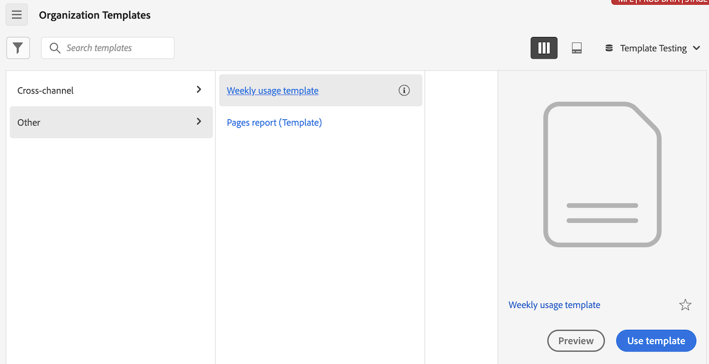

# 创建和管理模板

管理员可以创建模板并将其保存以供登录公司中的其他人使用。

登录公司中的人员可以使用[使用模板](/help/analyze/analysis-workspace/templates/use-templates.md)中所述的这些公司模板。

## 创建模板

要创建可供登录公司人员使用的新模板，请执行以下操作：

1. 在Analysis Workspace中，将项目构建到所需的状态。

1. 选择&#x200B;[!UICONTROL **项目**] > **[!UICONTROL 另存为模板……]**。

   

1. 在[!UICONTROL 另存为模板]对话框中指定以下信息：

   | 字段 | 描述 |
   |---------|----------|
   | **[!UICONTROL 名称]** | 为模板提供描述性名称。 |
   | **[!UICONTROL 描述]** | 提供模板的简短描述，描述其预期用途。 |
   | **[!UICONTROL 为何使用此模板]** | 提供简短说明，以告知组织中的人员如何使用此模板。 |
   | **[!UICONTROL 渠道]** | 选择适用于此模板的任何适用渠道。 您可以选择多个渠道： **[!UICONTROL Web]**、**[!UICONTROL 移动设备]**、**[!UICONTROL 跨渠道]**、**[!UICONTROL 呼叫中心]**&#x200B;和&#x200B;**[!UICONTROL 店内]**。
您选择的选项决定了显示模板的位置，以及哪些过滤器适用于从“组织模板”页访问模板的用户。
 |
   | **[!UICONTROL 用例]** | 选择适用于此模板的任何用例。 您可以选择多个用例：**[!UICONTROL 参与]**、**[!UICONTROL 转化]**、**[!UICONTROL 受众]**&#x200B;和&#x200B;**[!UICONTROL 客户获取]**。 
您选择的选项决定了显示模板的位置，以及哪些过滤器适用于从“组织模板”页访问模板的用户。
 |
   | **[!UICONTROL 标记]** | 指定要应用于模板的任何标记。 用户可按您添加的标记筛选模板列表。 |

1. 选择&#x200B;[!UICONTROL **另存为模板**]。

有关用户如何基于模板创建项目的信息，请参阅[使用模板](/help/analyze/analysis-workspace/templates/use-templates.md)中的[基于模板创建项目](/help/analyze/analysis-workspace/templates/use-templates.md#create-a-project-based-on-a-template)。

## 编辑或删除模板

管理员可以编辑或删除公司模板。

1. 在Analysis Workspace中，选择&#x200B;[!UICONTROL **Workspace**]&#x200B;选项卡，然后选择&#x200B;**[!UICONTROL _login_company_name _模板]**。

1. 如果您在列视图中查看模板：

   1. 转到要编辑或删除的模板，选择模板名称旁边的信息图标。

      

   1. 选择&#x200B;**[!UICONTROL 预览]**。

   1. 选择更多图标，然后选择&#x200B;**[!UICONTROL 编辑]**&#x200B;或&#x200B;**[!UICONTROL 删除]**。

      

1. 如果您在卡片视图中查看模板：

   1. 找到要编辑或删除的模板。

      

   1. 选择更多图标，然后选择&#x200B;**[!UICONTROL 编辑]**&#x200B;或&#x200B;**[!UICONTROL 删除]**。

      

## 重命名、标记或批准模板

管理员可以重命名、标记和批准公司模板。

1. 在Analysis Workspace中，选择&#x200B;[!UICONTROL **Workspace**]&#x200B;选项卡，然后在左边栏中选择&#x200B;**[!UICONTROL 项目选项卡]**。

1. 选择过滤器图标以过滤项目列表。

1. 在筛选器边栏中，选择&#x200B;**其他筛选器**，然后选择&#x200B;**公司模板**。

   此时将显示公司模板的列表。 不会显示所有常规项目（除非已固定）。

   公司模板可由模板名称前面的来标识。

   

1. 单击模板旁边的&#x200B;**...**&#x200B;省略号图标以查看可用选项。

   

1. 选择&#x200B;**[!UICONTROL 重命名]**、**[!UICONTROL 标记]**&#x200B;或&#x200B;**[!UICONTROL 批准]**。

   您也可以删除模板，也可以按照[编辑或删除模板](#edit-or-delete-templates)中的说明删除模板。

1. （可选）要返回到常规视图，请在筛选器边栏中取消选择&#x200B;**[!UICONTROL 公司模板]**。

## 访问公司模板

与Adobe提供的模板一样，组织内的用户可以访问管理员创建的模板。

有关如何访问公司模板的信息，请参阅[使用模板](/help/analyze/analysis-workspace/templates/use-templates.md)中的[访问和运行模板](/help/analyze/analysis-workspace/templates/use-templates.md#access-and-run-a-template)。
