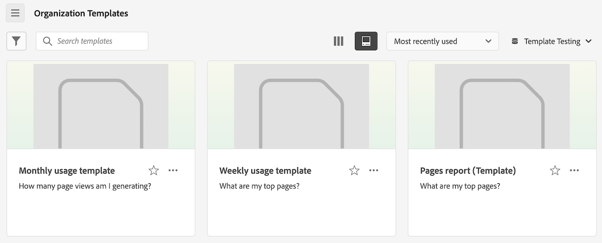

# 创建和管理模板

管理员可以创建并保存模板，供登录公司的其他人使用。

登录公司中的人员可以按照[使用模板](/help/analyze/analysis-workspace/templates/use-templates.md)中所述使用这些公司模板。

## 创建模板

要创建可供您登录公司中的人员使用的新模板：

1. 在 Analysis Workspace 中，按照所需状态生成项目。

1. 选择&#x200B;[!UICONTROL **项目**] > **[!UICONTROL 另存为模板……]**。

   

1. 在[!UICONTROL 另存为模板]对话框中指定以下信息：

   | 字段 | 描述 |
   |---------|----------|
   | **[!UICONTROL 名称]** | 为模板提供一个描述性名称。 |
   | **[!UICONTROL 描述]** | 为模板提供简短描述，说明其预期用途。 |
   | **[!UICONTROL 为什么使用此模板]** | 提供简短的说明，告知组织中的人员如何使用该模板。此说明显示在模板的预览页面上。 |
   | **[!UICONTROL 用例]** | 选择适用于此模板的任何用例。您可以选择多个用例：**[!UICONTROL 参与度]**、**[!UICONTROL 转化]**、**[!UICONTROL 受众]**&#x200B;和&#x200B;**[!UICONTROL 客户获取]**。 
您选择的选项将决定模板的显示位置，以及用户从组织模板页面访问模板时适用的过滤器。
 |
   | **[!UICONTROL 标记]** | 指定您想要应用于模板的任何标记。人们可以根据您添加的标记来过滤模板列表。 |

1. 选择&#x200B;[!UICONTROL **另存为模板**]。

有关用户如何基于模板创建项目的信息，请参阅[使用模板](/help/analyze/analysis-workspace/templates/use-templates.md)中的[基于模板创建项目](/help/analyze/analysis-workspace/templates/use-templates.md#create-a-project-based-on-a-template)。

## 编辑或删除模板

管理员可以编辑或删除公司模板。

1. 在 Analysis Workspace 中，选择 [!UICONTROL **Workspace**] 选项卡，然后选择 **[!UICONTROL _login_company_name _模板]**。

1. 如果您正在列视图中查看模板：

   1. 转到要编辑或删除的模板，选择模板名称旁边的信息图标。

      

   1. 选择&#x200B;**[!UICONTROL 预览]**。

   1. 选择更多图标，然后选择&#x200B;**[!UICONTROL 编辑]**&#x200B;或&#x200B;**[!UICONTROL 删除]**。

      

1. 如果您正在卡片视图中查看模板：

   1. 找到您要编辑或删除模板的位置。

      

   1. 选择更多图标，然后选择&#x200B;**[!UICONTROL 编辑]**&#x200B;或&#x200B;**[!UICONTROL 删除]**。

      

1. 如果您正在编辑模板，请进行所需的编辑，然后选择&#x200B;[!UICONTROL **项目**] > **[!UICONTROL 另存为模板……]**。

   

1. 在[!UICONTROL 另存为模板]对话框中指定以下信息：

   | 字段 | 描述 |
   |---------|----------|
   | **[!UICONTROL 名称]** | 为模板提供一个描述性名称。 |
   | **[!UICONTROL 描述]** | 为模板提供简短描述，说明其预期用途。 |
   | **[!UICONTROL 为什么使用此模板]** | 提供简短的说明，告知组织中的人员如何使用该模板。此说明显示在模板的预览页面上。 |
   | **[!UICONTROL 用例]** | 选择适用于此模板的任何用例。您可以选择多个用例：**[!UICONTROL 参与度]**、**[!UICONTROL 转化]**、**[!UICONTROL 受众]**&#x200B;和&#x200B;**[!UICONTROL 客户获取]**。 
您选择的选项将决定模板的显示位置，以及用户从组织模板页面访问模板时适用的过滤器。
 |
   | **[!UICONTROL 标记]** | 指定您想要应用于模板的任何标记。人们可以根据您添加的标记来过滤模板列表。 |

1. 选择&#x200B;[!UICONTROL **另存为模板**]。

## 重命名、标记或批准模板

管理员可以重命名、标记和批准公司模板。

1. 在 Analysis Workspace 中，选择&#x200B;[!UICONTROL **工作区**]&#x200B;选项卡，然后选择左边栏中的&#x200B;**[!UICONTROL 项目]**。

1. 选择过滤器图标来过滤项目列表。

1. 在过滤器边栏中，选择 **OTHER FILTERS**，然后选择&#x200B;**公司模板**。

   显示公司模板的列表。不会显示所有常规项目（除非已固定）。

   公司模板可通过模板名称前的识别。

   

1. 单击&#x200B;**...**&#x200B;模板旁边的省略号图标，查看可用选项。

   

1. 选择&#x200B;**[!UICONTROL 重命名]**、**[!UICONTROL 标记]**&#x200B;或&#x200B;**[!UICONTROL 批准]**。

   您还可以删除模板，或按[编辑或删除模板](#edit-or-delete-templates)中所述删除模板。

1. （可选）要返回常规视图，请在过滤器边栏中取消选择&#x200B;**[!UICONTROL 公司模板]**。

## 访问公司模板

与 Adobe 提供的模板一样，组织中的用户可以访问管理员创建的模板。

有关如何访问公司模板的信息，请参阅[使用模板](/help/analyze/analysis-workspace/templates/use-templates.md)中的[访问并运行模板](/help/analyze/analysis-workspace/templates/use-templates.md#access-and-run-a-template)。

## 隐藏模板选项卡 {#hide-reports}

管理员可以为其组织内的所有用户隐藏模板选项卡。

1. 转到 **[!UICONTROL Analytics]** > **[!UICONTROL 组件]** > **[!UICONTROL 偏好设置]** > **[!UICONTROL 公司]**。
1. 选择&#x200B;**[!UICONTROL 隐藏模板选项卡]**&#x200B;选项。
