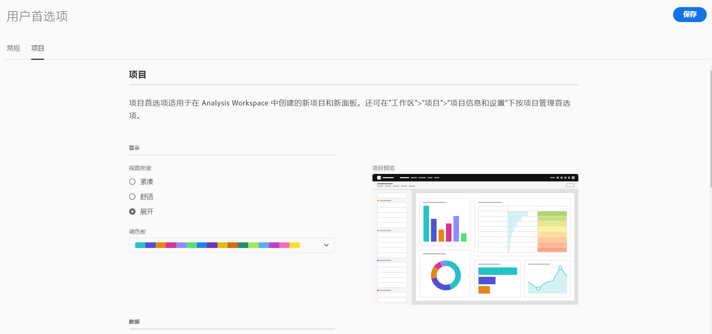

# 偏好设置

可以为创建的所有新项目或面板管理 Analysis Workspace 及其相关组件的设置。现有项目和面板不受影响。

>[!BEGINSHADEBOX]

请参阅  [管理偏好设置](https://video.tv.adobe.com/v/3429988/?quality=12&learn=on&captions=chi_hans){target="_blank"}以观看演示视频。

>[!ENDSHADEBOX]

## 更新偏好设置

1. 在 Adobe Analytics 中，前往&#x200B;[!UICONTROL **项目**]&#x200B;登陆页面，然后选择&#x200B;[!UICONTROL **偏好设置**]。

   

1. 有关每个选项卡上可用偏好设置的信息，请继续阅读本文中的以下任一部分：

   * [常规偏好设置](#general-preferences)

   * [公司](#company-preferences)

   * [项目偏好设置](#project-preferences)

   * [自由格式表偏好设置](#freeform-table-preferences)

   * [可视化偏好设置](#visualizations-preferences)

## 常规偏好设置

您可以为在 Analysis Workspace 中创建的所有新项目自定义常规偏好设置。有关如何访问这些偏好设置的信息，请参阅[更新偏好设置](#update-preferences)。

| 偏好设置 | 选项 |
| --- | --- |
| 登陆页面 | 选择访问 Adobe Analytics 时显示为默认页面的页面： <ul><li>项目列表（默认）</li><li>空白项目</li><li>从列表中选择的具体项目</li></ul> |
| 显示提示 | 在 Analysis Workspace 右下方区域的蓝色框中显示提示。 
默认启用选项。
 |
| 左边栏组中显示的组件 | 选择要在左边栏的“组件”菜单中显示的每个组件的数量。 
如果选择 0，则无法再从工作区的左边栏访问该组件。

默认情况下，为以下各项显示 5 个组件：
 <ul><li>维度</li><li>量度</li><li>过滤器</li><li>日期范围</li></ul> 
有关 Analysis Workspace 中组件的更多信息，请参阅[组件概述](/help/analyze/analysis-workspace/components/analysis-workspace-components.md)。
 |

## 公司偏好设置 {#company-preferences}

>[!CONTEXTUALHELP]
>id="workspace_prefs_shareonlyworkspace"
>title="仅允许与 Workspace 用户共享"
>abstract="启用后，**[!UICONTROL 与任何人共享]**&#x200B;选项在共享 Analysis Workspace 项目时将不再可供用户使用。之前通过此共享选项获得项目访问权限的人员将无法再访问该项目。"

>[!CONTEXTUALHELP]
>id="workspace_prefs_requireexperiencecloudauth"
>title="需要 Experience Cloud 身份验证"
>abstract="启用后，通过Analysis Workspace中的&#x200B;**[!UICONTROL 与任何人共享]**&#x200B;选项授予项目访问权限的用户必须使用其Experience Cloud凭据进行身份验证。"

>[!CONTEXTUALHELP]
>id="workspace_prefs_projectcommenting"
>title="允许对项目进行评论"
>abstract="启用后，Analysis Workspace 中每个项目的右侧栏中会显示一个评论区域。"

您可以更新适用于组织内所有用户和项目的公司偏好设置。有关如何访问这些偏好设置的信息，请参阅[更新偏好设置](#update-preferences)。

| 部分 | 偏好设置 | 选项 |
| --- | --- | --- |
| **“报告”选项卡** | | |
|  | “隐藏报告”选项卡 | 隐藏组织内所有用户的“报告”选项卡。 |
| **项目共享** | | |
| | 仅允许与 Workspace 用户共享 | 
启用此选项后，组织内的用户将无法在“共享”菜单中看到“与任何人共享”选项。这意味着，用户无法与已在您的组织中拥有 Analysis Workspace 帐户的人员共享项目，如[共享项目](/help/analyze/analysis-workspace/curate-share/share-projects.md)中的[与任何人共享项目（无需登录）](/help/analyze/analysis-workspace/curate-share/share-projects.md#share-public-link)中所述。

在启用或禁用此选项时，请考虑以下事项：
 <ul><li>
启用此选项后，之前通过“与任何人共享”共享选项获得项目访问权限的人员将无法再访问该项目。
</li><li>
如果启用此选项（仅允许与工作区用户共享），然后将其禁用（允许与任何人共享），则之前通过“与任何人共享”共享选项获得项目访问权限的人员不会自动重新获得对项目的访问权限。在这种情况下，已共享项目的用户必须启用在与任何人共享项目时可用的&#x200B;[!UICONTROL **链接已激活**]&#x200B;选项（[!UICONTROL **共享**] > [!UICONTROL **与任何人共享**]），如[共享项目](/help/analyze/analysis-workspace/curate-share/share-projects.md)中的[与任何人共享项目（无需登录）](/help/analyze/analysis-workspace/curate-share/share-projects.md#share-public-link)中所述。
</li> |
| | 需要 Experience Cloud 身份验证 | 
启用后，通过 Analysis Workspace 中的“与任何人共享”选项获得项目访问权限的人员必须使用其 Experience Cloud 凭据进行身份验证。
 
启用此选项后，当用户使用“与任何人共享”共享选项来共享项目时，共享对话框中都会启用“需要 Experience Cloud 身份验证”选项，并且共享项目的用户无法禁用该选项。（有关用户如何与任何人共享项目的信息，请参阅[共享项目](/help/analyze/analysis-workspace/curate-share/share-projects.md)中的[与任何人共享项目（无需登录）](/help/analyze/analysis-workspace/curate-share/share-projects.md#share-public-link)。）
 
启用此选项时，请考虑以下事项：
<ul><li>
启用此选项后，所有之前通过“与任何人共享”共享选项共享且未启用“需要 Experience Cloud 身份验证”选项的项目都将被停用。
</li> <li>
如果启用此选项（以要求进行 Experience Cloud 身份验证），然后将其禁用（以允许拥有链接的任何人员访问项目），则之前通过“与任何人共享”共享选项获得项目访问权限的人员不会自动重新获得对项目的访问权限。在这种情况下，已共享项目的用户必须启用在与任何人共享项目时可用的“链接已激活”选项（[!UICONTROL **共享**] > [!UICONTROL **与任何人共享**] > [!UICONTROL **链接已激活**]），如[共享项目](/help/analyze/analysis-workspace/curate-share/share-projects.md)中的[与任何人共享项目（无需登录）](/help/analyze/analysis-workspace/curate-share/share-projects.md#share-public-link)中所述。
</li> <li>
仅在组织内实施 SSO 后，此选项才可用。有关系统管理员如何为组织启用 SSO 的信息，请参阅[设置身份标识和单点登录](https://helpx.adobe.com/cn/enterprise/using/set-up-identity.html){target=_blank}。

如果已为组织配置 SSO，请检查控制台中是否实施了任何类型的自动帐户创建。通常，系统管理员会进行此设置，如[启用自动帐户创建](https://helpx.adobe.com/cn/enterprise/using/automatic-account-creation.html){target=_blank}中所述。
</li><li>
如果您的组织所在的行业需要遵守 HIPAA，则此选项将自动启用且无法禁用。
</li></ul> |

{style="table-layout:auto"}

## 项目和分析偏好设置 {#project-analyses-preferences}

>[!CONTEXTUALHELP]
>id="workspace_prefs_categoricalpalette"
>title="分类调色板"
>abstract="应用于 Analysis Workspace 和引导式分析中的许多可视化功能。每种颜色代表不同的类别值。"

>[!CONTEXTUALHELP]
>id="workspace_prefs_divergingpalette"
>title="发散调色板"
>abstract="应用于 Analysis Workspace 和用户增长引导式分析中的群组表。该调色板具有数字含义，其中带有两个极端以及中间的基线。"

>[!CONTEXTUALHELP]
>id="workspace_prefs_sequentialpalette"
>title="顺序调色板"
>abstract="应用于频率趋势（堆积条）引导式分析。该调色板具有从浅到深的数字含义。"

您可以为在 Analysis Workspace 中创建的所有新项目自定义项目偏好设置。有关如何访问这些偏好设置的信息，请参阅[更新偏好设置](#update-preferences)。

如[项目概述](/help/analyze/analysis-workspace/build-workspace-project/freeform-overview.md)中所述，也可以为个别项目自定义其中一些相同的偏好设置。

单击链接的偏好设置标题以获取有关每个偏好设置的更多信息和上下文。

| 部分 | 偏好设置 | 选项 |
| --- | --- | --- |
| **显示** | | |
|  | [视图密度](https://experienceleague.adobe.com/docs/analytics/analyze/analysis-workspace/build-workspace-project/view-density.html?lang=zh-hans) | 通过减小左侧边栏、自由格式表和同类群组表的垂直边距，让您可在屏幕上选择显示内容的多少。 <ul><li>紧凑</li><li>舒适</li><li>展开（默认）</li></ul> |
| | [调色板](https://experienceleague.adobe.com/docs/analytics/analyze/analysis-workspace/build-workspace-project/color-palettes.html?lang=zh-hans) | 选择 Analysis Workspace 中使用的可视化调色板。<ul><li>**分类调色板**：适用于 Analysis Workspace 中的许多可视化图表。每种颜色均代表不同的分类值。从 Adobe 提供的选项中进行选择，或输入由逗号分隔的十六进制值定义的自定义调色板。</li><li>**发散调色板**：适用于 Analysis Workspace 中的同类群组表。此调色板包含两个极端和中间基线的数值含义。</li><li>**顺序调色板**：适用于频率趋势（堆叠柱状图）引导分析。此调色板包含从浅色到深色的数值含义。</li></ul> |
| **数据** | | |
|  | [报告包](https://experienceleague.adobe.com/docs/analytics/analyze/analysis-workspace/panels/panels.html?lang=zh-hans?#report-suite) | 选择表格和可视化从中获取数据的位置。 <ul><li>最近（默认）</li><li>从列表中选择特定报告包</li></ul> |
|  | [日历](https://experienceleague.adobe.com/docs/analytics/analyze/analysis-workspace/panels/panels.html?lang=zh-hans?#calendar) | 从以下列表中选择： <ul><li>Adobe 提供的范围（默认为“本月”）</li><li>自定义范围</li></ul> |
|  | [面板类型](https://experienceleague.adobe.com/docs/analytics/analyze/analysis-workspace/panels/panels.html?lang=zh-hans) | <ul><li>自由格式（默认）</li><li>空白</li><li>快速洞察</li></ul> |
|  | 计数重复实例 | 指定是否将重复实例计入报告中。例如，此设置（激活时）会将同一页面的多次连续页面查看视为多次页面查看。关闭它后，它们将计为单个页面视图。 
**注意：**&#x200B;此设置仅影响某些量度（例如单页访问），不适用于流量或流失可视化。
 |
|  | 数字格式 | <ul><li>1,000.00（默认）</li><li>1.000,00</li><li>1 000,00</li></ul> |
|  | CSV 分隔符字符 | <ul><li>逗号（默认）</li><li>分号</li><li>冒号</li><li>竖线</li><li>句点</li><li>空格</li><li>制表符</li></ul> |
|  | 显示注释 | 选择注释是否在您的项目中可见。有关注释的更多信息，请参阅[注释概述](/help/analyze/analysis-workspace/components/annotations/overview.md)。 |

## 自由格式表偏好设置 {#freeform-table-preferences}

>[!CONTEXTUALHELP]
>id="workspace_prefs_showanomalies"
>title="显示异常"
>abstract="选择&#x200B;**[!UICONTROL 显示异常情况]**&#x200B;将会自动对已添加到时间序列可视化自由格式表中的第一个量度列运行异常检测。"

>[!CONTEXTUALHELP]
>id="workspace_prefs_showforecast"
>title="显示预测"
>abstract="选择&#x200B;**[!UICONTROL 显示预测]**&#x200B;将会自动对已添加到时间序列可视化自由格式表中的第一个量度列进行预测。"

>[!CONTEXTUALHELP]
>id="workspace_prefs_defaulttablemetric"
>title="默认表量度"
>abstract="选择用于自由格式表的默认量度。如果选定的数据视图不包含所选的默认量度，表格将自动切换到另一个主要量度。"

您可以为在 Analysis Workspace 中创建的所有新项目自定义自由格式表偏好设置。有关如何访问这些偏好设置的信息，请参阅[更新偏好设置](#update-preferences)。

这些相同的偏好设置中的一些也可以针对单个表进行自定义。

单击链接的分区标题以获取有关可用偏好设置的更多信息和上下文。

| 部分 | 偏好设置 | 选项 |
| --- | --- | --- |
| **表格** | | |
| | 表类型 | <ul><li>自由格式表</li><li>表生成器</li></ul> |
| | 默认表量度 | <ul><li>发生次数</li><li>独特访客</li><li>访问次数</li></ul> |
| | 默认表维度 | 从分钟、小时、天、周、月、季度或年中选择。 |
| | 调整日期 | 选择此选项可将每列的日期与同一行的所有开始日期对齐。 |
| **[列](/help/analyze/analysis-workspace/visualizations/freeform-table/column-row-settings/column-settings.md)** | | |
| | 隐藏标头文本 | 允许您隐藏自由格式表中的标头文本，以使标头更加易读，表格更易共享。这对 .pdf 渲染和名称较长的量度非常有用。默认处于启用状态。 |
| | 显示总数 | 此总数通常等于[!UICONTROL 全部总计]或者为其一部分。它反映自由格式表内应用的任何表过滤器，包括[!UICONTROL 不包含任何内容]选项。 |
| | 显示总计 | 此总计表示已收集的所有点击数，有时候称为“报告包总计”。当在面板级别或自由格式表中应用区段时，此总计会进行相应的调整以反映符合区段标准的所有点击。带有[统计行](/help/analyze/analysis-workspace/visualizations/freeform-table/workspace-totals.md)的表或细分不支持全部总计。 |
| | 显示迷您图 | 在图表底部显示或隐藏线形图。隐藏时，图例更改为不再在视觉上参照线形图。 |
| | 数值 | 确定单元格是否显示/隐藏量度的数值。例如，如果量度是“页面查看次数”，则数值是行项目的页面查看次数。 |
| | 百分比 | 确定单元格是否显示/隐藏量度的百分比值。例如，如果量度是“页面查看次数”，则百分比值等于行项目的页面查看次数除以该列的页面查看总数。注意：我们可以显示大于 100% 的百分比，准确度提高了。此外，我们还将上限调整为 1,000%，以确保允许列值有充足的变化范围。 |
| | 显示异常 <!-- This setting was moved from the "Project" tab. this is already in the tool/docs under "Freeform table, But the doc doesn't give a definition. --> | 确定此列中的值是否要运行异常检测。 |
| | 将零解释为没有值 | 对于具有 0 值的单元格，确定将其显示为 0 还是空白单元格。当您查看一个月中每一天的数据，而有些天尚未发生时，这非常有用。可以为将来日期显示空白单元格，而不是 0。各种图表也遵循这种设置（即，选中该设置后，线形图或条形图将不显示值为 0 的部分）。 |
| | 背景 | 确定单元格是否显示/隐藏所有单元格格式，包括条形图和条件格式。 <ul><li>条形图</li> 显示一个水平条形图，表示单元格相对于列总数的值。 <li>条件格式</li>有关条件格式的详细信息，请参阅[列设置](/help/analyze/analysis-workspace/visualizations/freeform-table/column-row-settings/column-settings.md)中的“条件格式”</ul> |
| | 单元格预览 | 显示应用当前所选的格式选项时，每个单元格的预览效果。 |
| **[行](/help/analyze/analysis-workspace/visualizations/freeform-table/column-row-settings/table-settings.md)** | | |
| | 按位置划分 | 如果您希望细目分类保留在项目的位置而不是项目本身，请选择此选项。有关细分的更多信息，请参阅[细分维度](/help/analyze/analysis-workspace/components/dimensions/t-breakdown-fa.md)。 |
| | 百分比计算 | <ul><li>列</li><li>行</li></ul> |
| | 列总计（仅限静态行） | <ul><li>显示行总和：显示各个行项目的总和 </li><li>显示总计：显示进行重复数据删除后的行总和。</li></ul> |

## 可视化偏好设置

您可以更新在 Analysis Workspace 中创建的所有新项目的可视化偏好设置。有关如何访问这些偏好设置的信息，请参阅[更新偏好设置](#update-preferences)。

这些相同的偏好设置中的一些也可以针对单个可视化进行自定义。

单击链接的分区标题以获取有关可用偏好设置的更多信息和上下文。

| 部分 | 偏好设置 | 选项 |
| --- | --- | --- |
| **常规默认值** | | |
| | 百分比 | 以百分比显示所有可视化的值。 |
| | 图例可见 | 用于隐藏所有可视化的详细图例文本。 |
| | 限制最大项目数 | 减少所有可视化的 X 轴上的项目数。如果您有大型数据集，这会很有用。 |
| | 显示双轴（适用时） | 仅适用于具有两个量度的情况，可以在左（用于一个量度）、右（用于另一个量度）两边各有一个 y 轴。在所绘制量度的数量级差别很大时，此项非常有用。 |
| | 标准化（适用时） | 要求所有量度按等比例计算。在所绘制量度的数量级差别很大时，此项非常有用。 |
| | 将 Y 轴定位在零 | 如果图表上绘制的所有值都远远大于零，则图表默认会将 y 轴底部设置为非零值。如果选中此框，y 轴将被强制设置为零（并将重新绘制图表）。 |
| | 允许异常缩放 Y 轴 | 如果图表中有多个量度，则必须将鼠标悬停在每个异常上以查看该量度的置信区间。为了使可视化更清晰，异常检测置信区间不会自动缩放 y 轴。此选项允许置信区间缩放可视化。 
有关详细信息，请参阅 Analysis Workspace 中的[查看异常情况](/help/analyze/analysis-workspace/c-anomaly-detection/view-anomalies.md)。
 |
| **[线形图](/help/analyze/analysis-workspace/visualizations/line.md)** | | |
| | 百分比 | 以百分比显示线条可视化的值。 |
| | 图例可见 | 允许您为线形图可视化隐藏详细的图例文本。 |
| | 限制最大项目数 | 减少直线可视化中 X 轴上的项目数。如果您有大型数据集，这会很有用。 |
| | 显示双轴（适用时） | 仅适用于具有两个量度的情况，可以在左（用于一个量度）、右（用于另一个量度）两边各有一个 y 轴。在所绘制量度的数量级差别很大时，此项非常有用。 |
| | 标准化（适用时） | 要求所有量度按等比例计算。在所绘制量度的数量级差别很大时，此项非常有用。 |
| | 显示 X 轴 | 在线形图上显示 x 轴。 |
| | 显示 Y 轴 | 在线形图上显示 y 轴。 |
| | 锚 Y 轴 | 如果图表上绘制的所有值都远远大于零，则图表默认会将 y 轴底部设置为非零值。如果选中此框，y 轴将被强制设置为零（并将重新绘制图表）。 |
| | 显示最小值 | 覆盖最小值标签以快速突出显示量度中的谷值。注意：最小值派生自可视化内容中的可见数据点，而不是维度中的完整值集。 |
| | 显示最大值 | 覆盖最大值标签以快速突出显示量度中的峰值。注意：最大值派生自可视化内容中的可见数据点，而不是维度中的完整值集。 |
| | 显示趋势线 | 显示线系列的回归或均线。趋势线有助于在数据中描绘更清晰的图案。 |
| **[同类群组](/help/analyze/analysis-workspace/visualizations/cohort-table/t-cohort.md)** | | |
| | 粒度 | 对于趋势性可视化内容，您可以更改时间粒度（日、周、月、季度或年）。此更改也适用于数据源表。 |
| | 仅显示百分比 | 删除数值，仅显示百分比。 |
| | 将百分比四舍五入到最接近的整数 | 将百分比值舍入为最接近的整数，而不是显示十进制值。 |
| | 显示平均百分比行 | 在表顶部插入新行，然后添加每列中值的平均值。 |
| | 队列预览 | 预览调色板在队列可视化图表中的显示方式。 |
| | 同类群组调色板 | 队列可视化图表中使用的调色板。 |
| **[组合图表](/help/analyze/analysis-workspace/visualizations/combo-charts.md)** | | |
| | 显示 X 轴 | 在组合图表上显示 x 轴。 |
| | 显示 Y 轴 | 在组合图表上显示 y 轴。 |
| | 在线上显示杠铃 | 在组合图表中的线条上显示杠铃。 |
| **[关键量度摘要](/help/analyze/analysis-workspace/visualizations/key-metric.md)** | | |
| | 摘要显示类型 | <ul><li>强调百分比变化</li><li>强调数值</li></ul> |
| | 显示迷您图 | 在图表底部显示或隐藏线形图。隐藏时，图例更改为不再在视觉上参照线形图。 |
| | 在迷您图上显示最大值和最小值 | 在主线形图和比较线形图上显示最小值和最大值。 |
| | 显示比较 | 显示对比数据。隐藏时，比较线形图和汇总更改对象将从视图中隐藏。 |
| | 数值选项 | 在&#x200B;[!UICONTROL **关键量度摘要**]&#x200B;部分 <ul><li>显示百分比变化</li><li>显示原始差异</li>主要日期范围和次要日期范围中量度的总值之间的原始差异</ul> |
| **[流失](/help/analyze/analysis-workspace/visualizations/fallout/configuring-fallout.md)** | | |
| | 容器 | 用于在“访问”和“访客”之间切换以分析访客路径。默认值为“访客”。这些设置可帮助您在访客级别（跨访问）了解访客参与程度，或将分析限定于单次访问。 
可以使用以下选项：
 <ul><li>访问</li><li>访客</li></ul> |
| **[流](/help/analyze/analysis-workspace/visualizations/c-flow/create-flow.md)** | | |
| | 容器 | 在&#x200B;[!UICONTROL **流**]&#x200B;部分 <ul><li>访问</li><li>访客</li></ul> |
| | 包装标签 | 通常情况下，流量元素上的标签会被截断以节约屏幕资源，但您可以通过选中此框使整个标签可见。默认值 = 取消选中。 |
| | 包括重复实例 | 流量可视化内容基于某个维度的实例。此设置使您可以选择包含还是排除重复实例，例如页面重新载入。但是，不能从包含多值维度（例如 listVar、listProp、s.product、推销 eVar 等）的流量可视化内容中删除重复项。默认值 = 取消选中。 |
| | 显示工具提示 | 确定将光标悬停在流量可视化内容中的各个节点上时是否显示包含节点数据的工具提示。 |
| | 列数 | 确定在流量图中需要多少列。 |
| | 每列扩展的项 | 每列中需要多少项。 |
| **堆栈图** | | |
| | 100% 堆叠 | 在面积堆叠、条形堆叠或水平条形堆叠的可视化内容上的此设置将图表转换为“100% 堆叠”的可视化内容。 
如需了解更多信息，请参阅[条形和堆叠条形](/help/analyze/analysis-workspace/visualizations/bar.md)。
 |
| **[直方图](/help/analyze/analysis-workspace/visualizations/histogram.md)** | | |
| | 存储体数量 | 在可视化中选择数据范围（储存体）的数量。存储段的最大数量为 50。 
有关更多信息，请参阅[直方图](/help/analyze/analysis-workspace/visualizations/histogram.md)。
 |
| | 计算方法 | 从以下选项中进行选择： <ul><li>点击</li><li>访问</li><li>访客</li></ul> 
例如，当与页面查看量结合使用时，您可以选择每个访问者的页面查看量、访问的页面查看量或每次点击的页面查看量。对于点击来说，“发生次数”可作为自由格式表中的 y 轴量度。
 |
| **[地图](/help/analyze/analysis-workspace/visualizations/map-visualization.md)** | | |
| | 绘制维度图 | <ul><li>移动经度/纬度</li><li>地理维度</li></ul> |
| | 地图类型 | <ul><li>气泡</li><li>热图</li></ul> |
| | 颜色主题 | 从珊瑚色、红色、绿色、蓝色、热图和正/负中进行选择。 |
| | 地图样式 | 从基本、街道、明亮、浅色、深色和卫星中进行选择。 |
| **[摘要变化](/help/analyze/analysis-workspace/visualizations/summary-number-change.md)** | | |
| | 值 | <!-- Seem to be basically the same options as in "Number value options" --> <ul><li>比例更改</li><li>原始差异</li></ul> |
| | 百分比 | 以百分比显示摘要更改可视化效果的值。 |
| | 图例可见 | 此设置允许您为摘要变化可视化内容隐藏详细的图例文本。 |
| **[摘要数字](/help/analyze/analysis-workspace/visualizations/summary-number-change.md)** | | |
| | 百分比 | 以百分比显示摘要编号可视化的值。 |
| | 图例可见 | 用于隐藏摘要编号可视化的详细图例文本。 |
| | 值汇总方式 | 从最大值、最小值、平均值、中值和总和中进行选择。 |
| | 缩写值 | 在&#x200B;[!UICONTROL **摘要编号**]&#x200B;部分 |
| **[树状图](/help/analyze/analysis-workspace/visualizations/treemap.md)** | | |
| | 百分比 | 以百分比显示 Treemap 可视化的值。 |
| | 限制最大项目数 | 减少树状图可视化中 X 轴上的项目数。如果您有大型数据集，这会很有用。 |
| **[维恩图](/help/analyze/analysis-workspace/visualizations/venn.md)** | | |
| | 图例可见 | 允许您为维恩图可视化隐藏详细的图例文本。 |
| **[散点图](/help/analyze/analysis-workspace/visualizations/scatterplot.md)** | | |
| | 百分比 | 以百分比显示散点图可视化的值。 |
| | 图例可见 | 允许您为散点图可视化隐藏详细的图例文本。 |
| | 限制最大项目数 | 减少散点图可视化中 X 轴上的项目数。如果您有大型数据集，这会很有用。 |
| | 将 Y 轴定位在零 | 如果图表上绘制的所有值都远远大于零，则图表默认会将 y 轴底部设置为非零值。如果选中此框，y 轴将被强制设置为零（并将重新绘制图表）。 |

## 恢复默认偏好设置

您可以将所有用户偏好设置恢复为系统默认值。这不会影响公司选项卡下的管理员偏好设置。

此操作无法撤销。

1. 在 Adobe Analytics 中，选择&#x200B;[!UICONTROL **组件**] **>** [!UICONTROL **偏好设置**]。

   

1. 在右上角，选择&#x200B;**[!UICONTROL 恢复默认]**。

1. 出现提示时，选择&#x200B;**[!UICONTROL 恢复默认]**。

## [!UICONTROL 深色主题]

如果您偏好为 Adobe Analytics 用户界面使用深色背景，可以切换到[!UICONTROL 深色主题]。

1. 单击右上角的 Experience Cloud 用户图标。

   

1. 将&#x200B;**[!UICONTROL 深色主题]**&#x200B;开关移动到右侧。

