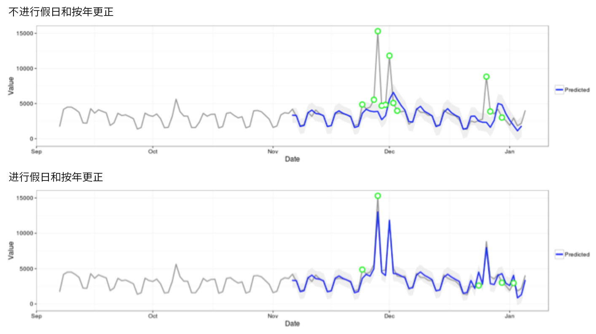

# 异常检测中使用的统计技术

Analysis Workspace 中的异常检测使用一系列高级统计技术来确定是否应将观测到的情况视为异常。

根据报告中使用的日期粒度，将使用3种不同的统计技术——尤其用于每小时、每日、每周／每月异常检测。 下文概述了每种统计技术。

## Anomaly detection for daily granularity {#section_758ACA3C0A6B4D399563ECABFB8316FA}

对于每天粒度报表，算法考虑了多种重要因素以尽可能提供最精确的结果。首先，算法根据可用数据确定要应用的模型类型，在基于时间序列的模型或离群点检测模型（称为函数过滤）两类之一中进行选择。

时间序列模型的选择基于 [Hyndman et al. (2008)](https://www.springer.com/us/book/9783540719168) 描述的下列误差、趋势和季节性 (ETS) 类型组合。具体来讲，算法会尝试以下组合：

1. ANA（加性误差、无趋势、加性季节性）
1. AAA（加性误差、加性趋势、加性季节性）
1. MNM（乘性误差、无趋势、乘性季节性）
1. MNA（乘性误差、无趋势、加性季节性）
1. AAN（加性误差、加性趋势、无季节性）

算法通过选择具有最优平均绝对百分比误差 (MAPE) 的组合来测试每种组合的适用性。但如果最优时间序列模型的 MAPE 大于 15%，则采用功能性过滤。通常，重复度较高的数据（例如每周或每月）最适合使用时间序列模型。

完成模型选择后，算法接着根据假日和每年的季节性调整结果。对于假日，算法会执行相关检查，以确定报告日期范围内是否存在以下假日：

* 阵亡将士纪念日
* 7 月 4 日
* 感恩节
* 黑色星期五
* 网购星期一
* 12 月 24 至 26 日
* 1 月 1 日
* 12 月 31 日

这些假期是根据对许多客户数据点的广泛统计分析来选择的，以确定对最多客户趋势最重要的假期。 虽然该列表肯定并不是所有客户或业务周期的完整列表，但我们发现，应用这些假期可以显着提高几乎所有客户数据集的算法整体性能。

选择了模型并确定了报告日期范围内的假日后，算法即会按照以下方式继续进行下一步：

1. 构建异常参考期——这包括最多在报告日期范围之前35天，以及1年前的匹配日期范围（在需要时计入闰日，包括前一年中不同日历日可能发生的任何适用假日）。
1. 根据最新数据测试当前时间段（不包括上一年）的假日是否存在异常。
1. 如果当前日期范围内的假期有异常，则根据上一年的假期（考虑前后2天）调整当前假日的预期值和置信区间。 对当前假日的更正基于以下项的最低平均绝对百分比误差：

   1. 加性影响
   1. 剩性影响
   1. 按年差异

请注意，在以下示例中，圣诞节日和新年日的表现显着提升：

## Anomaly detection for hourly granularity {#section_014C9E9209AF43F8A03D5D46E3B3AEE7}

每小时数据同样依赖于每日粒度算法所用的时间序列算法。但是，此算法在很大程度上依赖于两个趋势模式：以 24 小时为周期以及以周末/工作日为周期。为了捕获这两种季节性影响，每小时算法使用上述相同方法分别为周末和工作日构建两个不同的模型。

每小时趋势的培训时间范围依赖于 336 小时的回顾窗口。

## Anomaly detection for weekly and monthly granularities {#section_5D421576BFBC4B24A58DFCC0A6407545}

每周和每月趋势不会呈现与每日或每小时粒度所发现的相同每周或每日趋势，因此采用了单独的算法。对于每周和每月粒度，使用包含两个步骤的异常值检测方法，也就是 Generalized Extreme Studentized Deviate (GESD) 测试。此项测试在确定最大异常数量方面，同时考虑了预期的最大异常数量和调整后的箱线图方法（一种用于发现异常值的非参数方法）。这两个步骤是：

1. 调整后的箱线图功能：此功能确定给定输入数据中的最大异常数。
1. GESD 功能：应用至包含步骤 1 中输出内容的输入数据。

假日和YoY季节性异常检测步骤会从今年的数据中减去去年的数据，然后使用上述两步流程再次对数据进行迭代，以验证异常是否是季节性适当的。 上述每种日期粒度均使用 15 个回顾周期作为参照，其中包含选择的报告日期范围（15 个月或 15 周）及 1 年前的相应日期范围。
