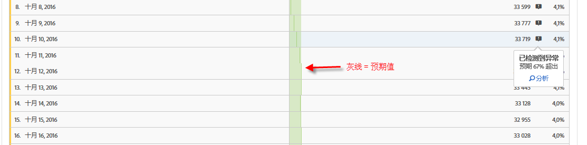
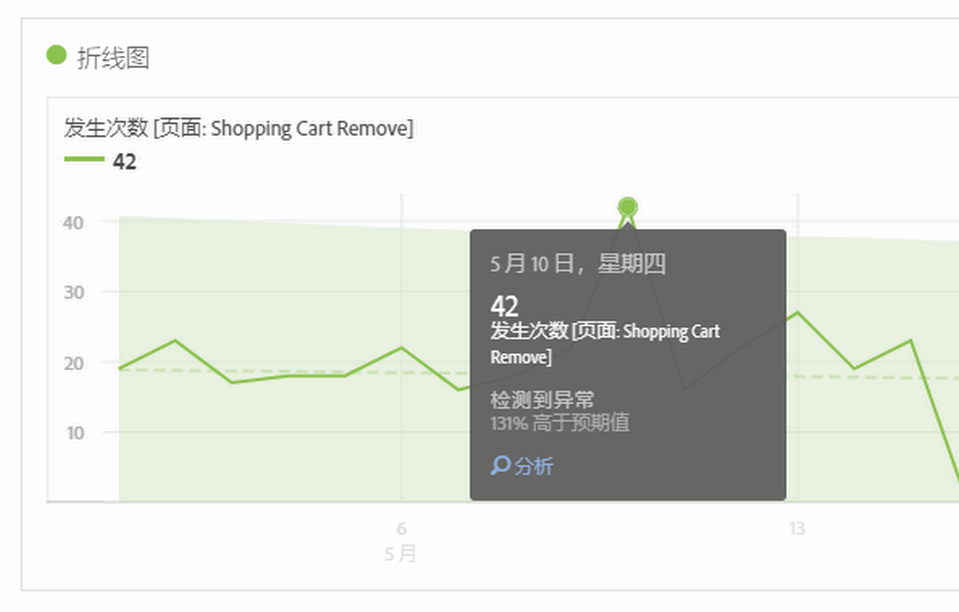
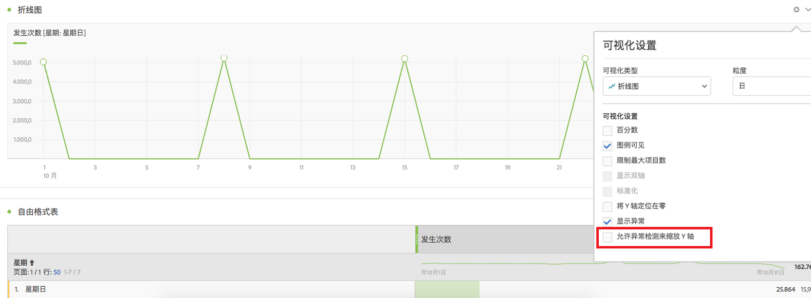

# 在 Analysis Workspace 中查看异常

您可以在表格或折线图中查看异常。

## 在表中查看异常 {#section_869A87B92B574A38B017A980ED8A29C5}

在时间序列自由格式表中，如果检测到数据异常，每一行现在会自动使用深灰色的感叹号进行标记。

每一行中垂直的灰线表示预期值。将鼠标悬停在感叹号上时，将以正、负百分比来指示异常偏离预期值的程度。

## 在折线图中查看异常 {#section_7C1192AFDB4345A8A2CCFB3AE0C47D82}

折线图会针对异常值（白色的点）显示浅绿色置信带。

如果您单击某个白色的点，则它会变为绿色，并向您显示以下信息：

* 异常发生的日期
* 异常的原始值
* 与预期值相差（高出或低于）的百分比，该值由绿色实线表示。
* 可启动[贡献分析](/help/analyze/analysis-workspace/virtual-analyst/contribution-analysis/ca-tokens.md)的“分析”链接。

如果折线图中包含多个量度，我们将仅显示异常，您必须将鼠标悬停在每个异常上，才能查看该量度的置信带。

异常检测置信度间隔不会自动缩放可视化的 y 轴以期让图表变得更加清晰易读。

您可以选择允许置信度间隔缩放图表。只需单击“设置”（齿轮）图标，并选中&#x200B;**[!UICONTROL 允许异常检测来缩放 Y 轴]**。

