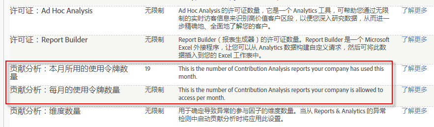

# 贡献分析概述

“贡献分析”可揭示数据中隐藏的模式以解释统计数据的异常，并可以跨各受众区段，确定意外客户操作、出界值以及选定量度的突增或突减背后存在的关联。

发生了一些事情。为什么？您的异常检测报表显示订购次数存在不寻常的上升，您想知道为什么出现这种情况。发生了什么不寻常的情况？谁响应了哪个促销活动或转接链接？这一情况是否会传播开来？导致本异常的具体因素是什么？或许最重要的是，如何捕获有关客户的重要信息以及如何重现这一情况？(或者，如果指标中的下降或出现了负面指标，我如何避免将来出现这种情况？)

贡献分析可帮助您立即评估数据，回答异常发生的原因。它可以在几秒钟内完成对异常的贡献划分（以前完成此过程需要用几周时间），从而提供受众区段的图表，并帮助描述客户交互情况。您可以在战略上使用“贡献分析”来确定和捕获有意义的关联，以便生成新的受众区段，或者在战术上使用它来确定触发警报的出界或欺骗活动。

[异常检测](/help/analyze/analysis-workspace/virtual-analyst/c-anomaly-detection/anomaly-detection.md)根据选定的量度和选定的受众区段来确定数据峰值和统计上的急速下跌。它首先根据培训期设置历史标准，然后标绘与特定事件关联的极端偏移值。“异常检测”可以报告正“订购”量度中的急速上升，或负“跳出次数”量度中的上升，也可以报告这两个量度中的下降情况，从而捕获在统计上相关的数据点，以供“贡献分析”进行评估。确定了统计异常之后，您可以通过“贡献分析”进行深化，跨所有异常数据点评估相关的营销和促销活动变量。它将运行高级算法和机器学习流程来评估导致明显上升或下降的关联。然后，这些然后在交互式可视化中显示计算，从而为您提供各种不同的视角来帮助答案发生事情，以及如何处理它。

“贡献分析”可以帮助您描述发生异常的原因以及如何应对这种异常情况，从而捕获相关的量度并确定隐藏的点，让您能够全面了解受众交互原因和客户兴趣发展趋势。有时，异常很容易发现和更正，如错误订购 2,000 艘橡皮船。而有时，异常会非常复杂，如确定某个地区在一个时间段仅针对特定目标促销活动突然出现的趋势。通过将各个维度中量度的贡献项目及其关联综合到一起，可让您全面了解您的受众交互，并且可帮助提供异常数据点的环境。

下面是一些建议：

* 通过监控产品需求的变化确定再营销的潜力。
* 通过响应特定的受众兴趣提升客户体验。
* 及早将欺骗性订单标识为越界报表。
* 通过识别高使用率和下载率保护自己免受商业间谍侵害。
* 监控操作，如报告缺失的 javascript 标记。

在全面分析了异常之后，将为排名最前的项目生成贡献摘要，并按总出现次数和项目的贡献值百分比进行排序。通过标准化的贡献得分，您可以轻松与其他重要维度项目进行比较、对照和关联。

## Contribution Analysis Tokens - overview {#section_3EF8D2BBCE6E4C309D753BCF04A453D0}

>[!IMPORTANT]
>
>已从Reports&amp; Analytics功能集中删除贡献分析，现在只通过Analysis Workspace提供。

在 Analysis Workspace 中，所有具有“贡献分析”授权的客户每月均可运行有限次数的完整贡献分析。这&#x200B;**不包括**&#x200B;单点产品 (SiteCatalyst 15) 客户、Analytics Foundation 客户和 Analytics Select 客户，这些客户根本没有获得“贡献分析”。

每个公司的运行次数受月度令牌的限制，而这些令牌是根据公司购买的 Adobe Analytics 产品授予的。这包括能够限制对贡献分析的访问以避免令牌滥用。

## 常见问题解答 {#section_11D0431AD2014B96AB9561CA66A367CE}

<table id="table_357775E5058644099E26B15A6790E8AF"> 
 <thead> 
  <tr> 
   <th colname="col1" class="entry"> 问题 </th> 
   <th colname="col2" class="entry"> 回答 </th> 
  </tr>
 </thead>
 <tbody> 
  <tr> 
   <td colname="col1"> 
<b>Adobe 为何要引入令牌？</b> 
 </td> 
   <td colname="col2"> 
自 2015 年发布 Adobe Analytics 以来，“贡献分析”一直是 Adobe Analytics 的最强大功能之一。通过允许您每月运行少量“完整”贡献分析（对于某些 Analytics 产品不仅仅是运行 3 个维度），您可以更好地了解不限数量的完整贡献分析对您有哪些益处。 
 </td> 
  </tr> 
  <tr> 
   <td colname="col1"> 
<b>令牌如何在贡献分析中起作用？是在加载具有现有贡献分析的项目时需要令牌，还是只有在运行全新的贡献分析时才需要令牌？</b> 
 </td> 
   <td colname="col2"> 
每个登录公司（而非每个用户）每月可获得一定数量的令牌，以便能够在 Analysis Workspace 中运行“完整”贡献分析。 
 
每次生成新的贡献分析时，都需要支付一个令牌。加载具有预运行贡献分析的项目时不需要支付令牌。 
 </td> 
  </tr> 
  <tr> 
   <td colname="col1"> 
<b>令牌是否适用于 Reports &amp; Analytics 中的贡献分析？</b> 
 </td> 
   <td colname="col2"> 
否。从 2018 年 4 月份版本起，Reports &amp; Analytics 中不再提供贡献分析。 
 </td> 
  </tr> 
  <tr> 
   <td colname="col1"> 
<b>如果我的公司用完了令牌，但是想要运行额外的贡献分析，我们该怎么做？</b> 
 </td> 
   <td colname="col2"> 
您可以升级到其他 Adobe Analytics 产品，例如从 Standard（每月 2 个令牌）升级到 Ultimate（每月 20 个令牌）。您不能只购买更多令牌，您必须在现有的包装框架内进行升级。 
 </td> 
  </tr> 
  <tr> 
   <td colname="col1"> 
<b>我如何限制对贡献分析的访问？</b> 
 </td> 
   <td colname="col2"> 
By default, only admins have access to run Contribution Analyses, but admins can grant access to other users by creating a permission group in the <a href="https://docs.adobe.com/content/help/en/core-services/interface/manage-users-and-products/admin-getting-started.html" format="html" scope="external"> Admin Console </a>. 您应授予仅对具有合法理由使用“贡献分析”的用户使用贡献分析的权限，并且不会滥用其访问权限。 
 
此权限称为“贡献分析”，位于 Analytics &gt; 管理员 &gt; 用户管理 &gt; 编辑群组 &gt; 编辑所有报表访问权限 &gt; 自定义报表包工具 &gt; 工具和报表下。 
 </td> 
  </tr> 
  <tr> 
   <td colname="col1"> 
<b>如何知道我的公司每月有权使用多少个令牌，以及我们在当月使用了多少个令牌？</b> 
 </td> 
   <td colname="col2"> 
请转到管理员 &gt; 公司设置 &gt; 查看功能访问级别。此页面中有 2 个新项目： 
 
 
 </td> 
  </tr> 
 </tbody> 
</table>

## Anomaly Detection and Contribution Analysis entitlements {#section_9278D58F21A840AA9B1ED1BD07A1EF0A}

以下是 Analysis Workspace 中异常检测和贡献分析的详细授权列表。

>[!IMPORTANT]
>
>异常检测和贡献分析已从 Reports &amp; Analytics 功能集中删除，现在只能通过 Analysis Workspace 使用。请注意，Adobe Analytics Select 和 Adobe Analytics Foundation 客户只能访问 Workspace 中的“每天粒度”异常检测。

<table id="table_5C9B7E4AE82640B5A913519E576889B5"> 
 <thead> 
  <tr> 
   <th colname="col1" class="entry"> Adobe Analytics 授权 </th> 
   <th colname="col2" class="entry"> 异常检测 </th> 
   <th colname="col3" class="entry"> 贡献分析 </th> 
  </tr>
 </thead>
 <tbody> 
  <tr> 
   <td colname="col1"> 
Foundation 
 </td> 
   <td colname="col2"> 
仅每天粒度 
 </td> 
   <td colname="col3" colsep="1"> 
无令牌 
 </td> 
  </tr> 
  <tr> 
   <td colname="col1"> 
<a href="https://www.adobe.com/data-analytics-cloud/analytics/select.html?promoid=B4XQ3X7G&amp;mv=other" format="html" scope="external"> Select </a> 
 </td> 
   <td colname="col2"> 
仅每天粒度 
 </td> 
   <td colname="col3"> 
无令牌 
 </td> 
  </tr> 
  <tr> 
   <td colname="col1"> 
<a href="https://www.adobe.com/data-analytics-cloud/analytics/prime.html?promoid=91BF51TR&amp;mv=other" format="html" scope="external"> Prime </a> 
 </td> 
   <td colname="col2"> 
是 
 </td> 
   <td colname="col3"> 
每月 10 个令牌 
 </td> 
  </tr> 
  <tr> 
   <td colname="col1"> 
<a href="https://www.adobe.com/data-analytics-cloud/analytics/ultimate.html?promoid=8N4B5F1V&amp;mv=other" format="html" scope="external"> Ultimate</a> 
 </td> 
   <td colname="col2"> 
是 
 </td> 
   <td colname="col3"> 
每月 20 个令牌 
 </td> 
  </tr> 
  <tr> 
   <td colname="col1"> 
+Predictive Workbench 
 </td> 
   <td colname="col2"> 
是 
 </td> 
   <td colname="col3"> 
无限制令牌 
 </td> 
  </tr> 
  <tr> 
   <td colname="col1"> 
Standard 
 
    <ul id="ul_73D52020793B44868C9CE0F90893075D"> 
     <li id="li_21EE0871C87E43C8B781219B2BA0FA74">Adobe Analytics 核心 </li> 
     <li id="li_AB3593200F33439BAEE8FEB13CAE57F4">Adobe Analytics OD </li> 
     <li id="li_2B7D625519BC4A4CB598C95F15D3029B">Adobe Analytics MA </li> 
    </ul> </td> 
   <td colname="col2"> 
是 
 </td> 
   <td colname="col3"> 
每月 2 个令牌 
 </td> 
  </tr> 
  <tr> 
   <td colname="col1"> 
Premium（360，属性） 
 </td> 
   <td colname="col2"> 
是 
 </td> 
   <td colname="col3"> 
每月 2 个令牌 
 </td> 
  </tr> 
  <tr> 
   <td colname="col1"> 
Premium（Complete，<a href="https://www.adobe.com/data-analytics-cloud/analytics/predictive-intelligence.html" format="html" scope="external">Predictive Intelligence</a>） 
 </td> 
   <td colname="col2"> 
是 
 </td> 
   <td colname="col3"> 
无限制令牌 
 </td> 
  </tr> 
 </tbody> 
</table>
