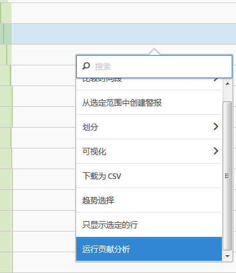
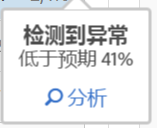
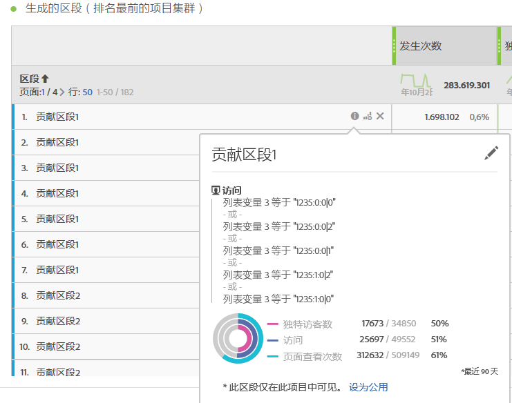
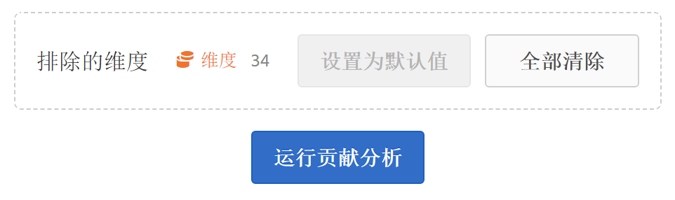
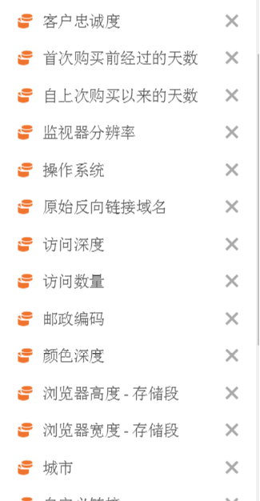

# 运行贡献分析

贡献分析是一个密集型计算机学习过程，专为揭示导致 Adobe Analytics 中所发现异常的因素而设计。它旨在帮助用户以远快于其他方式的速度找到执行进一步分析的焦点领域或时机。

## 运行贡献分析 {#section_7D2C5E48A5664727941DF4C90976D9DC}

在项目中可以通过两种方式来调用贡献分析：

* In a freeform table with daily granularity, right-click any row and select **[!UICONTROL Run Contribution Analysis]**. 甚至可以对没有显示任何异常的行运行贡献分析。

   >[!NOTE]
   >
   >我们目前仅支持每日粒度贡献分析。

   

* 在折线图中，将光标悬停在折线图中的异常数据点上。单击显示的&#x200B;**[!UICONTROL 分析]链接。**

   

1. （可选）在折线图或表中单击了&#x200B;**[!UICONTROL 运行贡献分析]**&#x200B;后，可通过[排除维度](../../../../analyze/analysis-workspace/virtual-analyst/contribution-analysis/run-contribution-analysis.md#section_F6932F4BF74544B5872164E7B1E0C6FC)来缩小分析范围（并且因此而提高分析速度）。

1. 在加载贡献分析时，请稍候。此过程可能需要用相当长一段时间，具体取决于报表包的大小和维度的数量。贡献分析可以对每个维度的前 50,000 项执行分析。
1. 然后，Analysis Workspace 会将新的贡献分析面板直接加载到此项目中。如果您之前使用过 Reports &amp; Analytics 中的“贡献分析”，则会发现有许多熟悉的面板：

   * 显示当天&#x200B;**访问**&#x200B;次数的可视化。
   * 用于上下文的每月&#x200B;**访问趋势线**。
   * 导致此异常的&#x200B;**排名最前的项目**（按[贡献得分](https://marketing.adobe.com/resources/help/en_US/analytics/contribution/ca_contribution_score.html)排序），以及相关量度和一个独特访客量度（用来对量度进行分级）。

   * [生成的区段](https://marketing.adobe.com/resources/help/en_US/analytics/contribution/ca_workflow_premium.html)（排名最前的项目集群）表根据贡献得分、异常发生次数和对异常量度做出贡献的整体百分比，识别排名最前的项目间的关联。然后，将这种关联捕获为受众区段（贡献区段 1、贡献区段 2，等等）。单击“i”（信息）按钮将显示每个自动生成区段的定义，包括构成该自动生成区段的排名最前的项目：

      

1. 由于贡献分析现在属于 Analysis Workspace 的一部分，因此您可以利用表右键单击菜单中的大量功能使您的分析更有意义，例如：

   * [按其他维度划分每个维度项目。](../../../../analyze/analysis-workspace/components/dimensions/t-breakdown-fa.md#task_B594DA2476E84DFDA8279E831F0BD9C4)
   * [显示一个或多个行的趋势。](../../../../analyze/analysis-workspace/analysis-workspace-features.md#section_34930C967C104C2B9092BA8DCF2BF81A)
   * [添加新的可视化。](../../../../analyze/analysis-workspace/visualizations/freeform-analysis-visualizations.md#concept_09242627629147A88A68F1506954C276)
   * [创建警报。](/help/components/c-alerts/intellligent-alerts.md)
   * [创建或比较区段。](../../../../analyze/analysis-workspace/c-panels/c-segment-comparison/segment-comparison.md#concept_74FAC1C6D0204F9190A110B0D9005793)

>[!NOTE]
>
>我们重点介绍了在贡献分析和链接到它的Intelligent Alert项目中使用蓝点分析的异常。这样可以更清楚地指示正在分析的异常。

## Exclude dimensions from Contribution Analysis {#section_F6932F4BF74544B5872164E7B1E0C6FC}

有时，您可能想从“贡献分析”中排除一些维度。例如，您可能根本不关心任何与浏览器或硬件相关的维度，因此希望删除它们从而加快分析速度。

1. 单击&#x200B;**[!UICONTROL 运行贡献分析]**（或折线图中的&#x200B;**[!UICONTROL 分析]）后，会显示**&#x200B;排除的维度]面板。**[!UICONTROL **

1. Just drag any unwanted dimensions into the **[!UICONTROL Excluded Dimensions]** panel, then save the list by clicking **[!UICONTROL Set as Default]**. 或者，选择要排除的维度后，单击&#x200B;**[!UICONTROL 全部清除]以重新开始。**

   

1. 添加了要排除的维度（或选择不排除的维度）后，请再次单击&#x200B;**[!UICONTROL 运行贡献分析]。**
1. 如果您需要修订排除的维度列表，只需双击“维度”，系统便会显示排除的维度列表：

   

1. Just delete any unwanted dimensions by clicking the x next to them, then save the list by clicking **[!UICONTROL Set as Default]**.

