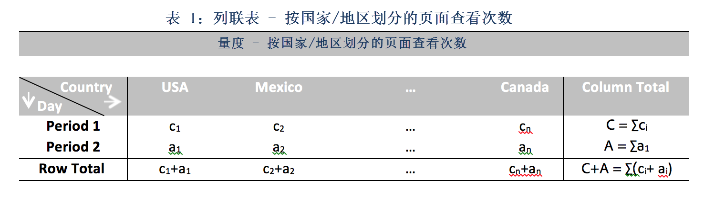

# 贡献分析中使用的统计技术

贡献分析是一个密集型计算机学习过程，专为揭示导致 Adobe Analytics 中所发现异常的因素而设计。此方法的目的在于协助用户寻找关注的领域或更多其他分析机会，而且比采用其他的方法要快得多。

贡献分析通过执行一个分为两部分的算法，即可对可用于用户贡献分析报表的每个维度项目完成此操作。此算法以下列顺序运行：

1. 对于每个维度，它会计算克莱姆 V 系数检验统计量。在以下实例中，须考虑列联表中跨越两个时间段的页面查看次数（按国家/地区划分）：

   

   在表格 1 中，克莱姆 V 系数可用于测量分别对应时间段 1（例如历史）和时间段 2（例如异常发生的日子）的页面查看次数（按国家/地区划分）之间的关联。克莱姆 V 系数的值较低意味着低级别的关联。克莱姆 V 系数的范围介于 0（无关联）到 1（完全关联）之间。克莱姆 V 系数统计量是可计算的：

   

1. 对于每个维度项目，客户残留 (PR) 用于测量异常量度和每个维度项目之间的关联。PR 遵循标准的正态分布，这允许算法比较两个随机变量的 PR（甚至是在偏差不可比较的情况下）。实际上，错误不是已知的，并可使用有限的样本校正进行预测。

   在前一示例表格 1 中，PR 以及国家/地区 i 和时间段 2 的有限样本校正都是给定的

   

   这里，

   

   （可获取用于时间段 1 的类似公式。）

   对于最后结果，每个维度项目的分数将由克莱姆 V 系数测量算得，并重新调整为一个介于 0 和 1 之间的数字，以便提供其贡献得分。

