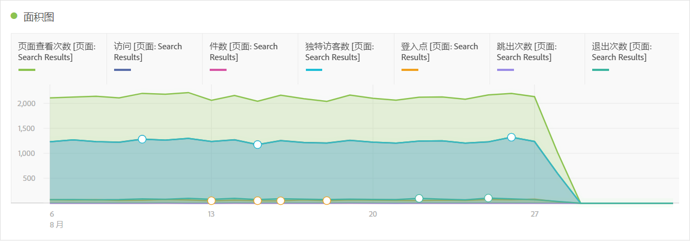
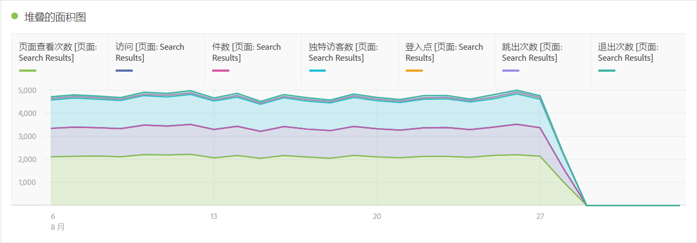
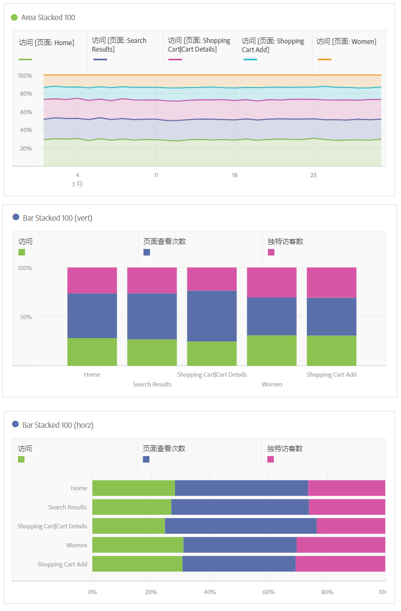

# 面积图和堆叠的面积图

>[!BEGINSHADEBOX]

_本文记录了_  _**Adobe Analytics**&#x200B;中的面积图和栈叠面积图可视化图表。_ _查看本文的_  _**Customer Journey Analytics**&#x200B;版本的[面积图和栈叠面积图](https://experienceleague.adobe.com/en/docs/analytics-platform/using/cja-workspace/visualizations/area)。_

>[!ENDSHADEBOX]

面积图可视化图表具有标准和栈叠选项。

## 面积图 {#area}

<!-- markdownlint-disable MD034 -->

>[!CONTEXTUALHELP]
>id="workspace_area_button"
>title="面积图"
>abstract="创建一份可视化面积图来表示多个量度的交集。"

<!-- markdownlint-enable MD034 -->

此可视化与折线图类似，只是线条下方显示了彩色区域。当您有多个量度并且希望显示两个或更多量度相交的区域时，可使用面积图。

## 堆叠的面积图 {#area-stacked}

<!-- markdownlint-disable MD034 -->

>[!CONTEXTUALHELP]
>id="workspace_areastacked_button"
>title="堆叠的面积图"
>abstract="创建面积图可视化来表示多个量度的堆叠。"

<!-- markdownlint-enable MD034 -->

此可视化与面积图类似，只是每个系列从上一个系列的顶部开始。

堆叠的面积可视化的新可视化设置将图表变为“100% 堆叠”可视化。

下面是有关“100% 堆叠可视化”的视频：

>[!VIDEO](https://video.tv.adobe.com/v/23131/?quality=12)
