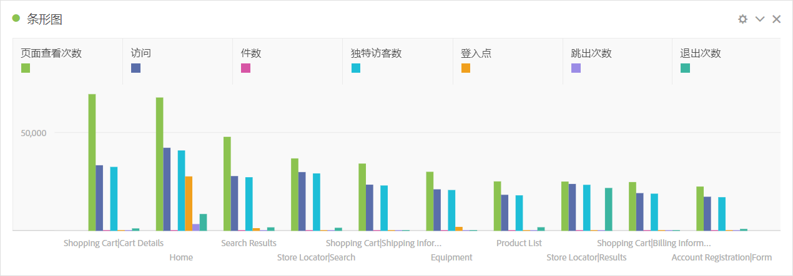
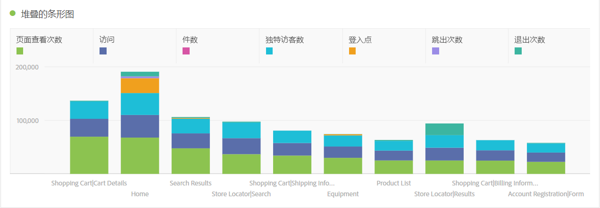
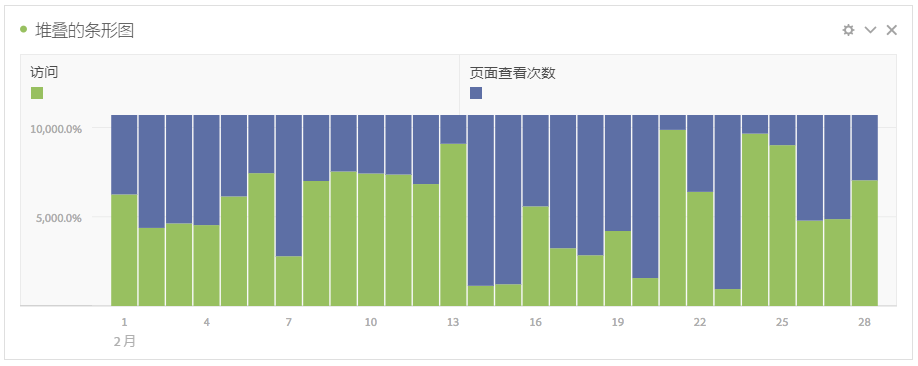

# 条形图和条形图堆叠

## 条形图 {#section_2E96E55D4E8E488CBCA6A3508DDF3918}

此可视化显示了一些垂直条，这些垂直条表示一个或多个量度中的各种值。

通过可视化设置中的粒度下拉列表，可以将趋势可视化（例如折线图、条形图）从每日更改为每周、每月等。

## Bar stacked {#section_9EA83779AE964635907EE5031A785A49}

此可视化与条形图类似，只是系列条相互堆叠在顶部。

堆叠的条形可视化的新可视化设置将图表变为“100% 堆叠”可视化：

