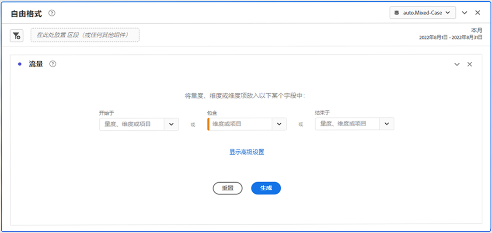
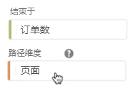
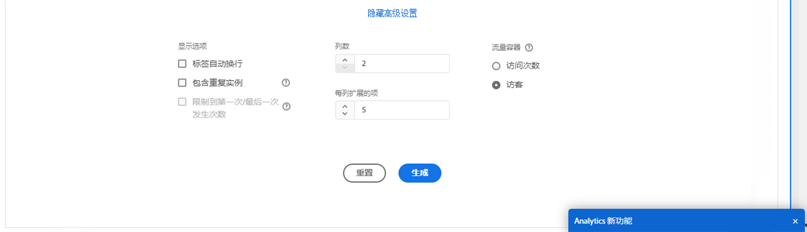
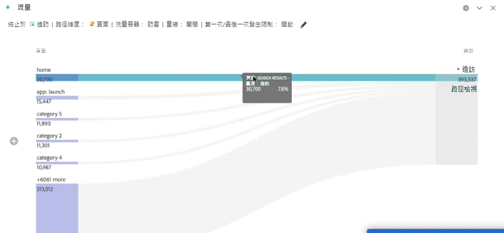
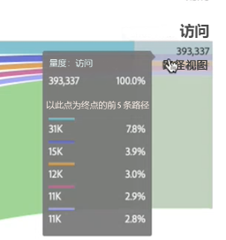

# 配置流量可视化图表

流量可视化图表可帮助您了解源于或导致网站或应用程序上特定转化事件的历程。它通过维度（和维度项）或量度跟踪路径。

流量可视化图表可让您配置感兴趣的路径的起点或终点，或分析流经某个维度或维度项的所有路径。

## 创建流量可视化图表 {#configure}

1. 将空白面板添加到项目中，然后单击左边栏中的可视化图表图标。

   或

   使用[可视化概述](/help/analyze/analysis-workspace/visualizations/freeform-analysis-visualizations.md)中的“将可视化图表添加到面板”部分中描述的任意方式添加可视化图表。

1. 使用以下选项之一锚定流量可视化图表：

   * 以（量度、维度或项目）[!UICONTROL **开头**]，或
   * [!UICONTROL **包含**]（维度或项目），或
   * 以（量度、维度或项目）[!UICONTROL **结束**]

   其中每种类别在屏幕上都显示为一个“放置区域”。可以通过3种方式填充放置区域：

   * 使用下拉菜单选择量度或维度。
   * 从左边栏中拖动维度或量度。
   * 开始键入维度或量度的名称，然后在它出现在下拉列表中时将其选中。

   >[!IMPORTANT]
   >
   >计算量度不能用于&#x200B;**[!UICONTROL 开始于]**&#x200B;或&#x200B;**[!UICONTROL 结束于]**&#x200B;字段。

1. 如果您选择某个量度，则还需要提供一个&#x200B;[!UICONTROL **路径Dimension**]，用作通往或离开您选定组件的路径，如下所示。 默认的是 [!UICONTROL **页面**]。

   

1. （可选）选择&#x200B;**[!UICONTROL 显示高级设置]**&#x200B;以配置以下任一选项：

   

   | 设置 | 描述 |
   | --- | --- |
   | **[!UICONTROL 包装标签]** | 通常情况下，流量元素上的标签会被截断以节约屏幕资源，但您可以通过选中此框使整个标签可见。默认值 = 取消选中。 |
   | **[!UICONTROL 包括重复实例]** | 流量可视化图表基于某个维度的实例。此设置使您可以选择包含还是排除重复实例，例如页面重新载入。但是，不能从包含多值维度（例如 listVar、listProp、s.product、推销 eVar 等）的流量可视化图表中删除重复项。 
默认禁用此选项。
 |
   | **[!UICONTROL 限制到第一次/最后一次发生次数]** | 将路径限制为以维度/项目/量度的第一次/最后一次发生次数开始/结束的路径。有关更详细的解释，请参阅下面的[“限制到第一次/最后一次发生次数”示例场景](#example-scenario-for-limit-to-firstlast-occurrence)部分。 |
   | **[!UICONTROL 列数]** | 流量图中所需的列数。您最多可以指定 5 个列。 |
   | **[!UICONTROL 每列扩展的项]** | 每列中所需的项数。您最多可以指定每列扩展 10 个项。 |
   | **[!UICONTROL 流量容器]** | <ul><li>访问</li><li>访客</li></ul> 用于在“访问”和“访客”之间切换以分析访客路径。这些设置可帮助您在访客级别（跨访问）了解访客参与程度，或将分析限定于单次访问。 |

   >[!IMPORTANT]
   >
   >**[!UICONTROL 列数]**&#x200B;和&#x200B;**[!UICONTROL 每列扩展的项]**&#x200B;的组合确定创建流量可视化图表所需的基础请求数。该数量越多，渲染可视化图表所需的时间就越长。

1. 选择&#x200B;**[!UICONTROL 生成]**。

>[!INFO]
>
>**示例：**&#x200B;假设您要跟踪用户用来访问或离开您网站上最受欢迎页面的路径。
>
>为此，您将
> 
>1. 开始创建流量可视化图表，如上所述。
>1. 将&#x200B;[!UICONTROL **页面**]&#x200B;维度拖入&#x200B;**[!UICONTROL 包含]**&#x200B;字段中，然后选择&#x200B;[!UICONTROL **生成**]。
>1. 流量可视化图表使用可视化图表中心的关注节点中可见的查看次数最多的页面来生成。您还可以看到进入该页面的顶部页面（焦点节点的左侧）以及进入该页面的顶部页面（焦点节点的右侧）。
>1. 分析流量中的数据，如[查看和更改流量输出](#view-and-change-the-flow-output)中所述。

## 查看并更改流量输出。 {#output}

流量配置的摘要显示在图的顶部。图表中路径的粗细与其活动成正比，活动较多的路径看起来比活动较少的路径更粗。

要进一步深入了解数据，您有几个选项：

* 流量图是交互式图表。将鼠标置于该图上可更改显示的详细信息。

* 选择图表中的节点时，将显示该节点的详细信息。再次选择该节点以将其折叠。

  

* 您可以通过筛选列仅显示某些结果，例如包括和排除、指定条件等。

* 选择左侧的加号 (+) 展开一列。

* 使用下面介绍的右键单击选项进一步自定义输出。

* 选择配置摘要旁边的铅笔图标以进一步编辑流量或使用不同选项重建流量。

* 您还可以将流量图导出为项目的 .CSV 文件的一部分并对其进行进一步分析，方法是转到&#x200B;**[!UICONTROL 项目]** > **[!UICONTROL 下载 CSV]**。

## 筛选

当您将鼠标悬停在每列上方时，会显示出一个过滤器。通过选择过滤器，您将获得与当前自由格式表格中存在的相同的过滤器对话框。此过滤器的工作原理与它在自由格式表格中的工作原理相同。

* 使用高级设置在操作员列表中包括或排除某些标准。
* 一旦从列表中筛选出一个项目，该特定列将会反映出筛选结果。（过滤器要么将其缩小为仅显示过滤器中允许的项目，要么删除除您希望在过滤器中显示的一个项目之外的所有项目。
* 只要有数据流入其余节点，所有下游和上游列都应保持不变。
* 应用后，过滤器图标将以蓝色显示在其正在过滤的列上方。
* 要删除过滤器，请选择过滤器图标以打开过滤器菜单。删除应用的任何过滤器，然后选择&#x200B;**[!UICONTROL 保存]**。流量应返回到其先前的未过滤状态。

## 右键单击选项 {#right-click}

| 选项 | 描述 |
|--- |--- |
| [!UICONTROL 从头开始] | 返回到自由格式表格生成器，您可从中生成新的流量图表。 |
| [!UICONTROL 为此路径创建区段] | 创建区段。这会转至区段生成器，您可从中配置新区段。 |
| [!UICONTROL 细分] | 按可用维度、量度或时间分解节点。 |
| [!UICONTROL 趋势] | 为节点创建趋势图表。 |
| 显示下一列/显示上一列 | 显示可视化图表的下一列（右）或上一列（左）。 |
| 隐藏列 | 在可视化图表中隐藏选定的列。 |
| [!UICONTROL 扩展整列] | 扩展某一列以显示全部节点。默认情况下，只会显示头五个节点。 |

## “第一次/最后一次发生次数”的示例场景

使用此选项时，请记住：

* **[!UICONTROL 限制到第一次/最后一次发生次数]**&#x200B;仅统计序列中的第一次/最后一次发生次数。所有其他满足 **[!UICONTROL Starts with]** 或 **[!UICONTROL Ends with]** 标准的发生次数均会被弃用。
* 如果与 **[!UICONTROL Starts with]** 流量一起使用，则只包括与开始标准匹配的第一次发生次数。
* 如果与 **[!UICONTROL Ends with]** 流量一起使用，则只包括与结束标准匹配的最后一次发生次数。
* 使用的系列因容器而异。如果使用&#x200B;**[!UICONTROL 访问]**&#x200B;容器，则一系列点击将成为会话。如果使用&#x200B;**[!UICONTROL 访客]**&#x200B;容器，则点击系列将是给定用户在提供的日期范围内的所有点击。
* 在“Starts with”或“Ends with”字段中使用量度或维度项时，可以在高级设置中配置&#x200B;**[!UICONTROL 限制到第一次/最后一次发生次数]**&#x200B;的选项。

点击系列示例：

主页 > 产品 > 添加到购物车 > 产品 > 添加到购物车 > 计费 > 订购确认

### 考虑使用以下设置进行流量分析：

* 从[!UICONTROL 添加到购物车]开始（维度项目）
* [!UICONTROL 页面]路径维度
* [!UICONTROL 访问]容器

如果&#x200B;**[!UICONTROL “限制到第一次/最后一次发生次数”]***被禁用*，那么这一系列点击将计为“添加到购物车”的 2 次发生次数。预期流量输出：
“添加到购物车” (2) —>“产品” (1)
->“计费” (1)

但是，如果&#x200B;*启用*&#x200B;了“**[!UICONTROL 限制到第一次/最后一次发生次数]**”，则分析中只包括“添加到购物车”的第一次发生次数。预期流量输出：
“添加到购物车” (1) —>“产品” (1)

### 考虑相同的点击系列，但使用以下设置：

* 到[!UICONTROL 添加到购物车]结束（维度项目）
* [!UICONTROL 页面]路径维度
* [!UICONTROL 访问]容器

如果&#x200B;**[!UICONTROL “限制到第一次/最后一次发生次数”]***被禁用*，那么这一系列点击将计为“添加到购物车”的 2 次发生次数。预期流量输出：
“产品” (2) &lt;— “添加到购物车” (2)

但是，如果启用了&#x200B;**[!UICONTROL “限制到第一次/最后一次发生次数”]****，则分析中将只包括[!UICONTROL “添加到购物车”]的最后一次发生次数。预期流量输出：
“产品” (1) &lt;— “添加到购物车” (1)
