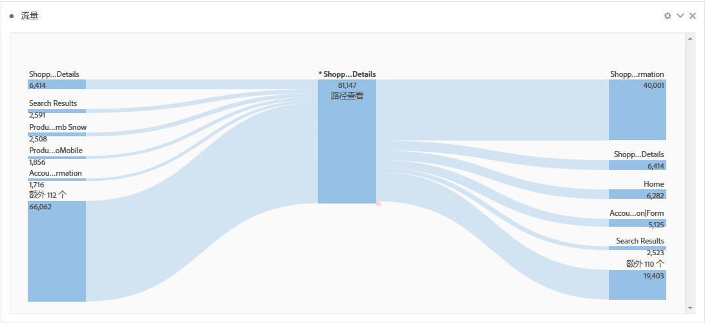
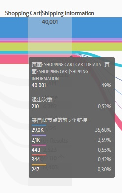
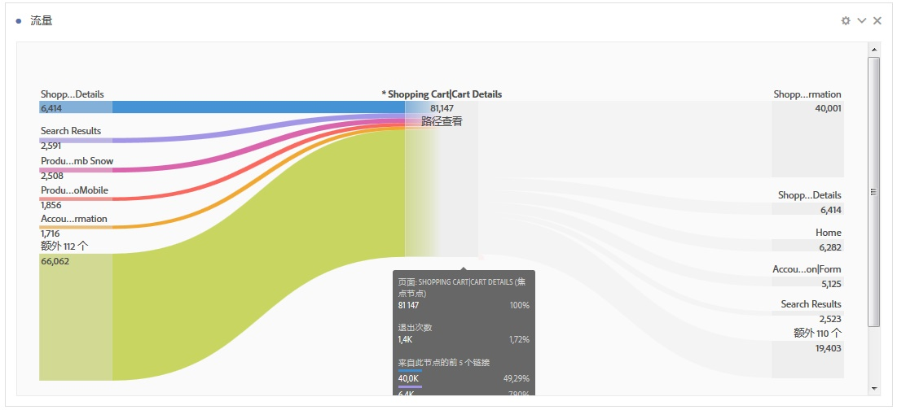
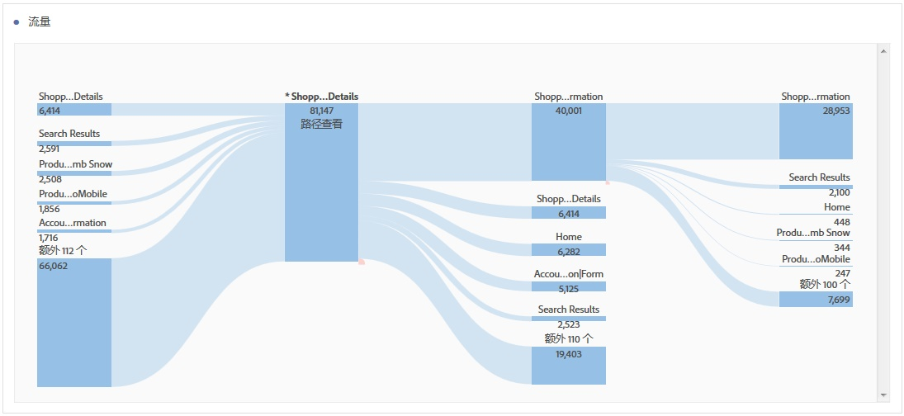

# 配置流可视化

流量允许您跟踪通过页面或维度的路径，如 eVar：

* 登入（仅限维度）
* 维度或项目
* 退出（仅限维度）

其中每种类别在屏幕上都显示为一个“放置区域”。将列表中的项目拖放到所需的放置区域中。页面和其他非维度项目只能放置在中间的放置区域。如果将某个维度放置在中间区域，将自动运行报表，插入该维度排名最前的项目。

在将项目放置到放置区域时，将打开流量图。流量图的内容取决于放置维度或项目的放置区域。“退出”和“登入”显示放置到“登入”或“退出”放置区域的维度（如页面）的所有项目。例如，如果将维度放置到中央的放置区域，将打开该维度对应的流量图。

将鼠标悬停在图表中间位置的“焦点节点”可查看与该节点有关的信息。

流量图是交互式图表。将鼠标置于该图上可更改显示的详细信息。

图表中的路径按比例显示。活动越多，路径越粗。

单击图表中的节点时，将显示该节点的详细信息。例如，如果单击顶部图表右上方的&#x200B;**[!UICONTROL 搜索结果]，将展开该图表，显示有关搜索结果节点的更多详细信息。**&#x200B;再次单击某个节点可折叠该节点。

默认情况下，图表显示前五个流量。如果单击图表底部的&#x200B;**[!UICONTROL 更多]节点，将向下展开该图表，显示另外五个流量。**&#x200B;继续单击&#x200B;**[!UICONTROL 更多]可一直展开，直到没有可显示的其他流量。**

您可以在流量图中浏览的流量数量没有限制。

You can also export and further analyze your Flow diagram as part of a project's .CSV file by going to **[!UICONTROL Project]** &gt; **[!UICONTROL Download CSV]**.
