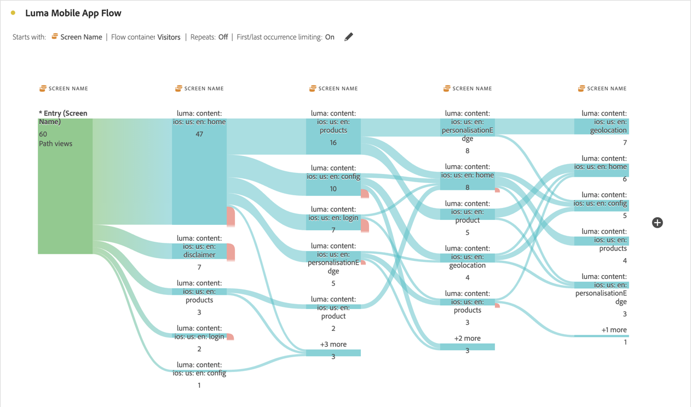

# 维度间流量

通过维度间流量可以跨不同维度查看用户路径。

<!-- 

>[!BEGINSHADEBOX]

See  [Inter-dimensional flows](https://experienceleague.adobe.com/en/docs/analytics-learn/tutorials/analysis-workspace/analyzing-customer-journeys/text-wrapping-and-multi-dimensional-flow){target="_blank"} for a demo video.

>[!ENDSHADEBOX]

-->

本文展示了如何在两种用例中使用此流量：移动应用程序交互和事件，以及营销活动如何推动 Web 访问次数。

## 移动应用程序交互和事件

此示例流量中使用[!UICONTROL 屏幕名称]维度来查看用户如何使用应用程序中的各种屏幕（场景）。 返回的顶部屏幕为 **[!UICONTROL luma: content: ios: en: home]**，即应用程序的主页：

要浏览此应用程序中屏幕和事件类型（如添加到购物车、购买等）之间的交互，请拖放&#x200B;**[!UICONTROL 事件类型]**&#x200B;维度：

* 在流量中任何可用步骤的顶部，替换该维度：

  

* 在当前流量可视化图表之外添加维度：

  

下面的流量可视化图表显示了添加&#x200B;**[!UICONTROL 事件类型]**&#x200B;维度的结果。 该可视化图表可让您洞察移动应用程序用户在将产品添加到购物车、关闭应用程序、展现产品建议等之前是如何在应用程序的各个屏幕之间移动的。

## 营销活动如何推动 Web 访问次数

您想要分析哪些营销活动可以推动网站访问次数。 您可以使用&#x200B;**[!UICONTROL 营销活动名称]**&#x200B;作为维度创建流量可视化图表

您可以用&#x200B;**[!UICONTROL 格式化页面名称]**&#x200B;维度替换最后一个&#x200B;**[!UICONTROL 营销活动名称]**&#x200B;维度，并在流量可视化图表的末端添加另一个&#x200B;**[!UICONTROL 格式化页面名称]**&#x200B;维度。

您可以将光标悬停在任意流量上，以查看更多详细信息。 例如哪些营销活动导致了购物车结账。

