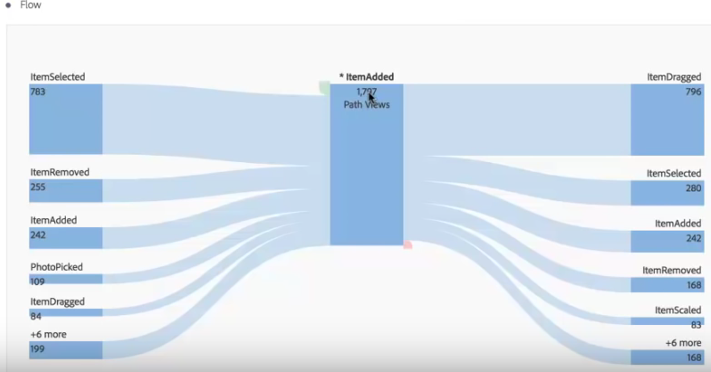

# 三维流动

通过维度间流量可以跨不同维度查看用户路径。

现在每个“流量”列的顶部有一个维度标签，让您在流量可视化图表中使用多个维度时变得更加直观：

我们将讨论 2 个用例：应用程序用例和 Web 用例。

## Use case one: app {#section_3D31D37B9C9F4134AE46C96291E41294}

[!UICONTROL 操作名称]维度已被添加到流量，顶部的返回项目为 [!UICONTROL ItemAdded]：

要探索此应用程序中屏幕/页面和操作之间的交互，您可以将页面维度拖到多个位置，具体取决于您要探索的内容：

* 将它拖到拖放区域的任一末端（在显示的黑框矩形区域内部）以&#x200B;**替换**&#x200B;末端的顶部结果：

    

* 将它拖到末端的空白处（注意黑色存储段）以&#x200B;**添加到**&#x200B;可视化：

   

如果您决定将右列中的 ItemScaled 项目替换为页面维度，即会得到此结果。顶部结果现在更改为页面维度的顶部结果：

现在您可以查看客户是如何在操作和页面间移动的。通过单击不同的节点，可进一步探索流量：

如果您将其他“操作名称”维度添加到可视化的末端，即会发生此情况：

这将允许进行一些深入的分析，并对您分析的应用程序进行可能的更改。

## Use case two: web {#section_8D55983FA0C84926995270052AE01CD8}

此用例显示如何分析哪些促销活动为网站带来最多登入。

将“促销活动名称”维度拖到新流量中：

现在我希望查看这些促销活动将流量推入哪些页面，这样我就能将页面维度拖到流量结果的右侧以添加到可视化：

随后，您可以按其他维度或量度（如收入、访问次数等）划分此结果。
