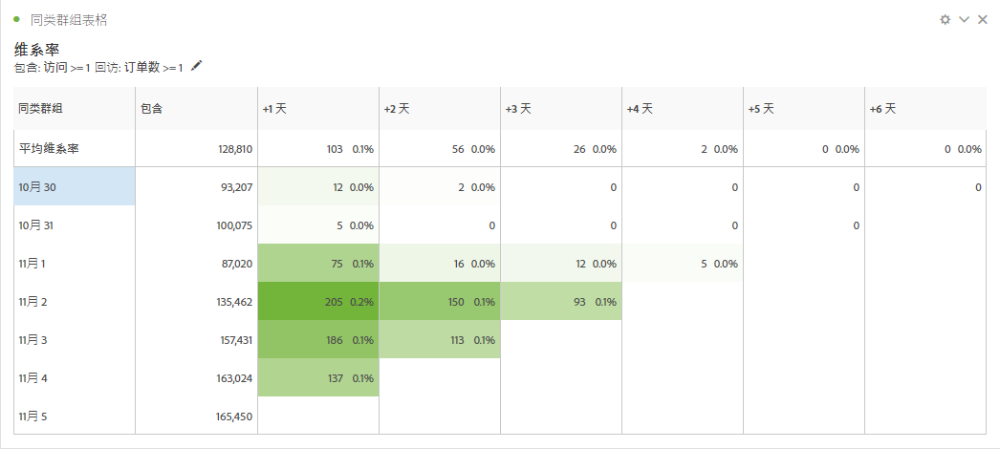
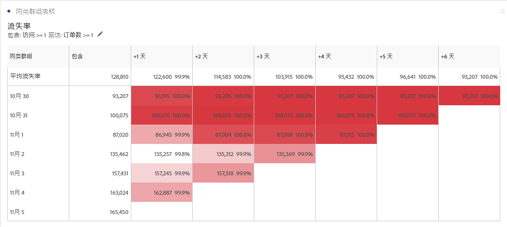
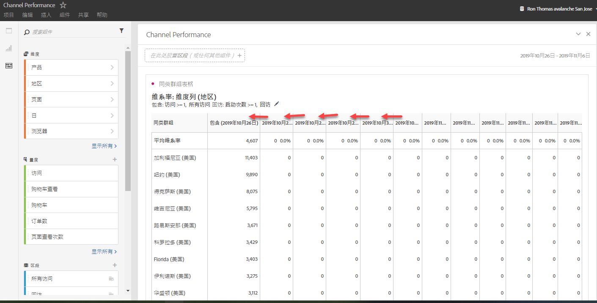
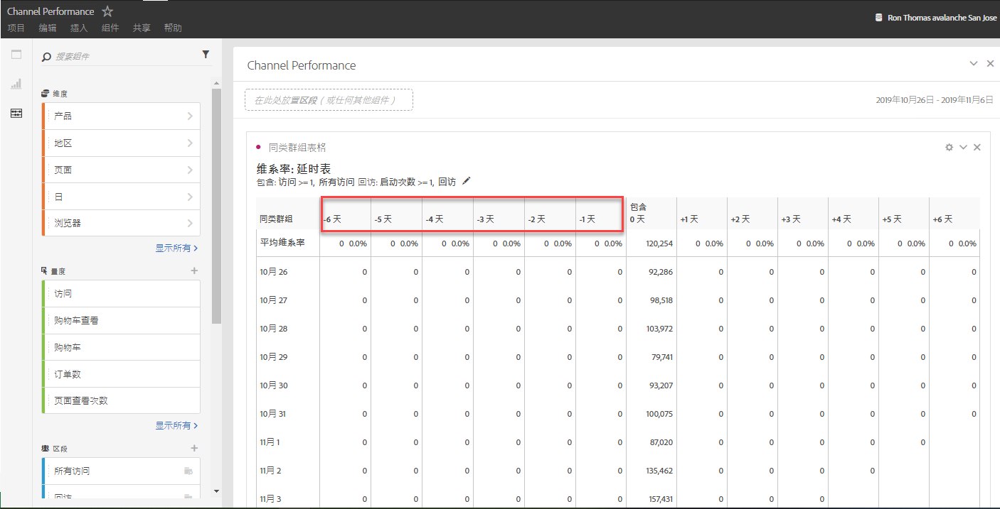
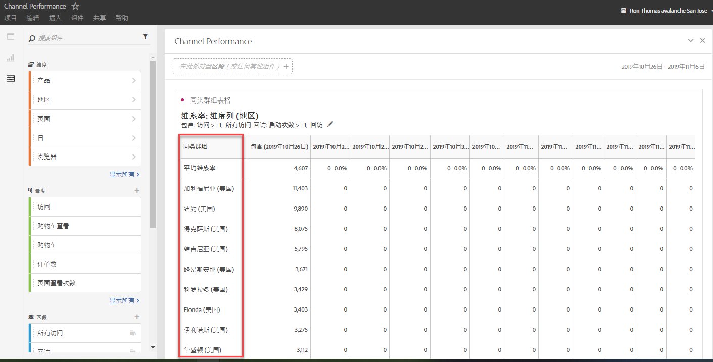

# 什么是队列分析？

A *`cohort`* is a group of people sharing common characteristics over a specified period. 群组分析很有用，例如，当您希望了解某个群组如何与某个品牌互动时。您可以轻松识别趋势中的变化，然后相应地采取回应(Explanations of Cohort Analysis are available on the web, such as at [Cohort Analysis 101](https://en.wikipedia.org/wiki/Cohort_analysis).)

创建队列报表后，您可以组织其组件（特定的维度、量度和区段），然后可以与其他任何人员共享这份队列报表。请参阅[特选和共享](../../../../analyze/analysis-workspace/curate-share/curate.md#concept_4A9726927E7C44AFA260E2BB2721AFC6)。

您可以使用Cochount Analysis执行哪些操作：

* 启动旨在推动所需操作的促销活动。
* 在客户生命周期的恰当时间内转变营销预算。
* 识别终止试用或优惠活动的时间，以实现价值的最大化。
* 获取在一些领域（例如，定价、升级路径等）内进行 A/B 测试的建议。
* 在引导分析报表中查看队列分析报表。
* 识别终止试用或优惠活动的时间，以实现价值的最大化。
* 获取在一些领域（例如，定价、升级路径等）内进行 A/B 测试的建议。

同类群组分析适用于具有 Analysis Workspace 访问权限的所有 Analytics 客户。

[YouTube上的群组分析](https://www.youtube.com/watch?v=kqOIYrvV-co&index=45&list=PL2tCx83mn7GuNnQdYGOtlyCu0V5mEZ8sS) (4：36)

## 群组分析功能

Adobe于2019年月发布了一个新的、大幅增强的群组分析版本。该版本允许对正在构建的同类群组进行更为精细的控制。以下是其特有的增强功能：

### 维系率表

保留同期报告返回访客：每个数据单元格显示在该时间段内执行操作的群组中的原始数据量和访客百分比。您最多可以包含 3 个量度和 10 个区段。

### 流失率表

Curn cohrt是保留表的反向部分，它显示了一段时间内因您的同期群而流失或从未达到的访客。您最多可以包含 3 个量度和 10 个区段。

### 滚动计算

允许您根据前一列而不是所包含的列计算维系率或流失率。

### 延时表

衡量包含事件发生之前和之后经过的时间。此表非常适用于进行事件之前/之后分析。“已包括”列位于该表的中心，而包含事件之前和之后的时间段则分别显示在两侧。

### 自定义维度同类群组

创建基于所选维度的同类群组，而不是默认的基于时间的同类群组。在 Adobe Analytics 中使用营销渠道、促销活动、产品、页面、区域或任何其他维度，可显示维系率根据这些维度值的不同有何变化。

有关如何设置和运行同类群组报表的说明，请转到 [配置同类群组分析报表](/help/analyze/analysis-workspace/visualizations/cohort-table/t-cohort.md).

