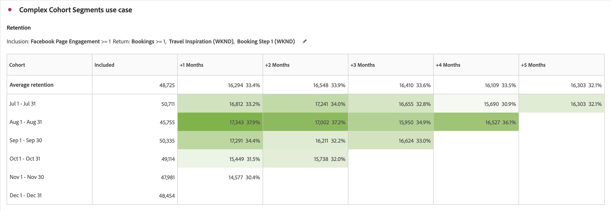

# 同类群组分析用例

本文讨论几个典型用例，在这些用例中，同类群组表有助于为采取下一步操作提供有用的见解。

## 应用程序参与度

假设您要分析安装您应用程序的用户在一段时间内参与应用程序的情况。 用户是否安装了应用程序，此后便不再使用应用程序？ 还是会暂时使用应用程序，然后停止使用该应用程序？ 还是说，随着时间的推移，这些用户会保持参与状态？

您可以创建一个为期六个月的同类群组分析。 在接下来的几个月内，访客不会计为&#x200B;*`engaged`*，除非这些用户进行了会话或至少启动了该应用程序。 [!UICONTROL 同类群组分析]随后会显示使用模式，其中 *`App Install`* 始终出现在第 0 个月。 您可能会注意到无论用户何时安装了应用程序，使用量都在第2个月下降。 利用此分析，可在用户安装应用程序后的第二个月内，向所有用户发送电子邮件或推送消息，提醒他们使用应用程序。

+++ 同类群组表可视化示例

+++

## 订阅

您可以在Adobe.com工作并提供免费的Creative Cloud订阅。 目标是让用户从免费版本升级到30天试用版，最终升级到付费版本。

使用[!UICONTROL 同类群组分析]了解，例如，无论用户是在何时安装的Creative Cloud免费版本，有8%到10%的用户会在第一个月内进行升级。 然后在使用的第二个月升级12-15%。 此后，升级幅度大幅下降：第三个月为4—5 % ，第四个月为3—4 % ，第五个月为1—2 % 。

发现您不希望第三个月就失去潜在客户后，即可设置一个电子邮件促销活动，该活动将在第三个月中期发送给一组抽样用户。 在该营销活动中，您向尚未升级的用户提供$50的优惠券。

几个月后，再次查看您的同类群组分析。 对于在该活动推出后形成的同类群组，在第三个月转化为付费Creative Cloud订阅的百分比从4%到5%上升到13%到14%。 对于自那时起进入第三个月的每个月同类群组而言，这种转换为每个同类群组带来数十万美元的回报。

+++ 同类群组表可视化示例

+++

## 复杂同类群组区段

您可以对一家大型连锁酒店进行分析，该连锁酒店面向多个客户组进行促销活动，并跟踪客户组的绩效情况。 要确定要定位的最佳用户同类群组组，您需要创建非常具体的同类群组。 使用[!UICONTROL 同类群组]表中扩大的[!UICONTROL 包含]和[!UICONTROL 返回]标准可定义具有多个量度和区段的正确同类群组。 此分析可帮助您识别表现不佳的客户群体，以便您可以通过促销和优惠活动来定位他们，以增加预订。

+++ 同类群组表可视化示例

+++

## 采用应用程序版本

您是一家大型保险公司的分析师，该公司通过其移动应用程序推动客户参与。 随着应用程序添加新功能，客户应升级到最新应用程序版本。 您可以使用[!UICONTROL 自定义Dimension]同类群组并排分析和比较应用程序版本，以了解要定位哪个应用程序版本的哪些客户。 此外，您还可以跟踪维系率和流失率，以了解随着时间的流逝，特定应用程序版本是否导致客户不再使用应用程序。 通过移动消息传送工作，您可以重新吸引这些用户，以便用户升级到最新版本以利用最新功能。

+++ 同类群组表可视化示例

+++

## 促销活动粘性

您是一家跨国媒体公司的分析师，该公司通过有针对性的促销活动吸引用户访问其各种平台以提升参与度。 每个平台的广告支出基于客户参与度和维系率。 成功的营销活动对于业务的成功至关重要。 您可以使用[!UICONTROL 同类群组]表中新的[!UICONTROL 自定义Dimension]同类群组功能来并排比较各种促销活动，从而确定哪些促销活动在吸引和留住用户以提高参与度方面最有效。 然后，您可以确定哪些方面有助于促销活动取得成功，并将这些知识应用于其他促销活动，从而提升各种平台的参与度。

+++ 同类群组表可视化示例

+++

## 产品发布

您是一家大型服装retailer的分析师，该品牌拥有许多特定的客户区段，这些客户区段为他们的业务带来了大部分收入。 每个客户细分在设计和创建特定的产品时都考虑到了客户细分。 每次产品上市，您都想知道新产品在一段时间内为各个同类群组提升销售额的幅度。 使用[!UICONTROL 同类群组分析]中新的[!UICONTROL 延迟表]设置，您可以分析给定客户区段在产品上市前和上市后的行为以及带来的收入。 利用这些信息，您可以确定哪些产品正在带来新的收入，哪些产品没有赢得客户的青睐。

+++ 同类群组表可视化示例

+++

## 个人吸引力 — 最忠诚的用户

您是一家大型航空公司的分析师，该公司的大部分成功和收入都来自回头客、忠诚客户。 在许多情况下，忠诚旅客占收益大部分，挽留该等客户对长远成功至关重要。 确定最忠诚、最一致的客户通常比较困难。 但是，使用[!UICONTROL 同类群组分析]中新的[!UICONTROL 滚动计算]设置，您可以分析忠实客户区段，并找出哪些旅客是每月的重复购买者。 然后，您便可以为这些旅客提供奖励和额外待遇，以答谢他们的忠诚。 此外，通过将同类群组类型从维系更改为流失，您还可以确定哪些客户不是回头客。 然后，您可以通过促销活动定位这些区段，以便重新吸引这些客户，这样这些客户以后就仍然保持忠诚度。

+++ 同类群组表可视化示例

+++
