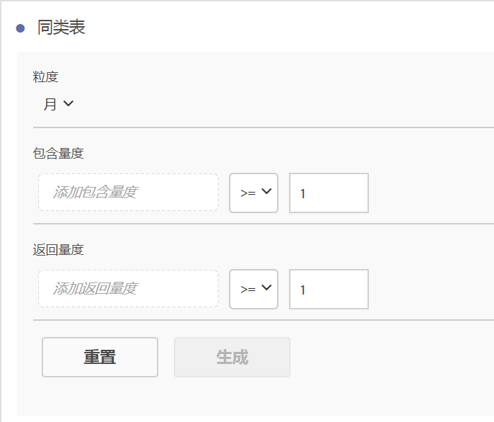
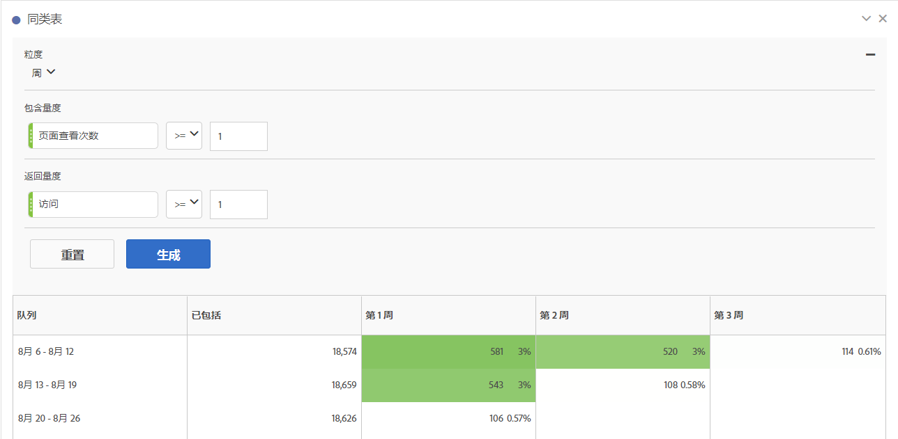

# 配置同类群组分析报表

在Analysis Workspace中创建群组并运行同期分析报告。

1. In Analysis Workspace, click the **[!UICONTROL Visualizations]** icon in the left rail and drag a **[!UICONTROL Cohort Table]** to the canvas.

   

1. Define the **[!UICONTROL Inclusion Criteria]**, **[!UICONTROL Return Criteria]**, **[!UICONTROL Cohort Type]**, and **[!UICONTROL Settings]** as defined in the table below.

| 元素 | 描述 |
|--- |--- |
| **[!UICONTROL 包含标准]** | 您最多可以应用 10 个包含区段和 3 个包含量度。该量度指定了哪些内容将用户放入某个编解码器中。例如，假设包含量度是“订单”，那么只有在同类群组分析的时间范围内下达了订单的用户才会包含在初始同类群组中。 这些量度之间的默认运算符是 AND，但您可以将其更改为 OR。此外，您还可以为这些量度添加数字过滤。例如：“访问次数 &gt;= 1”。  |
| **[!UICONTROL 回访标准]** | 您最多可以应用 10 个回访区段和 3 个回访量度。回访量度指示用户是已维系还是流失。例如，假设回访量度是“视频查看”，那么只有在后续时间范围（即，当用户添加到同类群组后的时间期限）内查看了视频的用户才会显示为已维系。另一个符合维系要求的量度是“访问”。 |
| **[!UICONTROL 粒度]** | 由“天”、“周”、“月”、“季度”或“年”组成的时间粒度。 |
| **[!UICONTROL 类型]** | ****&#x200B;维系率（默认）：维系率同类群组衡量一段时间内同类访客回访您的资产的程度。这是我们一直拥有的标准同类群组，该同类群组指示用户的回访和重复行为。维系率同类群组在表格中以绿色指示。 **[!UICONTROL 流失]**：某个客户流失(也称为“流失”或“流失”)同期可衡量访客同期群流失的情况。流失率 = 1 - 维系率。流失率会显示客户有多久没有回访，从而可以很好地衡量吸引力和商机。您可以使用流失来分析和识别焦点区域：哪些同期群可以引起注意。A Churn Cohort is indicated by the color red in the table (similar to fallout in our **[!UICONTROL Flow]** visualization).  |
| **[!UICONTROL 设置]** | **[!UICONTROL 滚动计算]**：根据前一列而不是“已包括”列（默认）计算维系率或流失率。滚动计算会更改“回访”时段的计算方法。常规计算会单独查找符合“回访”标准且包含在包含时段的用户，而不论他们是否在上一时段的同类群组中。相反，滚动计算会查找符合“回访”标准且包含在上一时段的用户。因此，滚动计算会过滤并筛分出一段时间内持续满足“回访”标准的用户。回访标准将应用于选定时段之前的每个时段。  **[!UICONTROL 延时表]**：延时表衡量包含事件发生之前和之后经过的时间。延时表非常适用于进行事件之前/之后分析。例如，如果您即将推出某个产品或某项促销活动，并且您想跟踪在推出之前的行为，并查看在推出之后的效果，延时表可并排显示推出前后的行为，以供查看直接影响。延时表中的预包含单元格是按以下方式计算的用户：在包含时段内符合“包含”标准，然后在包含时间之前的时段内符合“回访”标准。请注意，延时表和自定义维度同类群组不能一起使用。  **[!UICONTROL 自定义维度同类群组]**：创建基于所选维度的同类群组，而不是基于时间的同类群组（默认）。许多客户想要按时间以外的其他方式分析他们的同类群组，现在，通过新的自定义维度同类群组功能，可以灵活地根据他们所选的维度构建同类群组。在 Adobe Analytics 中使用营销渠道、促销活动、产品、页面、区域或任何其他维度，可显示维系率根据这些维度值的不同有何变化。“自定义维度队列”区段定义仅将维度项目作为包含时段的一部分应用，而不是作为返回定义的一部分应用。  选择自定义维度同类群组选项后，您可以将所需的任何维度拖放到拖放区域中。这允许您比较同一时段内的类似维度项目。例如，您可以并排比较城市、产品、促销活动等的性能。这会返回您的前 14 个维度项目。但是，您可以使用过滤器（通过悬停在拖动的维度右侧即可访问）仅显示所需的维度项目。自定义维度同类群组不能与延时表功能一起使用。  |

1. Adjust the **[!UICONTROL Cohort Table Settings]** by clicking the gear icon.

||设置||描述||
||仅显示百分比||删除数字值，只显示百分比。||
||四舍五入到最近的整个整数||将百分比值舍入到最近的整数，而不是显示小数点值。||
||显示平均百分比行||在表顶部插入新行，然后在每个列中添加值的平均值。|

## 构建“Cohoot Analysis”报告

1. Click **[!UICONTROL Build]**.

   

   The report shows visitors who placed an order ( *`Included`* column), and who returned to your site in subsequent visits. 随着时间的推移，当出现访问次数减少时，该报表可帮助您查明问题并采取相应的措施。
1. （可选）根据选定的内容创建区段。

   Select cells (contiguous or noncontiguous), then right-click &gt; **[!UICONTROL Create Segment From Selection]**.

1. In the [Segment Builder](https://marketing.adobe.com/resources/help/en_US/analytics/segment/?f=seg_build), further edit the segment, then click **[!UICONTROL Save]**.

   保存后的区段可以用在 Analysis Workspace 的“[!UICONTROL 区段]”面板中。
1. 命名并保存同类群组项目。
1. (Optional) [Curate and share](../../../../analyze/analysis-workspace/curate-share/curate.md#concept_4A9726927E7C44AFA260E2BB2721AFC6) the project components.

   >[!NOTE]
   >
   >您必须在特选之前保存项目。

