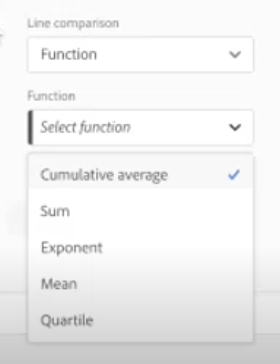

# 组合图表 {#combo}

<!-- markdownlint-disable MD034 -->

>[!CONTEXTUALHELP]
>id="workspace_combo_button"
>title="组合"
>abstract="快速创建可视化组合图表，无需先创建自由格式表。"

<!-- markdownlint-enable MD034 -->

>[!BEGINSHADEBOX]

*本文记录了&#x200B;**Adobe Analytics**中的组合可视化图表。 查看此文章的&#x200B;**Customer Journey Analytics**版本的[组合](https://experienceleague.adobe.com/en/docs/analytics-platform/using/cja-workspace/visualizations/combo-charts)。*

>[!ENDSHADEBOX]

通过[!UICONTROL 组合图表]可视化，可轻松快速地构建比较可视化图表，而无需先构建表格。您可以通过线条/条形组合轻松查看数据趋势。

使用[!UICONTROL 组合图表]：

* 将本周的订单与上个月（和去年）同一时间的订单进行比较 – 只需点击几下即可。

* 在同一张图表上快速分析和比较多个量度（例如[!UICONTROL 独特访客数]和[!UICONTROL 收入]）。

* 在一段时间内针对某个函数（例如[!UICONTROL 累积平均数]）分析量度。

请牢记这一点：

* 您可以在单个[!UICONTROL 组合图表]中添加多个比较。
* 如果添加一个或多个比较，则它们必须是同一类型，例如[!UICONTROL 时间比较]。
* 最多可添加 5 个比较。
* 您最多可以为一个量度应用 3 个过滤器（区段）。
* 组合图表中不支持计算指标。

## 构建组合图表

1. 从左侧栏的“可视化”下拉列表中，将[!UICONTROL 组合图表]可视化拖动到空面板中。

   

1. 从下拉列表中，为 X 轴选择一个维度，为 Y 轴选择一个量度。

1. 选择您要使用的[!UICONTROL 线形比较]的类型。

   | 线形比较类型 | 定义 |
   | --- | --- |
   | **[!UICONTROL 时间比较]** | 最常见的比较类型 – 例如，将此时间段与 4 周前进行比较。如果您选择了[!UICONTROL 时间比较]，则对要比较的时间段进行二次选择。
 |
   | **[!UICONTROL 函数]** | 您可以在比较中引入函数（例如[!UICONTROL 平均值]）。请参阅下面的支持函数列表。
 |
   | **[!UICONTROL 辅助量度]** | 例如，您可以将[!UICONTROL 收入]与另一个量度进行比较。
 |

   {style="table-layout:auto"}

1. 单击&#x200B;**[!UICONTROL 生成]**。

   输出将类似于下面这样：

   

   当前时期以条形图显示，对比时期以线形图表示。线形图上的点被称为“条形铃”。

## 支持的函数

如果您选择&#x200B;**[!UICONTROL 函数]**&#x200B;作为[!UICONTROL 线形比较类型]，则将返回您已选择的量度的函数。

| 函数 | 定义 |
| --- | --- |
| **[!UICONTROL 列总和]** | 在列中添加量度的所有数值（跨维度的元素） |
| **[!UICONTROL 累积平均数]** | 返回最后 N 行的平均数。 |
| **[!UICONTROL 中间值]** | 返回列中某量度的中间值。中间值是指位于一组数字正中间的那个数字，也就是说有一半数字的值大于或等于该中间值，还有一半数字的值小于或等于该中间值。 |
| **[!UICONTROL 累积数]** | N 行的累积总和。 |
| **[!UICONTROL 列最大值]** | 返回某量度列的一组维度元素中的最大值。 |
| **[!UICONTROL 平均值]** | 返回某度量的算术平均值或平均值。 |
| **[!UICONTROL 列最小值]** | 返回某量度列的一组维度元素中的最小值。 |

{style="table-layout:auto"}

以下是“收入”量度的累积平均值的示例：

以下是使用了累积平均值和均值函数的组合图的示例：

## 组合图表设置

单击组合图表右上角的齿轮图标以更改其设置。

| 设置 | 定义 |
| --- | --- |
| **[!UICONTROL 可视化类型]** | 让您切换到另一种可视化类型。 |
| **[!UICONTROL 粒度]** | 对于趋势性的可视化图表，您可以从该下拉列表中更改时间粒度（日、周、月等）。 |
| **[!UICONTROL 常规]** |  |
| **[!UICONTROL 百分比]** | 显示百分数值。 |
| **[!UICONTROL 图例可见]** | 允许您为组合图表可视化隐藏详细的图例文本。 |
| **[!UICONTROL 限制最大项目数]** | 减少 X 轴上的项目数。如果您有一个大数据集，则可能只显示前 10 个项目（或您选择的任何值）。 |
| **[!UICONTROL 叠加]** | 显示或隐藏线形上的条形铃。 |
| **[!UICONTROL 轴]** | |
| **[!UICONTROL 显示双轴]** | 仅适用于具有两个量度的情况，可以在左（用于一个量度）、右（用于另一个量度）两边各有一个 y 轴。在所绘制量度的数量级差别很大时，此项非常有用。双轴颜色与表格的颜色相匹配，除非有多个比较。在这种情况下，所有比较的颜色都是灰色的。 |
| **[!UICONTROL 标准化]** | 要求所有量度按等比例计算。在所绘制量度的数量级差别很大时，此项非常有用。 |
| **[!UICONTROL 显示 X 轴]** | 显示 X 轴或隐藏它。 |
| **[!UICONTROL 显示 Y 轴]** | 显示 Y 轴或隐藏它。 |
| **[!UICONTROL 将 Y 轴固定在 0]** | 如果图表上绘制的所有值都远远大于零，则图表默认会将 y 轴底部设置为非零值。如果选中此框，y 轴将被强制设置为零（并将重新绘制图表）。 |

{style="table-layout:auto"}
