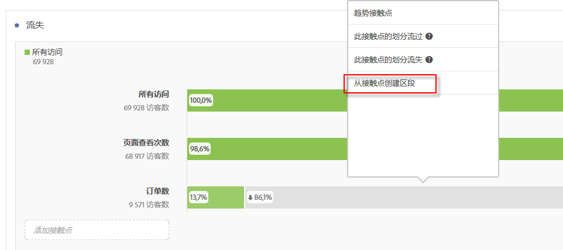
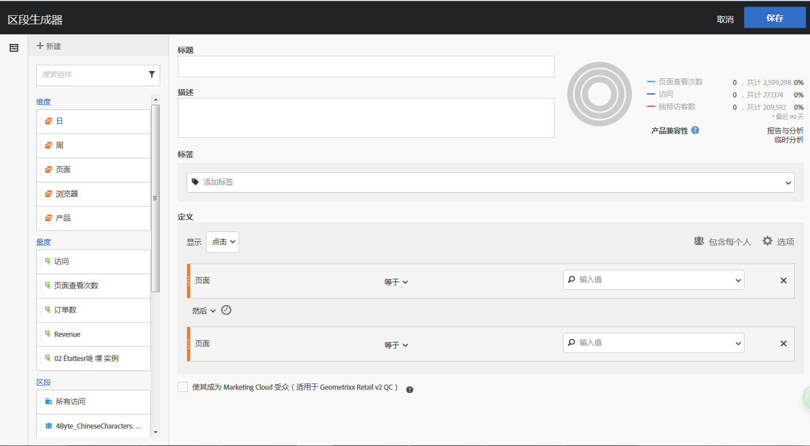
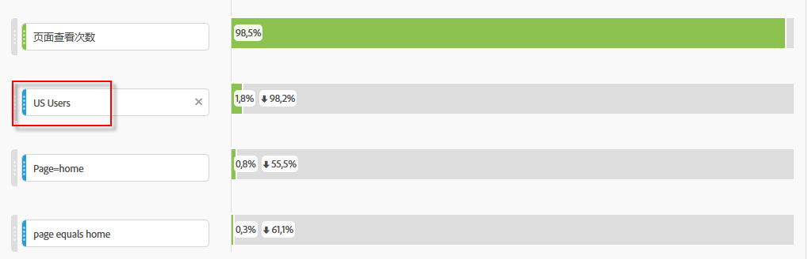
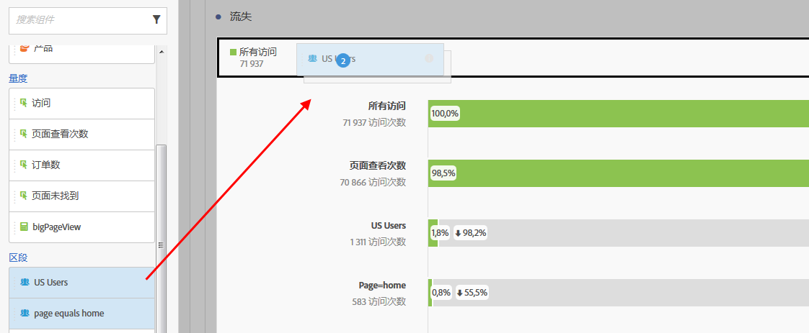
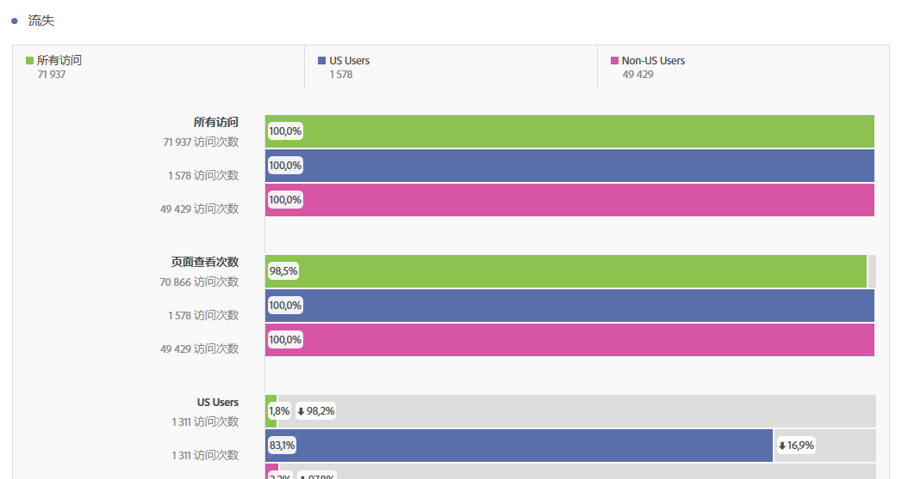

# 在流失分析中应用细分

您可以在 Analysis Workspace 中从接触点创建区段、添加区段作为接触点，并比较多个区段之间的关键工作流程。

>[!IMPORTANT]
>用作流失检查点的区段必须使用比流失可视化的整体上下文更低的容器。通过访客上下文流失，用作检查点的区段必须访问或基于点击区段。通过访问上下文流失，用作检查点的区段必须是基于点击的区段。如果您使用无效组合，则流失将为100%。我们为将不兼容区段添加为触点时将显示的流失可视化添加了警告。某些无效区段容器组合将导致无效的流失图表，如

>* 在访客上下文流失可视化图表中使用基于访客的区段作为接触点
>* 在访问上下文流失可视化图表中使用基于访客的区段作为接触点
>* 在访问上下文流失可视化图表中使用基于访问的区段作为接触点

## Create a segment from a touchpoint {#section_915E8FBF35CD4F34828F860C1CCC2272}

1. 首先，从特定的接触点创建一个您特别感兴趣，并且可以应用至其他报表的区段。You do this by right-clicking the touchpoint and selecting **[!UICONTROL Create segment from touchpoint]**.

   

   区段生成器即会打开，并预先填充匹配选定接触点的预置序列区段：

   

1. 为该区段提供一个标题和描述，然后保存它。

   您现在可以在您需要的任意报表中使用此区段。

## Add a segment as a touchpoint {#section_17611C1A07444BE891DC21EE8FC03EFC}

例如，如果您要查看您的美国用户趋势及其是如何影响流失的，只需将美国用户区段拖到流失中：

或者，您也可以将美国用户区段拖到另一检查点中，以此来创建一个 AND 接触点。

## Compare segments in fallout {#section_E0B761A69B1545908B52E05379277B56}

您可以在“流失”可视化中比较任意区段数量。

1. 从左侧的[!UICONTROL 区段]边栏中选择要比较的区段。在我们的示例中，我们已选择了 2 个区段：美国用户和非美国用户。
1. 将它们拖到顶部的区段拖放区域中。

   

1. 可选：您可以保留“所有访问”作为默认容器，或者删除它。

   

1. 您现在可以比较两个区段间的流失，例如一个区段在哪些方面超过另一区段，或者其他分析。

