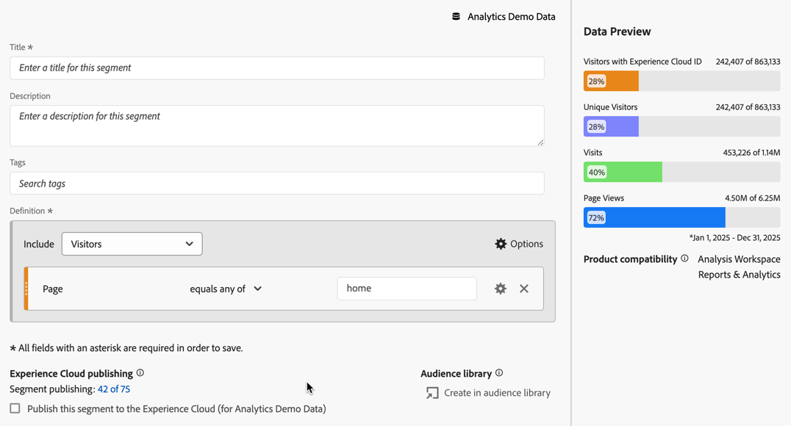
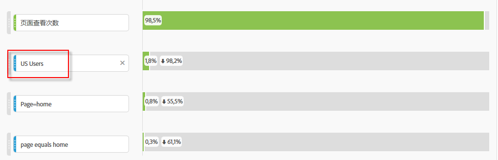

# 在流失分析中应用区段

您可以在 Analysis Workspace 中从接触点创建区段、添加区段作为接触点，并比较多个区段之间的关键工作流程。

>[!IMPORTANT]
>
>用作流失中检查点的区段必须使用级别低于流失可视化图表整体上下文的容器。 对于访客上下文流失，用作检查点的区段必须是基于访问或基于点击的区段。 对于访问上下文流失，用作检查点的区段必须是基于点击的区段。 如果您使用的组合无效，则流失率将为 100%。 将不兼容的区段添加为接触点时，流失可视化图表中会显示警告。 某些无效的区段容器组合会导致无效的流失图表，例如：
>
>* 在访客上下文流失可视化图表中使用基于访客的区段作为接触点。
>* 在访问上下文流失可视化图表中使用基于访客的区段作为接触点。
>* 在访问上下文流失可视化图表中使用基于访问的区段作为接触点。
>

## 从接触点创建区段

1. 从特定的接触点创建一个您特别感兴趣，并且可以应用至其他报表的区段。 为此，请右键单击接触点并选择&#x200B;**[!UICONTROL 从接触点创建区段]**。

   

   区段生成器即会打开，并预先填充与您选择的接触点匹配的预置连续区段：

   

1. 为区段提供标题和描述，然后保存它。

   您现在可以在所需的任何项目中使用此区段。

## 添加区段作为接触点

例如，如果您要查看移动设备应用程序点击量趋势及其如何影响流失，只需将移动设备应用程序点击量区段拖动到流失中：

或者，您也可以通过将移动设备应用程序点击量区段拖动到其他检查点来创建AND接触点。

## 在流失中比较区段

您可以在“流失”可视化图表中比较任意区段数量。 （请注意，以下视频说明最多可以比较3个区段，这是错误的。）

1. 从左侧的[!UICONTROL 区段]面板中选择要比较的区段。 在示例中选择了两个区段：**[!UICONTROL iOS]**&#x200B;和&#x200B;**[!UICONTROL Android]**。
1. 将三个区段拖到可视化图表顶部的区段拖放区域。

   

1. 可选：您可以保留&#x200B;*所有人员*&#x200B;作为默认容器，或者删除该容器。

1. 您现在可以比较三个区段之间的流失，例如一个区段在哪些方面表现优于另一个区段，或者其他分析。
