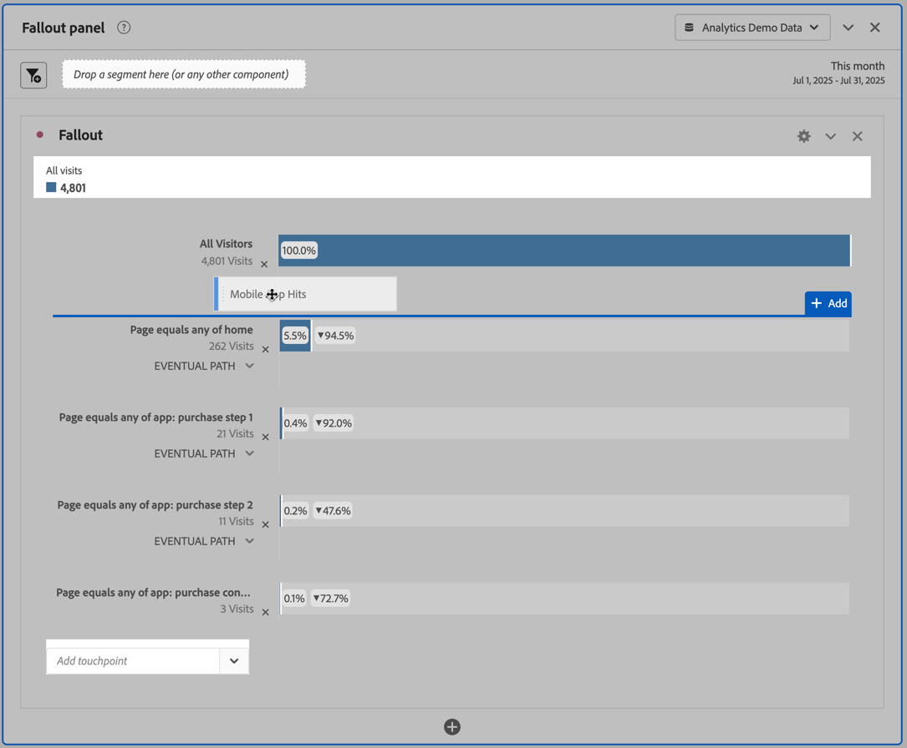

# 在流失分析中应用区段

您可以在 Analysis Workspace 中从接触点创建区段、添加区段作为接触点，并比较多个区段之间的关键工作流程。

>[!IMPORTANT]
>
>用作流失中检查点的区段必须使用级别低于流失可视化图表整体上下文的容器。对于访客上下文流失，用作检查点的区段必须是基于访问或基于点击的区段。对于访问上下文流失，用作检查点的区段必须是基于点击的区段。如果您使用的组合无效，则流失率将为 100%。我们为流失可视化图表添加了警告，当您添加不兼容的区段作为接触点时，将显示该警告。某些无效的区段容器组合会导致无效的流失图表，例如：

* 在访客上下文流失可视化图表中使用基于访客的区段作为接触点
* 在访问上下文流失可视化图表中使用基于访客的区段作为接触点
* 在访问上下文流失可视化图表中使用基于访问的区段作为接触点

## 从接触点创建区段 {#section_915E8FBF35CD4F34828F860C1CCC2272}

1. 从特定的接触点创建一个您特别感兴趣，并且可以应用至其他报表的区段。为此，请右键单击接触点并选择&#x200B;**[!UICONTROL 从接触点创建区段]**。

   

   区段生成器即会打开，并预先填充匹配选定接触点的预置序列区段：

   

1. 为该区段提供一个标题和描述，然后保存它。

   您现在可以在您需要的任意报表中使用此区段。

## 添加区段作为接触点 {#section_17611C1A07444BE891DC21EE8FC03EFC}

例如，如果您要查看您的美国用户趋势及其是如何影响流失的，只需将美国用户区段拖到流失中：

或者，您也可以将美国用户区段拖到另一检查点中，以此来创建一个 AND 接触点。

## 在流失中比较区段 {#section_E0B761A69B1545908B52E05379277B56}

您可以在“流失”可视化图表中比较任意区段数量。（请注意，以下视频说明最多可以比较3个区段，这是错误的。）

以下是一段关于比较流失中的各个区段的视频：

>[!VIDEO](https://video.tv.adobe.com/v/24046/?quality=12)

1. 从左侧的[!UICONTROL 区段]边栏中选择要比较的区段。在我们的示例中，我们已选择了 2 个区段：美国用户和非美国用户。
1. 将它们拖到顶部的区段拖放区域中。

   

1. 可选：您可以保留“所有访问”作为默认容器，或者删除它。

   

1. 您现在可以比较两个区段间的流失，例如一个区段在哪些方面超过另一区段，或者其他分析。
