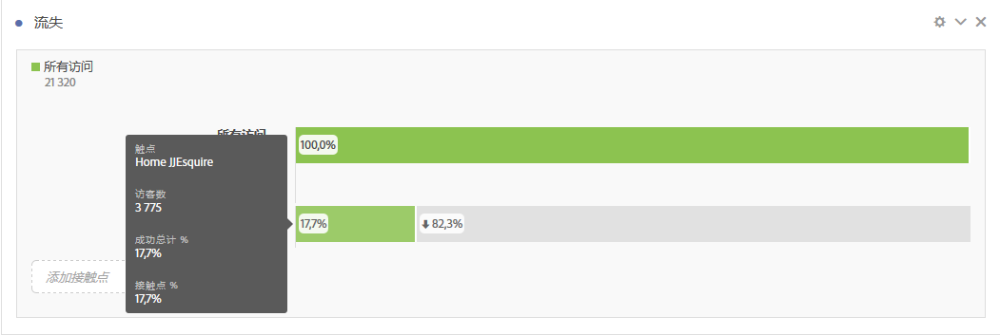
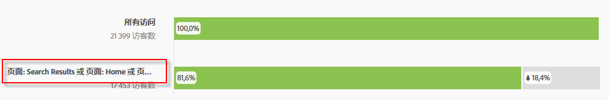
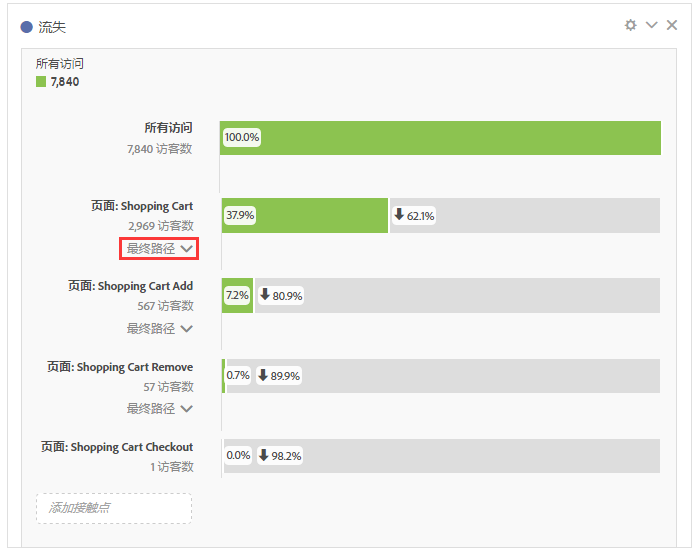

# 配置流失可视化

您可以指定接触点以创建多维度流失序列。通常，接触点就是网站中的某个页面。但是，接触点并不仅限于页面。例如，您可以添加事件，如件数及独特访客和回访。也可以添加维度，如类别、浏览器类型或内部搜索词。

甚至可以在接触点内添加区段。例如，您可能需要比较区段，如 iOS 和 Android 用户。请将所需区段拖动到流失顶部，并将与这些区段有关的信息添加到流失报表中。如果要仅显示这些区段，可以删除“所有访问”基准值。

对于可添加的步骤数量或可使用的维度数量，没有任何限制。

您可以对 eVar 执行路径分析，包括促销 eVar 和 [listVar](https://experienceleague.adobe.com/docs/analytics/implementation/vars/page-vars/page-variables.html?lang=zh-Hans)（每个点击可以具有多个值的变量，如产品、listVar、促销 eVar 和列表属性）。例如，假设某个用户在一个页面上查看鞋和衬衫，而在另一个页面上查看衬衫和袜子。鞋的下一个产品流量报表将是衬衫和袜子，而不是衬衫。

1. 将“[!UICONTROL 流失]”可视化从“可视化”下拉菜单中拖动到“[!UICONTROL 自由格式表]”中。

1. 将页面维度拖动到自由格式表中，然后从此处将某个页面（在本例中为 Home — JJEsquire）拖动到&#x200B;**[!UICONTROL 添加接触点]**&#x200B;字段，作为第一个接触点。

   

   将鼠标悬停在某个接触点上会看到流失和与该级别有关的其他信息，如接触点的名称、该接触点的访客数，同时还可以看到该接触点的成功率（以及将成功率与其他接触点进行比较）。

   条形图灰色部分中的带圆圈数字显示接触点之间的流失（而不是到该点的整体流失）。在流失报表中，接触点 % 显示从前一步骤到当前步骤的成功流过。

   您还可以向流失报表中添加一个页面而不是整个维度。单击页面维度上的向右箭头“>”可选取要添加到流失报表中的特定页面。

1. 继续添加接触点，直到您的序列完成。

   您可以通过将一个或多个其他接触点拖动到某个接触点上，来&#x200B;**合并多个接触点**。

   >[!NOTE]
   >
   >多个区段通过 AND 相连，而多个项目（如维度项）和量度通过 OR 相连。

   

1. 您还可以将路径中的各个接触点&#x200B;**限制在下一次点击**（而不是“最终”）。每个接触点下方都有一个选择器，其中包含“最终路径”和“下一次点击”选项，如下所示：

   

<table id="table_A91D99D9364B41929CC5A5BC907E8985"> 
 <tbody> 
  <tr> 
   <td colname="col1"> 
最终路径 
 
(默认) 
 </td> 
   <td colname="col2"> 
当访客最终到达路径中的下一个接触点时，就会计入访客（或访问）。允许在接触点之间绕道。 
 </td> 
  </tr> 
  <tr> 
   <td colname="col1"> 
下一次点击 
 </td> 
   <td colname="col2"> 
一旦访客到达路径中的下一个接触点，就会计入访客（或访问）。下一次点击包括任何点击类型（页面查看或链接）。禁止在接触点之间绕道。 
 </td> 
  </tr> 
 </tbody> 
</table>

## 流失设置 {#section_0C7C89D72F0B4D6EB467F278AC979093}

| 设置 | 描述 |
|--- |--- |
| 流失容器 <ul><li>访问</li><li>访客</li></ul> | 用于在“访问”和“访客”之间切换以分析访客路径。默认值为“访客”。这些设置可帮助您在访客级别（跨访问）了解访客参与程度，或将分析限定于单次访问。 |

当您&#x200B;**右键单击某个接触点**&#x200B;时，将会显示以下选项：

| 选项 | 描述 |
|--- |--- |
| 显示接触点趋势 | 在预先生成了一些异常检测数据的折线图中查看接触点的趋势数据。 |
| 显示接触点趋势 (%) | 显示总流失百分比趋势。 |
| 显示所有接触点趋势 (%) | 在同一个图表中显示流失中的所有接触点百分比趋势（如果包括“所有访问”，则将其排除）。 |
| 划分此接触点的流过 | 查看访客在两个接触点（此触点和下一个触点）之间的行为（如果他们继续到下一个触点）。这会创建一个自由格式表来显示您的维度。您可以替换表的维度和其他元素。 |
| 划分此接触点的流失 | 查看未通过漏斗的人员在选定步骤后立即做了些什么。 |
| 从接触点创建区段 | 从选定的接触点创建新区段。 |
