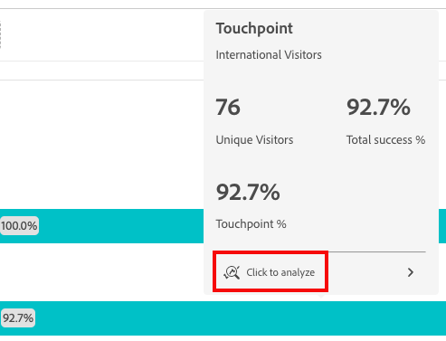

# 配置流失可视化图表

您可以指定&#x200B;**接触点**&#x200B;以创建多维度流失序列。 在许多情况下，接触点是您网站上的页面。 但是，接触点并不限于页面。 例如，您可以添加事件，如单位及独特人员和回访。您还可以添加维度，例如类别、浏览器类型或内部搜索词。

您甚至可以在接触点中添加区段。 例如，您可能需要比较区段，如iOS用户和Android用户。 请将所需区段拖动到流失顶部，并将与这些区段有关的信息添加到流失报告中。如果要仅显示这些区段，您可以移除“所有访问”基准值。

流失可视化图表对可添加的接触点数量或可使用的组件数量没有限制。

您可以对维度、量度和区段进行路径规划。例如，假设某人正在一个页面上查看`shoes, shirt`，而在下一个页面上查看`shirt, socks`。 鞋的下一个产品流量报告将是衬衫和袜子，而不是衬衫。

## 使用

1. 添加  **[!UICONTROL 流失]**&#x200B;可视化图表。请参阅[将可视化图表添加到面板](../freeform-analysis-visualizations.md#add-visualizations-to-a-panel)。

1. 将组件拖到&#x200B;**[!UICONTROL 添加接触点]**&#x200B;下拉菜单。

   >[!TIP]
   >
   >您可以在流失报表中添加单个页面，而不是整个维度。 在页面维度上单击向右箭头以选取要添加到流失报表的特定页面，如&#x200B;**[!UICONTROL home]**。

   

1. 继续添加接触点，直到您的序列完成。

   条形图灰色部分中的带圆圈数字显示接触点之间的流失（而不是到接触点的整体流失）。栏的绿色部分中的圆圈数字显示从上一个接触点到当前接触点的成功流失。

   

   添加接触点时，您可以执行以下任一操作：

   * 通过将一个或多个附加组件拖动到单个接触点来组合多个组件。

     >[!NOTE]
     >
     >多个区段通过 AND 相连，而多个项目（如维度项）和量度通过 OR 相连。

   * 通过将接触点拖到流失层次结构中的不同级别来重新排序接触点。

   * 通过将一个接触点拖动到另一个接触点来组合两个接触点。 当您看到&#x200B;**[!UICONTROL 合并]**&#x200B;一词时，请放置接触点。

   * 将路径中的各个接触点限制为下一次点击（而不是&#x200B;*最终*）。 在每个接触点下方，有一个选择器，带有选项&#x200B;**[!UICONTROL 最终路径]**&#x200B;和&#x200B;**[!UICONTROL 下一次点击]**，如下所示：

     | 选项 | 描述 |
     |---|---|
     | **[!UICONTROL 最终路径]**（默认） | 计入的访客最终&#x200B;*将*&#x200B;登陆路径中的下一页，但不一定是在下次访问时。 |
     | **[!UICONTROL 下一个点击]** | 访客经过计数，将在下一次点击时登陆路径中的下一页。 |

   * 将鼠标悬停在接触点上可查看流失和有关该级别的其他信息。 信息包括接触点的名称、人员计数和成功率。 您还可以将成功率与其他接触点进行比较。

## 设置

以下可视化设置可供使用：

| 流失容器 | 描述 |
|--- |--- |
| **[!UICONTROL 访问次数]**&#x200B;或&#x200B;**[!UICONTROL 访问次数]** | 在[!UICONTROL 访问]和[!UICONTROL 访客]之间切换以分析人员路径。 默认值为[!UICONTROL 访客]。 这些设置可帮助您在访客级别（跨访问）了解访客参与程度，或将分析限定于单次访问。 |

## 上下文菜单

作为可视化图表的一部分，可以使用特定上下文菜单选项。

### 访问上下文菜单

您可以通过以下任一方式访问上下文菜单：

* 将鼠标悬停在可视化图表中的接触点上，然后选择&#x200B;**[!UICONTROL 单击以分析]**。

  

* 右键单击可视化图表中的接触点。

  

### 上下文菜单选项

可以使用以下上下文菜单选项：

| 选项 | 描述 |
|--- |--- |
| **[!UICONTROL 显示接触点趋势]** | 在预先生成了一些异常检测数据的线形图中查看接触点的趋势数据。 |
| **[!UICONTROL 显示接触点趋势（%）]** | 显示总流失百分比趋势。 |
| **[!UICONTROL 显示所有接触点趋势（%）]** | 在同一图表上显示流失中所有接触点百分比的趋势（如果包含&#x200B;**[!UICONTROL 所有访客]**，则将其排除）。 |
| 在此接触点上&#x200B;**[!UICONTROL 划分流过]** | 查看访客在两个接触点（此触点和下一个触点）之间的行为（如果他们继续到下一个触点）。此选项会创建一个自由格式表，其中显示您的维度。 可以替换表的尺寸和其他元素。 例如，一个标记为&#x200B;**[!UICONTROL 流过：所有访客>页面等于任何主页]**，并包含&#x200B;**[!UICONTROL 页面]**&#x200B;作为维度以及按&#x200B;**[!UICONTROL 仅用于项目的快速区段]**&#x200B;分段的[独特访客](/help/components/segmentation/segmentation-workflow/seg-quick.md)作为量度的表。**[!UICONTROL 流过：所有访客>页面等于任何主页]**。 检查区段以了解如何确定流过区段。 |
| **[!UICONTROL 此接触点的划分流失]** | 查看未通过funnel的访客在选定步骤后立即做了些什么。 此选项会创建一个自由格式表，其中显示您的维度。 可以替换表的尺寸和其他元素。 例如，一个标记为&#x200B;**[!UICONTROL 流失：所有访客>页面等于任何主页]**，并包含&#x200B;**[!UICONTROL 页面]**&#x200B;作为维度以及按&#x200B;**[!UICONTROL 仅用于项目的快速区段]** [流过：所有访客>页面等于任何主页](/help/components/segmentation/segmentation-workflow/seg-quick.md)区段分段的&#x200B;**[!UICONTROL 独特访客]**&#x200B;作为量度的表。 检查区段以了解如何确定流失区段。 |
| **[!UICONTROL 从接触点创建区段]** | 从选定的接触点创建新区段。 |

>[!MORELIKETHIS]
>
>[将可视化图表添加到面板](/help/analyze/analysis-workspace/visualizations/freeform-analysis-visualizations.md#add-visualizations-to-a-panel)
>[可视化图表设置](/help/analyze/analysis-workspace/visualizations/freeform-analysis-visualizations.md#settings)
>[可视化图表上下文菜单](/help/analyze/analysis-workspace/visualizations/freeform-analysis-visualizations.md#context-menu)
>

