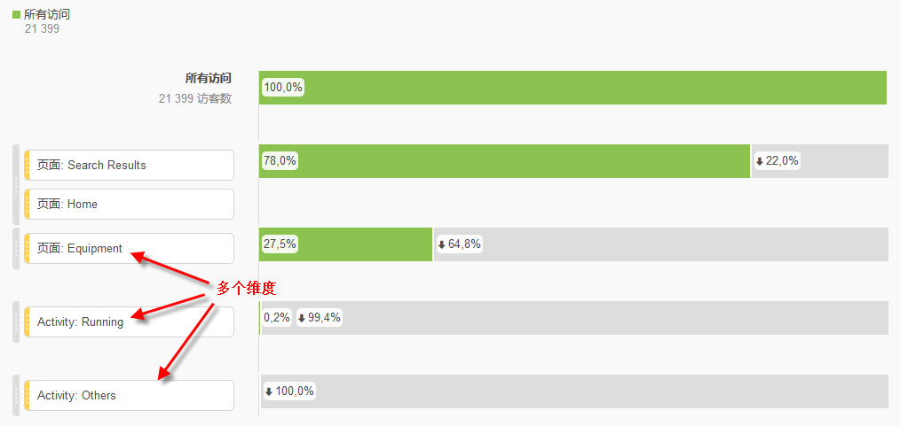
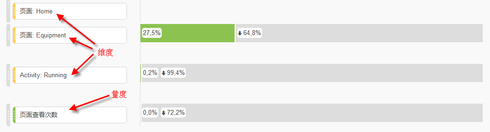
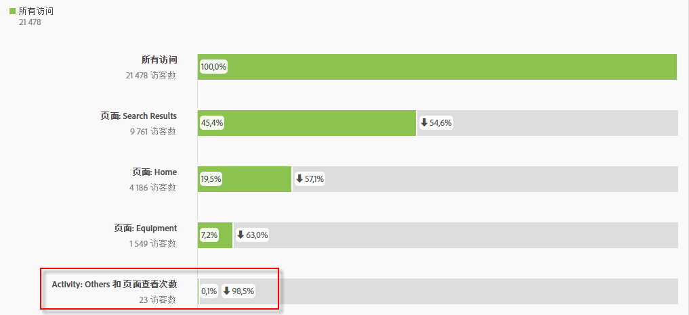

# 三维流失

Analysis Workspace 中的流失允许您将维度和量度作为漏斗和工作流程中的接触点来进行混合和匹配。这在定义要调查的用户步骤方面具有更大的灵活性。

**示例**：除了页面维度之外，还可以向流失可视化添加基于操作的维度项目。这让您可以可视化客户路径中页面和某些操作是怎样相互作用的。

流失会动态更新，并且允许您查看多个维度中的流失。

您还可以向此组合添加量度。在本例中，我们添加了“共享照片”量度来补充客户的浏览路径：

此外，您可以将不同的维度和量度合并为 AND 检查点。您只需将其他维度或量度拖动到现有维度或量度的顶部即可：

