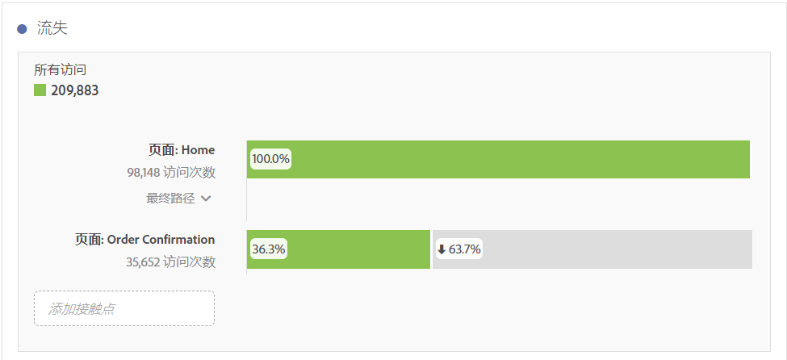
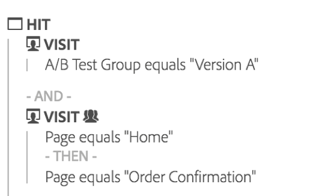
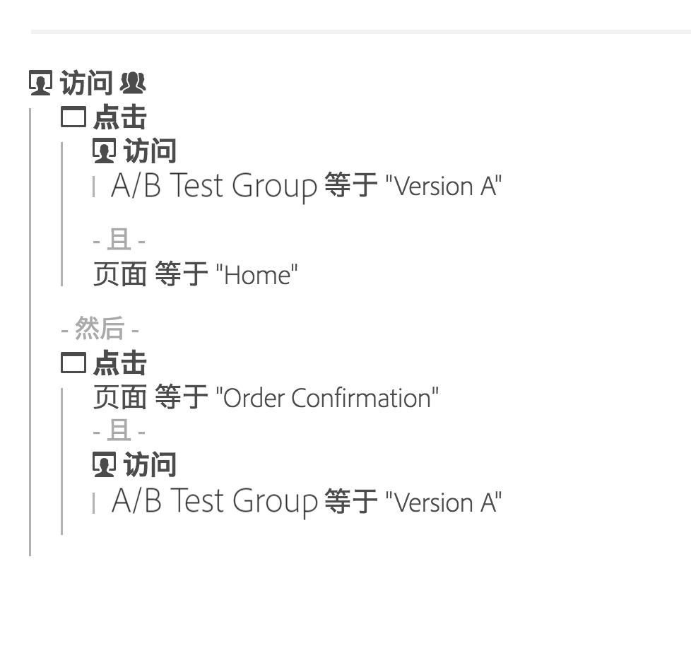

# 流失概述

流失可视化为构建流失报表提供了多个选项。流失报表显示访客从何处离开（流失）或继续通过（流过）预定义的页面序列。

流失可视化允许您

* 对同一个报表中的两个不同区段执行逐项比较。
* 拖放或重新安排漏斗步骤（接触点）
* 混合和匹配来自不同维度和量度的值
* 创建多维度流失报表
* 识别客户在流失之后马上前往何处

流失显示一个序列中每个步骤或接触点之间的转化和流失率。

例如，您可以跟踪购买过程中的客户流失点。您只需选择一个起始接触点和一个结束接触点，并在其中添加中间接触点，即可创建网站浏览路径。但是，您还可以执行多维度流失.

流失可视化有助于分析以下内容：

* 网站上特定过程的转化率（例如购买或注册过程）。
* 一般、更宽范围的流量：显示在查看主页的访客中，有多少人继续进行搜索及有多少人最终查看特定项目。
* 网站上事件之间的关联。显示查看隐私政策后继续购买产品的访客百分比。

[YouTube上的流失可视化](https://www.youtube.com/watch?v=VcrfHSyIoj8&index=52&list=PL2tCx83mn7GuNnQdYGOtlyCu0V5mEZ8sS) (4：15)

## Segmentation as a foundation for flow and fallout {#section_654F37A398C24DDDB1552A543EE29AA9}

应用到工作区中各个面板的区段在工作方式方面，与应用到 Reports &amp; Analytics 或 Ad Hoc Analysis 中流失报表和流量报表的区段略有不同。大多数时间，它们产生的结果完全一致。但 Reports &amp; Analytics 和 Ad Hoc Analysis 在序列中的每个步骤都会应用区段，这是主要区别所在。由于这一区别，产生的结果有时可能会略有不同。

我们以两个步骤的流失分析为例：

如果您在工作区面板级别应用区段，区段会按以下方式与流失结合使用：

相反，Reports &amp; Analytics 和 Ad Hoc Analysis 计算区段时，区段会按以下方式进行结合使用：

Reports &amp; Analytics 和 Ad Hoc Analysis 在每个步骤都会结合使用区段。如果容器级别和流失级别（例如访问次数或访客数级别）相同，则结果会与访问次数或访客数相匹配。

但是，如果应用到面板的区段比流失级别（如点击次数级别）低，则区段会因为其在报表中结合使用的方式不同而显示出不同的结果。需要重申的一点是，在大多数情况下，Analysis Workspace 中的数值同 Reports &amp; Analytics 和 Ad Hoc Analysis 中的数值是相匹配的。仅当以下所有情况都符合时，它们之间才会存在&#x200B;**不**&#x200B;匹配的情形：

* 区段和流失不在同一级别。
* 区段存在变数，即一次访问可能有不同的访客数量，或一位访客可能有不同的访问次数。

在极少数情况下，您可能需要使 Analysis Workspace 与 Reports &amp; Analytics 将区段应用到流失/流量的方式保持一致，为此只需将区段拖放到工作区中的每个流失步骤，即可得到相同的结果。
