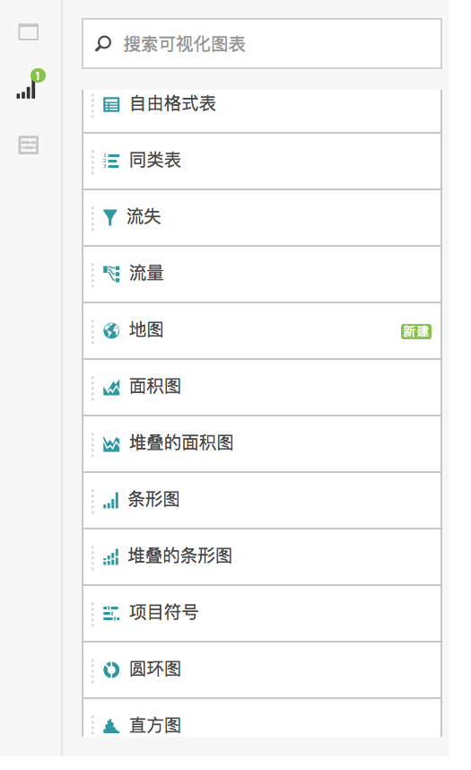
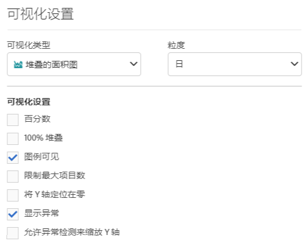
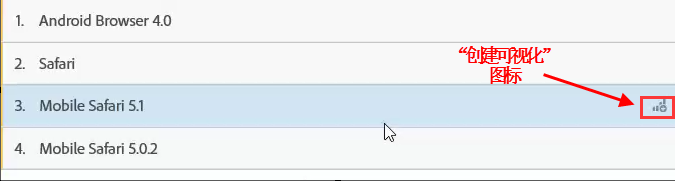
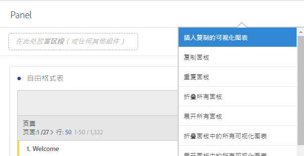
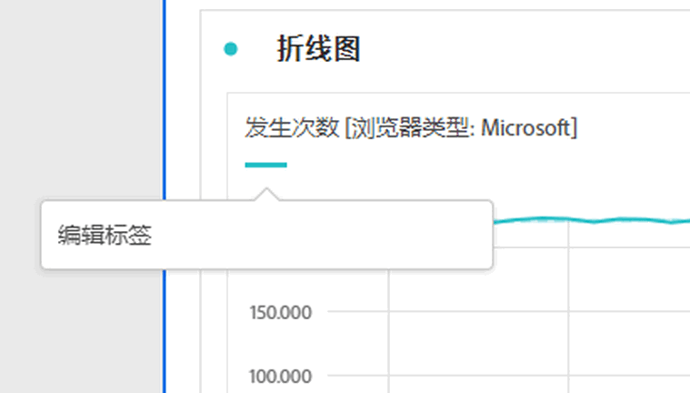

# 可视化概述

了解 Analysis Workspace 中的可视化和可视化设置。

[YouTube上Analysis Workspace中的可视化类型](https://www.youtube.com/watch?v=b1zLEywRa6w&index=39&list=PL2tCx83mn7GuNnQdYGOtlyCu0V5mEZ8sS) (2：57)

## Visualizations panel {#section_DC07F032FBEF4046A40F7B95C28DA018}

要显示“可视化”面板，请单击侧边面板中的&#x200B;**[!UICONTROL 可视化]。**

大部分可视化类型（例如面积图、条形图、圆环图和折线图）都是 Adobe Analytics 用户非常熟悉的。但是，Analysis Workspace 提供了可视化设置，以及许多全新或独特的具有交互功能的可视化类型。

## Visualization settings {#section_D3BB5042A92245D8BF6BCF072C66624B}

要访问“[!UICONTROL 可视化设置]”，请将一个可视化拖到“[!UICONTROL 自由格式面板]”中，然后单击“[!UICONTROL 可视化设置]”齿轮图标。

>[!IMPORTANT]
>
>可见的可视化设置取决于可视化。并非所有设置都适用于所有可视化。此外，某些高级设置&#x200B;**仅**&#x200B;可对特定可视化显示，例如[直方图设置](../../../analyze/analysis-workspace/visualizations/histogram.md#section_09D774C584864D4CA6B5672DC2927477)。

<table id="table_E0695243886046979EE609FAE5D6EA00"> 
 <thead> 
  <tr> 
   <th colname="col1" class="entry"> 设置 </th> 
   <th colname="col2" class="entry"> 描述 </th> 
  </tr> 
 </thead>
 <tbody> 
  <tr> 
   <td colname="col1"> 
百分数 
 </td> 
   <td colname="col2"> 
显示百分数值。 
 </td> 
  </tr> 
  <tr> 
   <td colname="col1"> 
100% 堆叠 
 </td> 
   <td colname="col2"> 
堆叠的面积、堆叠的条形或堆叠的水平条形可视化上的此设置将图表变为“100% 堆叠”可视化。示例： 
 
 
 </td> 
  </tr> 
  <tr> 
   <td colname="col1"> 
图例可见 
 </td> 
   <td colname="col2"> 
让您可以隐藏概要数字/概要变化可视化的过滤器详细信息文本。 
 </td> 
  </tr> 
  <tr> 
   <td colname="col1"> 
限制最大项目数 
 </td> 
   <td colname="col2"> 
允许您限制可视化显示的项目数量。 
 </td> 
  </tr> 
  <tr> 
   <td colname="col1"> 
将 Y 轴定位为 0 
 </td> 
   <td colname="col2"> 
 如果图表上绘制的所有值都远远大于零，则图表默认会将 y 轴底部设置为非零值。如果选中此框，y 轴将被强制设置为零（并将重新绘制图表）。 
 </td> 
  </tr> 
  <tr> 
   <td colname="col1"> 
标准化 
 </td> 
   <td colname="col2"> 
要求所有量度按等比例计算。See <a href="https://marketing.adobe.com/resources/help/en_US/reference/?f=normalization" format="https" scope="external"> Normalization</a>. 
 </td> 
  </tr> 
  <tr> 
   <td colname="col1"> 
显示双轴 
 </td> 
   <td colname="col2"> 
仅当有两个量度时适用-您可以在左侧(对于一个指标)和右侧(对于另一个量度)使用y轴。 
 </td> 
  </tr> 
  <tr> 
   <td colname="col1"> 
显示异常 
 </td> 
   <td colname="col2"> 
增强了折线图和自由格式表以显示数据异常。 
 </td> 
  </tr> 
 </tbody> 
</table>

## Create Visual icon {#section_9C11D9DEDC42413AA53E69A71A509DFC}

如果不确定应选取哪个可视化，请单击任意表行中的&#x200B;**[!UICONTROL 创建可视化]图标。**&#x200B;将光标悬停在表行上时，将显示此图标。单击此图标将提示 Analysis Workspace 针对哪种可视化最适合您的数据做出有根据的推测。例如，如果最多选择了 3 个区段，系统将创建维恩图。如果选择了 3 个以上的区段，系统将创建条形图。对于其他类型的数据，系统可能会创建折线图，等等。

## Right-click visualization/panel menu {#section_05B7914D4C9E443F97E2BFFDEC70240C}

在可视化或面板标头旁单击鼠标右键后，可以访问图形的上下文设置。以下部分或全部设置将可用：

| 设置 | 描述 |
|--- |--- |
| 插入已复制的可视化/面板 | 此设置允许您将已复制的可视化/面板粘贴（“插入”）到同一项目的其他位置，或另一个完全不同的项目中。 |
| 复制可视化/面板 | 此设置允许您右键单击并复制可视化或面板。 |
| 生成可视化/面板副本 | 生成一个与当前可视化完全相同的副本，然后可对其进行修改。 |
| 折叠所有面板 | 折叠所有项目面板。 |
| 折叠面板中的所有可视化 | 折叠此项目面板中的所有可视化。 |
| 展开所有面板 | 展开所有项目面板。 |
| 展开面板中的所有可视化 | 展开此项目面板中的所有可视化。 |
| 编辑描述 | 添加（或编辑）可视化/面板的文本描述。此描述会显示在项目 &gt; 项目信息和设置中。 |
| 获取面板链接 | 此设置允许您将人员引导至项目中的特定面板。 |
| 获取可视化链接 | 此设置允许您复制并共享该链接，从而让其他人直接访问这个可视化。需要用户登录。 |
| 重新开始 | （适用于流量、维恩、直方图）删除当前可视化的配置，并打开一个新面板，您可以在此处重新配置该可视化。 |

## Edit legend labels {#section_94F1988CB4B9434BA1D9C6034062C3DE}

您可以对可视化图例（流失、面积图、堆叠的面积图、条形图、堆叠的条形图、圆环图、直方图、水平条形图、堆叠的水平条形图、折线图、散点图和维恩图）中的系列名称进行重命名，从而让可视化变得更方便使用。

图例编辑&#x200B;**不**&#x200B;适用于以下可视化：树状图、项目符号、概要变化或数字、文本、自由格式、直方图、同类群组或流量。

要编辑图例标签，例如在折线图中编辑图例标签，请执行以下操作：

1. 右键单击某个图例标签。
1. Click **[!UICONTROL Edit Label]**.

   

1. 输入新的标签文本。
1. 按 **[!UICONTROL Enter]键保存。**

下面是一个[指向该主题相关视频的链接](https://www.youtube.com/watch?v=mry3vDrTml0&index=61&list=PL2tCx83mn7GuNnQdYGOtlyCu0V5mEZ8sS)。
