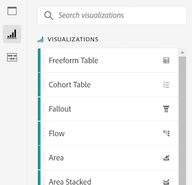
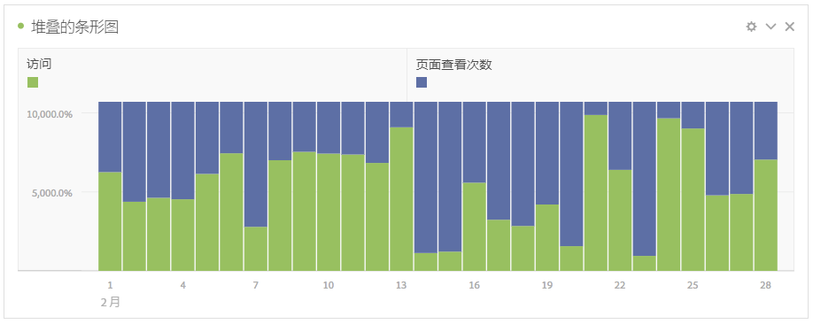

# 可视化图表概述

工作区提供了许多可视化图表，使您能够生成数据的可视化表示形式，如条形图、圆环图、直方图、折线图、地图、散点图等。如果您使用 Adobe Analytics，则您已经熟悉了大多数可视化图表类型。但是，Analysis Workspace 提供了可视化图表设置，以及许多全新或独特的具有交互功能的可视化图表类型。

## 可视化图表类型 

Analysis Workspace 中提供了以下可视化图表类型：

| 可视化图表名称 | 描述 |
| --- | --- |
| [面积图](/help/analyze/analysis-workspace/visualizations/area.md)

 | 与线形图相似，但线条下有彩色区域。当您有多个指标并且希望显示两个或更多指标相交的区域时，可使用面积图。 |
| [条形图](/help/analyze/analysis-workspace/visualizations/bar.md)

 | 显示一些垂直条，这些垂直条表示一个或多个指标中的各种值。 |
| [项目符号图表](/help/analyze/analysis-workspace/visualizations/bullet-graph.md)

 | 显示您感兴趣的值与其他性能范围（目标）进行比较或衡量的结果。 |
| [同类群组表](/help/analyze/analysis-workspace/visualizations/cohort-table/cohort-analysis.md)

 | *`cohort`* 是指一组在特定期限内共享相同特性的人员。同类群组分析对于保留、流失或延迟分析非常有用。 |
| [圆环图](/help/analyze/analysis-workspace/visualizations/donut.md)

 | 此可视化图表与饼图类似，它将数据显示为整体的一部分或区段。 |
| [流失](/help/analyze/analysis-workspace/visualizations/fallout/fallout-flow.md)

 | 流失报告显示访客从何处离开（流失）或继续通过（流过）预定义的页面序列。可以设置为有条件序列或确切序列。 |
| [流](/help/analyze/analysis-workspace/visualizations/c-flow/flow.md)

 | 显示客户在您的网站和应用程序中的确切路径。 |
| [自由格式表](/help/analyze/analysis-workspace/visualizations/freeform-table/freeform-table.md)

 | 自由格式表不仅可以作为数据表，而且还是一个交互式可视化图表。这是在工作区中进行数据分析的基础。 |
| [直方图](/help/analyze/analysis-workspace/visualizations/histogram.md)

 | 直方图根据指标数量，将访客数、访问数或点击数划分到存储桶中。 |
| [水平条](/help/analyze/analysis-workspace/visualizations/horizontal-bar.md)

 | 显示一些水平条，这些水平条表示一个或多个指标中的各种值。 |
| [关键量度摘要](/help/analyze/analysis-workspace/visualizations/key-metric.md)

 | 显示某个量度在单个时间范围内的趋势，或者让您比较两个时间范围内的量度表现。 |
| [折线图](/help/analyze/analysis-workspace/visualizations/line.md)

 | 使用线条来表示指标，以显示一段时间内值的变化情况。将时间作为 x 轴的线形图。 |
| [地图](/help/analyze/analysis-workspace/visualizations/map-visualization.md)

 | 允许您构建任何指标（包括计算指标）的可视地图。 |
| [散点图](/help/analyze/analysis-workspace/visualizations/scatterplot.md)

 | 显示维度项目与最多三个指标之间的关系。 |
| [概要数字](/help/analyze/analysis-workspace/visualizations/summary-number-change.md)

 | 将选择的单元格显示为 1 个多位数。 |
| [概要变化](/help/analyze/analysis-workspace/visualizations/summary-number-change.md)

 | 将所选单元格之间的变化显示为 1 个多位数/百分比。 |
| [文本](/help/analyze/analysis-workspace/visualizations/text.md)

 | 使您克将用户定义的文本添加到您的工作区。在利用面板/可视化图表描述之外，对于向您的分析和见解添加额外的上下文非常有用 |
| [树形图](/help/analyze/analysis-workspace/visualizations/treemap.md)

 | 将分层（树结构）数据显示为一组嵌套的矩形。 |
| [维恩图](/help/analyze/analysis-workspace/visualizations/venn.md)

 | 使用圆圈来描述最多 3 个区段之间的指标重叠。 |

## 向面板添加可视化图表

1. 打开要添加可视化图表的Analysis Workspace项目。

1. 使用以下任意方法来添加可视化图表：

   * 在左边栏中，选择&#x200B;**可视化图表**&#x200B;图标<!-- add icon -->，然后将可视化图表拖到要添加该可视化图表的面板中。

     

   * 在要添加可视化图表的面板上，选择&#x200B;**加号**&#x200B;图标，然后选择表示要添加的可视化图表的图标。 将鼠标悬停在每个可视化图表的图标上可查看其名称。

     用于添加可视化图表的

   * 添加[空白面板](https://experienceleague.adobe.com/docs/analytics/analyze/analysis-workspace/panels/blank-panel.html?lang=zh-Hans)，然后选择要添加的可视化图表。

     

   * 右键单击Analysis Workspace项目中的现有面板，然后选择&#x200B;[!UICONTROL **复制可视化图表**]&#x200B;或&#x200B;[!UICONTROL **复制可视化图表**]。

## 自定义可视化图表设置

您可以为单个可视化图表或您创建的所有可视化图表自定义可视化图表设置。

### 为单个可视化图表自定义可视化图表设置

要访问单个可视化图表的[!UICONTROL 可视化设置]，请执行以下操作：

1. 在 Analysis Workspace 中，将鼠标悬停在要自定义其设置的可视化图表上。

1. 单击齿轮图标。

   每种类型的可视化图表都具有可自定义的独特设置。有关可用设置的信息，请参阅[设置](#settings)。

### 为您创建的所有可视化图表自定义可视化图表设置

您可以为您创建的所有可视化图表自定义设置。有关更多信息，请参阅[用户偏好设置](/help/analyze/analysis-workspace/user-preferences.md)。

## 设置 {#settings}

| 设置 | 描述 |
| --- | --- |
| 可视化图表类型 | 更改描述数据所用的视觉效果的类型。 |
| 粒度 | 对于趋势性的可视化图表，您可从此下拉菜单更改下拉列表中。 此更改也适用于数据源表。 |
| 百分比 | 显示百分数值。 |
| 100% 堆叠 | 在面积堆叠、条形堆叠或水平条形堆叠的可视化图表上的此设置将图表转换为“100% 堆叠”的可视化图表。示例： |
| 图例可见 | 此设置允许您为概要数字/概要变化可视化图表隐藏详细的图例文本。 |
| 限制最大项目数 | 允许您限制可视化图表显示的项目数量。 |
| 将 Y 轴定位为 0 | 如果图表上绘制的所有值都远远大于零，则图表默认会将 y 轴底部设置为非零值。如果选中此框，y 轴将被强制设置为零（并将重新绘制图表）。 |
| 标准化 | 要求所有指标按等比例计算。在所绘制指标的数量级差别很大时，此项非常有用。 |
| 显示双轴 | 仅适用于具有两个指标的情况，可以在左（用于一个指标）、右（用于另一个指标）两边各有一个 y 轴。在所绘制指标的数量级差别很大时，此项非常有用。 |
| 显示异常 | 通过显示异常检测来增强线形图和自由格式表。线形可视化图表中的异常检测包括预期值（虚线）和预期范围（阴影带）。 |

## 图例 {#legend}

可视化图表图例可帮助您将源表中的日期与可视化图表中绘制的系列关联起来。图例是交互式的，在可视化图表中单击某个图例项可显示/隐藏一个系列。在需要简化所显示的数据时，这非常有用。

此外，可以重命名图例标签，这样有助于更好地使用视觉效果。注意：图例编辑&#x200B;**不会**&#x200B;应用到：树形图、项目符号、概要变化/概要数字、文本、自由格式表、直方图、同类群组或流可视化图表。

要编辑图例标签，请执行以下操作：

1. 右键单击某个图例标签。
1. 单击&#x200B;**[!UICONTROL 编辑标签]**。

   

1. 输入新的标签文本。
1. 按 **[!UICONTROL Enter]** 键保存。

## 右键单击菜单 {#right-click}

可视化图表的其他功能可通过在可视化图表的标题上右键单击来使用。其设置因可视化图表而异。其中一些设置包括：

| 设置 | 描述 |
| --- | --- |
| 插入复制的面板/可视化图表 | 使用此设置，您可以将复制的面板或可视化图表粘贴（“插入”）到项目中的其他位置或完全不同的项目中。 |
| 复制可视化图表 | 此设置允许您右键单击并复制可视化图表，以便将其插入到项目中的其他位置或完全不同的项目中。 |
| [以 CSV 格式下载项目](https://experienceleague.adobe.com/docs/analytics/analyze/analysis-workspace/curate-share/download-send.html?lang=zh-Hans?#download-items) | 以 CSV 格式下载所选维度，最多下载 50,000 个维度项。 |
| [将数据下载为 CSV](https://experienceleague.adobe.com/docs/analytics/analyze/analysis-workspace/curate-share/download-send.html?lang=zh-Hans?#download-data) | 以 CSV 格式下载可视化图表数据源。 |
| 复制可视化 | 生成一个与当前可视化图表完全相同的副本，然后可对其进行修改。 |
| 编辑描述 | 添加（或编辑）可视化图表的文本描述。 |
| 获取可视化图表链接 | 此设置允许您将用户引导至项目中的可视化图表。单击该链接时，收件人需要先登录，然后才能转至所链接到的确切可视化图表。 |
| 从头开始 | （适用于流、维恩图、直方图）删除当前可视化图表的设置，以便您从头开始重新配置。 |

## “创建可视化”图标 {#quick-viz}

如果您不确定所要创建的可视化图表，请单击任意表行中的&#x200B;**[!UICONTROL 创建可视化]**&#x200B;图标（将光标悬停于上方即可显示）。这是添加可视化图表最快的方法。单击此图标将提示 Analysis Workspace 针对哪种可视化图表最适合您的数据做出有根据的推测。例如，如果您选择了 1 行，则会创建趋势线形图。如果您选择了 3 个区段行，则会创建维恩图。

## 更改可视化上的刻度轴

以下是一段视频概述：

>[!VIDEO](https://video.tv.adobe.com/v/24708/?quality=12)
