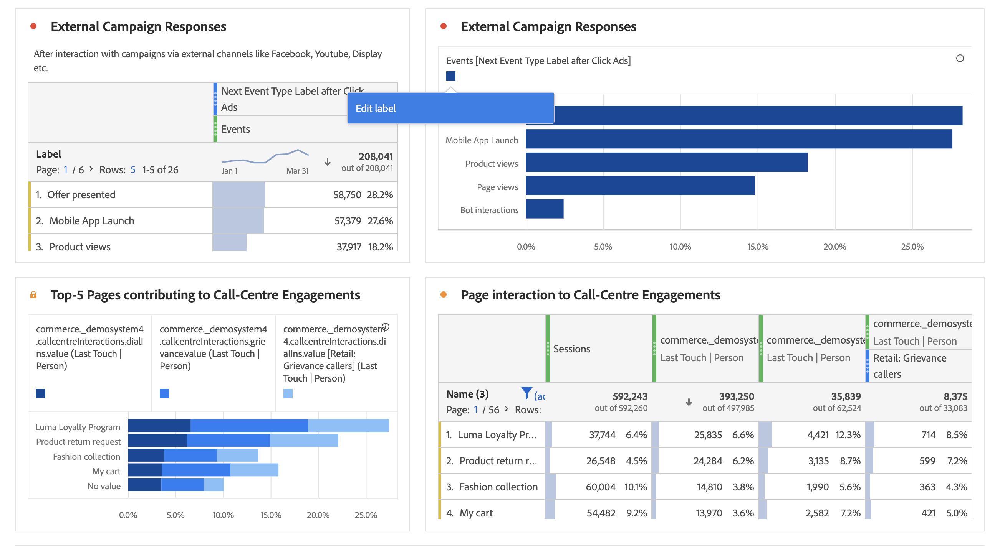

# 可视化概述

Workspace优惠了许多可视化功能，使您能够生成数据的可视化表示形式，如条形图、圆环图、直方图、线图、地图、散点图等。 每个可视化都有自己的设置可供您管理。 单击可视化的名称以了解更多详细信息。

YouTube视频：分析 [工作区中的可视化类型](https://www.youtube.com/watch?v=b1zLEywRa6w&amp;index=39&amp;list=PL2tCx83mn7GuNnQdYGOtlyCu0V5mEZ8sS) (2:57)

| 可视化名称 | 描述 |
|---|---|
| [面积图](/help/analyze/analysis-workspace/visualizations/area.md) | 就像线图，但线下有彩色区域。 当您有多个度量并且希望可视化由两个或多个度量的交叉表示的区域时，请使用区域图。 |
| [条形图](/help/analyze/analysis-workspace/visualizations/bar.md) | 显示表示一个或多个量度中各个值的竖条。 |
| [项目符号图表](/help/analyze/analysis-workspace/visualizations/bullet-graph.md) | 显示您感兴趣的值与其他性能范围（目标）的比较或度量方式。 |
| [同期群表](/help/analyze/analysis-workspace/visualizations/cohort-table/cohort-analysis.md) | *`cohort`* 是指一组在特定期限内共享相同特性的人员。例如，在您想了解如何让一个同类群组喜欢某个品牌时，同类群组分析就能派上用场。您可以轻松识别趋势中的变化，然后相应地采取回应 |
| [圆环](/help/analyze/analysis-workspace/visualizations/donut.md) | 与饼图类似，此可视化将数据显示为整体的部分或段。 |
| [流失](/help/analyze/analysis-workspace/visualizations/fallout/fallout-flow.md) | 流失报表显示访客从何处离开（流失）或继续通过（流过）预定义的页面序列。 |
| [流量](/help/analyze/analysis-workspace/visualizations/c-flow/flow.md) | 显示您网站和应用程序的客户路径。 |
| [自由格式表](/help/analyze/analysis-workspace/visualizations/freeform-table.md) | 自由格式表不仅是数据表，而且是交互式可视化。 |
| [直方图](/help/analyze/analysis-workspace/visualizations/histogram.md) | 直方图与条形图类似，但它将数字分组到范围（桶）中。 |
| [水平条](/help/analyze/analysis-workspace/visualizations/horizontal-bar.md) | 显示一个或多个度量中表示不同值的水平条。 |
| [折线图](/help/analyze/analysis-workspace/visualizations/line.md) | 使用行表示度量，以显示值在一段时间内的变化情况。 只有将时间用作维时，才能使用折线图。 |
| [地图](/help/analyze/analysis-workspace/visualizations/map-visualization.md) | 允许您构建任何量度（包括计算量度）的可视地图。 |
| [散点图](/help/analyze/analysis-workspace/visualizations/scatterplot.md) | 显示维度值与最多三个指标之间的关系。 |
| [摘要编号](/help/analyze/analysis-workspace/visualizations/summary-number-change.md) | 根据选择的单元格，此可视化显示总计和摘要。 |
| [摘要更改](/help/analyze/analysis-workspace/visualizations/summary-number-change.md) | 根据选择的单元格，此可视化功能会将单元格相互比较。 |
| [文本](/help/analyze/analysis-workspace/visualizations/text.md) | 允许您将用户定义的文本添加到工作区。 |
| [树图](/help/analyze/analysis-workspace/visualizations/treemap.md) | 将分层（树结构化）数据显示为一组嵌套矩形。 |
| [维恩图](/help/analyze/analysis-workspace/visualizations/venn.md) | 允许您拖入最多3个区段（从组件）和一个指标以构建维恩图。 |

## “可视化”面板 {#section_DC07F032FBEF4046A40F7B95C28DA018}

To display the Visualizations panel, click **[!UICONTROL Visualizations]** in the side panel.

大部分可视化类型（例如面积图、条形图、圆环图和折线图）都是 Adobe Analytics 用户非常熟悉的。但是，分析工作区提供可视化设置以及许多具有交互功能的新的或独特的可视化类型。

## “可视化”设置 {#section_D3BB5042A92245D8BF6BCF072C66624B}

要访问 [!UICONTROL Visualization Settings]，请将可视化拖动到 [!UICONTROL Freeform Panel]中，然后单击齿轮 [!UICONTROL Visualization Settings] 图标。

>[!IMPORTANT]
>
>可视化决定了哪些可视化设置可见。并非所有设置都适用于所有可视化。 此外，某些高级设置仅出 **现** ，用于特定可视化，如直方图 [设置](/help/analyze/analysis-workspace/visualizations/histogram.md#section_09D774C584864D4CA6B5672DC2927477)。

| 设置 | 描述 |
|--- |--- |
| 百分数 | 以百分比显示值。 |
| 100% 堆叠 | 堆叠区域、堆叠条形图或堆叠水平条形图的此设置会将图表转变为“100%堆叠”可视化。 示例： |
| 图例可见 | 用于隐藏“摘要编号／摘要更改”可视化的过滤器详细信息文本。 |
| 限制最大项目数 | 允许您限制可视化显示的项目数。 |
| 将 Y 轴定位为 0 | 如果图表上绘制的所有值都大大高于零，则图表默认值将使y轴的底部变为非零。 如果选中此框，y轴将强制为零（并将重绘图表）。 |
| 标准化 | 要求所有量度按等比例计算。 |
| 显示双轴 | 仅适用于具有两个量度的情况，可以在左（用于一个量度）、右（用于另一个量度）两边各有一个 y 轴。 |
| 显示异常 | 增强线形图和自由形式表以显示数据异常。 |

## “创建可视化”图标 {#section_9C11D9DEDC42413AA53E69A71A509DFC}

If you are not sure which visualization to pick, click the **[!UICONTROL Create Visual]** icon in any table row. 将鼠标悬停在表行上时，将显示此图标。 单击它会提示分析工作区，猜测哪种可视化最适合您的数据。 例如，如果您最多选择了3个区段，它将创建一个维恩图。 对于3个以上的区段，它将创建条形图。 对于其他类型的数据，它可能创建线图等。

## 右键单击“可视化”/“面板”菜单 {#section_05B7914D4C9E443F97E2BFFDEC70240C}

右键单击可视化或面板标题旁边的设置可访问图形的上下文设置。 将提供以下部分或全部设置：

| 设置 | 描述 |
|--- |--- |
| 插入复制的可视化／面板 | 允许您将复制的元素粘贴（“插入”）到项目中的其他位置或完全不同的项目中。 |
| 复制可视化／面板 | 允许您右键单击并复制可视化或面板。 |
| 重复可视化／面板 | 精确重复当前可视化，然后可以修改它。 |
| 折叠所有面板 | 折叠所有项目面板。 |
| 折叠面板中的所有可视化 | 折叠此项目面板中的所有可视化。 |
| 展开所有面板 | 展开所有项目面板。 |
| 展开面板中的所有可视化 | 展开此项目面板中的所有可视化。 |
| 编辑说明 | 为可视化／面板添加（或编辑）文本描述。 此描述会显示在项目 > 项目信息和设置中。 |
| 获取面板链接 | 允许您将某人定向到项目中的特定面板。 |
| 获取可视化链接 | 允许您复制和共享此链接，以将其他链接直接发送到此可视化。 用户需要登录。 |
| 开始结束 | （适用于流、维恩、直方图）删除当前可视化的配置，并打开一个新面板，您可以在其中重新配置它。 |

## 编辑图例标签 {#section_94F1988CB4B9434BA1D9C6034062C3DE}

您可以重命名可视化图例（流失、面积、堆叠区域、条形、堆叠的条形、圆环、直方图、水平条、堆叠的水平条、线条、散点和维恩）中的序列名称，以帮助您使视觉元素更易于消耗。

图例编辑不 **适用于** :树图、项目符号、摘要更改或数字、文本、自由格式、直方图、同期群或流可视化。

例如，要编辑折线图中的图例标签，

1. 右键单击其中一个图例标签。
1. 单击 **[!UICONTROL Edit Label]**.

   

1. 输入新的标签文本。
1. Press **[!UICONTROL Enter]** to save.

下面是一个[指向该主题相关视频的链接](https://www.youtube.com/watch?v=mry3vDrTml0&amp;index=61&amp;list=PL2tCx83mn7GuNnQdYGOtlyCu0V5mEZ8sS)。
