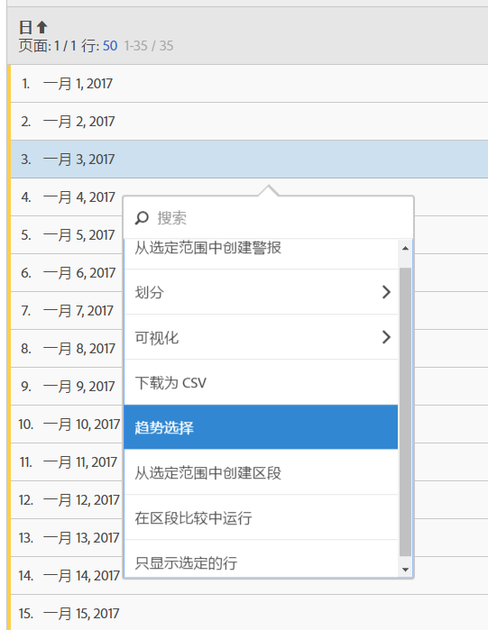

# 自由表

在 Analysis Workspace 中，数据表（自由格式表）不仅可以作为报表，而且还是一个交互式的可视化界面。您可以与单个行、许多选定行或整个表进行交互。

您最多可以在一个表格中显示 400 行。

您可以采用下面独特的方式与该表进行交互：

* [从表选定范围中创建警报](/help/components/c-alerts/alert-builder.md)
* 运行[划分](../../../analyze/analysis-workspace/components/dimensions/t-breakdown-fa.md#task_B594DA2476E84DFDA8279E831F0BD9C4)，并创建内联区段（右键单击）
* Run [visualizations](../../../analyze/analysis-workspace/visualizations/freeform-analysis-visualizations.md#concept_09242627629147A88A68F1506954C276) on specific cells
* Export rows to [CSV](../../../analyze/analysis-workspace/curate-share/download-send.md#concept_BB548979F47F45739679B830428C3025)
* 运行选定单元格中的[趋势](../../../analyze/analysis-workspace/analysis-workspace-features.md#section_34930C967C104C2B9092BA8DCF2BF81A)可视化
* 从所选内容中创建[区段](../../../analyze/analysis-workspace/components/t-freeform-project-segment.md#task_11C6A2C7717B48049E5750B9D20FEC80)
* Perform a [segment comparison](../../../analyze/analysis-workspace/c-panels/c-segment-comparison/segment-comparison.md#concept_74FAC1C6D0204F9190A110B0D9005793)
* 只显示选定的行

See [Create an Analysis Workspace project](../../../analyze/analysis-workspace/build-workspace-project/t-freeform-project.md#task_C2C698ACC7954062A28E4784911E6CF2) for more information.
