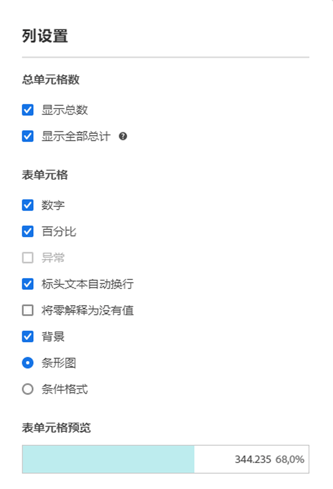

# [!UICONTROL 列设置]

[!UICONTROL 列设置]允许您配置列格式，其中一些可以是条件格式。

## 编辑[!UICONTROL 列设置] {#edit-column-settings}

您可以编辑单个列的列设置，也可以同时编辑多个列的列设置。

1. 在 Analysis Workspace 中，将一个自由格式表拖到您的项目中。

1. （视情况而定）要同时编辑多个列，请在按住 Shift 键的同时选择要编辑的每个列。

1. 将鼠标悬停在要编辑的列上，然后选择齿轮图标。

   如果您选择了多个列，请单击任意选定列的齿轮图标。您所做的任何更改将应用于所有选定的列。

   

1. 继续进行[列设置](#column-settings)。

## 列设置

您可以在 Analysis Workspace 中更新单个表的以下列设置，如[编辑列设置](#edit-uicontrol-column-settings)中所述。

还可以为您在 Analysis Workspace 中创建的所有新项目管理其中一些相同的设置，如[用户偏好设置](/help/analyze/analysis-workspace/user-preferences.md)中所述

| 元素 | 描述 |
| --- | --- |
| **总单元格数** |  |
| 显示总数 | 此总数通常等于[!UICONTROL 全部总计]或者为其一部分。它反映自由格式表内应用的任何表过滤器，包括[!UICONTROL 不包含任何内容]选项。 |
| 显示全部总计 | 此总计表示已收集的所有点击数，有时候称为“报表包总计”。当在面板级别或自由格式表中应用区段时，此总计会进行相应的调整以反映符合区段标准的所有点击。带有[统计行](/help/analyze/analysis-workspace/visualizations/freeform-table/workspace-totals.md)的表或细分不支持全部总计。 |
| **表单元格** |   |
| 数值 | 确定单元格是否显示/隐藏量度的数值。例如，如果量度是“页面查看次数”，则数值是行项目的页面查看次数。 |
| 百分比 | 确定单元格是否显示/隐藏量度的百分比值。例如，如果量度是“页面查看次数”，则百分比值等于行项目的页面查看次数除以该列的页面查看总数。注意：我们可以显示大于 100% 的百分比，准确度提高了。此外，我们还将上限调整为 1,000%，以确保允许列值有充足的变化范围。 |
| 异常 | 确定此列中的值是否要运行异常检测。有关更多信息，请参阅[查看 Analysis Workspace 中的异常情况](/help/analyze/analysis-workspace/c-anomaly-detection/view-anomalies.md)。 |
| 隐藏标头文本 | 允许您隐藏自由格式表中的标头文本，以使标头更加易读，表格更易共享。这对 .pdf 渲染和名称较长的量度非常有用。默认处于启用状态。 |
| 将零解释为没有值 | 对于具有 0 值的单元格，确定将其显示为 0 还是空白单元格。当您查看一个月中每一天的数据，而有些天尚未发生时，这非常有用。可以为将来日期显示空白单元格，而不是 0。各种图表也遵循这种设置（即，选中该设置后，折线图或条形图将不显示值为 0 的部分）。 |
| 背景 | 确定单元格是否显示/隐藏所有单元格格式，包括条形图和条件格式。 |
| 条形图 | 显示一个水平条形图，表示单元格相对于列总数的值。 |
| 条件格式 | 请参阅以下部分。 |
| 表单元格预览 | 显示应用当前所选的格式选项时，每个单元格的预览效果。 |

## 条件格式 {#conditional-formatting}

条件格式将格式应用于由您定义的上限、中点和下限。除非选择了“自定义”限制，否则对于各种划分，还将在自由格式表格中自动应用条件格式（例如颜色）。

| 元素 | 描述 |
| --- | --- |
| 条件格式 | 将您选择的预配置颜色集应用于单元格。根据您选择的 4 种可用颜色方案中的哪一种，不同的颜色会分配给高值、中点值和低值。 替换表中的维度会重置条件格式限制。替换量度会重新计算此列的限制（其中，量度在 X 轴上，维度在 Y 轴上）。 |
| 使用百分比限制 | 将限制范围更改为基于百分比而不是绝对值。此选项适用于完全基于百分比的量度（如跳出率）以及包含计数和百分比的量度（如页面查看次数）。 |
| 自动生成 | 根据数据自动计算上限/中值/下限。上限为此列中的最大值。下限为最小值，中点为上限和下限的平均值。 |
| 自定义 | 手动指定上限/中值/下限。这可以让您灵活地决定列值何时为好、中或差。 |
| 条件格式化调色板 | 选择 4 种可用颜色方案中的哪一种用于您的条件格式。 |

## 使用非默认的属性模型 {#attribution}

Analysis Workspace 支持对几乎所有量度进行[归因](/help/analyze/analysis-workspace/attribution/overview.md)。

1. 单击“自由格式表”列中的“设置”（齿轮）图标。

   

1. 在&#x200B;**[!UICONTROL 数据设置]**&#x200B;下，选中&#x200B;**[!UICONTROL 使用非默认归因模型]**。有关不同归因模型的更多信息，请参阅[归因模型](/help/analyze/analysis-workspace/attribution/models.md)。

   

>[!MORELIKETHIS]
>
>* [管理数据源](/help/analyze/analysis-workspace/visualizations/t-sync-visualization.md)

## 动态列

以下是一段关于如何在 Analysis Workspace 中使用动态列的视频：

>[!VIDEO](https://video.tv.adobe.com/v/23138/?quality=12)
