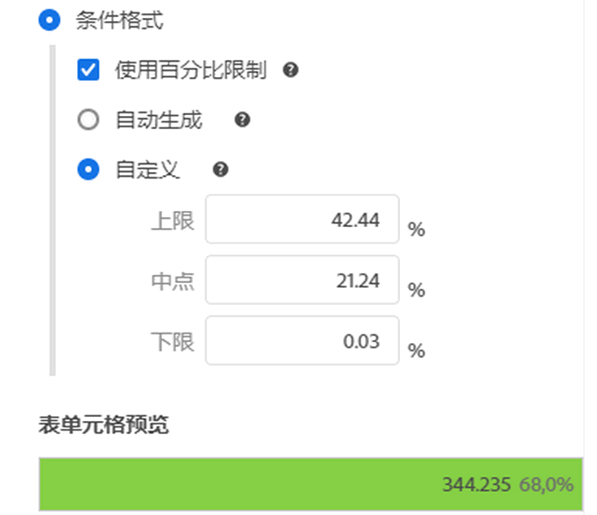
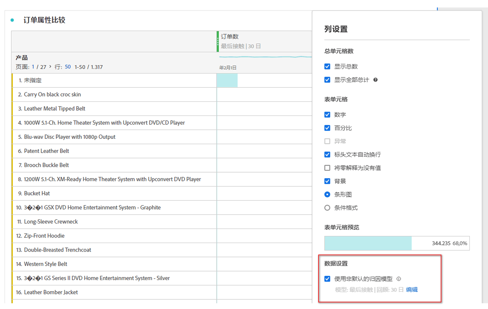
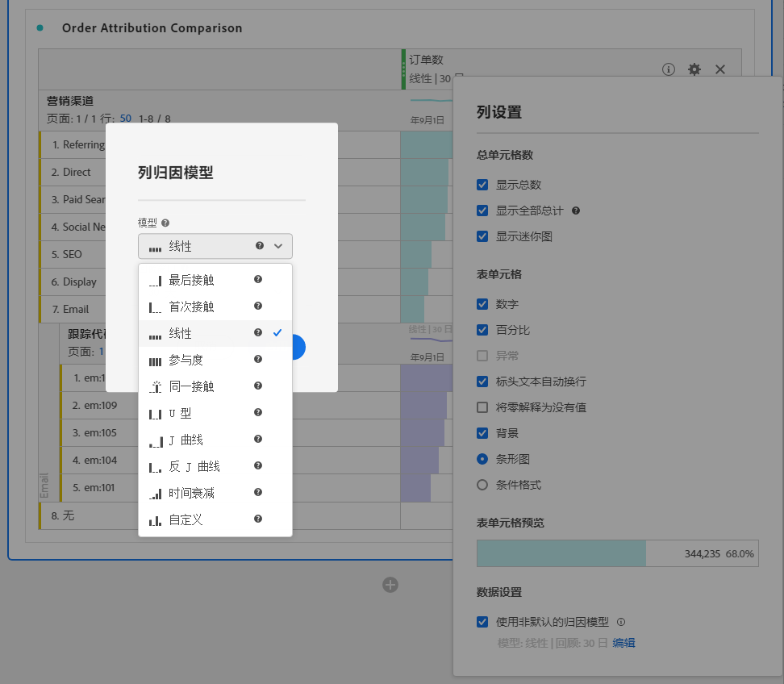

# 列设置

[!UICONTROL 列设置]允许您配置列格式，其中一些可以是条件格式。

>[!BEGINSHADEBOX]

请参阅  [自由格式表中的行和列设置](https://video.tv.adobe.com/v/40382/?quality=12&learn=on){target="_blank"}以获取演示视频。

>[!ENDSHADEBOX]

要访问[!UICONTROL 列设置]，请在列标题中选择。

您可以一次编辑多个列设置。选择多个列，然后在选定的任意一列中选择。您所做的任何更改将应用于有单元格被选中的所有列。

| 选项 | 描述 |
| --- | --- |
| **[!UICONTROL 显示总计]** | 显示客户端列的总和。此总计&#x200B;**不会**&#x200B;去除会话或人员等重复量度。 |
| **[!UICONTROL 显示全部总计]** | 显示服务器端列的总和。全部总计会去除会话或人员等重复量度。 |
| **[!UICONTROL 显示迷您图]** | 在列标题处显示线形图。 |
| **[!UICONTROL 数值]** | 确定单元格是否显示/隐藏量度的数值。例如，如果量度是“页面查看次数”，则数值是行项目的页面查看次数。 |
| **[!UICONTROL 百分比]** | 确定单元格是否显示/隐藏量度的百分比值。例如，如果量度是“页面查看次数”，则百分比值等于行项目的页面查看次数，除以该列的总页面查看次数。注释：为了确保准确性，百分比可以大于 100%。上限可以调整为 1,000%，以防止列宽变得太大。 |
| **[!UICONTROL 显示异常情况]** | 确定此列中的值是否要运行异常检测。 |
| **[!UICONTROL 显示预测]** | 确定预测值是否显示在此列中。 |
| **[!UICONTROL 标题文本换行]** | 让自由格式表中的标题文本换行，以使标题更加易读，表格更易共享。换行对 PDF 渲染和名称较长的量度非常有用。默认处于启用状态。 |
| **[!UICONTROL 将零解释为没有值]** | 对于具有 0 值的单元格，确定将其显示为 0 还是空白单元格。当您查看一个月中每一天的数据，而有些天将在未来发生时，这种解释就很有用。可以为未来日期显示空白单元格，而不是 0。各种图表也遵循这种设置（即，线形图或条形图将不显示值为 0 的部分）。 |
| **[!UICONTROL 背景]** | 确定单元格是否显示/隐藏所有单元格格式，包括条形图和条件格式。 |
| **[!UICONTROL 条形图]** | 显示一个水平条形图，表示单元格相对于列总数的值。 |
| **[!UICONTROL 条件格式]** | 使用条件格式。请参阅以下[部分](#conditional-formatting)。 |
| **[!UICONTROL 表单元格预览]** | 应用当前所选的格式选项时，每个单元格的预览效果。 |
| **[!UICONTROL 使用非默认归因模型]** | 使用非默认归因模型。请参阅以下[部分](#use-non-default-attribution-model)。 |

## 条件格式 {#conditional-formatting}

条件格式将格式应用于由您定义的上限、中点和下限。除非选择了[!UICONTROL 自定义]限制，否则对于各种细分，还将在自由格式表中自动应用条件格式。

| 条件格式选项 | 描述 |
| --- | --- |
| **[!UICONTROL 使用百分比限制]** | 将限制范围更改为基于百分比而不是绝对值。百分比限制范围适用于完全基于百分比的量度（如跳出率）和包含计数和百分比的量度（如页面查看次数）。 |
| **[!UICONTROL 自动生成]** | 根据数据自动计算上限/中值/下限。上限为此列中的最大值。下限为最小值，中点为上限和下限的平均值。 |
| **[!UICONTROL 自定义]** | 手动分配&#x200B;**[!UICONTROL 上限]**、**[!UICONTROL 中点]**&#x200B;和&#x200B;**[!UICONTROL 下限]**。限制提供了确定列值何时变为良好、一般或不良的灵活性。 |
| **[!UICONTROL 条件格式化调色板]** | 将预配置的颜色集应用于单元格。根据您选择的四种可用颜色方案中的哪一种，不同的颜色会分配给高值、中点值和低值。 替换表中的维度会重置条件格式限制。替换量度会重新计算此列的限制（其中，量度在 X 轴上，维度在 Y 轴上）。 |

## 使用非默认归因模型 {#use-non-default-attribution-model}

<!-- markdownlint-disable MD034 -->

>[!CONTEXTUALHELP]
>id="workspace_freeformtable_column_usenondefaultattributionmodel"
>title="使用非默认归因模型"
>abstract="为所选列启用非默认归因模型。"

<!-- markdownlint-enable MD034 -->

<!-- markdownlint-disable MD034 -->

>[!CONTEXTUALHELP]
>id="workspace_freeformtable_column_usenondefaultattributionmodel_disabled"
>title="使用非默认归因模型"
>abstract="非默认归因模型不可用于此量度。"

<!-- markdownlint-enable MD034 -->

>[!NOTE]
>
>将组件的归因更新为非默认归因模型时，请考虑以下事项：
>
>* **在具有&#x200B;*单个维度*的报告中使用该组件：**&#x200B;当使用非默认归因模型时，该组件的归因将忽略分配模型。
>
>* **在具有&#x200B;*多个维度*的报告中使用该组件：**&#x200B;当使用非默认归因模型时，该组件的归因将保留分配模型。
>
>

要在 Analysis Workspace 中对量度使用非默认归因模型，请执行以下操作：

1. 选择&#x200B;**[!UICONTROL 使用非默认归因模型]**。当已选择时，使用&#x200B;**[!UICONTROL 编辑]**&#x200B;来编辑归因模型。或者取消选择以返回默认归因模型。

   

2. 在&#x200B;**[!UICONTROL 列归因模型]**&#x200B;中，选择&#x200B;**[!UICONTROL 模型]**&#x200B;和&#x200B;**[!UICONTROL 回顾窗口]**。回顾窗口可以确定应用于每次转化的数据归因窗口。

   

### 归因模型

{{attribution-models-details}}

### 容器

{{attribution-container}}

### 回顾时间范围

{{attribution-lookback-window}}

### 示例

{{attribution-example}}

>[!MORELIKETHIS]
>
>* [管理数据源](/help/analyze/analysis-workspace/visualizations/t-sync-visualization.md)

>[!BEGINSHADEBOX]

请参阅  [动态列](https://video.tv.adobe.com/v/23138?quality=12&learn=on){target="_blank"}以获取演示视频。

>[!ENDSHADEBOX]

