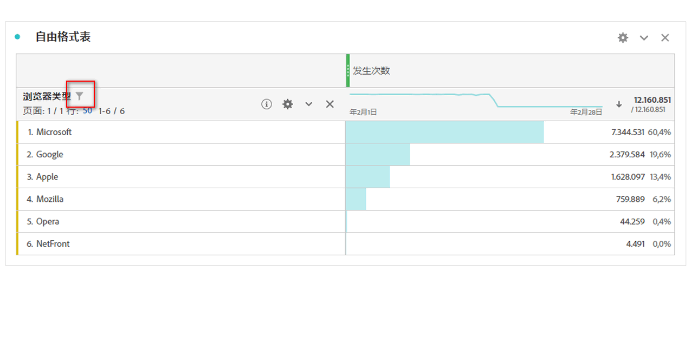
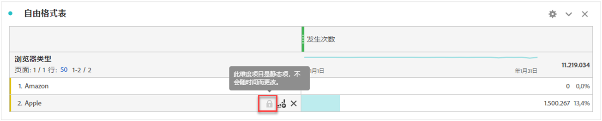
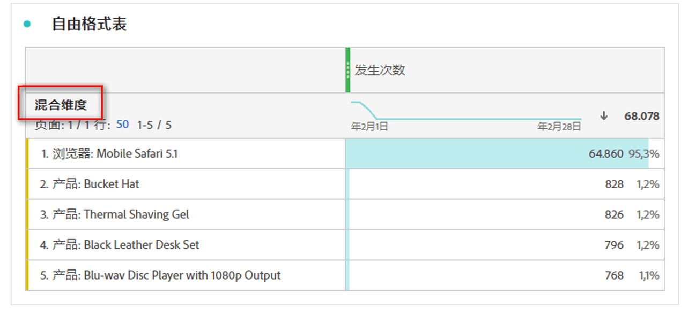

# 动态项和静态维度项

在自由格式表中，行和列可以包含各种组件值。 这些值可能是动态的（随时间而改变），也可能是静态的（不随时间而改变），具体取决于您要生成的分析。

## 动态维度项

动态维度项会随时间而改变，并且取决于自由格式表中按其排序的量度。如果要分析给定时间段内排名靠前的项目，可首选使用动态维度项。

将维度拖放到自由格式表后，将返回动态行。这些动态行表示与给定量度和时间段的维度对应的排名靠前的项目。此外，您还可以将某个维度拖放到自由格式表的列中，该维度会自动扩展为排名前 5 的维度项。

例如，将“浏览器类型”维度拖入表中后，则排名靠前的“浏览器类型”维度项（例如 Microsoft、Apple、Google 等）会动态返回到表行。如果拖放到列中，则会动态返回排名前 5 的“浏览器类型”维度项。

动态维度项具有行过滤器选项和，并&#x200B;**没有**&#x200B;锁定 。<!--do they have the lock icon? -->当您单击动态维度项旁边的，会自动应用过滤器。有关将过滤器应用于表的更多信息，请参阅[排序和过滤表格](/help/analyze/analysis-workspace/visualizations/freeform-table/filter-and-sort.md)。

## 静态维度项

静态维度项不会随时间而改变；它们是自由格式表中始终返回的固定组件。如果您希望始终分析同一项目（无论是特定促销活动还是一周中的特定日期），可首选使用静态维度项。

每当您手动选择特定组件值（维度、量度、过滤器、日期范围）并将其拖放到表中后，就会生成行或列的静态列表。

例如，当您将光标拖到特定的“浏览器类型”项目（例如 Microsoft 和 Apple）上时，这 2 个特定项目始终会提取到表中。

如果您从选定行的上下文菜单中选择&#x200B;**[!UICONTROL 只显示选定的行]**，也可以创建静态维度项。

静态维度项&#x200B;**没有**&#x200B;行过滤器选项。相反， 和存在于每个项目上。选择从表中移除该维度项。

## 混合维度项

来自不同维度的维度项可以添加到同一个表中。在这些情况下，行标题会显示&#x200B;**[!UICONTROL 混合维度]**。这些维度项是静态的。例如，从“浏览器组维度”维度添加特定维度项，以及从“浏览器名称”维度添加其他维度项。

## 自由格式表总计行

动态行和静态行在自由格式表总计行中的行为方式有所不同。默认情况下：

* 动态行是服务器端总和，并且去除了重复量度（如会话和人员）。
* 静态行是客户端总和，并且&#x200B;**不会**&#x200B;去除重复量度。要计算服务器端总计行，请将“行”设置更改为&#x200B;**“显示总计”**。[了解详情](/help/analyze/analysis-workspace/visualizations/freeform-table/workspace-totals.md)

>[!BEGINSHADEBOX]

请参阅  [重新排序静态行](https://video.tv.adobe.com/v/31319?quality=12&learn=on){target="_blank"}以获取演示视频。

>[!ENDSHADEBOX]

