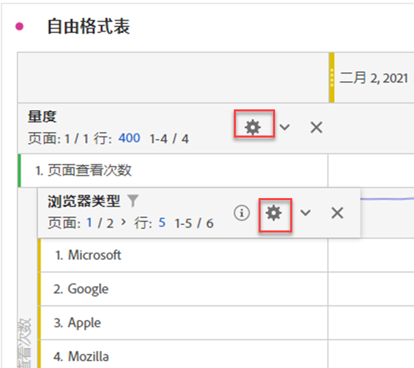

# 行设置

>[!BEGINSHADEBOX]

请参阅  [自由格式表中的行和列设置](https://video.tv.adobe.com/v/40382/?quality=12&learn=on){target="_blank"}以获取演示视频。

>[!ENDSHADEBOX]

行设置因您拖入到表格中的组件而异。要访问表格行设置，请选择每个对象内的维度、过滤器、量度、时间段或细分旁边的**[!UICONTROL 设置]**。

| 设置 | 描述 |
| --- | --- |
| **[!UICONTROL 按位置细分]** | 默认情况下，此设置处于禁用状态，并且细分固定在静态行项目。例如，假设您按营销渠道细分排名前 3 的“页面”维度项（主页、搜索结果、结账）。然后，您离开项目，两周后返回。再次打开项目时，排名前 3 的页面已更改，此时“主页”、“搜索结果”和“结账”页面成为排名第 4-6 的页面。默认情况下，营销渠道细分仍显示在“主页”、“搜索结果”和“结账”下方，即使三者现在分别位于第 4-6 行中。 相反，**按位置细分**&#x200B;始终划分排名前 3 的项目，而不管它们具体是什么。回顾该示例，当您重新打开项目时，营销渠道细分与表中排名前 3 的页面相关联。而不是与“主页”、“搜索结果”和“结帐”相关联，这三项现在分别位于第 4-6 行中。 |
| **[!UICONTROL 百分比]** | **按列计算百分比**（默认）：单元格中显示的百分比是根据列总数计算的。 **按行计算百分比**：单元格中的百分比是按行计算的，而不是沿列向下计算，以全部总计作为分母。该计算方式对显示百分比趋势特别有用。 |
| **[!UICONTROL 列总计]** | 这些设置仅可用于[静态行](/help/analyze/analysis-workspace/visualizations/freeform-table/column-row-settings/manual-vs-dynamic-rows.md)。  **显示为当前行的总和**&#x200B;将显示表中行的客户端总和，这意味着总计&#x200B;*不会*&#x200B;去除重复量度，如访问次数或人员。  **显示全部总计**&#x200B;将显示服务器端总和，这意味着去除重复量度的总计。 |

## 更改行计数

要更改显示的行数，请执行以下步骤：

1. 单击表格第一列顶部&#x200B;**[!UICONTROL 行数]**&#x200B;旁边的数字。

   

1. 从下拉列表中，选择您希望表显示的行数。

## Context-menu

选择维度标题时，以下上下文菜单选项可用。

| 选项 | 描述 |
| --- | --- |
| **[!UICONTROL 将选择复制到剪贴板]** | 将可视化图表中的选择复制到剪贴板上。 |
| **[!UICONTROL 将项目下载为 CSV（*维度名称*）]** | 将可视化图表的维度项（最多 50,000 个）立即下载到本地设备。所选维度最多可有 50,000 个维度项。 |
| **[!UICONTROL 将选择下载为 CSV]** | 立即将可视化图表的维度项下载到您的本地设备。 |
| **[!UICONTROL 为所有维度项创建超链接]** | 为所有维度项创建超链接。请参阅[为自由格式表中的维度对超链接进行操作](../freeform-table-hyperlinks.md) |
| **[!UICONTROL 为所有维度项编辑超链接]** | 为所有维度项编辑超链接。请参阅[为自由格式表中的维度对超链接进行操作](../freeform-table-hyperlinks.md) |
| **[!UICONTROL 为所有维度项移除超链接]** | 为所有维度项移除超链接。请参阅[为自由格式表中的维度对超链接进行操作](../freeform-table-hyperlinks.md) |
| **[!UICONTROL 删除]** | 从表中删除维度。 |
| **[!UICONTROL 可视化]** | 使用任何可用的可视化图表将维度可视化。 |
| **[!UICONTROL 仅显示选定的行]** | 仅显示可视化图表中选定的项目。 |
| **[!UICONTROL 从选择创建注释]** | 打开&#x200B;**[!UICONTROL 注释详细信息]**&#x200B;以添加注释。 |

选择自由格式表中的一个或多个维度项（第一列）或者一个或多个单个单元格时，可以使用以下附加上下文菜单选项。

| 选项 | 描述 |
| --- | --- |
| **[!UICONTROL 创建超链接]** | 为项目创建超链接。请参阅[为自由格式表中的维度对超链接进行操作](../freeform-table-hyperlinks.md) |
| **[!UICONTROL 编辑超链接]** | 为项目编辑超链接。请参阅[为自由格式表中的维度对超链接进行操作](../freeform-table-hyperlinks.md) |
| **[!UICONTROL 移除超链接]** | 为项目移除超链接。请参阅[为自由格式表中的维度对超链接进行操作](../freeform-table-hyperlinks.md) |
| **[!UICONTROL 细分]** | 划分维度项。从&#x200B;**[!UICONTROL 维度]**、**[!UICONTROL 量度]**、**[!UICONTROL 过滤器]**&#x200B;或&#x200B;**[!UICONTROL 日期范围]**&#x200B;列表中进行选择。使用&#x200B;*搜索*&#x200B;来替代搜索组件。 |
| **[!UICONTROL 删除选定项]** | 删除选定的行（项目）。 |
| **[!UICONTROL 趋势选择]** | 为选择创建趋势线形图可视化图表。 |
| **[!UICONTROL 仅显示选定的行]** | 仅显示可视化图表中选定的行。 |
| **[!UICONTROL 显示所有行]** | 显示可视化图表中的所有行。 |
| **[!UICONTROL 从选择创建过滤器]** | 打开&#x200B;**[!UICONTROL 过滤器生成器]**，从选择中生成过滤器。 |
| **[!UICONTROL 从选择创建受众]** | 打开&#x200B;**[!UICONTROL 创建受众]**&#x200B;对话框，从选择中生成受众。 |

选择量度列标题时，可以使用以下附加上下文菜单选项。

| 选项 | 描述 |
|---|---|
| **[!UICONTROL 从选择创建量度]** | 从选定量度创建新的量度。度量可以是平均值、中间值、列最大值、列最小值、列总和。您还可以在计算量度生成器中选择“打开”来创建计算量度。 |
| **[!UICONTROL 添加时间段列]** | 添加时间段列。您有多个选项可供选择，其中面板的日程表范围决定了&#x200B;*日期范围*： <li>从&#x200B;**[!UICONTROL 以前的&#x200B;*日期范围*到此日期范围]**</li><li>从&#x200B;**[!UICONTROL 这些&#x200B;*日期范围*到此日期范围]**。</li><li>**[!UICONTROL 将日期范围自定义为此日期范围]**。打开&#x200B;**[!UICONTROL 日期范围生成器]**，指定日期范围。</li>有关更多信息，请参阅[日期比较](/help/analyze/analysis-workspace/components/calendar-date-ranges/time-comparison.md)。 |
| **[!UICONTROL 比较时间段]** | 添加比较时间段的列。仅当维度不是基于时间时才可用。您可以通过多个选项来确定&#x200B;*日期范围*： <li>从&#x200B;**[!UICONTROL 以前的&#x200B;*日期范围*到此日期范围]**</li><li>**[!UICONTROL 将日期范围自定义为此日期范围]**。打开&#x200B;**[!UICONTROL 日期范围生成器]**，指定日期范围。</li>有关更多信息，请参阅[日期比较](/help/analyze/analysis-workspace/components/calendar-date-ranges/time-comparison.md)。 |
| **[!UICONTROL 修改归因模型]** | 修改该列的归因模型。 |
| **[!UICONTROL 比较归因模型]** | 指定一个新的归因模型并将其与所选列的归因模型进行比较。添加了包含新归因模型量度的新列。此外，还添加了百分比变化列以便进行比较。 |
| **[!UICONTROL 重置列宽]** | 将列宽重置为默认宽度。 |
| **[!UICONTROL 从选择创建注释]** | 打开&#x200B;**[!UICONTROL 注释详细信息]**&#x200B;以添加注释。 |
| **[!UICONTROL 从选择创建过滤器]** | 打开&#x200B;**[!UICONTROL 过滤器生成器]**，从选择中生成过滤器。 |
| **[!UICONTROL 从选择创建受众]** | 打开&#x200B;**[!UICONTROL 创建受众]**&#x200B;对话框，从选择中生成受众。 |

## 更改行高

您可以将项目的[视图密度](/help/analyze/analysis-workspace/build-workspace-project/view-density.md)设置为&#x200B;**[!UICONTROL 紧凑]**、**[!UICONTROL 舒适]**&#x200B;和&#x200B;**[!UICONTROL 展开]**。
