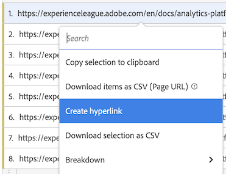

# 为自由格式表中的维度创建超链接

您可以为维度项目创建超链接，以使它们可在Analysis Workspace的自由格式表中点击。

在为以下类型的维度项目创建超链接时，此功能特别有用：

* 具有要链接到的URL值的Dimension项目（例如，页面URL维度）

* 包含划分（其URL值要链接到某个“页面名称”维度）的Dimension项目（例如，其中划分了“页面URL”维度）

* Dimension包含的值是您要链接到的URL的一部分的项目或划分（例如，是URL一部分的“页面名称”维度）

+++ 观看此功能的视频演示。

>[!VIDEO](https://video.tv.adobe.com/v/3430411/?learn=on)

+++

## 为一个或多个维度项目创建超链接

为维度项目创建超链接时，请考虑以下事项：

* 您创建的超链接存储在自由格式表的Analysis Workspace项目中。 在另一个表或其他项目中使用相同的维度或维度项时，超链接不会持久保留。

* 如果更改自由格式表的数据视图，则为表中的维度或维度项目创建的任何超链接仍然可用，前提是数据视图中存在维度。

* 创建超链接时，不会检查URL的有效性。

  如果您创建的超链接具有无效的URL，或者您创建的超链接引用了没有URL值的维度项(通过直接引用维度项或使用 `$value` 或 `$breakdown` 变量)，则单击超链接的用户将看到一条错误消息，说明URL无效。

* 为单个维度项目创建的超链接会覆盖在维度上创建的超链接。

* 超链接在中不起作用 [已下载PDF文件](/help/analyze/analysis-workspace/curate-share/download-send.md).

要为一个或多个维度项目创建超链接：

1. 在Analysis Workspace的自由格式表中，执行以下操作之一：

   * **为单个维度项目创建超链接：** 右键单击要为其创建超链接的表中的维度项目，然后选择 [!UICONTROL **创建超链接**].

     

     此 [!UICONTROL **创建超链接**] 对话框随即显示。 要为其创建超链接的维度项目的名称将显示在对话框中。

     

   * **为维度列中的所有维度项目创建超链接：** 右键单击维列标题中的维名称，然后选择 [!UICONTROL **为所有维度项目创建超链接**].

     

     此 [!UICONTROL **为所有维度项目创建超链接**] 对话框随即显示。 要为其创建超链接的维度的名称将显示在对话框中。

     

1. 从以下选项中进行选择：

   * [!UICONTROL **将维度项目的值用作URL**]：为具有URL值的维度项目（如页面URL维度）选择此选项。

     例如，如果您使用的是页面URL维度，其中每个维度项目的值都是一个URL，则选择此选项将创建指向该URL的超链接。

   * [!UICONTROL **创建自定义URL**]：指定静态或动态自定义URL。 选择此选项可以为没有URL值的维度项目创建超链接。

     例如，如果您使用的是“页面名称”维度，其中每个维度项目的值是页面的名称（而不是完整的URL），则选择此选项可指定要用作维度项目的链接的超链接。

     如果要为多个维度项目创建动态URL，您可以使用 `$value` 和 `$breakdown` 变量。 有关更多信息，请参阅下表。

     要创建自定义URL，请指定以下信息：

     | 字段 | 描述 |
     |---------|----------|
     | [!UICONTROL **自定义URL**] | 指定要用于超链接的自定义URL。 URL必须作为完全限定的URL输入。 例如： https://www.example.com
您创建的自定义URL可以是静态或动态：
 <ul><li>**静态URL：** 如果要为单个维度项目创建超链接，则使用静态URL可能就足够了。 
请考虑以下示例：例如，如果您有一个“页面名称”维度项目，则可以创建一个静态URL，以将用户链接到要与页面名称关联的特定网页。

假设您要为维度项目列表创建超链接，每个链接均链接到内部Wiki页面中的文档中的相应定义。

您可以通过为每个维度项目创建静态URL来实现这一点。 例如：

https://wiki.internal.company_name/page_name#item_definition
</li><li>**动态URL：** 如果要为多个维度项目或维度列中的所有维度项目创建超链接，则动态URL可能更实用。 
要使自定义URL成为动态变量，您需要在URL中包含一些变量，以便允许URL根据维度本身的值或划分维度的值动态更改。

使用变量时，任何包含在URL中无效字符（例如空格）的维度项目都将进行URL编码。

以下变量可用： (**注意**：虽然您可以在同一URL中使用这些变量，但可能更常见的是单独使用这些变量。)
 <ul><li>**`$value`：** 允许您将维度项目的值插入到指定的URL中。 
以以下方案为例：

假设您要为自由格式表中的所有“页面名称”维度项目创建超链接，其中每个维度项目的值都是网页URL的一部分。 在这种情况下，您可以构建一个自定义URL，以动态调整每个维度项目。 

您可以通过添加 `$value` 变量到您指定的自定义URL的结尾。 例如：
 
https://company-name.com/browse/product#$value

当此自定义URL应用于值为“ProductY”和“ProductZ”的“页面名称”维度项时，生成的超链接将如下所示： 

https://company-name.com/browse/product#ProductY

和

 https://company-name.com/browse/product#ProductZ 

**提示**：如果您只添加 `$value` 变量，则选择 [!UICONTROL **使用维度项目的值**] 选项。
</li><li>**`$breakdown`：** 允许您将划分维度项目的值插入到指定的URL中。 这样，您可以在报表中使用具有用户友好名称的维度（例如产品名称维度）同时基于用户友好程度可能较低的划分维度（例如产品ID或页面URL维度）创建超链接。
在引用划分维度时，通常给定维度项目只具有一个划分项目。 如果给定维度项目有多个划分项目，则在URL中使用第一个划分项目的值。 如果未列出任何划分项目，则URL将无效。 对划分项目应用的排序顺序与对表应用的排序顺序相同。

您可在以下位置指定划分维度 [!UICONTROL **划分维度**] 字段。
 
考虑以下示例情景： [!UICONTROL **划分维度**] 字段。
</li></ul> |
     | [!UICONTROL **划分维度（可选）**] | 开始键入要使用的划分维度的名称，然后从下拉列表中选择该名称。 
如果在此字段中选择划分维度，则必须使用 `$breakdown` 变量标识 [!UICONTROL **自定义URL**] 字段。

以以下方案为例：

假设您要为自由格式表中的所有“产品名称”维度项目创建超链接。 每个产品名称维度项都包含产品ID维度的细分。

在这种情况下，您可以为每个产品名称维度创建超链接，以便使用产品ID划分维度的值将用户引导至产品页面。 

您可以通过添加 `$breakdown` 变量填充到您在中指定的自定义URL的结尾 [!UICONTROL **自定义URL**] 字段。 例如：

https://company-name.com/browse/product/$breakdown

当此自定义URL应用于您的产品名称维度项目（具有值为“ProductY”和“ProductZ”的划分维度项目）时，生成的超链接将如下所示：

https://company-name.com/browse/product/ProductY

和

https://company-name.com/browse/product/ProductZ

然后，您可以选择中的产品ID维度 [!UICONTROL **划分维度**] 字段 

 |

1. 选择&#x200B;[!UICONTROL **创建**]。

   查看自由格式表的用户会看到超链接的维度项目。 单击维度项目时，用户将被带入单独的浏览器选项卡中的超链接页面。

   <!-- add screenshot of a table with hyperlinks.-->

1. [保存项目](/help/analyze/analysis-workspace/build-workspace-project/save-projects.md) 以保存更改。

## 编辑超链接

您可以编辑在自由格式表中针对维度或维度项目创建的超链接。

1. 在Analysis Workspace的自由格式表中，执行以下操作之一：

   * **编辑单个维度项目的超链接：** 在要编辑超链接的表内右键单击维度项目。

     

   * **编辑维度列中所有维度项目的超链接：** 右键单击维列标题中的维名称。

     

1. 选择 [!UICONTROL **编辑超链接**] 从右键单击菜单。

   此 [!UICONTROL **编辑维度项目的超链接**] 对话框随即显示。

1. 有关用于编辑超链接的配置选项的信息，请参见 [为一个或多个维度项目创建超链接](#create-hyperlinks-for-one-or-more-dimension-items) 部分，然后选择 [!UICONTROL **应用**] 完成更新后。

1. [保存项目](/help/analyze/analysis-workspace/build-workspace-project/save-projects.md) 以保存更改。

## 删除超链接

您可以删除为自由格式表中的维度项目创建的超链接。

>[!NOTE]
>
>在自由格式表中，如果删除包含超链接的维度，则在将同一维度重新添加到自由格式表中时，超链接将不会持久。

要从维度项目中删除超链接，请执行以下操作：

1. 在Analysis Workspace的自由格式表中，执行以下操作之一：

   * **从单个维度项中删除超链接：** 在要删除超链接的表格中右键单击维度项目。

     

   * **从维度列中的所有维度项中删除超链接：** 右键单击维列标题中的维名称。

     

1. 选择 [!UICONTROL **删除超链接**] 从右键单击菜单。

   超链接将从单个维度项目（如果您选择了单个维度项目）或所有维度项目（如果您在维度列标题中选择了维度名称）中删除。

1. [保存项目](/help/analyze/analysis-workspace/build-workspace-project/save-projects.md) 以保存更改。
