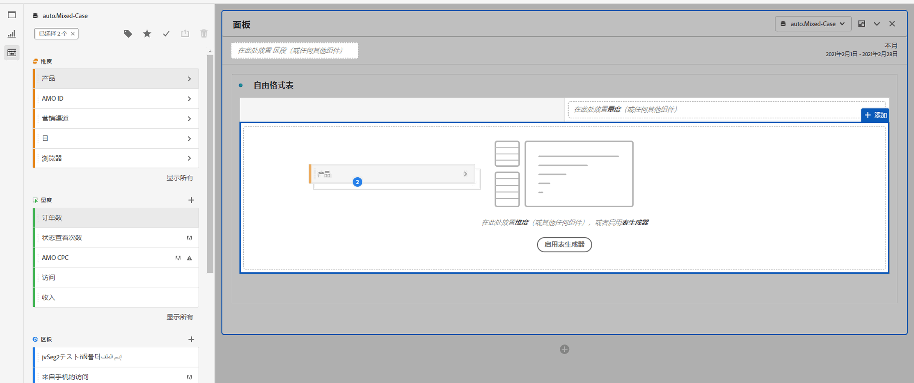
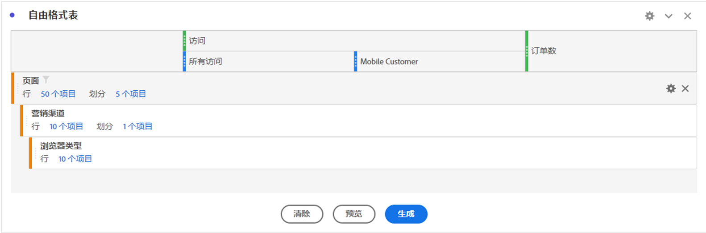
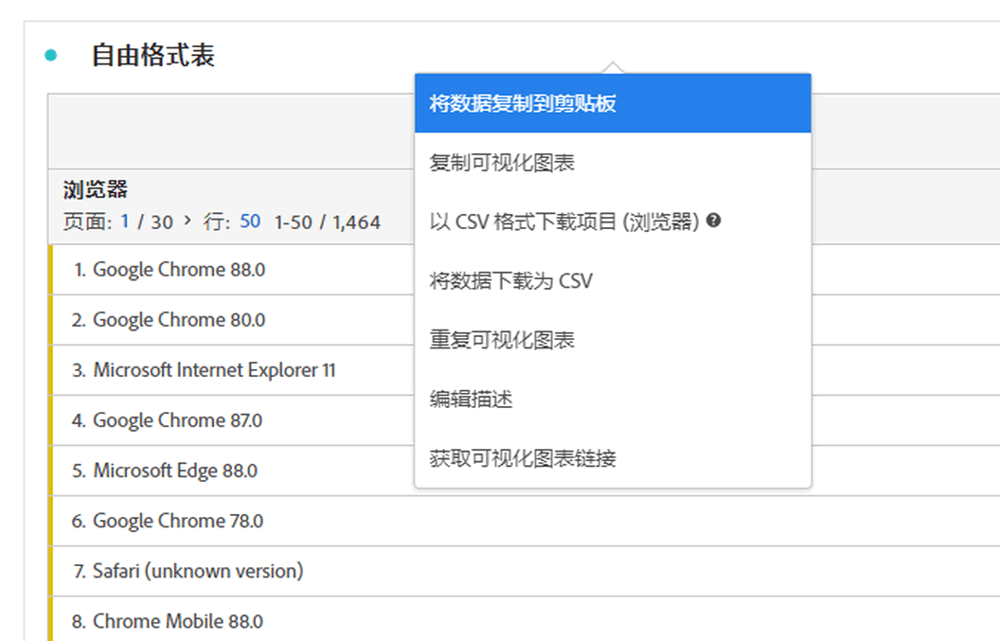

# 自由格式表 {#freeform-table-overview}

<!-- markdownlint-disable MD034 -->

>[!CONTEXTUALHELP]
>id="workspace_freeformtable_button"
>title="自由格式表"
>abstract="创建一个您可以使用维度、区段、量度和日期范围来构建的空的可视化自由格式表格。您可以使用自由格式表作为其他可视化的基础。"

<!-- markdownlint-enable MD034 -->

>[!BEGINSHADEBOX]

_本文记录了_  _**Adobe Analytics**&#x200B;中的自由格式表可视化图表。_ _查看本文的_  _**Customer Journey Analytics**&#x200B;版本的[自由格式表](https://experienceleague.adobe.com/en/docs/analytics-platform/using/cja-workspace/visualizations/freeform-table/freeform-table)。_

>[!ENDSHADEBOX]

在 Analysis Workspace 中，自由格式表是进行交互式数据分析的基础。可以将[组件](https://experienceleague.adobe.com/docs/analytics/analyze/analysis-workspace/components/analysis-workspace-components.html?lang=zh-Hans)组合拖放到行和列中，以创建自定义表格供您分析。拖动每个组件后，表格会立即更新，以便您能够快速分析和深入探索。

## 构建简单的自由格式表

您首先会看到一个空的自由格式表。

如果将&#x200B;**[!UICONTROL **&#x200B;访问次数&#x200B;**]**&#x200B;量度放置在&#x200B;**[!UICONTROL **&#x200B;在此处放置量度（或任何其他组件）**]**&#x200B;上，则自由格式表会自动填充您所选日历时段的每日访问次数。

如果您随后删除&#x200B;**[!UICONTROL **&#x200B;页面&#x200B;**]**&#x200B;维度来替换&#x200B;**[!UICONTROL **&#x200B;天&#x200B;**]**&#x200B;维度列，则自由格式表会自动反映每个页面的访问次数。

例如，您可以通过将&#x200B;**[!UICONTROL **&#x200B;营销渠道&#x200B;**]**&#x200B;维度放置在&#x200B;**[!UICONTROL ** category：5 **]**&#x200B;行上来划分&#x200B;**[!UICONTROL ** category：5 **]**&#x200B;页面。

## 自动化表

如上图所示，构建表的最快速方法是将组件直接拖放到空白项目、面板或自由格式表中。 随后将自动以建议的格式为您构建自由格式表。[观看教程](https://experienceleague.adobe.com/docs/analytics-learn/tutorials/analysis-workspace/building-freeform-tables/auto-build-freeform-tables-in-analysis-workspace.html?lang=zh-Hans)。

## 自由格式表生成器

如果您希望先向表中添加多个组件，然后再渲染数据，则可以启用自由格式表生成器。启用该生成器后，您可以通过拖放多个维度、细分、量度和区段来构建可解答更复杂问题的表格。 数据不会即时更新，单击&#x200B;**[!UICONTROL 生成]**&#x200B;后才会更新。

## 表交互

您可以通过各种方式与自由格式表进行交互并进行自定义设置：

* **行**
   * 您可以通过调整项目的[视图密度](https://experienceleague.adobe.com/docs/analytics/analyze/analysis-workspace/build-workspace-project/view-density.html?lang=zh-Hans)，将更多行放入单个屏幕中。
   * 在执行分页之前，每个维度行最多可显示 400 行。单击“行”旁边的数字可在单个页面上显示更多行。使用页眉中的页面箭头可导航到其他页面。
   * 可以按其他组件划分行。要同时划分多行，只需选择多行，然后将下一个组件拖动到选定行上即可。了解有关[划分](https://experienceleague.adobe.com/docs/analytics/analyze/analysis-workspace/components/dimensions/t-breakdown-fa.html?lang=zh-Hans)的更多信息。
   * 可以[过滤](https://experienceleague.adobe.com/docs/analytics/analyze/analysis-workspace/visualizations/freeform-table/filter-and-sort.html?lang=zh-Hans)行，以显示缩减的项目集。在[行设置](https://experienceleague.adobe.com/docs/analytics/analyze/analysis-workspace/visualizations/freeform-table/column-row-settings/table-settings.html?lang=zh-Hans)下，提供了其他设置。

* **列**
   * 可以将组件堆放在列中，以创建分段量度、跨标签分析等。
   * 可以在[列设置](https://experienceleague.adobe.com/docs/analytics/analyze/analysis-workspace/build-workspace-project/column-row-settings/column-settings.html?lang=zh-Hans)下调整每列的视图。
   * 可通过[右键单击菜单](https://experienceleague.adobe.com/docs/analytics-learn/tutorials/analysis-workspace/building-freeform-tables/using-the-right-click-menu.html?lang=zh-Hans)执行多个操作。根据您单击表标题、行或列的情况，菜单可提供不同的操作。

## 导出自由格式表数据

了解有关用于 Analysis Workspace 的所有数据[导出选项](https://experienceleague.adobe.com/docs/analytics/analyze/analysis-workspace/curate-share/download-send.html?lang=zh-Hans)的更多信息。

* 右键单击并选择&#x200B;**[!UICONTROL 将数据复制到剪贴板]**&#x200B;可导出显示的表数据。如果已选择表，则此选项将显示为&#x200B;**[!UICONTROL 将选定内容复制到剪贴板]**。也可以使用 **Ctrl+C** 热键复制所选数据。
* 右键单击并选择&#x200B;**[!UICONTROL 将数据下载为 CSV]** 可将显示的表数据下载为 CSV。如果已选择表，则此选项将显示为&#x200B;**[!UICONTROL 将选定内容下载为 CSV]**。
* 右键单击并选择&#x200B;**[!UICONTROL 项目>以CSV格式下载项目]**&#x200B;可为所选维度导出最多50,000个维度项目。

了解有关用于 Analysis Workspace 的所有数据[导出选项](https://experienceleague.adobe.com/docs/analytics/analyze/analysis-workspace/curate-share/download-send.html?lang=zh-Hans)的更多信息。

## 视频

自由格式表生成器概述：
>[!BEGINSHADEBOX]

有关演示视频，请参阅 [自由格式表生成器概述](https://video.tv.adobe.com/v/31318?quality=12&learn=on){target="_blank"}。

>[!ENDSHADEBOX]

>[!BEGINSHADEBOX]

观看演示视频的 [自由格式表筛选器](https://video.tv.adobe.com/v/23232?quality=12&learn=on){target="_blank"}。

>[!ENDSHADEBOX]

>[!BEGINSHADEBOX]

观看演示视频的 [自由格式表总计](https://video.tv.adobe.com/v/29273?quality=12&learn=on){target="_blank"}。

>[!ENDSHADEBOX]

